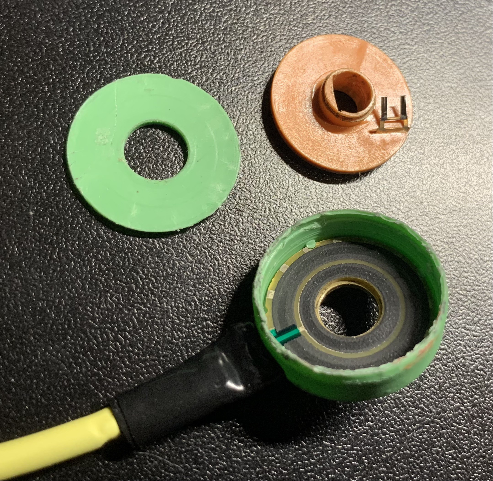
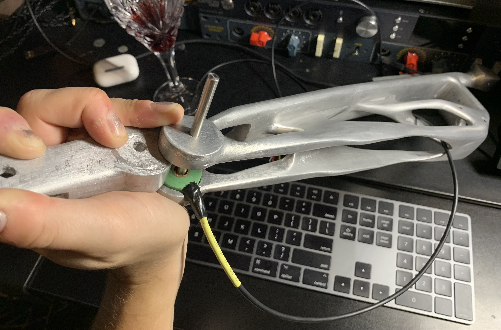
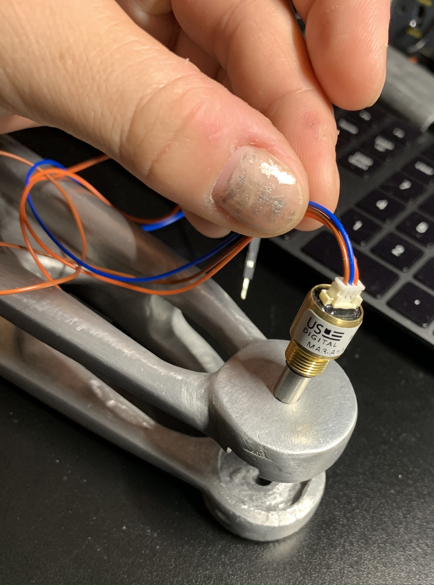
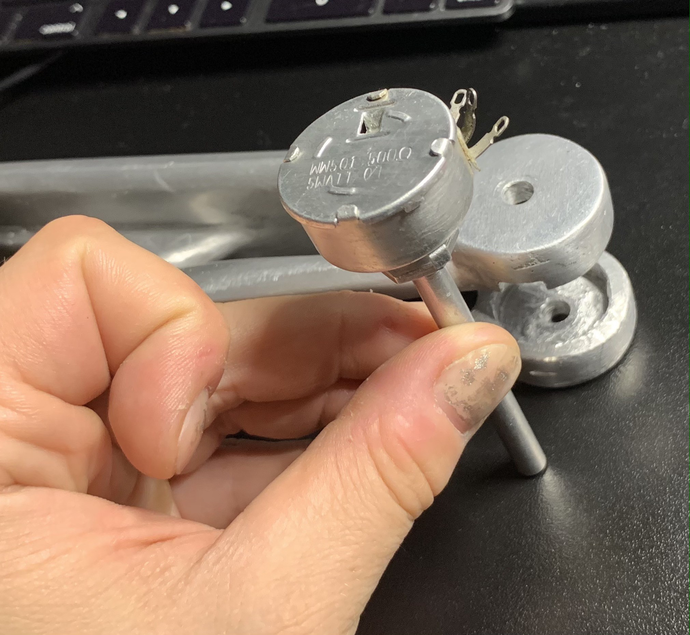
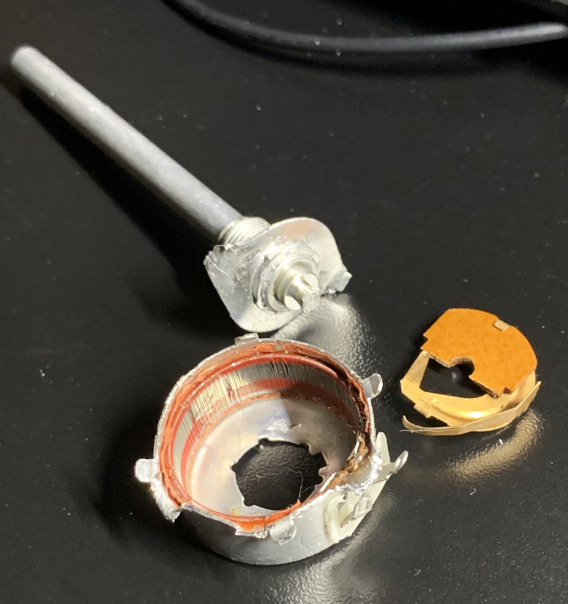

## motivation

Robotics servos come with encoders, but the resulting package is often hard to integrate into a *compact design*. Manufacturers that [integrate a servo with an encoder](https://www.robotis.us/dynamixel-p/) price their products for *big-budget customers*.

For my [robot drummer](/projects/drumming-robot), I wanted to move the arms using *linear* actuators and read current arm positions as *angles*. Compact linear actuators did not come with encoders, and there was no space to fit a linear encoder so I went looking for an *absolute encoder* that could fit inside the arm joints.

## challenges

Many compact encoders on the market offer only *incremental* readings. When sourcing *absolute* encoders you are faced with the following choices:

- Bulky encoders like [Broadcom](https://www.digikey.com/en/products/detail/broadcom-limited/AEAT-6012-A06/2210458) or [Dynapar](https://ecatalog.dynapar.com/ecatalog/absolute-encoders/en/AD36) that would hang off the side of your design and totally ruin the vibe.
- [Potentiometers](https://www.digikey.com/en/products/detail/tt-electronics-bi/EN18ABHB11A0F26/16360754) designed for control panel knobs. These are hard to integrate because the rotating shaft is neither removable nor long enough to serve as a joint axis.
- Ring encoders like [Celeramotion](https://www.celeramotion.com/multiturn-incoder) or [Andymark](https://www.andymark.com/products/lamprey-absolute-encoder) which are low-profile but still can't fit inside robot arm joints to due large diameters.
- Hall-effect sensors that can be attached to shafts or joints, but often require a custom design to be created around them from the beginning.

## hollow potentiometer

The winner for my application was [RH24PC](https://p3america.com/rh24pc-110mm-series/) from P3 America, a `6mm` *hollow D-shaft* potentiometer featuring a compact, small-diameter design.



Despite the simple and unassuming construction it gives detailed absolute angle readings rivaling those of a hall-effect sensor while fitting inside a robot arm in their entirety, without being seen. They are also `$15` each.

This was the only potentiometer I found big enough to accept a `6mm` shaft, yet small enough to fit inside of something else without being seen. Note that the D-shaft is not `5.4mm` on the "flatted" portion like standard robot parts (from [goBuilda](https://www.gobilda.com/), [RobotShop](https://www.robotshop.com/), or [ServoCity](https://www.servocity.com/)) but sligtly smaller.

It doesn't have "leads", just simple PCB traces, so any wires you solder to the traces will break off easily. I used a shrinkwrap cover combined with electrical tape to create a make-shift wire protector.



The potentiometer is pictured here with the mounting "ears" removed by pliers, which did not affect its function. It makes up for weak contacts by having the capability to be "re-skinned" by stripping away pieces and replacing them with other cooler-looking pieces while it continues to work

## hall effect sensor

Runner up is the [hall-effect potentiometer with analog output](https://p3america.com/mab12ah-6-10-0505/) from P3 America:


This sensor produces very accurate readings, especially with regard to linearity, but not that different than the cheap and simple pot reviewed above. The magnet fits perfectly on a `6mm` *round* shaft or *D-shaft*.

The leads are not only strong, but also have `micro-JST` connectors attached. Strong overall construction, and part of the plastic *barrel* could be sawed off to fit into a tighter space, thus there is a capacity for *re-skinning*. Small enough to fit into most designs without being seen.

## magnetic ring encoder

AndyMark has a similar product called the [Lamprey Absolute Encoder](https://www.andymark.com/products/lamprey-absolute-encoder):


This is mid-level hall-effect ring encoder (about `$40` each). The magnetic ring attaches to a rotating joint and the PCB ring with the sensor is fixed so that the inner magnetic ring rotates inside the mounted PCB ring.

It's slightly too big to conceal for many human or animal-sized robot limbs due to the large diameter required by the outer ring, but it is very low profile.

There are complaints in the comments that the magnet can break easily but it is available for purchase separately.

## hall effect system

A custom encoder could be built utilizing the [AS5045](https://docs.rs-online.com/e9dd/A700000006770281.pdf) system-on-chip:


(Shown here is an [adapter board](https://ams.com/en/as5045adapterboard) that makes it easy to evaluate the chip).

The entire "board" is inside the chip, and it directly outputs the readings over the SSI protocol (similar to SPI with Clock, Data, and Select pins). It can also output relative A/B signals and PWM.

The two primary advantages are:
+ You can design a circuit board of any shape and put this chip on it - all that's required are some traces to your chosen connector type.
+ The readings are output through a serial digital protocol rather than simple analog voltage, which makes them less susceptible from picking up noise from surrounding actuator power lines.
+ You can talk to a "network" of these chips through a single serial bus (they can be daisy-chained to each other and you will receive the readings for all devices in the chain from the first device).

Once connected, a single chip can be read with code like the following. For multiple chips you would modify this code to add an outer loop, since the readings from all devices are sent in a single array of 12-bit values.

```
const int CLOCK_PIN = 5;
const int DATA_PIN = 6;
const int CS_PIN = 7;
const int BIT_COUNT = 12;

void initEncoder()
{
  pinMode(DATA_PIN, INPUT);
  pinMode(CLOCK_PIN, OUTPUT);
  pinMode(CS_PIN, OUTPUT);

  digitalWrite(CLOCK_PIN, HIGH);
  digitalWrite(CS_PIN, HIGH);
}

double readPosition()
{
  unsigned long sample1 = shiftIn(DATA_PIN, CLOCK_PIN, CS_PIN);
  unsigned long sample2 = shiftIn(DATA_PIN, CLOCK_PIN, CS_PIN);

  delayMicroseconds(20);

  if (sample1 != sample2) return -1.0;

  return ((sample1 & 0x0FFF) * 360UL) / 4096.0;
}

unsigned long shiftIn(int dataPin, int clockPin, int selectPin)
{
  unsigned long data = 0;

  digitalWrite(selectPin, LOW);

  for (int n = 0; n < BIT_COUNT; n++)
  {
    data <<= 1;

    digitalWrite(clockPin, LOW);
    delayMicroseconds(1);
    digitalWrite(clockPin, HIGH);
    delayMicroseconds(1);

    data |= digitalRead(dataPin);
  }

  digitalWrite(selectPin, HIGH);
  return data;
}

void setup()
{
  initEncoder();
  Serial.begin(115200);
}

void loop()
{
  double reading = readPosition();

  if (reading >= -0.5)
  {
    Serial.print("Reading: ");
    Serial.println(reading, 2);
  }

  delay(50);
}
```

The primary disadvantage is that you may need to learn how to design circuit boards, design a custom encoder enclosure, determine which connector you are going to use, and so on. A lot of extra work just to get an encoder into your system.

## optical encoder

Next up is [JT-30](https://www.digikey.com/en/products/detail/nidec%2Dcopal%2Delectronics/JT30%2D120%2DC00/6469478) absolute encoder from [DigiKey](https://www.digikey.com/) (`5V` or `12V` logic):


This encoder features incredibly smooth motion and it's very light despite all-metal construction. Perfectly standard `6mm` D-shaft that fits all robot parts.

Not only does it have strong, protected leads, but actually ships with shielded audio-grade cable built-in. The same cable I bought for handling potentiometer signals so that my readings don't jump around too much.

The downside is that the body is still pretty big so it cannot be concealed, and the shaft cannot be removed to be replaced with a longer shaft. That severely restricts where you can place them, since somehow you need to connect this shaft to the shaft that the robot arm rotates on.

## micro potentiometer

Next we have [MA-3](https://www.usdigital.com/products/ma3) from US Digital:



This potentiometer features silky-smooth motion and `JST` leads. It's easy to place by screwing it in, but the body is too long to be easily concealed.

The shaft is `1/8"`. They can be custom-ordered with shafts of different diameters and lengths but that requires large order quantities.

## long potentiometer

Next we have this `1/8"` long-shaft linear potentiometer from eBay, likely made by Vishay in India:



The body is large enough that it cannot be *concealed*, and the construction is strong enough that it cannot be *re-skinned*.



On the plus side, the long shaft can function as the actual rotation shaft of the robot arm, and the contacts won't be fatigued easily.
