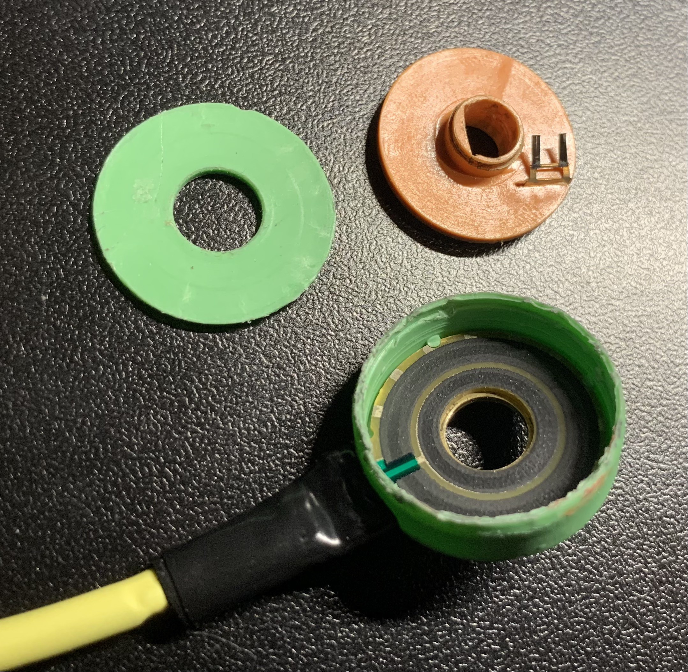
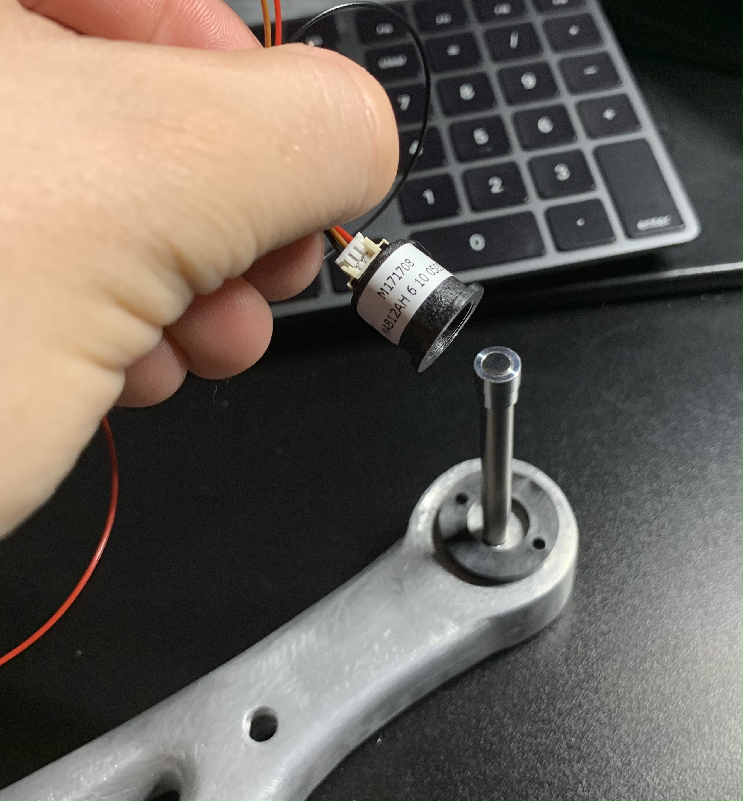
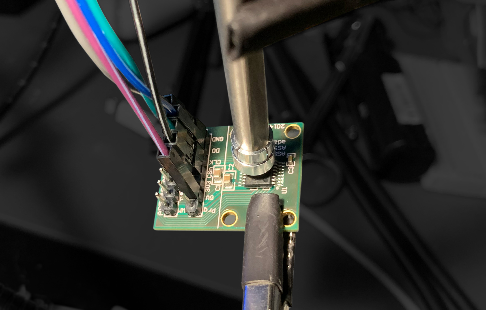
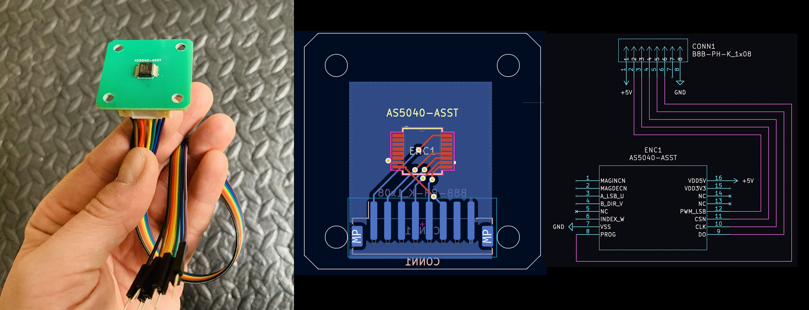
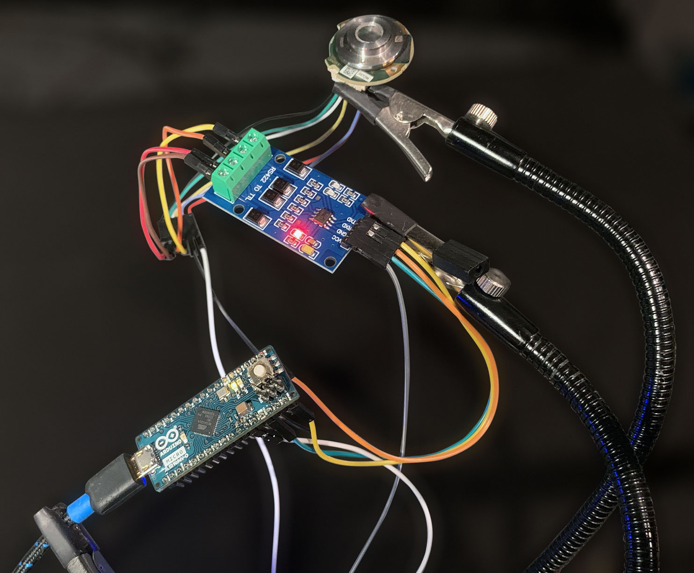
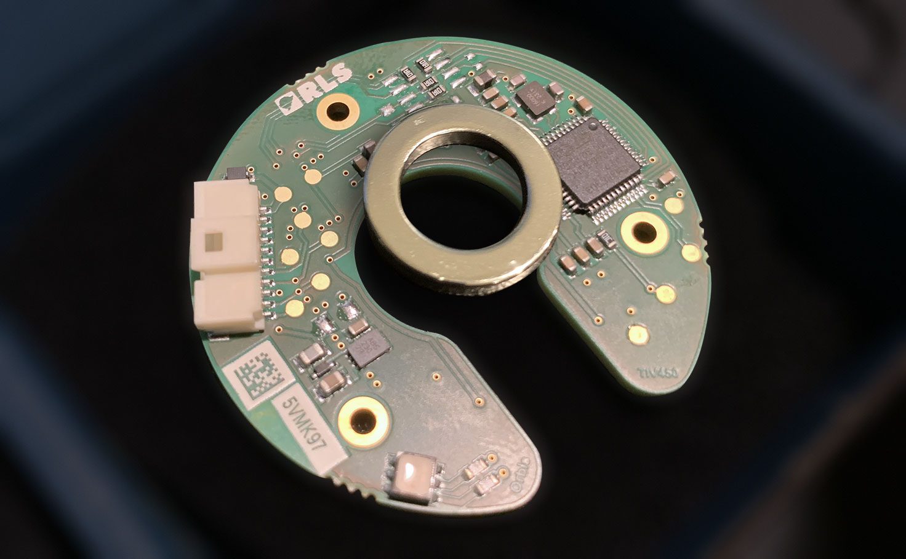
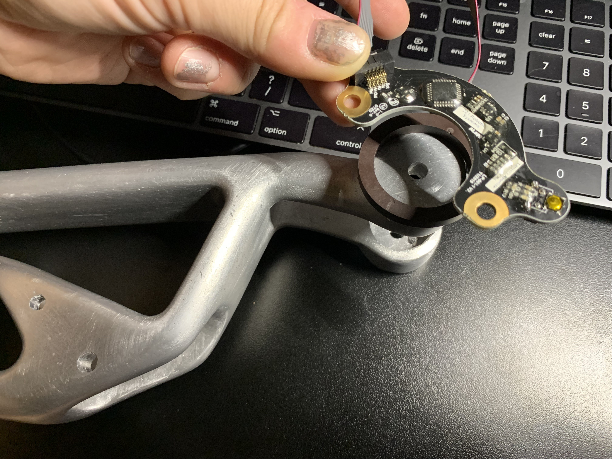
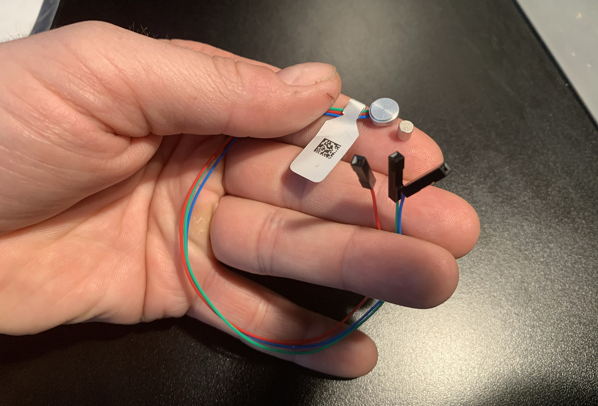
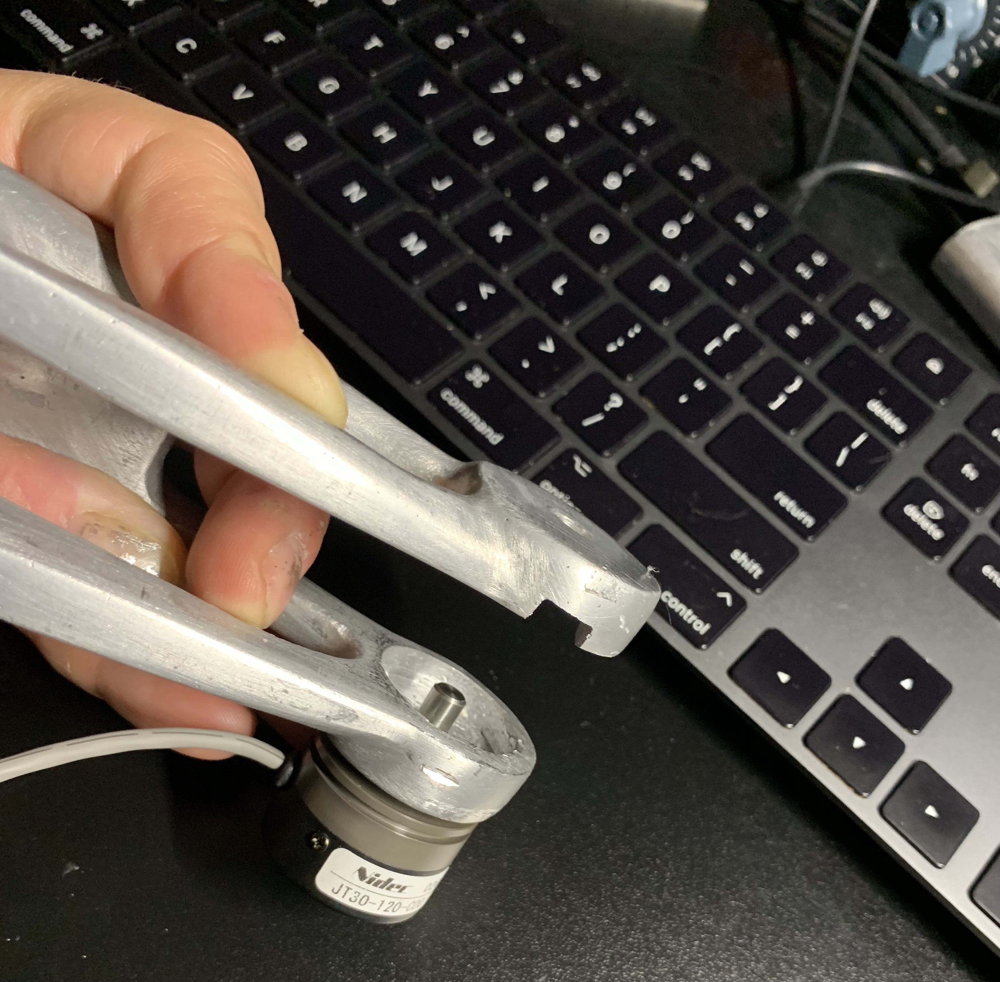

## applications

High-torque servo motors like [Dynamixel Pro](https://www.robotis.us/dynamixel-p/) and BDLC motors like [Cubemars AK80](https://www.robotshop.com/products/cubemars-ak80-64kv80-bldc-motor-robot-w-integrated-encoder-driver) integrate a DC motor, absolute encoder, relative encoder, and a [PID](https://www.ni.com/en/shop/labview/pid-theory-explained.html) controller into a single convenient package.

What if these products don't fit your price range or your application, or you would like to use another motor/gearbox, or even [build one yourself](https://www.youtube.com/watch?v=GakFB8Tdd98)?

Many DC motors have relative encoders built-in (for example [Duma Dynamics](https://www.robotshop.com/products/56rpm-right-angle-gear-motor-w-13ppr-hall-sensor-encoder) and [Yellow Jacket](https://www.servocity.com/5203-series-yellow-jacket-planetary-gear-motor-188-1-ratio-24mm-length-8mm-rex-shaft-30-rpm-3-3-5v-encoder/)). Relative encoders are easy to find for those that don't.

Picking an absolute encoder is considerably more difficult, and in this article we will look at a few options that work well in robotics projects.

## challenges

Many compact encoders on the market offer only *incremental* readings. When sourcing *absolute* encoders you are faced with the following choices:

- Bulky encoders like [Broadcom AEAT](https://www.digikey.com/en/products/detail/broadcom-limited/AEAT-6012-A06/2210458), [Dynapar AD36](https://ecatalog.dynapar.com/ecatalog/absolute-encoders/en/AD36), or [US Digital A2K](https://www.usdigital.com/products/encoders/absolute/kit/a2k/) that would hang off the side of your design and totally ruin the vibe.
- [Potentiometers](https://www.digikey.com/en/products/detail/tt-electronics-bi/EN18ABHB11A0F26/16360754) designed for control panel knobs. These are hard to integrate because the rotating shaft is neither removable nor long enough to serve as a joint axis.
- Ring encoders like [Celeramotion](https://www.celeramotion.com/multiturn-incoder) or [Lamprey](https://www.andymark.com/products/lamprey-absolute-encoder) which are low-profile but still can't fit inside robot arm joints to due large diameters.
- Hall-effect sensors like [AS5045](https://www.digikey.com/en/products/detail/ams-osram-usa-inc/AS5045-ASST/2334769) that can be attached to shafts or joints, but require a custom circuit board to integrate into a design.

## hollow-shaft pot

The [NP24HS](https://p3america.com/np24hs-series//) from P3 America is a passive analog *hollow D-shaft* potentiometer featuring a compact design:



This was the only hollow-shaft potentiometer I found big enough to accept a `6mm` shaft, yet with a small enough `24mm` diameter.

> Note that the D-shaft is not `5.4mm` on the "flatted" portion like standard robot parts (from [goBuilda](https://www.gobilda.com/), [RobotShop](https://www.robotshop.com/), or [ServoCity](https://www.servocity.com/)) but sligtly smaller.

There are no "leads", just simple PCB traces, so you will likely have to solder in a locking connector with a matching `2mm` pitch, such as [JST-PH](https://www.digikey.com/en/resources/datasheets/jst/ph-series-datasheet).

## compact encoder

Runner up is the [extreme compact hall effect encoder with analog output](https://p3america.com/mab12ah-6-10-0505/):



This sensor produces accurate `10-bit` to `12-bit` readings depending on the model. The magnet fits perfectly onto a `6mm` *round* shaft or *D-shaft*. The leads have a locking [PicoBlade](https://www.molex.com/en-us/products/connectors/wire-to-board-connectors/picoblade-connectors) connector attached.

## hall effect sensor

A custom encoder could be built utilizing the [AS5045](https://docs.rs-online.com/e9dd/A700000006770281.pdf) system-on-chip:



(Shown above is an [adapter board](https://ams.com/en/as5045adapterboard) that makes it easy to evaluate the chip).

The chip outputs readings over the SSI protocol (similar to SPI with Clock, Data, and Select pins). It can also output relative A/B signals (in *relative* mode) and PWM, enabling it to be used as an analog potentiometer.



(Shown above is a custom PCB I designed with this chip in KiCad)

The two primary advantages are:
+ You can design a circuit board of any shape and put this chip on it - all that's required are some traces to your chosen connector type.
+ The readings are output through a serial digital protocol rather than simple analog voltage, which makes them less susceptible from picking up noise from surrounding actuator power lines.
+ You can talk to a "network" of these chips through a single serial bus (they can be daisy-chained to each other and you will receive the readings for all devices in the chain from the first device).

Once connected, a single chip can be read with code like the following. For multiple chips you would modify this code to add an outer loop, since the readings from all devices are sent in a single array of 12-bit values.

```
const int CLOCK_PIN = 5;
const int DATA_PIN = 6;
const int CS_PIN = 7;
const int BIT_COUNT = 12;

void initEncoder()
{
  pinMode(DATA_PIN, INPUT);
  pinMode(CLOCK_PIN, OUTPUT);
  pinMode(CS_PIN, OUTPUT);

  digitalWrite(CLOCK_PIN, HIGH);
  digitalWrite(CS_PIN, HIGH);
}

double readPosition()
{
  unsigned long sample1 = shiftIn(DATA_PIN, CLOCK_PIN, CS_PIN);
  unsigned long sample2 = shiftIn(DATA_PIN, CLOCK_PIN, CS_PIN);

  delayMicroseconds(20);

  if (sample1 != sample2) return -1.0;

  return ((sample1 & 0x0FFF) * 360UL) / 4096.0;
}

unsigned long shiftIn(int dataPin, int clockPin, int selectPin)
{
  unsigned long data = 0;

  digitalWrite(selectPin, LOW);

  for (int n = 0; n < BIT_COUNT; n++)
  {
    data <<= 1;

    digitalWrite(clockPin, LOW);
    delayMicroseconds(1);
    digitalWrite(clockPin, HIGH);
    delayMicroseconds(1);

    data |= digitalRead(dataPin);
  }

  digitalWrite(selectPin, HIGH);
  return data;
}

void setup()
{
  initEncoder();
  Serial.begin(115200);
}

void loop()
{
  double reading = readPosition();

  if (reading >= -0.5)
  {
    Serial.print("Reading: ");
    Serial.println(reading, 2);
  }

  delay(50);
}
```

The primary disadvantage is that you may need to learn how to design circuit boards, design a custom encoder enclosure, determine which connector you are going to use, and so on. A lot of extra work just to get an encoder into your system.

## aksim-2 ring encoder

[AKSIM-2](https://www.rls.si/eng/aksim-2-off-axis-rotary-absolute-encoder) is a `17-bit` off-axis magnetic ring encoder in a range of diameters, starting from `28.5mm` for use with `8mm` shaft. It supports a variety of protocols (including SSI) and requires an `RS-422 `converter.



The high resolution (higher than any other encoder featured here) and the `RS-422` communication makes AKSIM-2 stand out as a "professional" option because `RS-422` enables long cable runs with excellent noise rejection.

Other encoders featured in this article, like the Lamprey or AS5045, support the same protocols but do not communicate through `RS-422` which makes the data transmission less reliable. At the same time, having to put `RS-422` converter(s) before the device makes it harder to use.

I tried out the SSI interface version with the following code:

```
// SSI pins
const int CLOCK_PIN = 15;
const int DATA_PIN = 16;

// Aksim encoder bit count
const int BIT_COUNT = 17;

// Aksim encoder max value (17 bits all set)
const unsigned long MAX_VALUE = 0b11111111111111111;

// Aksim Pin | Transceiver | Arduino
// -------------------------------------
// 1 5V      |             | 5V
// 2 GND     |             | GND
// 5 Clock+  | Y        TX | 15
// 6 Clock-  | Z           |
// 7 Data+   | A        RX | 16
// 8 Data-   | B           |

void initEncoder()
{
  pinMode(CLOCK_PIN, OUTPUT);
  pinMode(DATA_PIN, INPUT);
  digitalWrite(CLOCK_PIN, HIGH);
}

unsigned long shiftIn(int dataPin, int clockPin)
{
  unsigned long data = 0;
  
  for (int n = 0; n < BIT_COUNT; n++)
  {
    data <<= 1;
    
    digitalWrite(clockPin, LOW);
    delayMicroseconds(1);

    data |= digitalRead(dataPin);
    
    digitalWrite(clockPin, HIGH);
    delayMicroseconds(1);
  }
  
  return data;
}

double readPosition()
{
  unsigned long sample = shiftIn(DATA_PIN, CLOCK_PIN);
  return ((sample & MAX_VALUE) * 1.0) / double(MAX_VALUE);
}

void setup()
{
  initEncoder();
  Serial.begin(115200);
}

void loop()
{
  double reading = readPosition();
  
  Serial.print("Reading: ");
  Serial.println(reading, 2);
  
  delay(50);
}
```

## orbis ring encoder

[Orbis Absolute Magnetic Encoder](https://www.rls.si/eng/orbis-true-absolute-rotary-encoder) has `14-bit` resolution and comes in a variety of sizes starting from `45mm` diameter. Different part numbers support BiSS-C, SSI, SPI, Asynchronous Serial and PWM communication.

I tried out the version with SPI because it's a binary protocol that would guard against line noise affecting readings, and the timing is constant unlike SSI (which is not recommended for precise PID motor control due to time drift).



You can get it with a set-screw flange that attached to a motor shaft and has the magnetic ring inserted, or just the magnetic ring for use with your own custom flange. The following code will let you read the position over SPI:

```
#include <SPI.h>

// Megaherz multiplier
const long MHz = 1000000;

// Select pin (active low)
const int SELECT_PIN = 8;

// Orbis encoder max value (14 bits all set)
const unsigned long MAX_VALUE = 0b11111111111111;

// Orbis data frame
struct DATA
{
  unsigned int position : 14;
  unsigned int error: 1;
  unsigned int warning: 1;
};

// Orbis (SPI)     | Arduino (SPI)
// -------------------------------
// 1 5V    (brown) | 5V
// 3 GND   (white) | GND
// 7 SCK   (red)   | SCK
// 8 CS    (blue)  | 8
// 10 MISO (green) | MOSI
// 11 MOSI (yellow)| MISO

void initEncoder()
{
  SPI.begin();
  SPI.beginTransaction(SPISettings(
    // Orbis clock frequency
    1 * MHz,
    // Orbis sends data MSB first
    MSBFIRST,
    // Data capture on rising edge of the clock
    SPI_MODE0
  ));

  pinMode(SELECT_PIN, OUTPUT);
  digitalWrite(SELECT_PIN, HIGH);
}

double readPosition(bool& error, bool& warning)
{
  // Select
  digitalWrite(SELECT_PIN, LOW);
  delayMicroseconds(8);

  // Read value
  DATA data;
  *((uint16_t*)&data) = SPI.transfer16(0x0);

  // Deselect
  digitalWrite(SELECT_PIN, HIGH);

  // Parse
  error = data.error;
  warning = data.warning;

  return double(data.position) / double(MAX_VALUE);
}

void setup()
{
  initEncoder();
  Serial.begin(115200);
}

void loop()
{
  bool error, warning;
  double reading = readPosition(error, warning);
  
  Serial.print("Reading: ");

  if (error) Serial.print("(err) ");
  if (warning) Serial.print("(warn) ");
  
  Serial.println(reading, 2);
  
  delay(10);
}
```

## lamprey ring encoder

[Lamprey Absolute Encoder](https://www.andymark.com/products/lamprey-absolute-encoder) from AndyMark is `10-bit` magnetic ring encoder. The ring attaches to a rotating joint while the PCB attaches to the motor:



The header includes `5V`, `GND`, `TX`, `RX`, `MOSI`, `MISO`, `Analog`, and `PWM` pins for USB, analog, PWM, and UART communication.

It's slightly too big to conceal for many human or animal-sized robot limbs due to the large diameter required by the outer ring, but it is very low profile.

## miniature encoder

[RM08](https://www.rls.si/eng/rm08-super-small-non-contact-rotary-encoder) from RLS is the smallest absolute encoder I could find. It supports up to `12-bit` resolution with linear voltage or digital output (including SSI) and both `5V` and `3.3V` logic.



The source code to read SSI is provided in [hall effect sensor](#hall-effect-sensor) section, and linear voltage can be read with an [ADC](/articles/adc-review).

## optical encoder

Next up is [JT-30](https://www.digikey.com/en/products/detail/nidec%2Dcopal%2Delectronics/JT30%2D120%2DC00/6469478) optical encoder from [DigiKey](https://www.digikey.com/) (`5V` or `12V` logic):



This encoder features incredibly smooth motion and it's very light despite all-metal construction. Perfectly standard `6mm` D-shaft that fits all robot parts.

Not only does it have strong, protected leads, but actually ships with shielded audio-grade cable built-in. The same cable I bought for handling potentiometer signals so that my readings don't jump around too much.

The downside is that the body is still pretty big so it cannot be concealed, and the shaft cannot be removed to be replaced with a longer shaft. That severely restricts where you can place them, since somehow you need to connect this shaft to the shaft that the robot arm rotates on.
