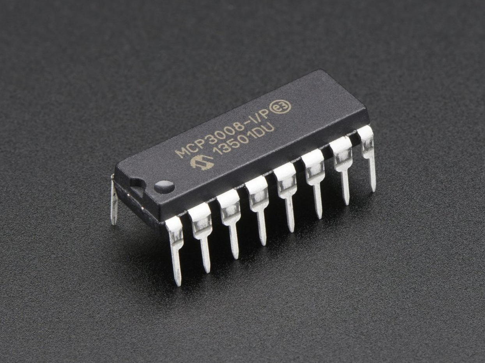
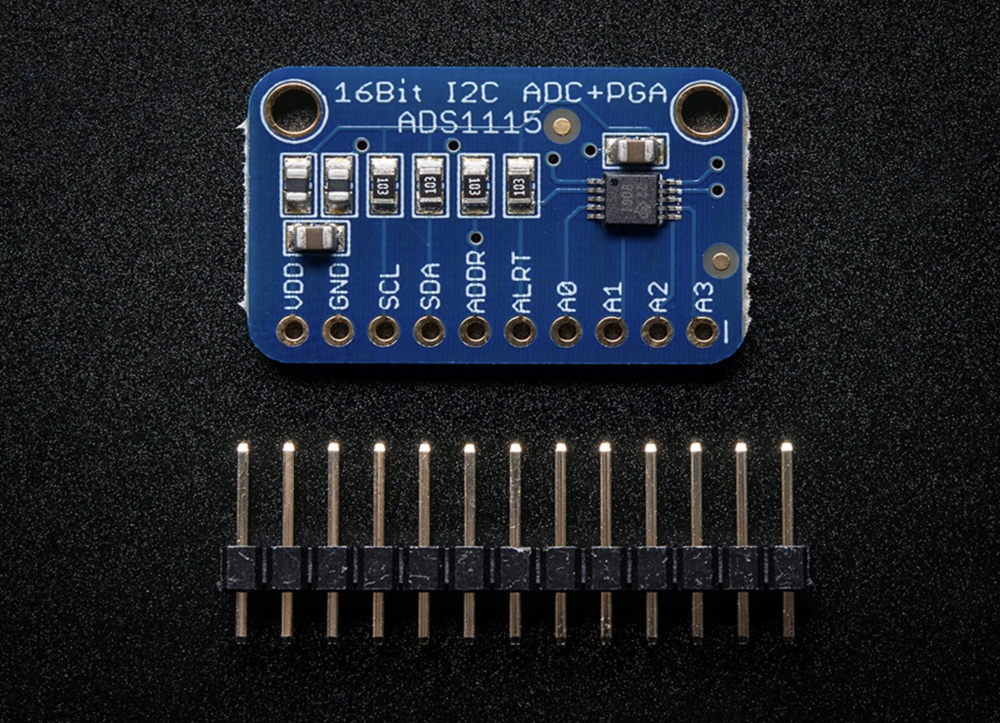
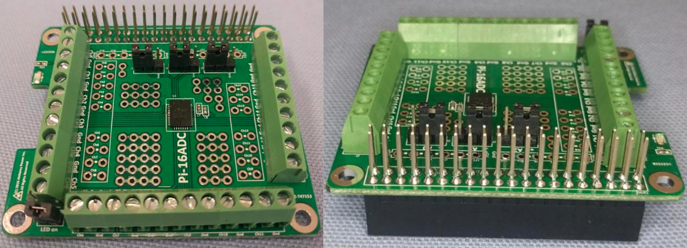
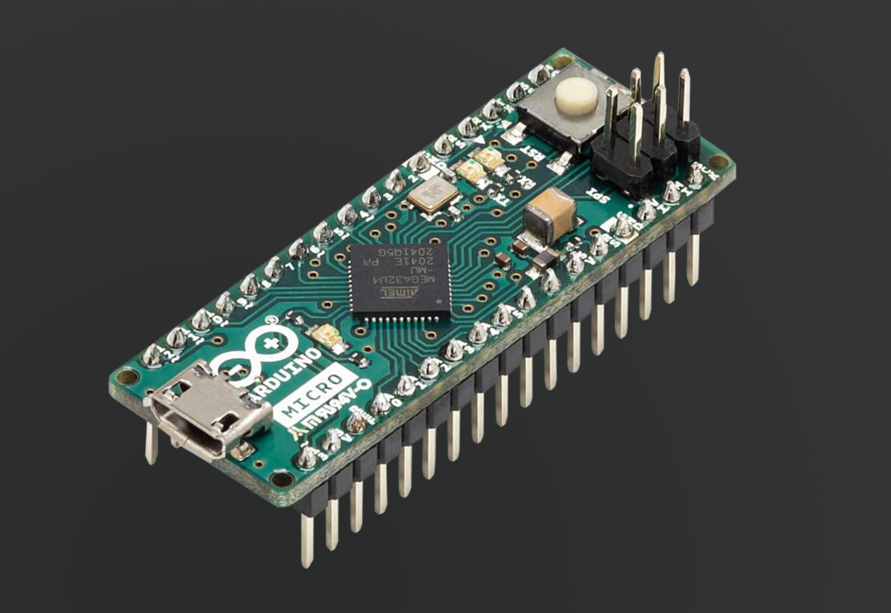

## overview

Robotics projects often require reading analog inputs, which is a capability not available on a Raspberry Pi. Adding inputs requires interfacing with an Analog-to-Digital Converter (ADC) and writing C++ code to read the channels.

This review will explore the commonly available options from Adafruit, Digikey, and Amazon and demonstrate the effort required to get them working.

## mcp3008 adc

[MCP3008](https://cdn-shop.adafruit.com/datasheets/MCP3008.pdf) is an 8-channel, 10-bit ADC with `3.3V` to `5V` logic and a "4-wire" SPI interface, distributed by [Adafruit](https://www.adafruit.com/product/856so). It's simple to setup for a small project.



MCP3008 can be wired to the Raspberry Pi `SPI0` bus as follows:

|MCP3008|Rasberri Pi 4B|Description|
|-|-|-|
|`CLK`|`SCLK`|SPI Clock|
|`DOUT`|`MISO`|SPI Send|
|`DIN`|`MOSI`|SPI Receive|
|`CS`|Digital Pin `5`|SPI Select|
|`VDD`|`3.3V`|Power|
|`VREF`|`3.3V`|Power|
|`AGND`|`GND`|Ground|
|`DGND`|`GND`|Ground|

The inputs can be read using [spiOpen](https://abyz.me.uk/rpi/pigpio/cif.html#spiOpen) and [spiXfer](https://abyz.me.uk/rpi/pigpio/cif.html#spiXfer) from `PiGPIO` libray:

```c
#include <stdio.h>
#include <pigpio.h>

// MCP3008 SPI rate (100 kbps)
const int SPI_RATE = 100 * 1000;

// MCP3008 SPI mode
const int SPI_MODE = 0;

// MCP3008 channels
const int CHANNELS = 8;

// Max value for a 10-bit sample
const double MAX_VALUE = double(1 << 10);

// SPI bus handle
int spi = -1;

/*
  Initialize MCP3008 on Raspberry Pi 4B
  initBus - The SPI bus to initialize on
  returns true if successful, false otherwise
*/
bool init(int initBus)
{
  if (gpioInitialise() < 0) return false;

  spi = spiOpen(initBus, SPI_RATE, SPI_MODE);

  if (spi < 0)
  {
    // Failed to open
    return false;
  }

  return true;
}

/*
  Read sample on a channel as an integer
  channel - The channel to read
  returns the sample converted from 10 bits to 32 bits
*/
int read(int channel)
{
    char buffer[3] =
    {
      // Begin command
      1,
      // Select channel
      char((8 + channel) << 4),
      // End command
      0
    };

    spiXfer(spi, buffer, buffer, sizeof(buffer));

    return ((buffer[1] & 3) << 8) | buffer[2];
}

/*
  Entry point
*/
int main()
{
  // Initialize MCP3008 on SPI bus 0
  if (!init(0)) return 1;

  // Read all channels
  for (int channel = 0; channel < CHANNELS; channel++) {
    int sample = read(channel);

    printf(
      "channel %d: %d (%g)",
      channel,
      sample,
      sample / MAX_VALUE
    );
  }

  return 0;
}
```

It's worth noting that the [16-channel analog input HAT](https://bc-robotics.com/shop/16-channel-analog-input-hat-adc-for-raspberry-pi-assembled/) for Raspberry Pi made by BC Robotics uses two MCP3008 chips thus you get the same quality with double the channels if you are OK with the HAT format.

## ads1115 adc

[ADS1115](https://cdn-shop.adafruit.com/datasheets/ads1115.pdf) is a 4-channel 16-bit ADC with a "2-wire" `I2C` interface and `3.3V` to `5V` logic, distributed by [Adafruit](https://learn.adafruit.com/raspberry-pi-analog-to-digital-converters/ads1015-slash-ads1115) and [Digikey](https://www.digikey.com/en/product-highlight/t/texas-instruments/ads1115-industry-smallest).



It's harder to use than MCP3008 and has less inputs, however it has a higher resolution and four ADS1115s can be chained together on a single I2C bus to read 16 analog inputs simultaneously at up to 860 samples per second.

> This ADC has advanced features like a *multiplexer* and a *comparator* for reading the difference between pairs of inputs. The multiplexer reads samples from two pins and the comparator samples the difference.

ADS1115 can be wired to the Raspberry Pi `I2C` bus as follows:

|ADS1115|Raspberry Pi 4B|Description|
|-|-|-|
|`SCL`|`SCL`|I2C Clock|
|`SDA`|`SDA`|I2C Data|
|`VDD`|`3.3V`|Power|
|`GND`|`GND`|Ground|

Configuring ADS1115 involves writing a 16-bit value with various settings stored in bitfields to its *configuration* register (encoded as two's complement):

|Offset|Bits|Setting|Values|
|-|-|-|-|
|`0`|`2`|Alert Mode|`0` - Set `ALERT` after 1 conversion|
| | | |`1` - Set `ALERT` after 2 conversions|
| | | |`2` - Set `ALERT` after 4 conversions|
| | | |`3` - Disable alerts (default)|
|`2`|`1`|Latch mode|`0` - `ALERT` does not latch|
| | | |`1` - `ALERT` latches until read|
|`3`|`1`|Alert Polarity|`0` - `ALERT` is active low (default)|
| | | |`1` - `ALERT` is active high |
|`4`|`1`|Comparator Mode|`0` - Traditional (default)|
| | | |`1` - Window comparator|
|`5`|`3`|Sample Rate|`0` - 8 samples per second|
| | | |`1` - 16 samples per second|
| | | |`2` - 32 samples per second|
| | | |`3` - 64 samples per second|
| | | |`4` - 128 samples per second|
| | | |`5` - 250 samples per second|
| | | |`6` - 475 samples per second|
| | | |`7` - 860 samples per second|
|`8`|`1`|Sample Mode|`0` - Continuous sampling|
| | | |`1` - Single-shot sampling (default)|
|`9`|`3`|Gain|`0` - +/- 6.144V range|
| | | |`1` - +/- 4.096V range|
| | | |`2` - +/- 2.048V range (default)|
| | | |`3` - +/- 1.024V range|
| | | |`4` - +/- 0.512V range|
| | | |`5` - +/-0.256V range|
|`12`|`3`|Multiplexer|`0` - Differential +AIN0, -AIN1 (default)|
| | | |`1` - Differential +AIN0, -AIN3|
| | | |`2` - Differential +AIN1, -AIN3|
| | | |`3` - Differential +AIN2, -AIN3|
| | | |`4` - Single-ended +AIN0, -GND|
| | | |`5` - Single-ended +AIN1, -GND|
| | | |`6` - Single-ended +AIN2, -GND|
| | | |`7` - Single-ended +AIN3, -GND|
|`15`|`1`|Command / Status|`0` - Noop (when writing), Conversion not ready (when reading)|
| | | |`1` - Requesting conversion (when writing), Conversion ready (when reading) |\

After the chip is configured, the analog inputs can be sampled by reading the *conversion* register. The process for reading a sample on a channel is:

1. Write to the *configuration* register to request a conversion on a certain channel along with options like gain and sample rate
2. Read the conversion status from the *configuration* register
3. When the conversion status is *ready*, read the 16-bit sample from the *conversion* register and decode it from two's complement

```c
#include <stdio.h>
#include <stdlib.h>
#include <fcntl.h>
#include <unistd.h>
#include <sys/ioctl.h>
#include <sys/types.h>
#include <sys/stat.h>
#include <inttypes.h>
#include <linux/i2c-dev.h>
#include <linux/i2c.h>

/*
  Constants
*/

// ADS1115 registers
enum deviceRegister
{
    conversion    = 0b00,           // Conversion register
    configuration = 0b01,           // Configuration register
    loThreshold   = 0b10,           // Low Threshold register
    hiThreshold   = 0b11            // High Threshold register
};

// Configuration register bit 15 (1 bit long) meaning when reading
enum readOperation
{
    busy          = 0b0 << 15,      // Conversion not ready
    ready         = 0b1 << 15       // Conversion ready to read
};

// Configuration register bit 15 (1 bit long) meaning when writing
enum writeOperation
{
    noop          = 0b0 << 15,      // Not requesting anything
    convert       = 0b1 << 15,      // Requesting conversion
};

// Configuration register bits 12-14 (3 bits long)
enum multiplexer
{
    diff_0_1      = 0b000 << 12,    // Select diff channel 0 to 1
    diff_0_3      = 0b001 << 12,    // Select diff channel 0 to 3
    diff_1_3      = 0b010 << 12,    // Select diff channel 1 to 3
    diff_2_3      = 0b011 << 12,    // Select diff channel 2 to 3
    single_0      = 0b100 << 12,    // Select channel 0
    single_1      = 0b101 << 12,    // Select channel 1
    single_2      = 0b110 << 12,    // Select channel 2
    single_3      = 0b111 << 12     // Select channel 4
};

// Configuration register bits 9-11 (3 bits long)
enum gain
{
    pga_6_144V    = 0b000 << 9,     // +/-6.144V range
    pga_4_096V    = 0b001 << 9,     // +/-4.096V range
    pga_2_048V    = 0b010 << 9,     // +/-2.048V range*
    pga_1_024V    = 0b011 << 9,     // +/-1.024V range
    pga_0_512V    = 0b100 << 9,     // +/-0.512V range
    pga_0_256V    = 0b101 << 9,     // +/-0.256V range
    pga_0_256V2   = 0b110 << 9,     // not used
    pga_0_256V3   = 0b111 << 9      // not used
};

// Configuration register bit 8 (1 bit long)
enum sampleMode
{
    continuous    = 0b0 << 8,       // Continuous conversion mode
    single        = 0b1 << 8        // Power-down single-shot mode*
};

// Configuration register bits 5-7 (3 bits long)
enum sampleRate
{
    sps8          = 0b000 << 5,     // 8 samples per second
    sps16         = 0b001 << 5,     // 16 samples per second
    sps32         = 0b010 << 5,     // 32 samples per second
    sps64         = 0b011 << 5,     // 64 samples per second
    sps128        = 0b100 << 5,     // 128 samples per second*
    sps250        = 0b101 << 5,     // 250 samples per second
    sps475        = 0b110 << 5,     // 475 samples per second
    sps860        = 0b111 << 5,     // 860 samples per second
};

// Configuration register bit 4 (1 bit long)
enum comparatorMode
{
    traditional   = 0b0 << 4,       // Traditional comparator*
    window        = 0b1 << 4        // Window comparator
};

// Configuration register bit 3 (1 bit long)
enum alertPolarity
{
    activeLow     = 0b0 << 3,       // ALERT pin active low*
    activeHigh    = 0b1 << 3        // ALERT pin active high
};

// Configuration register bit 2 (1 bit long)
enum latchMode
{
    nonLatching   = 0b0 << 2,       // ALERT does not latch
    latching      = 0b1 << 2        // ALERT latches until read
};

// Configuration register bits 0-1 (2 bits long)
enum alertMode
{
    alert1        = 0b00 << 0,      // Set ALERT after 1 conversion
    alert2        = 0b01 << 0,      // Set ALERT after 2 conversions
    alert4        = 0b10 << 0,      // Set ALERT after 4 conversions
    none          = 0b11 << 0       // Disable the comparator*
};

// Max channels available on each ADS1115 device
const int CHANNELS = 4;

// How many times to retry polling for conversion result
const int MAX_RETRY = 4;

// I2C addresses for multiple chained ADS1115 devices
const uint8_t DEVICE_ADDRESS[] =
{
    0x48,                       // ADDR pin tied to GND*
    0x49,                       // ADDR pin tied to VDD
    0x4A,                       // ADDR pin tied to SDA
    0x4B                        // ADDR pin tied to SCL
};

// Shortcut to select a channel to read from
const uint16_t SELECT_CHANNEL[] =
{
    multiplexer::single_0,      // Select channel 0
    multiplexer::single_1,      // Select channel 1
    multiplexer::single_2,      // Select channel 2
    multiplexer::single_3       // Select channel 3
};

// Shortcut to look up delay for sample rate
const int DELAYS[] =
{
    1000 + 1000 * 1000 / 8,     // Delay for 8 samples/sec rate
    1000 + 1000 * 1000 / 16,    // Delay for 16 samples/sec rate
    1000 + 1000 * 1000 / 32,    // Delay for 32 samples/sec rate
    1000 + 1000 * 1000 / 64,    // Delay for 64 samples/sec rate
    1000 + 1000 * 1000 / 128,   // Delay for 128 samples/sec rate
    1000 + 1000 * 1000 / 250,   // Delay for 250 samples/sec rate
    1000 + 1000 * 1000 / 475,   // Delay for 475 samples/sec rate
    1000 + 1000 * 1000 / 860    // Delay for 860 samples/sec rate
};

/*
  State
*/

// I2C bus on which ADS1115 device(s) are attached
int i2cBus = 0;

// Number of chained ADS1115 devices
int devices = 0;

// Gain mode
gain gain;

// Sample rate
sampleRate rate;

// I2C device handle
int i2c = -1;

/*
  Operations
*/

/*
  Initialize ADS1115 on Raspberry Pi 4B
  initGain - The gain to configure
  initRate - The sample rate to configure
  initDevices - How many ADS1115 are chained on I2C bus
  initBus - Which I2C bus to use
  returns true if successful, false if failed
*/
bool init(
  gain initGain,
  sampleRate initRate,
  int initDevices,
  int initBus
) {
  // Open I2C bus
  char busName[16] = {0};
  sprintf(busName, "/dev/i2c-%d", initBus);
  i2c = open(busName, O_RDWR);

  // Failed to open I2C bus
  if (i2c < 0) return false;

  // Initialize state
  i2cBus = initBus;
  devices = initDevices;
  gain = initGain;
  rate = initRate;

  return true;
}

/*
  Helper method to request conversion on a channel
  device - The index of ADS1115 to talk to (up to 4 can be chained)
  channel - The channel to read
  config - The configuration options
*/
void configure(int device, int channel, uint16_t config) {
  // Select device to talk to on I2C bus
  if (i2c < 0 || ioctl(i2c, I2C_SLAVE, DEVICE_ADDRESS[device]) < 0)
  {
    // Failed to select device
    return false;
  }

  // Include a command to switch channel
  config |= SELECT_CHANNEL[channel];

  // Encode command to write to configuration register
  uint8_t command[] = {
    // Select configuration register
    deviceRegister::configuration,
    // Configuration register value MSB (two's complement)
    ((uint8_t*)&config)[1],
    // Configuration register value LSB (two's complement)
    ((uint8_t*)&config)[0]
  };

  if (write(i2c, command, sizeof(command)) != sizeof(command))
  {
    // If size to write != size written, error
    return false;
  }

  return true;
}

/*
  Helper method to wait for conversion result
  channel - The channel to poll
  returns true if ready to read, false otherwise
*/
bool poll(int channel) {
  uint8_t buffer[2] = {0};
  uint16_t config = 0;
  int retries = 0;

  do
  {
    // Wait for configuration to take effect
    usleep(DELAYS[rate >> 5]);

    // Read configuration register
    if (read(i2c, &buffer, sizeof(buffer)) != sizeof(buffer))
    {
      // Failed to read
      return false;
    }

    // Decode configuration register value from two's complement
    config = buffer[0] << 8 | buffer[1];
  }
  while
  (
    // Wait until conversion is ready...
    config & readOperation::ready == 0 &&
    // for this channel...
    ((config >> 12) & 0b111) != (SELECT_CHANNEL[channel] >> 12) &&
    // and there are retries left
    retries++ < MAX_RETRY
  );

  return retries < MAX_RETRY;
}

/*
  Helper method to read conversion result when ready
  value - The variable to set to the conversion result
  returns true if read successfully, false otherwise
*/
bool readConversion(uint16t& value) {
  // Select conversion register
  uint8_t command[] = { deviceRegister::conversion };

  if (write(i2c, command, sizeof(command)) != sizeof(command))
  {
    // Size to write != size written, failed to write
    return false;
  }

  // Read conversion register
  uint8_t conversion[2] = {0};

  if (read(i2c, &conversion, sizeof(conversion))
      != sizeof(conversion))
  {
    // Size to read != size read, failed to read
    return false;
  }

  // Decode conversion from two's complement
  value = conversion[0] << 8 | conversion[1];
  return true;
}

/*
  Sample a channel on a device
  device - The index of ADS1115 if multiple, or 0
  channel - The channel on ADS1115 0-3
  sample - The value sampled
  returns true if sampled successfully, false otherwise
*/
bool read(int device, int channel, uint16t& sample) {
  uint16_t config =
    // Command to request conversion
    writeOperation::convert |
    // Set gain
    gain |
    // Set single-shot conversion mode
    sampleMode::single |
    // Set sampling rate
    rate |
    // Not using comparator
    comparatorMode::traditional |
    // Not using latching
    latchMode::nonLatching |
    // Not using alerts
    alertMode::none |
    alertPolarity::activeLow;
  
  if (configureDevice(device, channel, config) &&
      pollDevice(channel) &&
      readConversion(sample))
  {
    return true;
  }

  return false;
}

/*
  Entry point
*/

int main()
{
  // Initialize one ADS1115 on I2C bus 0 with default gain & rate
  if (!init(gain::pga_2_048V, sampleRate::sps128, 1, 0))
    return 1;

  // Read all channels
  uint16t sample;

  for (int device = 0; device < devices; device++)
  {
    for (int channel = 0; channel < CHANNELS; channel++)
    {
      if (read(device, channel, sample)) {
        printf(
          "device %d channel %d = %d\n",
          device,
          channel,
          sample
        );
      }
    }
  }

  return 0;
}
```

## pi-16adc hat

[Pi-16ADC](http://alchemy-power.com/wp-content/uploads/2017/03/Pi-16ADC-User-Guide.pdf) is a 16-bit, 16 channel ADC with `3.3V` logic, designed for use as a HAT for the Raspberry Pi and sold on [Amazon](https://www.amazon.com/PI-16ADC-16-Bit-ADC-Raspberry-Trade/dp/B06W5RSSS4). It's simple but slow (10 seconds to read all 16 inputs) and it takes up all the pins on the Pi even though it only uses `I2C0`, `3.3V`, and `GND`.



Analog inputs can be connected via large screw terminals or soldered in, which makes Pi-16ADC attractive for prototyping. There is no wiring diagram because it automatically connects itself to the `I2C` bus when installed.

Once installed, the ADC should appear on the `I2C` bus at address `0x76` as can be verified by running `i2cdetect` in a terminal. Another address can be picked by setting `A0`, `A1` and `A2` jumpers.

Successive reads must be enabled for I2C to use this device:

```bash
# enable successive reads on I2C bus in Raspbian
echo -n 1 > /sys/module/i2c_bcm2708/parameters/combined
```

Samples can be read on the Raspberry Pi as follows:

```c
#include <stdio.h>
#include <stdlib.h>
#include <fcntl.h>
#include <unistd.h>
#include <string.h>
#include <sys/ioctl.h>
#include <sys/types.h>
#include <sys/stat.h>
#include <linux/i2c-dev.h>
#include <linux/i2c.h>

// Pi-16ADC address
const int DEVICE_ADDRESS = 0x76;

// Number of channels
const int CHANNELS = 16;

// Max sample value
const int MAX_VALUE = 0x800000;

// Max retries to acquire a sample
const int MAX_RETRY = 8;

// How long it takes  to read a channel
const int DEFAULT_DELAY_US = 200 * 1000;

// Reset command
const uint16_t RESET_COMMAND = 0xA0;

// Channel switching commands
const uint8_t CHANNEL_COMMANDS[] =
{           // PREAMBLE SGL CHANNEL
    0xB0,   // 101      1   0000
    0xB8,   // 101      1   1000
    0xB1,   // 101      1   0001
    0xB9,   // 101      1   1001
    0xB2,   // 101      1   0010
    0xBA,   // 101      1   1010
    0xB3,   // 101      1   0011
    0xBB,   // 101      1   1011
    0xB4,   // 101      1   0100
    0xBC,   // 101      1   1100
    0xB5,   // 101      1   0101
    0xBD,   // 101      1   1101
    0xB6,   // 101      1   0110
    0xBE,   // 101      1   1110
    0xB7,   // 101      1   0111
    0xBF    // 101      1   1111
};

// I2C bus handle
int i2c = -1;

/*
  Initialize Pi-16ADC on Raspberry Pi 4B
  initBus - the I2C bus to initialize on
  returns true if initialized successfully, false otherwise
*/
bool init(int initBus)
{
  char busName[16] = {0};
  sprintf(busName, "/dev/i2c-%d", initBus);

  i2c = open(busName, O_RDWR);
  if (i2c < 0) return false;

  if (ioctl(i2c, I2C_SLAVE, DEVICE_ADDRESS) == -1)
    return false;

  if (!configure(RESET_COMMAND)) return false;

  return true;
}

/*
  Send I2C command to configure the ADC
  config - The configuration to set
  returns true if configured successfully, false otherwise
*/
bool configure(uint8_t config)
{
  int result = 0;

  for (int attempt = 0; attempt < MAX_RETRY; attempt++)
  {
    result = write(i2c, &config, 1);
    usleep(DEFAULT_DELAY_US);

    if (result == 1) break;
  }

  if (result != 1) return false;

  return true;
}

/*
  Read a conversion from a channel
  channel - The channel to read (0 through 16)
  value - The value to read
  returns true if read successfully, false otherwise
*/
bool read(int channel, int& value) {
  // Switch channel and wait
  if (!configure(CHANNEL_COMMANDS[channel]))
    return false;

  // Read conversion
  unsigned char buffer[3] = {0};
  if (read(i2c, buffer, sizeof(buffer)) != sizeof(buffer))
    return false;

  // Return max value when floating (nothing connected)
  if ((buffer[0] & 0b11000000) == 0b11000000)
  {
    value = MAX_VALUE;
    return true;
  }

  // Decode conversion
  value =
    ((buffer[0] & 0x3F) << 16) +
    (buffer[1] << 8) +
    (buffer[2] & 0xE0);

  return true;
}

int main()
{
  int value;

  if (!init(0)) return 1;

  for (int n = 0; n < CHANNELS; n++)
  {
    if (read(value)) printf(
      "channel %d: %d\n", channel, value
    );
  }

  return 0;
}
```

## arduino micro

Attaching an [Arduino Micro](https://docs.arduino.cc/hardware/micro) to the Raspberry Pi to read 12 analog inputs at 10bit resolution is a great option because it lets you design and test your own programming interface for sampling inputs.

Receiving data from an Arduino via a USB serial port in C++ is simpler than using a complex ADC chip that tries to be everything for everyone.



The following samples all analog pins on the Arduino and continuously sends the samples over the serial port in a binary (28-byte) payload:

```c
// Arduino Micro analog channels
const int CHANNELS = 12;

// Signature for each data frame
const unsigned char SIGNATURE[] = { 'a', 'd', 'c', 'd' };

// Pins on Arduino Micro that correspond to each channel
const int PINS[] =
{
  A0,   // Analog 0
  A1,   // Analog 1
  A2,   // Analog 2
  
  A3,   // Analog 3
  A4,   // Analog 4
  A5,   // Analog 5

  A6,   // Digital 4
  A7,   // Digital 6
  A8,   // Digital 8

  A9,   // Digital 9
  A10,  // Digital 10
  A11,  // Digital 12
};

// Data transfer structure to send values of all channels
struct SAMPLE
{
  unsigned char signature[4];
  short readings[sizeof(CHANNELS)];
};

struct SAMPLE sample;

void setup()
{
  Serial.begin(9600);

  for (int channel = 0; channel < CHANNELS; channel++)
    pinMode(PINS[channel], INPUT);
  
  memcpy(&sample.signature, SIGNATURE, sizeof(SIGNATURE));
}

void loop()
{
  for (int channel = 0; channel < CHANNELS; channel++)
  {
    sample.readings[channel] = analogRead(PINS[channel]);
  }

  Serial.write((unsigned char*)&sample, sizeof(sample));

  // This can be as fast as the Arduino
  delay(500);
}
```

Attaching an Arduino to Raspberry Pi via USB will make it appear as one of the available devices under `/dev/ttyACM*` or `/dev/ttyUSB*`:

```bash
ls /dev/tty*
```

The following listing reads the samples from the serial port on the Raspberry Pi with the [PiGPIO](https://abyz.me.uk/rpi/pigpio/cif.html) library assuming Arduino is detected on `/dev/ttyACM0`:

```c
#include <stdio.h>
#include <pigpio.h>

// Arduino Micro analog channels
const int CHANNELS = 12;

// Signature for each data frame
const unsigned char SIGNATURE[] = { 'a', 'd', 'c', 'd' };

// Data transfer structure to send values of all channels
struct SAMPLE
{
  unsigned char signature[4];
  short readings[sizeof(CHANNELS)];
};

// Serial bus handle
int usb = -1;

/*
  Initialize serial connection from Raspberry Pi to Arduino Micro
  busName - The bus name like /dev/tty* or /dev/serial*
  returns true if successful or false otherwise
*/
bool init(const char* busName)
{
  // Initialize pigpio
  if (gpioInitialise() < 0) return false;

  // Open serial bus
  usb = serOpen(busName, 9600, 0);

  if (usb < 0)
  {
    // Failed to open
    return false;
  }

  return true;
}

/*
  Read samples from Arduino Micro
  readingCount - How many samples to read
  readings - the buffer that receives samples
  return true if successful or false otherwise
*/
bool read(int readingCount, int* readings)
{
  SAMPLE sample;

  if (serDataAvailable(usb) < sizeof(SAMPLE))
  {
    // Not enough data to read
    return false;
  }

  if (serRead(usb, (char*)&sample, sizeof(SAMPLE)) != sizeof(SAMPLE))
  {
    // Failed to read
    return false;
  }

  if (memcmp(sample.signature, SIGNATURE, sizeof(SIGNATURE)) != 0)
  {
    // Invalid or corrupted data
    return false;
  }

  for (int n = 0; n < readingCount; n++)
  {
    readings[n] = sample.readings[n];
  }

  return true;
}

/*
  Entry point
*/
int main()
{
  // Initialize Arduino Micro on ttyACM0
  init("/dev/ttyACM0");

  // Read samples
  while (true)
  {
    int readings[CHANNELS] = {0};

    if (read(CHANNELS, readings))
    {
      for (int n = 0; n < CHANNELS; n++)
      {
        printf("channel %d: %d\n", readings[n]);
      }
    }
  }

  return 0;
}
```

* * *

To give any of the executables built from samples in this article the ability to access various ports such as I2C, SPI, or USB you may have to give it root permissions (for example as part of the build process):

```bash
sudo chown root:root filename
sudo chmod +s filename
```