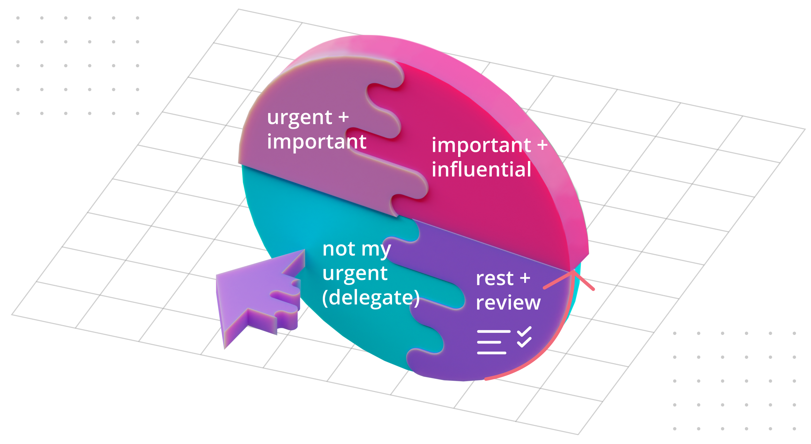

## overview

I picked up [The Art of Coaching](https://www.amazon.com/Art-Coaching-Handbook-Tips-Tools-ebook/dp/B0B5G4644N/) by *Jenny Bird* and *Sarah Gornall* because interpersonal communication is notoriously difficult to get right: many leaders assume they are effortless communicators until the negative effects of their communication style accumulate enough to be visible, often all at once.

## communication

Communication failures are frequent. The leading cause is a lack of awareness of the medium through which verbal and written messages are transferred, and the resulting under-estimation of the effort required to overcome the interferences present in this medium.

### frame of reference

Consider the differences in frame of reference between the *communicator* and the *audience*. Both carry *"baggage"*: assumptions, stories, and models built through uniquely personal experiences including successes, failures, trauma, and beliefs accepted from others.

*Understanding yourself* requires heightened self-awareness and reflection, while *understanding others* requires asking questions and building a personal relationship, even one of transient nature.

### self-reflection

Increasing your communication capabilities will also increase your emotional intelligence, progressing through the following stages:

## conflict resolution

Conflict resolution involves unwinding tight networks of cause and effect, peeling away inaccurate narratives to turn *vicious cycles* (negative feedback loops) into *virtuous cycles* (positive feedback loops).

The *drama triangle* is one unhelpful behavior pattern the human brain is wired to "snap into" in response to conflict:

* The **persecutor** is seen as a danger, attacking the victim unfairly
* The **victim** is the one who feels attacked
* The **rescuer** is pulled into the drama to help the victim by defending against the persecutor

Start by understanding your position, and remember that being trapped in this triangle is a form of suffering for everyone involved including the persecutor:

* The **rescuer** is overwhelmed by carrying the weight of the victim in addition to their own burden, which quickly leads to burnout
* The **persecutor** blames the victim for violated expectations and sees them as an obstacle to success
* The **victim** feels unfairly targeted and sees expectations as unreasonable, but cannot communicate this to the persecutor effectively

Once the roles are identified, follow this process to nudge the participants out of their unhelpful behaviors:

* The **victim** must voice their view, owning and taking responsibility for their thoughts and reactions. Speaking up against the persecutor requires overcoming fear while acknowledging vulnerability is discomforting. Admitting that mistakes may have been made made on both sides takes strength and courage.
* The **rescuer** must develop awareness of their role as well as the roles of others, and understand the boundaries of their responsibility.
* The **persecutor** must recognize other people's value and skills, accept that everyone does their best given knowledge and experience they have to date, and use mistakes and unexpected outcomes to learn and develop.

All participants must be *voicing their position*, *responsible for their reactions*, and *proactive* in supporting other participants.

## learning

Leaders who don't take the *learning cycle* into account fail to build knowledge and experience on their team:

1. Creative experimentation
2. Mapping or experiencing
3. Analysis or reflection
4. Mental model generation

> A common symptom is feedback from your reports that they are no longer "learning anything new", because they are **repeating the same year of experience** instead of accumulating **years of meaningful experience**. This diminishes their competitive advantage and forces them to leave the team in order to rebuild it.

## leadership

The *defining aspects of leadership* are:

* **Understanding** *spheres of influence* to build partnerships and co-create
* **Establishing** *aim* and *direction* of the company, team, or project
* **Planning** how to get there, including *strategy*, *timeline*, and *resourcing*
* **Aligning** people to achieve a goal through *team building* and *communicating*
* **Delivering** on agreements, which require *motivation*, *coordination*, and *solution finding*
* Staying sane and healthy in complex contexts, which requires *balance* and *resilience*

The typical challenge faced by leaders at all levels is analyzing people on the team to choose an appropriate coaching style:

* **Direction**: useful for *entry level skills* and *variable will* (lacking focus)
* **Mentorship**: useful for team members with *high level of will* (ambitious), who are still building their skills
* **Coaching**: useful for experienced team members with *variable will* (sometimes losing focus or getting off-track)
* **Delegation**: appropriate for highly skilled and ambitious team members

## coaching

Coaching works in the gap between where someone is and where they want to be. The path to their goal is uncertain and requires daily commitment. Try asking your team members:

* What attracts you?
* What is the most intuitive way to track your progress?
* What distractions might pull you in other directions, and how could they be avoided?
* How could you ensure you practice daily commitment and stay the course?

The replies should give you enough to put together a complete, personalized coaching program for that person.

## force field analysis

To help someone deal with distractions on the way to their goal, try using the force field analysis chart:

On the *negative* side, list distractions. On the *positive* side, list strategies to deal with each distraction as it comes up. The chart can be periodically reviewed to identify more distractions and design more counter-measures.

> Let's say someone hires a coach to help them get fit. Besides working out, there are other components that require daily commitment, like nutrition. The client enjoys visiting a coffee shop in the morning, where the environment is designed to create mental pressure for customers to buy an overpriced pastry along with the coffee. How can the client get their morning coffee but resist getting a pastry?

## support matrix

Coaching requires **active support**. Providing support in a way that's wrong for a particular person or failing to provide it can permanently damage the relationship with direct reports.

> There is only **one quadrant** which results in a **positive outcome**: this is why inexperienced leaders will often "poke in the dark" until they discover a combination that works.

* **High** challenge, **low** support: potential is undermined, which leads to frustration and resentment among the reports. Typical symptoms are *complaints about being unsupportive*.
* **Low** challenge, **low** support: disengagement. This can result in low performance for the team, which will get the leader in trouble from above and result in attrition of ambitious team members.
* **Low** challenge, **high** support: missed opportunity. This gets the leader in trouble from below as their reports feel anger, regret, and bitterness at being under-utilized and disrespected.

## productivity

Giving in to interruptions and fire-fighting can be tempting, but a superior ability to keep calm and prioritize lets high-performers rise above the work.

> President Eisenhower used to organize his desk to separate the important tasks from the urgent ones. He sought to do the **important** rather than the **urgent**. So there is a long precedence for using relative urgency and importance to sort and prioritize tasks. -- Bird and Gornall, The Art of Coaching

The Do-It disc can be used to prioritize tasks for your next working session:

1. Important and *influential* (high-leverage) tasks
2. Important and *urgent* tasks
3. Urgent tasks but *not my urgent* (good candidates for delegating)
4. Review: a slice of time used to *rest and review* the task list

## future-based planning

The best way to reach a goal is always keeping the end in mind and creating milestones at `t - 1`, `t - 2` and so on.

This technique is useful for self-improvement and managing a team of reports.

* In the first case it helps you stay focused on *high-leverage work*.
* In the second case, it sets clear expectations with your reports, as all you have to do is make sure they are "ready" for their next level. This eliminates resentment for not being promoted (whether it's fair or based on entitlement) and creates a framework for analyzing *violated expectations* without conflict.

## the change process

As time progresses, people go through several stages before they change, fluctuating between *positive* and *negative* emotions at *different rates*:

1. Stability
2. Immobilization
3. Denial
4. Anger
5. Bargaining
6. Depression
7. Testing
8. Acceptance & Ownership

## team balloon

It's important to voice and agree on a direction the whole team is heading, what it would look like if the shared purpose was fulfilled, what holds the team back, and what could remove impediments to progress.

## conclusion

I recommended this book for anyone faced with analyzing poor communication or leadership failures. It will help you cultivate a scientific mindset when dealing with unexpected reactions and outcomes, and avoid trouble in your personal journey by getting educated instead of going through endless cycles of trial and error while causing needless suffering for the whole team.
