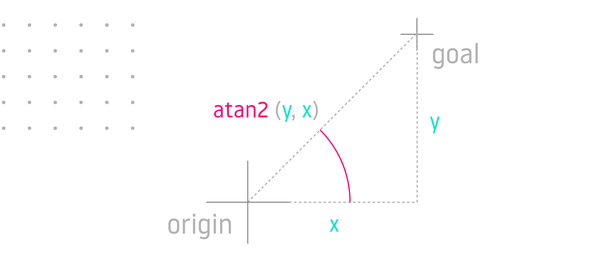
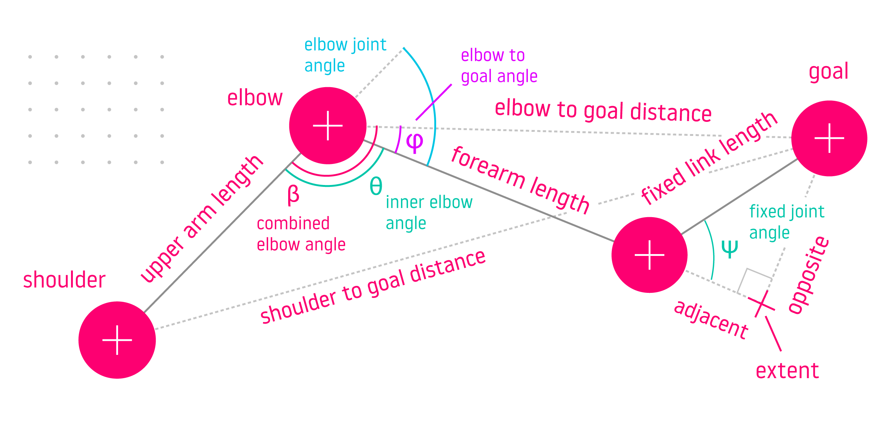

## introduction

*Inverse Kinematics* is a way to calculate the position that each robot arm joint would need to have in order for the gripper at the end of the arm, called the *end-effector*, to reach a specific point in space, sometimes with a specific orientation toward that point.

A software plugin that can compute joint positions given the desired goal pose is called an *Inverse Kinematics Solver* or *IK solver*.

## motivation

Open-source IK solvers like [KDL](https://orocos.org/wiki/Kinematic_and_Dynamic_Solvers.html) and [IKFast](http://openrave.org/docs/latest_stable/) are easy to setup but only address common scenarios encountered in robotics research labs. If you are building a custom robot, you could look for ways to appease the automated tools until they generate something that works, or learn how to write an IK solver yourself.

Learning about inverse kinematics is another hurdle, as many resources on the subject require extensive mathematical background and fail to provide practical examples, making this subject more complicated than necessary.

This article aims to put you on the fastest path to writing your own solver.

## background

If you're looking for more background, [Introduction to Robotics](https://www.amazon.com/Introduction-Robotics-Analysis-Control-Applications/dp/0470604468/ref) by Saeed Niku explains inverse kinematics using high-school level math:


## overview

The following sections will define important concepts and dive right into working inverse kinematics code examples after a brief survey of approaches.

We will be using [MathWorks Matlab](https://www.mathworks.com/pricing-licensing.html?prodcode=ML&intendeduse=home) or [GNU Octave](https://octave.org/) for testing equations and [Blender](https://www.blender.org/features/) for visualizing solutions and robot geometry.

## robot description

Both *forward* and *inverse* kinematics require describing robot *joints*. This is often provided in the form of the *Universal Robot Description Format* ([URDF](https://wiki.ros.org/urdf)).

The types of joints you'll be dealing with most often are *Revolute* and *Prismatic*. Revolute joints rotate around the joint axis, and prismatic joints slide on it.

In the following video we will use Blender to re-create robot descriptions for [KUKA KR-5 industrial robot](https://github.com/orsalmon/kuka_manipulator_gazebo), [Basic robot arm](https://github.com/01binary/basic_velocity_control/tree/pretty/description), and [Str1ker drumming robot arm](https://github.com/01binary/str1ker_moveit_config).

TODO Insert Video Here

Using Blender simplifies working with robot description:

+ Each `<joint>` element in URDF (robot description file) defines a joint.
+ The joint `<parent>` element defines its parent (we will use *Make Parent without Inverse* to represent this in Blender).
+ The joint `<origin>` element defines the *offsets* from the previous joint with `xyz` attribute (translation on `X`, `Y` and `Z` axis in meters) and *twists* with `rpy` attribute (*roll*, *pitch*, *yaw* angles in radians).
+ The `<axis>` element defines the axis of rotation or sliding motion.
+ The `<limit>` element defines joint position, velocity, and effort limits.
+ The `<child>` element refers to the child `<link>` in the same file, which is a 3D model of a segment of the robot arm between the current and the next joint (for example, *forearm* is between *elbow* and *wrist*).
+ The corresponding `<link>` element for the child link contains a `<visual>` element that usually specifies the `<mesh>` element with the `filename` of the 3D model used to represent the link visually.

Once the *models* for the *links* associated with each *joint* are imported in Blender, *parent-child* relationships are setup, and *offsets* are specified for each joint, we will be able to use the Blender to calculate *forward kinematics* and visualize *inverse kinematics* solutions.

## representing joints

Joints are represented by `4x4` (*homogenous*) transformation matrices:

+ *Revolute* joints are defined by a revolution around an axis.
+ *Prismatic* joints are defined by a translation on an axis.

Linear and angular offsets from the previous joint are also included:

+ *Linear offset* is usually the length or height of the previous link, and is defined by a constant translation.
+ *Angular offset* (or *twist*) is any constant rotation that is not on joint axis.

The position of the joint is called a *joint variable* because it could represent an angle in radians or an offset in meters. Joints may also have more than one degree of freedom (DOF) with one joint variable assigned to each DOF.

## joint matrix in blender

Once the robot is assembled in Blender, it's easy to extract joint matrices.

1. Turn one of the Blender panes into a **Python Console**. If you haven't customized anything previously, the Animation pane on the bottom is a great choice for being turned into a console pane. Click the dropdown menu with the *clock icon*, and choose *Python Console* pane type under the *Scripting* category.
2. Name your joints on the **Outliner** pane displayed on top right. You should be able to expand each joint to see the children.
3. Execute the following in the *Python Console* to extract the joint matrix (`bpy` is the Blender Python API singleton):

  `bpy.data.objects["joint_name"].matrix_local`

4. To extract the position and orientation of the end-effector in world space coordinates, use the `matrix_world` property:

  `bpy.data.objects["end_effector"].matrix_world`

If you followed these steps, you've just calculated forward kinematics.

It's helpful to visualize joint coordinate frames by using an *Empty Arrows* object in Blender. Click *Add* &gt; *Empty* &gt; *Arrows* and parent this new Empty object to the last joint *without inverse*:

TODO image of robot arm with empty arrows

## joint matrix in octave

To build a 4x4 joint matrix in [GNU Octave](https://octave.org/download), execute the following directly on the command prompt, or save in a `.m` script and then execute the script:

```
pkg load matgeom

Joint = ...
  createTranslation3d(0, 0, 0) * ...    % offset
  createRotationOz(jointVariable) * ... % rotation on joint axis
  createRotationOx(pi / 2);             % twist
```

Once you have the matrices for each of the joints, calculate forward kinematics by multiplying them together to get the end-effector pose:

```
% Define Joint Variables
base = 0;
shoulder = -0.501821;
elbow = 0.904666;
wrist = 0.917576;

% Define Joint Frames
pkg load matgeom
Base = createRotationOz(base);
Shoulder = ...
  createTranslation3d(0, 0, 0.670) * ...
  createRotationOy(shoulder);
Elbow = ...
  createTranslation3d(0.7, 0, 0) * ...
  createRotationOy(elbow);
Wrist = ...
  createTranslation3d(0.7, 0.05, 0) * ...
  createRotationOx(wrist) * ...
  createTranslation3d(0.18, 0, 0);

% Calculate Forward Kinematics
EE = Base * Shoulder * Elbow * Wrist;
```

## joint matrix in matlab

You may find it easier to use Matlab on the command line much like Octave:

```
matlab -nodesktop
```

Unlike Octave, Matlab will launch with its system folder as the current directory, so you may have to change the current directory using `cd` after launching.

To build a 4x4 joint matrix in [MathWorks Matlab](https://www.mathworks.com/products/matlab.html):

```
Joint = ...
  makehgtform(‘translate’, [0, 0, 0]) * ...   % offset
  makehgtform(‘zrotate’, jointVariable) * ... % rotation on joint axis
  makehgtform(‘xrotate’, pi / 2)              % twist
```

Multiply the joint matrices together to calculate forward kinematics:

```
% Define Joint Variables
base = 0;
shoulder = -0.501821;
elbow = 0.904666;
wrist = 0.917576;

% Define Joint Frames
Base = makehgtform('zrotate', base);
Shoulder = ...
  makehgtform('translate', [0, 0, 0.670]) * ...
  makehgtform('yrotate', shoulder);
Elbow = ...
  makehgtform('translate', [0.7, 0, 0]) * ...
  makehgtform('yrotate', elbow);
Wrist = ...
  makehgtform('translate', [0.7, 0.05, 0]) * ...
  makehgtform('xrotate', wrist) * ...
  makehgtform('translate', [0.18, 0, 0]);

% Calculate Forward Kinematics
EE = Base * Shoulder * Elbow * Wrist;
```

Matlab and Octave are essentially *Python REPLs*. The `...` (*ellipsis*) is used to wrap your code to the next line and `%` is a single-line comment.

Placing `;` at the end of the line will execute the line without echoing the output. Omitting `;` will echo the output of the calculation.

## denavit-hartenberg

The *Denavit-Hartenberg* (DH) *parameters* are simply a convention for describing a joint transformation matrix as a function of four parameters:

+ Joint offset `d`: translation on Z axis
+ Joint angle `θ`: rotation on Z axis
+ Link length `a`: translation on X axis
+ Joint twist `α`: rotation on X axis

The *Denavit-Hartenberg matrix* can be built directly by using the following expressions in each matrix cell, or by multiplying the above transforms:

```
[cos(θ),  -sin(θ) * cos(α), sin(θ) * sin(α),  a * cos(θ)]
[sin(θ),   cos(θ) * cos(α), -cos(θ) * sin(α), a * sin(θ)]
[0,        sin(α),           cos(α),          d         ]
[0,        0,                0,               1         ]
```

See [Octave](https://github.com/01binary/inverse-kinematics/tree/main/exercise11-denavit-hartenberg/octave) and [Matlab](https://github.com/01binary/inverse-kinematics/tree/main/exercise11-denavit-hartenberg/matlab) examples of defining joints using DH parameters and multiplying them together to calculate forward kinematics.

## end-effector matrix

The `4x4` matrix that describes the end-effector pose consists of four vectors:


```
[nx, ox, ax, px]
[ny, oy, ay, py]
[nz, oz, az, pz]
[0,  0,  0,  1 ]
```

+ The `N` or *Normal* unit vector with components `nx`, `ny`, `nz` describes the *normal* pointing out of the end-effector. Rotation around this vector corresponds to *roll* in terms of [Euler](https://mecharithm.com/learning/lesson/explicit-representations-orientation-robotics-roll-pitch-yaw-angles-15) (roll-pitch-yaw) angles.
+ The `O` or *Orientation* unit vector with components `ox`, `oy`, `oz` is the local *up* direction, thus rotation around this axis is equivalent to *yaw*.
+ The `A` or *Approach* unit vector with components `ax`, `ay`, `az` is the local *right* direction, thus rotation around this axis is equivalent to *pitch*.
+ The `P` or *Position* vector with components `px`, `py`, `pz` describes the *position* of the end-effector on `X`, `Y`, `Z` axis in world space.

To visualize any of these unit vectors by using the [Blender Math Vis Console](https://docs.blender.org/manual/en/latest/addons/3d_view/math_vis_console.html):

```
% Draw a line from first to second point
line = [Vector((0, 0, 0)), Vector((x, y, z))]

% Erase a line
line = 0
```

## types of ik solutions

There are several ways to solve inverse kinematics problems:

+ *Numerical* solvers measure *changes* to end-effector *pose* resulting from *changes* in *joint variables*, until they find a solution within tolerance.
+ *Sampling-based* solvers build a *graph* of random possible joint states and look for *connections* that lead to end-effector reaching *goal pose*.
+ *Analytical* solvers equate the *product of all joint matrices* with the end-effector *pose*, and solve the resulting *system of nonlinear equations*.
+ *Geometric* solvers use *trigonometry* to break the problem into multiple steps and solve for each joint variable on its own plane.

## numerical solvers

Numerical solvers iteratively *sample* poses calculated from combinations of *joint variables* by using *forward kinematics*.

Each joint variable is *increased* or *decreased* based on whether a *change* in this variable resulted in the end-effector pose getting *closer* to or *further* away from the goal. The search *stops* when the pose is within *tolerance of the goal*.

We will look at how to implement *gradient descent* and *newton-raphson iterator* numerical solvers in the following two sections.

## gradient descent

The *amount* by which to change each joint variable at each iteration is calculated by using a *gradient equation*:

1. Increment each joint *j* at each iteration *n* by Δ:

  joints<sub>n, j</sub> = joints<sub>n - 1, j</sub> + Δ

2. Call the forward kinematics function to get the end-effector pose after this joint was incremented by Δ:

  pose<sub>n</sub> = forwardKinematics(joints<sub>n</sub>)

3. Compute the *error* by using a *gradient equation*: the difference in end-effector poses divided by the difference in joint angles:

  error = (pose<sub>n</sub> - pose<sub>n - 1</sub>) / Δ

  This *signed* value is used as a weight to pull the joint variable in the direction (`+`/`-`) that moves the end-effector closer to the goal.

  Dividing by Δ re-maps the error from world space (since this value comes from subtracting end-effector poses) to joint space, where it's now expressed in *joint units* and can be used to do *steering*.

4. Add the *error* scaled by a *damping* factor to the joint variable:

  joints<sub>n, j</sub> = joints<sub>n - 1, j</sub> + error &times; damping

 The damping factor is how many joint units to "steer" toward the goal each iteration. A large damping factor may result in over-steering and missing the goal while a small damping factor will make the journey longer than necessary.

The same *gradient* strategy is [used by bacteria to navigate](https://www.ncbi.nlm.nih.gov/pmc/articles/PMC3320702) and can be visualized as a rise-over-run *descent* down a *slope* to minimize the error:


We can implement this algorithm in C++ using the [Eigen3](https://eigen.tuxfamily.org/index.php?title=Main_Page) library for matrix calculations. First define the forward kinematics function that can take a *vector of joint variables* and return the *end-effector pose*:

```
#include <Eigen/Dense>

using namespace Eigen;

Matrix4d forwardKinematics(MatrixXd jointVariables)
{
  return
    // Base
    (
      Translation3d(0, 0, 0) *
      AngleAxisd(jointVariables(0,0), Vector3d::UnitZ())
    ).matrix() *
    // Shoulder
    (
      Translation3d(0, 0, 0.670) *
      AngleAxisd(jointVariables(1,0), Vector3d::UnitY())
    ).matrix() *
    // Elbow
    (
      Translation3d(0.7, 0, 0) *
      AngleAxisd(jointVariables(2,0), Vector3d::UnitY())
    ).matrix() *
    // Wrist
    (
      Translation3d(0.7, 0.05, 0) *
      AngleAxisd(jointVariables(3,0), Vector3d::UnitX())
    ).matrix() *
    // Hand
    (
      Translation3d(0.18, 0, 0) *
      AngleAxisd(0.0, Vector3d::UnitX())
    ).matrix();
}
```

The algorithm starts by initializing the joint variables with an *initial guess*, which has a biasing influence on the outcome.

> For example, if your robot configuration is elbow-up, you would bias the shoulder joint to a negative value and the elbow to a positive value so that the algorithm first tries to reach the goal with the elbow facing up.

See the [complete project](https://github.com/01binary/inverse-kinematics/tree/main/exercise15-gradient-descent) in the companion repository.

```
#include <iostream>
#include "fk.h" // previous code snippet

using namespace std;

double distanceToGoal(
  Vector3d goalPosition, MatrixXd jointVariables);

double calculateError(
  Vector3d goal, MatrixXd jointVariables, int joint, double delta);

int main(int argc, char** argv)
{
  // Algorithm parameters
  const int MAX_ITERATIONS = 10000;
  const double DELTA = 0.001;
  const double DAMPING = 0.001;
  const double TOLERANCE = 0.0001;

  // Initial joint states
  const double BIAS_BASE = 0;
  const double BIAS_SHOULDER = -0.5;
  const double BIAS_ELBOW = 0.5;
  const double BIAS_WRIST = 0;

  // Prompt for goal position
  Vector3d goal;
  goal << stod(argv[1]), stod(argv[2]), stod(argv[3]);

  // Run the algorithm
  MatrixXd jointVariables(4, 1);
  jointVariables <<
    BIAS_BASE, BIAS_SHOULDER, BIAS_ELBOW, BIAS_WRIST;

  for (int iteration = 0; iteration < MAX_ITERATIONS; iteration++)
  {
    for (int joint = 0; joint < jointVariables.rows(); joint++)
    {
      double error = calculateError(
        goal, jointVariables, joint, DELTA);

      jointVariables(joint, 0) -= DAMPING * error;
    }

    if (distanceToGoal(goal, jointVariables) < TOLERANCE) break;
  }

  cout << endl << "Joints" << endl << jointVariables << endl;

  return 0;
}

double distanceToGoal(
  Vector3d goalPosition, MatrixXd jointVariables)
{
  Matrix4d endEffector = forwardKinematics(jointVariables);
  Vector3d position = endEffector.block<3, 1>(0, 3);
  return (goalPosition - position).norm();
}

double calculateError(
  Vector3d goal, MatrixXd jointVariables, int joint, double delta)
{
  double before = distanceToGoal(goal, jointVariables);

  MatrixXd afterVariables = jointVariables;
  afterVariables(joint, 0) += delta;

  double after = distanceToGoal(goal, afterVariables);

  return (after - before) / delta;
}
```

## newton-raphson

The *newton-raphson iterator* algorithm is similar to *gradient descent*. The amount by which to *increase* or *decrease* each joint variable at each iteration is computed by using the *Jacobian matrix* inverse or transpose.

The Jacobian matrix describes *how much* the end-effector moves and rotates on each *axis* in response to each *joint variable* changing. Its inverse or transpose will give you the influences of joint variables on the end-effector.

This matrix will have as many rows as the dimensions being tracked and as many columns as there are joint variables. In this example we are tracking just three dimensions (end-effector `X`, `Y`, and `Z`).

For each joint *j* at each iteration *n*:

1. Increment the joint variable by Δ:

  joints<sub>n, j</sub> = joints<sub>n - 1, j</sub> + Δ

2. Compute the resulting change to the end-effector pose by using forward kinematics:

  pose<sub>n</sub> = forwardKinematics(joints<sub>n</sub>)

3. Calculate the difference between the end-effector poses (in world units), divided by Δ (in joint units), to get the weight this joint has on the end-effector pose, recording it in the Jacobian matrix:

  J<sub>j</sub> = (pose<sub>n</sub> - pose<sub>n - 1</sub>) / Δ

4. Compute the *error* (the difference between the end-effector pose with given joint variables, and the goal pose):
  
  error = goal - pose<sub>n</sub>

5. Add the error to the joint variable. The error is scaled by the influence of this joint on the end-effector pose that's looked up from the transposed Jacobian matrix (this re-maps the error from world-space to joint-space), and scaled again by a damping factor (how much of a correction to make at each iteration in joint units):

  joints<sub>n, j</sub> = joints<sub>n - 1, j</sub> + Jtranspose<sub>j</sub> &times; error &times; damping

See the [complete project](https://github.com/01binary/inverse-kinematics/tree/main/exercise16-newton-raphson) in the companion repository.

```
#include <iostream>
#include <Eigen/Dense>
#include "fk.h"

using namespace std;
using namespace Eigen;

Vector3d forwardKinematicsPositionOnly(MatrixXd angles)
{
  // Calculate end-effector position and orientation
  Matrix4d endEffector = forwardKinematics(angles);

  // Take only the position X Y Z
  return endEffector.block<3, 1>(0, 3);
}

MatrixXd calculateJacobian(const VectorXd& angles)
{
  const double EPSILON = 1e-6;
  const int joints = angles.size();

  Vector3d pose = forwardKinematicsPositionOnly(angles);
  MatrixXd jacobian(3, joints);

  for (int n = 0; n < joints; ++n)
  {
    VectorXd deltaAngles = VectorXd::Zero(joints);
    deltaAngles(n) = EPSILON;

    const Vector3d diff =
      forwardKinematicsPositionOnly(angles + deltaAngles) - pose;

    jacobian.block<3, 1>(0, n) = diff / EPSILON;
  }

  return jacobian;
}

int main(int argc, char** argv)
{
  // Algorithm parameters
  const int MAX_ITERATIONS = 10000;
  const double TOLERANCE = 0.001;
  const double DAMPING = 0.5;

  // Initial joint states
  const double BASE_BIAS = 0;
  const double SHOULDER_BIAS = 1;
  const double ELBOW_BIAS = -1;
  const double WRIST_BIAS = 0;

  if (argc < 4) return 1;

  cout << "Inverse kinematics" << endl << endl;
  cout << "Given Position" << endl;
  cout << "[ "
    << argv[1] << ", "
    << argv[2] << ", "
    << argv[3]
    << " ]"
    << endl
    << endl;

  Vector3d goalPose;
  goalPose << stod(argv[1]), stod(argv[2]), stod(argv[3]);

  VectorXd angles(4);
  angles << BASE_BIAS, SHOULDER_BIAS, ELBOW_BIAS, WRIST_BIAS;
  
  for (int iteration = 0; iteration < MAX_ITERATIONS; iteration++)
  {
    Vector3d pose = forwardKinematicsPositionOnly(angles);
    Vector3d error = goalPose - pose;

    if (error.norm() < TOLERANCE) break;

    MatrixXd Jtranspose = calculateJacobian(angles).transpose();
    angles = angles + DAMPING * (Jtranspose * error);
  }

  cout << endl << "Angles" << endl << angles << endl;

  return 0;
}
```

## sampling solvers

*Sampling-based* solvers create a *graph* of randomly sampled *states* (each state with different *joint variables*) and look for a *path* through this graph that reaches the desired *goal pose*.


> Sampling solvers are popular because they are able to find a path to the goal in the presence of obstacles like joint limits or actual physical objects.

Like other numerical solvers, they use an iterative algorithm which takes time and could fail to find a solution. A unique limitation of sampling solvers is that they require [at least 6-DOF](https://answers.ros.org/question/152591/kdl-kinematics-solver-limitations/) to make arbitrary points in space reachable.

It's useful to know the basic theory behind this type of solver, but we won't gain much by implementing our own since it would be subject to the same limitations as the KDL solver which works with [MoveIt](https://moveit.ros.org/) out of the box.

## ikfast

Before we dive into analytical IK theory let's look at [IKFast](https://ros-planning.github.io/moveit_tutorials/doc/ikfast/ikfast_tutorial.html?highlight=ikfast) utility that auto-generates a solver based on the robot description and a [solution type](http://openrave.org/docs/latest_stable/openravepy/ikfast/#ik-types).

Install IKFast (and the MoveIt IKFast wrapper that simplifies working with this tool) by following [IKFast Kinematics Solver](https://ros-planning.github.io/moveit_tutorials/doc/ikfast/ikfast_tutorial.html?highlight=ikfast) tutorial.

> If you don't have a Linux machine handy, look for a [quick tutorial](https://www.youtube.com/watch?v=oi8f6hVI2P4) on running an Ubuntu virtual machine with [Multipass](https://multipass.run/).

An [example of a solver plugin](https://github.com/01binary/inverse-kinematics/tree/main/exercise19-analytical-ik-basic) auto-generated by *IKFast* for the [Basic robot arm](https://github.com/01binary/basic_velocity_control/tree/pretty/description) is provided in the companion repository. See the [solver implementation](https://github.com/01binary/inverse-kinematics/blob/main/exercise19-analytical-ik-basic/src/robot_arm_ikfast_solver.cpp).

## analytical ik

In this section we will design an *analytical solver* in Matlab and export it to working C++ code by following these steps:

1. Equate the product of all *joint matrices* with the *end-effector pose*.
2. Multiply both sides by inverse of joint matrices to de-couple joint variables in the equations.
3. The resulting matrix equation breaks down into a *system of nonlinear equations* (one for each matrix cell).
4. This system of equations is then solved for the joint variables.

## systems of equations

You may recall solving systems of linear equations in middle school.


Here's a refresher from *Alan Wake 2* where you must solve a system of equations to [access a locked container](https://www.youtube.com/watch?v=pABHyFH8FQs):

> There are 3 batteries (B1, B2, B3) with a combined charge of 1600 Amps.<br/>
> B2 has 128 Amps more than B3.<br/>
> B1 has two times as much charge as B3.<br/>
> How many amps does B2 have?

We can model this in Matlab or Octave as follows:

```
% Declare unknowns
syms B1 B2 B3 real

% Equation 1: All 3 batteries have a combined charge of 1600 Amps
E1 = B1 + B2 + B3 == 1600

% Equation 2: B2 has 128 Amps more than B3
E2 = B2 == B3 + 128

% Equation 3: B1 has two times as much charge as B3
E3 = B1 == B3 * 2
```

Since `B1` and `B2` are both expressed in terms of `B3`, we can substitute them into `E1` by using [subs](https://www.mathworks.com/help/symbolic/subs.html) so that the sum is expressed only in terms of `B3`:

```
% Substitute right-hand side of E3 (which is B3 * 2) into E1
E1 = subs(E1, B1, rhs(E3));

% Substitute right-hand side of E2 (which is B3 + 128) into E1
E1 = subs(E1, B2, rhs(E2));
```

`E1` now looks like this:

```
4*B3 + 128 == 1600
```

Re-arrange `E1` in terms of `B3` by using [isolate](https://www.mathworks.com/help/symbolic/sym.isolate.html):

```
E1 = isolate(E1, B3)
```

`E1` now looks like this:

```
B3 == 368
```

We can now solve `E2` for `B2` after substituting `B3`:

```
E2 = subs(E2, B3, 368)
E2 = isolate(E2, B2)
```

`E2` now looks like this:

```
B2 == 496
```

Watch the [video](https://www.youtube.com/watch?v=pABHyFH8FQs) in the beginning of this section to confirm the protagonist is able to open the container by entering `496` in the code lock.

Matlab and Octave include a symbolic solver, but it can only handle equations of certain complexity. It is able to solve this particular problem with no issue:

```
% Solve a given system of equations for specified variables
solve([E1, E2, E3], [B1, B2, B3])
```

This produces the following output:

```
>> solve([E1, E2, E3], [B1, B2, B3])

ans = 

  struct with fields:

    B1: 736
    B2: 496
    B3: 368
```

We could have used [solve](https://www.mathworks.com/help/symbolic/sym.solve.html) immediately after defining these equations, but that won't work with more complex equations we encounter in the next section.

## analytical ik in matlab

In the following example we solve inverse kinematics for a [3-DOF robot arm](https://github.com/01binary/str1ker_moveit_config). See the `.m` files for this example in the [companion repository](https://github.com/01binary/inverse-kinematics/tree/main/exercise22-analytical-ik-advanced/matlab).

```
% Define symbols for joint variables (output)
syms theta1 theta2 theta3 real

% Define symbols for the end-effector pose (input)
syms nx ny nz ox oy oz ax ay az px py pz real

% Define the end-effector pose
EE = [ ...
  [ nx, ox, ax, px ];
  [ ny, oy, ay, py ];
  [ nz, oz, az, pz ];
  [ 0,  0,  0,  1  ];
];

% Define the joints with Denavit-Hartenberg parameters
Base = ...
  dh(a = 0, d = 0.11518, alpha = pi / 2, theta = theta1) * ...
  dh(a = -0.013, d = 0, alpha = 0, theta = 0);

Shoulder = ...
  dh(a = 0.4173, d = 0, alpha = 0, theta = theta2);

Elbow = ...
  dh(a = 0.48059, d = 0, alpha = 0, theta = theta3) * ...
  dh(a = 0.008, d = 0, alpha = 0, theta = pi / 4) * ...
  dh(a = 0.305, d = -0.023, alpha = 0, theta = -pi / 4 + 0.959931);

% IK equation
IK = Base * Shoulder * Elbow == EE;

% Take the left-hand side
LHS = lhs(IK);

% Take the right-hand side
RHS = rhs(IK);

% System of non-linear equations
E1 = LHS(1,1) == RHS(1,1); % row 1 column 1 from both matrices
E2 = LHS(1,2) == RHS(1,2); % row 1 column 2 from both matrices
E3 = LHS(1,3) == RHS(1,3); % and so on...
E4 = LHS(1,4) == RHS(1,4);
E5 = LHS(2,1) == RHS(2,1);
E6 = LHS(2,2) == RHS(2,2);
E7 = LHS(2,3) == RHS(2,3);
E8 = LHS(2,4) == RHS(2,4);
E9 = LHS(3,1) == RHS(3,1);
E10 = LHS(3,2) == RHS(3,2);
E11 = LHS(3,3) == RHS(3,3);
E12 = LHS(3,4) == RHS(3,4);

% We stop at E12 because the last row is constant (0, 0, 0, 1)
```

Examine equations `E1` through `E12`. You can use [vpa](https://www.mathworks.com/help/symbolic/vpa.html) for readability (for example `vpa(E1, 2)` would render `E1` to 2 digits of precision). Notice that `theta1` is the only variable that appears by itself in equations `E3` and `E7`:

```
>> E3
sin(theta1) == ax

>> E7
-cos(theta1) == ay
```

Use [isolate](https://www.mathworks.com/help/symbolic/sym.isolate.html) to re-write the second equation, exposing `cos(theta1)`:

```
E7 = isolate(E7, cos(theta1))
```

Printing both equations again, we get:

```
>> E3

sin(theta1) == ax

>> E7

cos(theta1) == -ay
```

Solving either equation for `theta1` results in two solutions because `sin` and `cos` return the same value for different angles [depending on the quadrant](https://courses.lumenlearning.com/precalculus/chapter/unit-circle-sine-and-cosine-functions/):

```
>> solve(sin(theta1) == ax, theta1)

ans =

     asin(ax)
pi - asin(ax)
```

Additionally `asin` and `acos` only return real numbers for inputs between `-1` and `1`, thus the solution would only be valid under those conditions. 

The [2-argument inverse tangent](https://en.wikipedia.org/wiki/Atan2) (`atan2`) returns a unique solution as long as we can provide both the *sine* and the *cosine* of the same joint variable:

```
S1 = rhs(E3) % right-hand side of E3 is sin(theta1)
C1 = rhs(E7) % right-hand size of E7 is cos(theta1)

theta1Solution = atan2(S1, C1)
```

Now that we have a solution for `theta1`, convert it to C++ by using [ccode](https://www.mathworks.com/help/symbolic/sym.ccode.html):

```
>> ccode(theta1Solution)

ans =

    '  t0 = atan2(ax,-ay);'
```

Next we need to solve for `theta2` and `theta3`. Reviewing equations `E1` through `E12`, there are no equations where either variable appears by itself. They are always *coupled*: to solve for one, you need the other.

We can multiply both sides of the IK equation by inverse of a joint matrix containing one of these variables to *de-couple* them:

```
% Original equation
IK = Base * Shoulder * Elbow == EE;

% Multiply both sides by inverse of Elbow
IK = Base * Shoulder * Elbow * inv(Elbow) == EE * inv(Elbow);

% Elbow and its inverse cancel out
IK = Base * Shoulder == EE * inv(Elbow);
```

In the above example we over-write the `IK` equation each time just to show the steps. Re-define the system of equations since both sides have changed:

```
% Take the left-hand side
LHS = lhs(IK);

% Take the right-hand side
RHS = rhs(IK);

% System of non-linear equations
E1 = LHS(1,1) == RHS(1,1);
E2 = LHS(1,2) == RHS(1,2);
E3 = LHS(1,3) == RHS(1,3);
E4 = LHS(1,4) == RHS(1,4);
E5 = LHS(2,1) == RHS(2,1);
E6 = LHS(2,2) == RHS(2,2);
E7 = LHS(2,3) == RHS(2,3);
E8 = LHS(2,4) == RHS(2,4);
E9 = LHS(3,1) == RHS(3,1);
E10 = LHS(3,2) == RHS(3,2);
E11 = LHS(3,3) == RHS(3,3);
E12 = LHS(3,4) == RHS(3,4);
```

Many of these equations still have `theta2` and `theta3` locked up.

However, `E4` now has `cos(theta2)` along with `cos(theta1)` which is known; `theta3` no longer appears in that equation. Similarly, `E12` now has `sin(theta2)` exposed, as `theta3` has been moved out to the other side.

Substitute `cos(theta1)` into `E4` by using [subs](https://www.mathworks.com/help/symbolic/subs.html):

```
E4 = subs(E4, cos(theta1), C1);
```

Re-arrange `E4` to isolate `cos(theta2)`, which we then assign to `C2`:

```
C2 = rhs(isolate(E4, cos(theta2)));
```

To complete the puzzle, isolate `sin(theta2)` in `E12`, assigning it to `S2`:

```
S2 = rhs(isolate(E12, sin(theta2)));
```

Now we have `sin(theta2)` and `cos(theta2)` which lets us use `atan2` to solve for `theta2` and convert the solution to C++:

```
theta2Solution = atan2(S2, C2);
ccode(theta2Solution)
```

The last joint variable `theta3` appears in several equations along with `theta1` and `theta2` which can be substituted. Let's pick `E2` and `E10`:

```
% Solve E2 for sin(theta3) substituting S2 and C1
E2 = subs(E2, cos(theta1), C1);
E2 = subs(E2, sin(theta2), S2);
S3 = rhs(isolate(E2, sin(theta3)));

% Solve E10 for cos(theta3) substituting C2 and S3
E10 = subs(E10, cos(theta2), C2);
E10 = subs(E10, sin(theta3), S3);
C3 = rhs(isolate(E10, cos(theta3)));

% Substitute C3 into E2
E2 = subs(E2, cos(theta3), C3);

% Isolate S3 again with C3 substituted
S3 = rhs(isolate(E2, sin(theta3)));

% Solve for theta3
theta3Solution = atan2(S3, C3);
ccode(theta3Solution)
```

Solving for `theta3` was more challenging because all equations had both `sin(theta3)` and `cos(theta3)` - it was always *expressed in terms of itself*.

We had to choose two equations, isolate either `sin(theta3)` or `cos(theta3)` in one of the equations, and substitute into the other equation.

With the substitution done, we could proceed with getting `atan2` since we had both `sin(theta3)` and `cos(theta3)`.

In this example we solved analytical inverse kinematics for a 3-DOF robot arm. The companion repository includes [another example](https://github.com/01binary/inverse-kinematics/blob/main/exercise22-analytical-ik-advanced/matlab/basicIK.m) with 4-DOF robot arm.

## geometric ik

This type of inverse kinematics solution uses *trigonometry* to solve for each joint variable. You will be using a lot of inverse trig functions and [identities](https://github.com/01binary/inverse-kinematics/blob/main/resources/trig-identities.pdf).

## inverse tangent

Given cartesian coordinates on a plane, you can solve for the angle with *inverse tangent*, or *arctangent*. The [2-argument inverse tangent](https://en.wikipedia.org/wiki/Atan2) is preferred because it accounts for the quadrant and therefore returns a *unique angle* for every input:



Inverse tangent can be used to solve for the first joint angle θ (*theta*) of a robot arm mounted on a rotating platform:

```
theta = atan2(y, x)
```


## inverse sine

What if the robot arm has joints which are offset from the centerline? This offset would translate into a *bias angle* added to the basic solution above:


We can describe this problem as a right triangle on `XY` plane, with its first vertex at the robot *origin* and second vertex at the *goal*:

+ The *hypotenuse* is the distance to goal on `XY` plane.
+ The *bias angle* we need to solve for is Ψ (*psi*).
+ The joint offset is *opposite* the *bias angle*.
+ We can use *inverse sine* to solve for this angle because we have the *opposite* side and the *hypotenuse*.

Once we have the bias angle Ψ (*psi*), we can apply it to the angle to goal θ (*theta*) from the previous section to get the final joint angle Φ (*phi*):

```
% Get angle to goal
theta = atan2(y, x)

% Get distance from origin to goal on XY plane
distanceToGoalXY = sqrt(x^2 + y^2)

% Sine of bias angle is joint offset over distance to goal
sin(psi) == offset / distanceToGoalXY

% Get bias angle with inverse sine
psi = asin(offset / distanceToGoalXY)

% Apply bias
phi = theta - psi
```

## law of cosines

The *Law of Cosines* can be used when several joints rotate on the same axis. The sides (*lower case*) are opposite from the angles (*upper case*):


If you know all three *sides* you can solve for any of the *inner angles*:

+ cos(A) = (b<sup>2</sup> + c<sup>2</sup> - a<sup>2</sup>) / 2bc
+ cos(B) = (a<sup>2</sup> + c<sup>2</sup> - b<sup>2</sup>) / 2ac
+ cos(C) = (a<sup>2</sup> + b<sup>2</sup> - c<sup>2</sup>) / 2ab

A pair of links with a common joint can be modeled as a triangle with two sides that are link lengths and the third side that's a distance from first to last joint:


In the following two examples, we will use the law of cosines to compute the shoulder and elbow angles of a 3-DOF robot arm.

Solve for the *inner shoulder angle* θ corresponding to *angle B* in the triangle by isolating it in the equation cos(B) = (a<sup>2</sup> + c<sup>2</sup> - b<sup>2</sup>) / 2ac:

```
theta = acos((a^2 + c^2 - b^2) / 2 * a * c)
``` 

+ `B`: inner shoulder angle
+ `A`: inner elbow angle
+ `C`: inner wrist angle
+ `c`: upper arm link length
+ `b`: forearm link length
+ `a`: the distance between shoulder joint and goal

The *inner shoulder angle* is not enough to determine the angle of the *shoulder joint*, since the triangle would be tilted depending on whether the goal is above or below the shoulder joint.

Therefore we need to solve for the *shoulder to goal* angle β (*beta*), which describes the angle of that tilt:

```
shoulderToGoalDistanceXY = sqrt(
  (goalX - shoulderX)^2 +
  (goalY - shoulderY)^2
)

sin(beta) == goalZ / shoulderToGoalDistanceXY
beta = asin(goalZ, shoulderToGoalDistanceXY)
```

This lets us solve for the *outer shoulder angle* Φ which is the joint angle:

```
phi = theta + beta
```

Now we can use the same process to find the *elbow joint angle*:


If we label the *elbow inner angle* as *A*, then cos(A) = (b<sup>2</sup> + c<sup>2</sup> - a<sup>2</sup>) / 2bc, and to solve for *A* we take the inverse cosine of the right side:

```
theta == acos((b^2 + c^2 - a^2) / 2 * b * c)
```

+ `B`: inner shoulder angle
+ `A`: inner elbow angle
+ `C`: inner wrist angle
+ `c`: upper arm link length
+ `b`: forearm link length
+ `a`: the distance between shoulder joint and goal

The *inner elbow angle* is a part of the *elbow joint angle*. For this robot the elbow joint limits are `0` (elbow "straight") to `180°` or π (elbow "closed").

Subtract the *inner elbow angle* θ from π to invert the angle in [`0` - `π`] range, then negate the result since the joint variable increases *clock-wise*, while angles in trigonometric equations are always described *counter-clockwise*.

```
phi = -(PI - theta3)
```

## fixed joint

In this last example we will compute inverse kinematics for a 4-DOF robot arm, where the angle of the last DOF (the *wrist*) is fixed or determined externally.

> For instance, imagine that at the end of the arm is an excavator bucket controlled by the operator and you want to determine the joint angles needed to touch a point on the ground with the tip of the bucket.

This problem can be represented by three triangles overlaid over each other - one with vertices at *shoulder*, *elbow* and *goal*, another with vertices at  *wrist*, *elbow*, and *goal*, and last one with vertices at *wrist*, *goal*, and *extent*:



We need to isolate the *inner elbow angle* θ between the *upper arm* and the *forearm*. This can be done by using the surrounding geometry:

1. Find the unknown sides of the *shoulder-elbow-goal* triangle: the *elbow to goal distance* and the *shoulder to goal distance*.
2. Use the *shoulder-elbow-goal* triangle to solve for the *combined elbow angle* β with *law of cosines*. This angle is a sum of the angle θ we need and the *elbow to goal* angle φ (*phi*) which is not yet known.
3. Use the *extent-elbow-goal* triangle to solve for φ after we find the unknown sides: one opposite the *fixed joint angle* Ψ (*psi*) and one a sum of *forearm link length* and the side *adjacent* to Ψ.
4. Since β = θ + φ and we know both β and φ, we can solve for θ.
5. Re-map *inner elbow angle* θ according to joint limits by subtracting from π and negating as in the previous section.

Two of these steps require us to find the sides *opposite* and *adjacent* to the fixed joint Ψ (*psi*). We can use *Soh-Cah-Toa* trigonometric identities to do this:

```
sin(psi) == opposite / fixedLinkLength
opposite = sin(psi) * fixedLinkLength

cos(psi) == adjacent / fixedLinkLength
adjacent = cos(psi) * fixedLinkLength
```

Now we can use the larger *elbow-goal-extent* triangle to find the *elbow to goal distance*. Because this is a *right triangle*, its hypotenuse will give you the distance between *elbow* and *goal* vertices.


One of the sides in this triangle is *opposite* the fixed joint. The other is a sum of the *forearm link length* and the side *adjacent* to the fixed joint:

```
elbowToGoalDistance = sqrt(
  (forearmLinkLength + adjacent)^2 +
  opposite^2
)
```

The only unknown side of the *shoulder-elbow-goal* triangle remaining is the *shoulder to goal* distance on the local `XZ` plane:

```
shoulderToGoalDistance = sqrt(
  (goalX - shoulderX)^2 +
  (goalZ - shoulderZ)^2
)
```

Once all sides of the *shoulder-elbow-goal* triangle are known, we can use the *law of cosines* to solve for the *combined elbow angle* β (*beta*).

If we take β to be angle *A* in the *law of cosines* triangle, then:

cos(A) = (b<sup>2</sup> + c<sup>2</sup> - a<sup>2</sup>) / 2bc

+ `A`: combined elbow angle
+ `c`: upper arm link length
+ `b`: elbow to goal distance
+ `a`: shoulder to goal distance


```
beta = acos(
  (
    elbowToGoalDistance^2 +
    upperArmLinkLength^2 -
    shoulderToGoalDistance^2
  )
  /
  (2 * elbowToGoalDistance * upperArmLinkLength)
)
```

The last piece needed to isolate θ is the *elbow to goal* angle φ (*phi*).


We can use the *elbow-goal-extent* triangle to solve for φ because it is a *right triangle* with known sides:

```
tan(phi) == opposite / (forearmLinkLength + adjacent)
phi = atan2(opposite, forearmLinkLength + adjacent)
```

To isolate the *inner elbow angle* θ, subtract the *elbow to goal angle* φ from the *combined elbow angle* β since β is a sum of θ and φ:

```
theta = beta - phi
```

Finally, solve for the *elbow joint angle* by subtracting the *inner elbow angle* θ from π and negating, just as in the previous section:

```
elbowJoint = -(PI - theta)
```

From here we could continue by solving for the *inner shoulder angle* by using the *shoulder-elbow-goal* triangle with known sides. We would add that to the angle from shoulder to goal as before to get the *shoulder joint angle*.

* * *

This article should provide you with a strong foundation for calculating inverse kinematics with a custom robot.

In the next article we will explore calculating inverse kinematics by using a trained TensorFlow network, running on a video card by using *CUDA*.