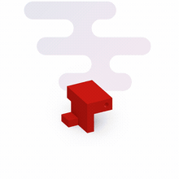
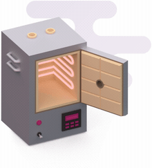

import { Tabs, Tab } from '../components/Tabs'
import { Definition, Property, Value } from '../components/DefinitionList'

## overview

Investment casting (or _lost wax casting_) is a great choice for projects that require large, complex, or detailed metal parts on a budget. The comparison chart below should help you decide if this is the right process for your project.

<Tabs>
	<Tab label="investment casting">
		

			<b>pros</b>
		

		<ul>
			<li>Preserves polished surfaces and reproduces tiny, sharp details</li>
			<li>Temperature resistant (starts deforming at <code>500°F</code>)</li>
			<li>Mechanically strong (<code>3.5%</code> elongation at break)</li>
		</ul>
		

			<b>cons</b>
		

		<ul>
			<li>Complicated process that requires precision and time to get any results</li>
		</ul>
	</Tab>
	<Tab label="green sand casting">
		

			<b>pros</b>
		

		<ul>
			<li>Easy and relatively cheap to get started</li>
			<li>Quality of results scales progressively with skill</li>
		</ul>
		

			<b>cons</b>
		

		<ul>
			<li>Grainy surface, requires advanced techniques and extensive finishing</li>
			<li>Parts come out "blurry", does not reproduce very small or complex details</li>
		</ul>
	</Tab>
	<Tab label="cold casting">
		

			<b>pros</b>
		

		<ul>
			<li>Easy to get good results after a few attempts</li>
			<li>Quality of results scales progressively with skill</li>
	 	</ul>
		

			<b>cons</b>
		

		<ul>
			<li>Partially composed of resin, deforms at <code>90°F</code>, not fire proof</li>
			<li>Requires finishing for seamless metal appearance</li>
	 	</ul>
	</Tab>
	<Tab label="metal 3D printing">
		

			<b>pros</b>
		

		<ul>
			<li>Less toil, skills, and experience required</li>
			<li>Parts can be ordered from an online service with a few clicks</li>
		</ul>
		

			<b>cons</b>
		

		<ul>
			<li>Equipment and service too expensive for a large number of parts</li>
			<li>Still requires finishing and weaker than cast parts (<code>1%</code> elongation)</li>
		</ul>
	</Tab>
</Tabs>

## process steps

The original model is cast four times (two positives and two negatives), with the final positive cast out of the chosen alloy.

1. The first negative is a _rubber mold_, with the original model released and the resulting cavity filled with wax.
2. The _wax pattern_ is removed from the rubber mold, attached to a rubber base with sprues, and put inside of a steel cylinder called a _flask_. The flask is filled with specially formulated plaster called _investment_.
3. When the investment sets, the wax is steamed or flash-fired, leaving a hard _ceramic mold_. This mold, still inside a flask, is fired in a kiln to evacuate water and strengthen the investment.
4. Metal is poured to cast the final positive. Flasks used in investment casting are perforated to enable _vacuum-assist casting_, which forces the air out of the mold and pulls the metal in to fill intricate details.

Aluminum casts can be up to `5%` smaller than the original. This only matters when they are combined with other parts produced through a different method.

## making a rubber mold

To make a rubber mold, build a box slightly larger than the model, fix the model in the box, and fill it with room temperature vulcanization (RTV) rubber.

If you simply cut the master model out of the mold you will produce a _one-part mold_. Releasing a fragile wax pattern from this mold could be next to impossible without breaking it. For this reason, complex models require [two-part molds](https://www.youtube.com/watch?v=DEVi0mEaJJQ).

You can also create additional geometry at this stage to _aid degassing_ or to _add strength_ to the wax pattern cast from the mold.

- Cut _vents_ directly into the rubber mold in concave areas where you find large bubbles collecting and preventing a complete fill.
- Add _supports_ to strengthen thin areas that would break when de-molding.

Entrapped gas is a concern with rubber molds as any bubbles at the surface of the model will become filled spheres on a cast positive. To prevent this, spray the model with a _mold release_ compound before pouring.

## casting a wax pattern

The wax copy of your model is called a _pattern_. Select the wax for your pattern by experimenting with different **expansion ratios**.

- If the expansion ratio is _too high_, investment could be cracked by expanding wax during autoclaving.
- If the expansion ratio is _too low_, wax casts will be brittle and difficult to remove from rubbere molds without breaking

The tools and process required to cast wax patterns from rubber molds depend on the size of the parts:

- _Small_ parts can be cast with a wax injector used for jewelry casting.
- _Large_ parts require several iterations of pouring wax into the mold and degassing in a vacuum oven. Wax can be melted in a Presto pot and poured into a pre-heated mold.

## spruing and gating

After you _chase_ the wax pattern by removing any vents and supports with a wax pen, attach it to a rubber base using _sprues_. When you _invest_ the flask later, the rubber base will give the top of the flask a funnel shape for pouring metal.

Connecting sprues to the rubber base and the model with _sticky wax_ will also reduce re-work and form stronger connections. A poorly attached wax pattern will break off the base and float to the surface as the flask is being invested.

Use fewer sprues and place them at strategic points (_gates_) following thin sections, which will give the metal alternate pathways for filling the mold before solidifying. Placing too many gates in close proximity will cause turbulence from several streams of molten metal colliding under pressure and wasting energy otherwise used to fill mold details, which will result in incomplete fills. Turbulence can also break off small internal features of the mold and they will end up being embedded in the casting as "inclusions".

## mixing investment

Select investment based on the size of the parts to be cast:

- [UltraVest](https://www.riogrande.com/Product/ransom--randolph-ultra-vest-investment-100-lbs/702313) is a good choice for small to medium size aluminum parts that could fit into 6" diameter by 9" high flask.
- [SuspendaSlurry FS](https://www.ransom-randolph.com/suspendaslurry) is great for larger aluminum parts that could be dipped into a bucket of slurry.

When several investment mix ratios are available, start in the middle and then select a ratio resulting in the strongest mold (more investment) while providing enough working time (more water).

Deionize the water before mixing it with investment to filter out mineral particles that weaken the mold. Portable deionizers are easy to get because they are also used for washing cars.

Degass the liquid investment in a vacuum chamber twice while vibrating it with an oscillator: first after mixing and then after pouring into the flask. If the investment molds still have bubbles after vacuuming, spray a layer of anti-sticking compound such as VacuFilm on the wax patterns before investing.

## investing

Place the flask on top of a rubber base with a wax pattern, and attach it using enough painter’s tape to ensure it won’t detach when vibrated. You can wind the rest of the flask with the same tape.

Pour investment into the flask at an angle to avoid creating more bubbles. After the investment sets, scrape the flask with a fettling knife to remove any overhangs that could cause it to get stuck in the vacuum-assist chamber.

## autoclaving

You can remove the wax from from the mold by autoclaving. This requires a pressure cooker filled with an inch of water and a stove to steam the wax out of the mold through the pouring cup. The steam causes the outer layer of wax to permeate into the mold, leaving enough space for the wax to expand and trickle out. Evacuated wax then collects on the bottom of the pressure cooker.

## burnout

Following wax removal, burn out the ceramic molds in a kiln using the schedule provided by the investment supplier in order to evacuate water and fuse fibers in the micro-structure of the mold. Transfer autoclaved molds directly into a pre-heated kiln to avoid cracking from rapid cool-down.

Running a kiln requires a metal desk, a room with a stone floor, all non-ceramic surfaces covered with sheet rock, corners sealed with fire foam, and a ventilation system. Large kilns run on 220-240V similar to washers and dryers.

## metal casting

Use an alloy designed for casting rather than machining. The [356](https://www.makeitfrom.com/material-properties/356.0-SG70A-A03560-Cast-Aluminum) alloy is used for car engine blocks and computer heat sinks, so it’s easy to acquire on the Internet in the form of de-drossed and degassed ingots.

Your goal when casting is to transfer the flask from the kiln to the vacuum assist chamber and pour metal in 2 minutes or less. This avoids a thermal shock that can destroy intricate mold details as the flask rapidly cools to room temperature, causing them to break off and become embedded in the casting.

Once the metal in the crucible reaches the casting temperature, transfer the flask into the [vacuum-assist chamber](<(https://www.youtube.com/watch?v=3BikL2yIDic)>) with a running vacuum pump. Use a temperature resistant O-ring to seal the flask flange to the top of the chamber. This will generate vacuum around the outside of the flask, drawing gases inside the flask out through the walls. While the small gas particles can permeate the mold due to its porous microstructure, the metal cannot. Instead the metal will be pulled toward the walls of the mold, precisely capturing surface details.

If the vacuum is not enough to achieve a complete fill, you can attach a "riser" to the top of the flask to increase the weight of metal pushing down into the mold. Risers also let you pour quickly and avoid dangerous spills because they buffer the metal and feed it at a slower rate while keeping it hot. Install a ceramic filter inside the riser to prevent pieces of forge refractory, dust, and other unwanted particles from entering the mold and becoming inclusions.

## tools & supplies

Tools and consumables mentioned throughout the article are listed here with a few budget presets.

<Tabs label="burnout kiln">
	<Tab label="$">
		<Definition>
			<Property>
				<a target="__blank" href="https://www.ebay.com/p/Compact-Electrical-Muffle-Kiln-with-Digital-Temperature-Controller-Two-Movable-Tile-shelves-R14-Q/1956318322?iid=312064015894">
					7"x4"x4" programmable
				</a>
			</Property>
			<Value>$355</Value>
		</Definition>
	</Tab>
	<Tab label="$$">
		<Definition>
			<Property>
				<a target="__blank" href="https://www.ebay.com/itm/RapidFire-TableTop-Programmable-Ceramic-Precious-Metal-Clay-Jewelry-Kiln-Furnace/381553072012">
					6"x5"x6" programmable
				</a>
			</Property>
			<Value>$500</Value>
		</Definition>
	</Tab>
	<Tab label="$$$">
		<Definition>
			<Property>
				<a target="__blank" href="https://www.ebay.com/itm/Programmable-Fiber-Furnace/253236407481">
					10.5"x10.5"x7.5" programmable
				</a>
			</Property>
			<Value>$1550</Value>
		</Definition>
	</Tab>
	<Tab label="$$$$">
		<Definition>
			<Property>
				<a target="__blank" href="https://www.riogrande.com/product/rio-large-programmable-oven/703022">
					14"x14"x14" programmable
				</a>
			</Property>
			<Value>$2400</Value>
		</Definition>
	</Tab>
	<Tab label="$$$$$">
		<Definition>
			<Property>
				<a target="__blank" href="https://www.riogrande.com/product/rio-extra-large-programmable-oven/703017">
					18"x18"x18" programmable
				</a>
			</Property>
			<Value>$2750</Value>
		</Definition>
	</Tab>
</Tabs>

<Tabs label="vacuum oven">
	<Tab label="$">
		<Definition>
			<Property>
				<a target="__blank" href="https://www.amazon.com/dp/B075ZMPN4H/">
					12"x12"x11"
				</a>
			</Property>
			<Value>$655</Value>
		</Definition>
	</Tab>
	<Tab label="$$">
		<Definition>
			<Property>
				<a target="__blank" href="https://www.amazon.com/OrangeA-Sterilizing-temperature-Controller-Extraction/dp/B01NCP1RTD">
					12"x12"x11"
				</a>
			</Property>
			<Value>$670</Value>
		</Definition>
	</Tab>
	<Tab label="$$$">
		<Definition>
			<Property>
				<a target="__blank" href="https://www.amazon.com/Value-Vacs-0-9CF-Vacuum-Degassing/dp/B072JNQ271">
					12"x12"x11"
				</a>
			</Property>
			<Value>$1100</Value>
		</Definition>
	</Tab>
	<Tab label="$$$$">
		<Definition>
			<Property>
				<a target="__blank" href="https://www.amazon.com/dp/B009WSJNNQ?ref=emc_b_5_t">
					12"x12"x11"
				</a>
			</Property>
			<Value>$1390</Value>
		</Definition>
	</Tab>
	<Tab label="$$$$$">
		<Definition>
			<Property>
				<a target="__blank" href="https://www.amazon.com/dp/B00BEIH65O?ref=emc_b_5_t">
					16"x14.5"x14"
				</a>
			</Property>
			<Value>$2190</Value>
		</Definition>
	</Tab>
</Tabs>

<Tabs label="wax injector">
	<Tab label="$">
		<Definition>
			<Property>
				<a target="__blank" href="https://www.riogrande.com/product/rio-mini-hand-wax-injector-with-thermostat/700047">
					1 pint
				</a>
			</Property>
			<Value>$225</Value>
		</Definition>
	</Tab>
	<Tab label="$$">
		<Definition>
			<Property>
				<a target="__blank" href="https://www.ebay.com/itm/Digital-Vacuum-Wax-Injector-Jewelry-Casting-Machine-for-Jeweler-Tools-220V/332460625503">
					3kg (small but with vacuum)
				</a>
			</Property>
			<Value>$538</Value>
		</Definition>
	</Tab>
	<Tab label="$$$">
		<Definition>
			<Property>
				<a target="__blank" href="https://www.riogrande.com/product/rio-four-quart-air-pressure-wax-injector/700125">
					4 quart (more basic)
				</a>
			</Property>
			<Value>$605</Value>
		</Definition>
	</Tab>
	<Tab label="$$$$">
		<Definition>
			<Property>
				<a target="__blank" href="https://www.riogrande.com/product/dura-bull-four-quart-air-pressure-wax-injector/700057">
					4 quart (fancy but without vacuum)
				</a>
			</Property>
			<Value>$675</Value>
		</Definition>
	</Tab>
	<Tab label="$$$$$">
		<Definition>
			<Property>
				<a target="__blank" href="https://www.riogrande.com/product/rio-digital-vacuum-wax-injectors/700914gp">
					3 quart with vacuum injection
				</a>
			</Property>
			<Value>$2130</Value>
		</Definition>
	</Tab>
</Tabs>

<Tabs label="vacuum pump">
	<Tab label="$">
		<Definition>
			<Property>
				<a target="__blank" href="https://www.amazon.com/Value-Brand-Single-Stage-Vacuum/dp/B013ENREW6/">
					1 stage 7 cfm
				</a>
			</Property>
			<Value>$180</Value>
		</Definition>
	</Tab>
	<Tab label="$$">
		<Definition>
			<Property>
				<a target="__blank" href="https://www.amazon.com/dp/B00SXGOXFG/">
					1 stage 7 cfm
				</a>
			</Property>
			<Value>$306</Value>
		</Definition>
	</Tab>
	<Tab label="$$$">
		<Definition>
			<Property>
				<a target="__blank" href="https://www.bestvaluevacs.com/best-value-vacs-ve280-9cfm-two-stage-vacuum-pump-4006.html">
					2 stage 9 cfm
				</a>
			</Property>
			<Value>$390</Value>
		</Definition>
	</Tab>
	<Tab label="$$$$">
		<Definition>
			<Property>
				<a target="__blank" href="https://www.bestvaluevacs.com/best-value-vacs-ve2100-12cfm-two-stage-vacuum-pump-4007.html">
					2 stage 12 cfm
				</a>
			</Property>
			<Value>$445</Value>
		</Definition>
	</Tab>
	<Tab label="$$$$$">
		<Definition>
			<Property>
				<a target="__blank" href="https://www.bestvaluevacs.com/pro-series-11-3cfm-corrosion-resistant-two-stage-vacuum-pump.html">
					2 stage 11.3 cfm
				</a>
			</Property>
			<Value>$2360</Value>
		</Definition>
	</Tab>
</Tabs>

<Tabs label="vacuum chamber">
	<Tab label="$">
		<Definition>
			<Property>
				<a target="__blank" href="https://www.amazon.com/dp/B01AO0P5NW/">
					1.5 quart
				</a>
			</Property>
			<Value>$56</Value>
		</Definition>
	</Tab>
	<Tab label="$$">
		<Definition>
			<Property>
				<a target="__blank" href="https://www.amazon.com/dp/B01NAGN0AT/">
					1.5 gallon
				</a>
			</Property>
			<Value>$78</Value>
		</Definition>
	</Tab>
	<Tab label="$$$">
		<Definition>
			<Property>
				<a target="__blank" href="https://www.amazon.com/dp/B01N9FGDTY/">
					3 gallon
				</a>
			</Property>
			<Value>$95</Value>
		</Definition>
	</Tab>
	<Tab label="$$$$">
		<Definition>
			<Property>
				<a target="__blank" href="https://www.amazon.com/dp/B01NAH0EWN/ref=sspa_dk_detail_2?psc=1">
					5 gallon
				</a>
			</Property>
			<Value>$105</Value>
		</Definition>
	</Tab>
	<Tab label="$$$$$">
		<Definition>
			<Property>
				<a target="__blank" href="https://www.amazon.com/Gallon-300mm450mm-Stainless-Degassing-Chamber/dp/B072LSX379/">
					8.4 gallon
				</a>
			</Property>
			<Value>$174</Value>
		</Definition>
	</Tab>
</Tabs>

<Tabs label="vacuum assist">
	<Tab label="$">
		<Definition>
			<Property>
				<a target="__blank" href="https://www.youtube.com/watch?v=HV-b1_D8RJs">
					vacuum assist riser fixture
				</a>
			</Property>
			<Value>$56</Value>
		</Definition>
	</Tab>
	<Tab label="$$">
		<Definition>
			<Property>
				<a target="__blank" href="https://www.youtube.com/watch?v=3BikL2yIDic">
					steel plate and pipe, RTV silicone
				</a>
			</Property>
			<Value>$78</Value>
		</Definition>
	</Tab>
	<Tab label="$$$">
		<Definition>
			<Property>
				<a target="__blank" href="https://www.amazon.com/Superland-Combination-Mini-Vacuum-Investing-Investment/dp/B072KDMYX1">
					4"x7" flasks
				</a>
			</Property>
			<Value>$656</Value>
		</Definition>
	</Tab>
	<Tab label="$$$$">
		<Definition>
			<Property>
				<a target="__blank" href="https://www.riogrande.com/product/v-i-c-12-tabletop-solid-and-perforated-flask-casting-machine-with-the-rio-assistant-110-volt/70511814">
					5"x7" flasks
				</a>
			</Property>
			<Value>$1955</Value>
		</Definition>
	</Tab>
	<Tab label="$$$$$">
		<Definition>
			<Property>
				<a target="__blank" href="https://www.riogrande.com/product/neutec-j-2r-casting-machine-ce-certified/710040ce">
					4"x9" flasks
				</a>
			</Property>
			<Value>$7495</Value>
		</Definition>
	</Tab>
</Tabs>

<Tabs label="forge">
	<Tab label="$">
		<Definition>
			<Property>
				<a target="__blank" href="https://www.ebay.com/p/Metal-Melting-Furnace-FB1Sb-Propane-Foundry-Kwik-Jewelry-Gold-Silver-Copper/1153096501">
					6"x7.6
				</a>
			</Property>
			<Value>$250</Value>
		</Definition>
	</Tab>
	<Tab label="$$">
		<Definition>
			<Property>
				<a target="__blank" href="https://www.amazon.com/VEVOR-Capacity-Refining-Precious-Aluminum/dp/B071FSSX68">
					2.56"x4.92" table top
				</a>
			</Property>
			<Value>$360</Value>
		</Definition>
	</Tab>
	<Tab label="$$$">
		<Definition>
			<Property>
				<a target="__blank" href="https://www.ebay.com/itm/Metal-Melting-Furnace-FB1S-Propane-Foundry-Kwik-Jewelry-Gold-Silver-Copper/261498065505">
					4"x7.4" flasks
				</a>
			</Property>
			<Value>$380</Value>
		</Definition>
	</Tab>
	<Tab label="$$$$">
		<Definition>
			<Property>
				<a target="__blank" href="https://www.ebay.com/itm/Metal-Melting-Furnace-FB2M-Propane-Foundry-Kwik-Kiln-Forge-Gold-Silver-Copper/251901919391">
					8"x10" flasks
				</a>
			</Property>
			<Value>$600</Value>
		</Definition>
	</Tab>
	<Tab label="$$$$$">
		<Definition>
			<Property>
				<a target="__blank" href="https://www.amazon.com/dp/B0197A24RU">
					table top 2.56" x 4.92"
				</a>
			</Property>
			<Value>$746</Value>
		</Definition>
	</Tab>
</Tabs>

<Tabs label="crucible">
	<Tab label="$">
		<Definition>
			<Property>
				<a target="__blank" href="https://www.amazon.com/Graphite-Crucible-Melting-Silver-Casting/dp/B01934GVQK">
					table top crucible
				</a>
			</Property>
			<Value>$17</Value>
		</Definition>
	</Tab>
	<Tab label="$$">
		<Definition>
			<Property>
				<a target="__blank" href="https://www.amazon.com/dp/B07415C5C4">
					table top crucible
				</a>
			</Property>
			<Value>$35</Value>
		</Definition>
	</Tab>
	<Tab label="$$$">
		<Definition>
			<Property>
				<a target="__blank" href="https://www.ebay.com/itm/8-10-KG-Clay-Graphite-Foundry-Crucible-Melting-Furnace-Refining-Gold-Silver-CU/321201746624">
					outdoor crucible
				</a>
			</Property>
			<Value>$40</Value>
		</Definition>
	</Tab>
	<Tab label="$$$$">
		<Definition>
			<Property>
				<a target="__blank" href="https://www.ebay.com/itm/Pure-Graphite-Crucible-Metal-Melting-Gold-Silver-Scrap-Casting-Ingot-Mould-5KG/222691515940">
					table top crucible
				</a>
			</Property>
			<Value>$50</Value>
		</Definition>
	</Tab>
	<Tab label="$$$$$">
		<Definition>
			<Property>
				<a target="__blank" href="https://www.ebay.com/itm/Salamander-Clay-Graphite-Morgan-Crucibles-Super-A-16-Furnace-Melt-Non-Ferrous/200636865881">
					outdoor crucible
				</a>
			</Property>
			<Value>$93</Value>
		</Definition>
	</Tab>
</Tabs>

<Tabs label="fan">
	<Tab label="$">
		<Definition>
			<Property>
				<a target="__blank" href="https://www.amazon.com/gp/product/B0043235K8">
					10” 500 cfm
				</a>
			</Property>
			<Value>$67</Value>
		</Definition>
	</Tab>
	<Tab label="$$">
		<Definition>
			<Property>
				<a target="__blank" href="https://www.amazon.com/Vortex-Powerfans-VTX400-172-Powerfan/dp/B0055F6Z7C/">
					4” 172 cfm
				</a>
			</Property>
			<Value>$116</Value>
		</Definition>
	</Tab>
	<Tab label="$$$">
		<Definition>
			<Property>
				<a target="__blank" href="https://www.amazon.com/dp/B01M13M24R">
					4” 100 cfm
				</a>
			</Property>
			<Value>$148</Value>
		</Definition>
	</Tab>
	<Tab label="$$$$">
		<Definition>
			<Property>
				<a target="__blank" href="https://www.amazon.com/dp/B00903HDK8">
					10” 810 cfm
				</a>
			</Property>
			<Value>$167</Value>
		</Definition>
	</Tab>
	<Tab label="$$$$$">
		<Definition>
			<Property>
				<a target="__blank" href="https://www.amazon.com/dp/B003T9CKR0">
					12” 820 cfm
				</a>
			</Property>
			<Value>$340</Value>
		</Definition>
	</Tab>
</Tabs>

<Tabs label="oscillator">
	<Tab label="$">
		<Definition>
			<Property>
				<a target="__blank" href="https://www.amazon.com/Frankford-Arsenal-Quick-n-EZ-Case-Tumbler/dp/B001MYGLJC">
					vibratory tumbler
				</a>
			</Property>
			<Value>$40</Value>
		</Definition>
	</Tab>
	<Tab label="$$">
		<Definition>
			<Property>
				<a target="__blank" href="https://www.amazon.com/Dental-Vibrator-Round-Dentist-Equipment/dp/B00S0X7QHO">
					dental vibrator
				</a>
			</Property>
			<Value>$59</Value>
		</Definition>
	</Tab>
	<Tab label="$$$">
		<Definition>
			<Property>
				<a target="__blank" href="https://www.amazon.com/Adjustable-Speed-Orbital-Shaker-Rotator/dp/B002TEQI42">
					adjustable speed shaker
				</a>
			</Property>
			<Value>$120</Value>
		</Definition>
	</Tab>
	<Tab label="$$$$">
		<Definition>
			<Property>
				<a target="__blank" href="https://www.amazon.com/dp/B008XRM0XM">
					355mm x 235mm platform
				</a>
			</Property>
			<Value>$679</Value>
		</Definition>
	</Tab>
	<Tab label="$$$$$">
		<Definition>
			<Property>
				<a target="__blank" href="https://www.amazon.com/ELMI-DOS-20M-Digital-Orbital-Platform/dp/B008XRLZCE">
					355mm x 235mm platform
				</a>
			</Property>
			<Value>$909</Value>
		</Definition>
	</Tab>
</Tabs>

<Tabs label="scale">
	<Tab label="$">
		<Definition>
			<Property>
				<a target="__blank" href="https://www.amazon.com/1byone-Digital-Kitchen-Cooking-Baking/dp/B01D9XKDNS/">
					digital kitchen scale
				</a>
			</Property>
			<Value>$9</Value>
		</Definition>
	</Tab>
	<Tab label="$$">
		<Definition>
			<Property>
				<a target="__blank" href="https://www.amazon.com/dp/B0171DN6R2">
					digital kitchen scale
				</a>
			</Property>
			<Value>$12</Value>
		</Definition>
	</Tab>
	<Tab label="$$$">
		<Definition>
			<Property>
				<a target="__blank" href="https://www.riogrande.com/product/digital-investment-scale-11-lb-5kg/702108">
					digital investment scale
				</a>
			</Property>
			<Value>$55</Value>
		</Definition>
	</Tab>
	<Tab label="$$$$">
		<Definition>
			<Property>
				<a target="__blank" href="https://www.amazon.com/ZIEIS-Capacity-Stainless-Platform-Accuracy/dp/B0042L04PO/">
					large capacity platform
				</a>
			</Property>
			<Value>$95</Value>
		</Definition>
	</Tab>
	<Tab label="$$$$$">
		<Definition>
			<Property>
				<a target="__blank" href="https://www.amazon.com/USA-Digital-Shipping-Stainless-Platform/dp/B01LXRW17R">
					digital shipping scale
				</a>
			</Property>
			<Value>$140</Value>
		</Definition>
	</Tab>
</Tabs>

<Tabs label="pressure cooker">
	<Tab label="$">
		<Definition>
			<Property>
				<a target="__blank" href="https://www.amazon.com/Mirro-Polished-Aluminum-Pressure-Cookware/dp/B000RNH7PQ">
					22 quart
				</a>
			</Property>
			<Value>$62</Value>
		</Definition>
	</Tab>
	<Tab label="$$">
		<Definition>
			<Property>
				<a target="__blank" href="https://www.amazon.com/Presto-01781-23-Quart-Pressure-Canner">
					23 quart
				</a>
			</Property>
			<Value>$70</Value>
		</Definition>
	</Tab>
	<Tab label="$$$">
		<Definition>
			<Property>
				<a target="__blank" href="https://www.amazon.com/dp/B0002808YS">
					25 quart
				</a>
			</Property>
			<Value>$30</Value>
		</Definition>
	</Tab>
	<Tab label="$$$$">
		<Definition>
			<Property>
				<a target="__blank" href="https://www.amazon.com/dp/B00MCLRFQW">
					30 quart
				</a>
			</Property>
			<Value>$350</Value>
		</Definition>
	</Tab>
	<Tab label="$$$$$">
		<Definition>
			<Property>
				<a target="__blank" href="https://www.amazon.com/All-American-2-Quart-Pressure-Cooker/dp/B0002808ZM">
					41.5 quart
				</a>
			</Property>
			<Value>$500</Value>
		</Definition>
	</Tab>
</Tabs>

<Tabs label="deionizer">
	<Tab label="$">
		<Definition>
			<Property>
				<a target="__blank" href="https://www.amazon.com/dp/B0024E6V30">
					mini inline RV water filter
				</a>
			</Property>
			<Value>$18</Value>
		</Definition>
	</Tab>
	<Tab label="$$">
		<Definition>
			<Property>
				<a target="__blank" href="https://www.amazon.com/dp/B00523AMBC">
					RV water filter
				</a>
			</Property>
			<Value>$45</Value>
		</Definition>
	</Tab>
	<Tab label="$$$">
		<Definition>
			<Property>
				<a target="__blank" href="https://www.amazon.com/dp/B0144MFPOA">
					480 gal under-sink water filter
				</a>
			</Property>
			<Value>$100</Value>
		</Definition>
	</Tab>
	<Tab label="$$$$">
		<Definition>
			<Property>
				<a target="__blank" href="https://www.amazon.com/CR-Spotless-Deionized-Water-System/dp/B0056HDCUM">
					car wash deionizer
				</a>
			</Property>
			<Value>$250</Value>
		</Definition>
	</Tab>
	<Tab label="$$$$$">
		<Definition>
			<Property>
				<a target="__blank" href="https://www.amazon.com/Go-Spotless-Portable-Dual-Deionizer/dp/B00KVPO21C/">
					portable deionizer
				</a>
			</Property>
			<Value>$420</Value>
		</Definition>
	</Tab>
</Tabs>

<Tabs label="pyrometer">
	<Tab label="$">
		<Definition>
			<Property>
				<a target="__blank" href="https://www.ebay.com/itm/194440320479">
					thermocouple controller
				</a>
			</Property>
			<Value>$7</Value>
		</Definition>
		<Definition>
			<Property>
				<a target="__blank" href="https://www.ebay.com/itm/125256238229">
					thermocouple probe
				</a>
			</Property>
			<Value>$17</Value>
		</Definition>
	</Tab>
	<Tab label="$$">
		<Definition>
			<Property>
				<a target="__blank" href="http://mifco.com/shop/pyrometers/mt-400-portable-hand-lance-pyrometer">
					pyrometer with probe and lance
				</a>
			</Property>
			<Value>$340</Value>
		</Definition>
	</Tab>
</Tabs>

<Tabs label="rubber bowls">
	<Tab label="$">
		<Definition>
			<Property>
				<a target="__blank" href="https://www.ebay.com/itm/New-10cm-Dental-Lab-Hygienist-Flexible-Mixing-Bowl-Rubber-Dental-Emporium/152860196168">
					$5
				</a>
			</Property>
			<Value>$17.64</Value>
		</Definition>
	</Tab>
	<Tab label="$$">
		<Definition>
			<Property>
				<a target="__blank" href="https://www.ebay.com/itm/Dental-Lab-Hygienist-Flexible-Mixing-Bowl-Rubber-Size-Large-Green-for-Impression/180428891851">
					1 pint
				</a>
			</Property>
			<Value>$6</Value>
		</Definition>
	</Tab>
	<Tab label="$$$">
		<Definition>
			<Property>
				<a target="__blank" href="https://www.ebay.com/itm/Dental-Lab-Hygienist-Flexible-Mixing-Bowl-Rubber-Size-Large-Green-for-Impression/180428891851">
					1 pint
				</a>
			</Property>
			<Value>$10</Value>
		</Definition>
	</Tab>
	<Tab label="$$$$">
		<Definition>
			<Property>
				<a target="__blank" href="https://www.riogrande.com/product/Rubber-Mixing-Bowl-1-12-Qt/702131">
					1.5 quart
				</a>
			</Property>
			<Value>$15</Value>
		</Definition>
	</Tab>
	<Tab label="$$$$$">
		<Definition>
			<Property>
				<a target="__blank" href="https://www.riogrande.com/product/Rubber-Mixing-Bowl-1-Gal/702132">
					1 gallon
				</a>
			</Property>
			<Value>$23</Value>
		</Definition>
	</Tab>
</Tabs>

<Tabs label="waxer pen">
	<Tab label="$">
		<Definition>
			<Property>
				<a target="__blank" href="https://www.ebay.com/itm/Dental-Electric-Wax-Waxer-Carver-Double-Carving-Pen-pencil-6-Tip-Pot-2018-NEW/121308997601">
					electric wax carver
				</a>
			</Property>
			<Value>$39</Value>
		</Definition>
	</Tab>
	<Tab label="$$">
		<Definition>
			<Property>
				<a target="__blank" href="https://www.riogrande.com/product/rio-benchmount-ii-wax-pen-system/700457">
					bench mount wax pen system
				</a>
			</Property>
			<Value>$158</Value>
		</Definition>
	</Tab>
	<Tab label="$$$">
		<Definition>
			<Property>
				<a target="__blank" href="https://www.riogrande.com/product/giles-precision-wax-pen-tool/700391">
					wax pen tool
				</a>
			</Property>
			<Value>$173</Value>
		</Definition>
	</Tab>
	<Tab label="$$$$">
		<Definition>
			<Property>
				<a target="__blank" href="https://www.riogrande.com/product/foredom-wax-carving-pen/700331">
					foredom wax carving pen
				</a>
			</Property>
			<Value>$204</Value>
		</Definition>
	</Tab>
	<Tab label="$$$$$">
		<Definition>
			<Property>
				<a target="__blank" href="https://www.riogrande.com/product/kerr-ultra-waxer-2/700574">
					ultra waxer
				</a>
			</Property>
			<Value>$333</Value>
		</Definition>
	</Tab>
</Tabs>

<Tabs label="wax warmer">
	<Tab label="$">
		<Definition>
			<Property>
				<a target="__blank" href="https://www.ebay.com/itm/Dental-Lab-Electric-Wax-Waxer-3-Well-Analog-Melting-Dipping-Heater-Pot-Machine/122642117908">
					electric waxer
				</a>
			</Property>
			<Value>$28</Value>
		</Definition>
	</Tab>
	<Tab label="$$">
		<Definition>
			<Property>
				<a target="__blank" href="https://www.riogrande.com/product/digital-three-well-wax-melting-pot-with-lid/700101">
					3-well wax melting pot with lid
				</a>
			</Property>
			<Value>$109</Value>
		</Definition>
	</Tab>
	<Tab label="$$$">
		<Definition>
			<Property>
				<a target="__blank" href="https://www.riogrande.com/product/giles-precision-wax-pen-tool/700391">
					wax pen tool
				</a>
			</Property>
			<Value>$173</Value>
		</Definition>
	</Tab>
	<Tab label="$$$$">
		<Definition>
			<Property>
				<a target="__blank" href="https://www.ebay.com/itm/BesQual-E100-Digital-Wax-Pot-4-Compartment-Dental-Lab/292274197663">
					wax pot with compartments
				</a>
			</Property>
			<Value>$118</Value>
		</Definition>
	</Tab>
	<Tab label="$$$$$">
		<Definition>
			<Property>
				<a target="__blank" href="https://www.ebay.com/itm/Dental-Lab-BesQual-S800-Digital-Multi-Wax-Pot-3-x-Digital-Dipping-Pots/272867180222">
					multi wax pot
				</a>
			</Property>
			<Value>$168</Value>
		</Definition>
	</Tab>
</Tabs>

<Tabs label="wax pot">
	<Tab label="$">
		<Definition>
			<Property>
				<a target="__blank" href="https://www.ebay.com/itm/PRESTO-POT-8lb-WAX-MELTER-LIFETIME-WARRANTY-FREE-SHIPPING/182567297772">
					presto pot wax melter
				</a>
			</Property>
			<Value>$63</Value>
		</Definition>
	</Tab>
	<Tab label="$$">
		<Definition>
			<Property>
				<a target="__blank" href="https://www.ebay.com/itm/PRESTO-POT-WAX-MELTER-WAX-MELTING-WITH-SPOUT-LIFETIME-WARRANTY/230422075172">
					melting pot with spout
				</a>
			</Property>
			<Value>$79</Value>
		</Definition>
	</Tab>
	<Tab label="$$$">
		<Definition>
			<Property>
				<a target="__blank" href="https://www.ebay.com/itm/PRESTO-POT-X-LARGE-WAX-MELTER-CANDLE-MAKING-WITH-SPOUT-WAX-MELTING/231339863625">
					wax pot with compartments
				</a>
			</Property>
			<Value>$100</Value>
		</Definition>
	</Tab>
	<Tab label="$$$$">
		<Definition>
			<Property>
				<a target="__blank" href="https://www.ebay.com/itm/PRESTO-POT-X-LARGE-WAX-MELTER-CANDLE-MAKING-WITH-SPOUT-WAX-MELTING/332118767581">
					large pot with spout
				</a>
			</Property>
			<Value>$200</Value>
		</Definition>
	</Tab>
</Tabs>

<Tabs label="ingot mold">
	<Tab label="$">
		<Definition>
			<Property>
				<a target="__blank" href="https://www.amazon.com/SODIAL-Melting-Casting-Refining-Graphite/dp/B074FST7LW">
					graphite ingot mold
				</a>
			</Property>
			<Value>$9</Value>
		</Definition>
	</Tab>
	<Tab label="$$">
		<Definition>
			<Property>
				<a target="__blank" href="https://www.ebay.com/itm/Lee-Precision-Ingot-Mold/292315094262">
					precision ingot mold
				</a>
			</Property>
			<Value>$14</Value>
		</Definition>
	</Tab>
	<Tab label="$$$">
		<Definition>
			<Property>
				<a target="__blank" href="https://www.ebay.com/itm/50oz-1-5KG-Cast-Iron-Ingot-Mould-Silver-Gold-Bar-Foundry-Melting-Casting-Metal/302624064470">
					cast iron ingot mold
				</a>
			</Property>
			<Value>$23.42</Value>
		</Definition>
	</Tab>
	<Tab label="$$$$">
		<Definition>
			<Property>
				<a target="__blank" href="http://www.budgetcastingsupply.com/product-p/6172-008.htm">
					ingot mold from budget casting supply
				</a>
			</Property>
			<Value>$39</Value>
		</Definition>
	</Tab>
</Tabs>

<Tabs label="crucible shank">
	<Tab label="$">
		<Definition>
			<Property>
				<a target="__blank" href="http://mifco.com/shop/shanks-bails/020705-ladle-shank-9-dia-id-ring/">
					ladle shank
				</a>
			</Property>
			<Value>$101</Value>
		</Definition>
	</Tab>
	<Tab label="$$">
		<Definition>
			<Property>
				<a target="__blank" href="http://mifco.com/shop/shanks-bails/s16h-latching-hand-shank/">
					latching hand shank
				</a>
			</Property>
			<Value>$244</Value>
		</Definition>
	</Tab>
	<Tab label="$$$">
		<Definition>
			<Property>
				<a target="__blank" href="http://www.budgetcastingsupply.com/Crucible-Pouring-Shank-p/6080-s1.htm">
					crucible pouring shank
				</a>
			</Property>
			<Value>$320</Value>
		</Definition>
	</Tab>
	<Tab label="$$$$">
		<Definition>
			<Property>
				<a target="__blank" href="http://mifco.com/shop/shanks-bails/s890se-adjustable-latching-single-end-shank/">
					latching single end shank
				</a>
			</Property>
			<Value>$633</Value>
		</Definition>
	</Tab>
</Tabs>

<Tabs label="crucible tongs">
	<Tab label="$">
		<Definition>
			<Property>
				<a target="__blank" href="https://www.amazon.com/Carbon-Foundry-Crucible-Casting-Precious/dp/B019QR8DG0/">
					jewelry crucible shank
				</a>
			</Property>
			<Value>$34</Value>
		</Definition>
	</Tab>
	<Tab label="$$">
		<Definition>
			<Property>
				<a target="__blank" href="http://www.budgetcastingsupply.com/Crucible-Lifting-Tongs-p/6061-t1.htm">
					crucible lifting tongs
				</a>
			</Property>
			<Value>$245</Value>
		</Definition>
	</Tab>
</Tabs>

<Tabs label="flask tongs">
	<Tab label="$">
		<Definition>
			<Property>
				<a target="__blank" href="https://www.amazon.com/dp/B075QNVW2X">
					stainless steel crucible tongs
				</a>
			</Property>
			<Value>$20</Value>
		</Definition>
	</Tab>
	<Tab label="$$">
		<Definition>
			<Property>
				<a target="__blank" href="https://www.amazon.com/Crucible-Graphite-Refinery-Crucibles-Refining/dp/B00EUG5NJI">
					graphite flask tongues
				</a>
			</Property>
			<Value>$59.99</Value>
		</Definition>
	</Tab>
</Tabs>

<Tabs label="perforated flask">
	<Tab label="$">
		<Definition>
			<Property>
				<a target="__blank" href="https://www.riogrande.com/product/Neutec-SuperPerf-Flanged-Flask-with-Cross-Bar-2-12-dia/702184N">
					2.5”x4” with cross bar
				</a>
			</Property>
			<Value>$43</Value>
		</Definition>
	</Tab>
	<Tab label="$$">
		<Definition>
			<Property>
				<a target="__blank" href="https://www.riogrande.com/product/Neutec-SuperPerf-Flanged-Flask-with-Cross-Bar-3-12-dia/702199N">
					3.5" x 8" with cross bar
				</a>
			</Property>
			<Value>$60</Value>
		</Definition>
	</Tab>
	<Tab label="$$$">
		<Definition>
			<Property>
				<a target="__blank" href="https://www.riogrande.com/product/Neutec-SuperPerf-Flanged-Flask-with-Cross-Bar-4-dia/702194N">
					4" x 9" with cross bar
				</a>
			</Property>
			<Value>$68</Value>
		</Definition>
	</Tab>
	<Tab label="$$$$">
		<Definition>
			<Property>
				<a target="__blank" href="https://www.riogrande.com/product/Neutec-SuperPerf-Flanged-Flask-with-Cross-Bar-5-dia/702196N">
					5" x 9" with cross bar
				</a>
			</Property>
			<Value>$87</Value>
		</Definition>
	</Tab>
	<Tab label="$$$$$">
		<Definition>
			<Property>
				<a target="__blank" href="https://www.riogrande.com/product/Neutec-SuperPerf-Flanged-Flask-with-Cross-Bar-6-dia/702198N">
					6" x 9"
				</a>
			</Property>
			<Value>$109</Value>
		</Definition>
	</Tab>
</Tabs>

<Tabs label="rubber base">
	<Tab label="$">
		<Definition>
			<Property>
				<a target="__blank" href="https://www.riogrande.com/product/Rubber-Round-Button-C-Style-Sprue-Base-2-12-dia/702706">
					2.5” diameter
				</a>
			</Property>
			<Value>$12</Value>
		</Definition>
	</Tab>
	<Tab label="$$">
		<Definition>
			<Property>
				<a target="__blank" href="https://www.riogrande.com/product/Rubber-Round-Button-C-Style-Sprue-Base-3-12-dia/702708">
					3.5" diameter
				</a>
			</Property>
			<Value>$12</Value>
		</Definition>
	</Tab>
	<Tab label="$$$">
		<Definition>
			<Property>
				<a target="__blank" href="https://www.riogrande.com/product/Rubber-Round-Button-C-Style-Sprue-Base-4-dia/702709">
					4" diameter
				</a>
			</Property>
			<Value>$12</Value>
		</Definition>
	</Tab>
	<Tab label="$$$$">
		<Definition>
			<Property>
				<a target="__blank" href="https://www.riogrande.com/product/Rubber-Round-Button-C-Style-Sprue-Base-5-dia/702710">
					5" diameter
				</a>
			</Property>
			<Value>$13</Value>
		</Definition>
	</Tab>
	<Tab label="$$$$$">
		<Definition>
			<Property>
				<a target="__blank" href="https://www.riogrande.com/product/neusprue-base-assembly-6-dia/710914">
					6" diameter
				</a>
			</Property>
			<Value>$18</Value>
		</Definition>
	</Tab>
</Tabs>

<Tabs label="flask o-ring">
	<Tab label="$">
		<Definition>
			<Property>
				<a target="__blank" href="https://www.riogrande.com/product/Silicone-Flask-Gasket-2-12-dia/710390">
					2.5” diameter
				</a>
			</Property>
			<Value>$53</Value>
		</Definition>
	</Tab>
	<Tab label="$$">
		<Definition>
			<Property>
				<a target="__blank" href="https://www.riogrande.com/product/Silicone-Flask-Gasket-3-12-dia/710392">
					3.5" diameter
				</a>
			</Property>
			<Value>$62</Value>
		</Definition>
	</Tab>
	<Tab label="$$$">
		<Definition>
			<Property>
				<a target="__blank" href="https://www.riogrande.com/product/Silicone-Flask-Gasket-4-dia/710393">
					4" diameter
				</a>
			</Property>
			<Value>$68</Value>
		</Definition>
	</Tab>
	<Tab label="$$$$">
		<Definition>
			<Property>
				<a target="__blank" href="https://www.riogrande.com/product/Silicone-Flask-Gasket-5-dia/710405">
					5" diameter
				</a>
			</Property>
			<Value>$68</Value>
		</Definition>
	</Tab>
	<Tab label="$$$$$">
		<Definition>
			<Property>
				<a target="__blank" href="https://www.riogrande.com/product/Silicone-Flask-Gasket-6-dia/710394">
					6" diameter
				</a>
			</Property>
			<Value>$69</Value>
		</Definition>
	</Tab>
</Tabs>

<Tabs label="sprues">
	<Tab label="$">
		<Definition>
			<Property>
				<a target="__blank" href="https://www.riogrande.com/product/Bulk-Extruded-Red-Sprue-Wax-14-dia/700014">
					1/4" diameter
				</a>
			</Property>
			<Value>$30</Value>
		</Definition>
	</Tab>
	<Tab label="$$">
		<Definition>
			<Property>
				<a target="__blank" href="https://www.riogrande.com/product/Bulk-Extruded-Red-Sprue-Wax-12-dia/700020">
					1/2" diameter
				</a>
			</Property>
			<Value>$30</Value>
		</Definition>
	</Tab>
	<Tab label="$$$">
		<Definition>
			<Property>
				<a target="__blank" href="https://www.riogrande.com/product/Bulk-Extruded-Red-Sprue-Wax-38-dia/700017">
					3/8" diameter
				</a>
			</Property>
			<Value>$31</Value>
		</Definition>
	</Tab>
</Tabs>

<Tabs label="flex shaft">
	<Tab label="$">
		<Definition>
			<Property>
				<a target="__blank" href="https://www.amazon.com/Shaft-System-Horsepower-Motor-HDP-150-00/dp/B00OV9BJU6">
					flexshaft system (EuroTool)
				</a>
			</Property>
			<Value>$95</Value>
		</Definition>
	</Tab>
	<Tab label="$$">
		<Definition>
			<Property>
				<a target="__blank" href="https://www.riogrande.com/product/prodigy-flex-shaft-system-with-quick-change-handpiece/117097">
					flexshaft system (Prodigy)
				</a>
			</Property>
			<Value>$132</Value>
		</Definition>
	</Tab>
	<Tab label="$$$">
		<Definition>
			<Property>
				<a target="__blank" href="https://www.riogrande.com/product/foredom-sr-motor-with-h-20-quick-change-handpiece-flex-shaft-systems/117535gp">
					flexshaft system (Foredom)
				</a>
			</Property>
			<Value>$320</Value>
		</Definition>
	</Tab>
	<Tab label="$$$$">
		<Definition>
			<Property>
				<a target="__blank" href="https://www.riogrande.com/product/foredom-txh440-industrial-system/117552">
					industrial flexshaft system (Foredom)
				</a>
			</Property>
			<Value>$403</Value>
		</Definition>
	</Tab>
	<Tab label="$$$$$">
		<Definition>
			<Property>
				<a target="__blank" href="https://www.riogrande.com/product/foredom-k-2845-system-with-lx-motor-h-15-and-h-18-handpieces-and-c-sxr-foot-control/117608">
					hi-HP motor
				</a>
			</Property>
			<Value>$537</Value>
		</Definition>
	</Tab>
</Tabs>

<Tabs label="flex shaft fittings">
	<Tab label="$">
		<Definition>
			<Property>
				<a target="__blank" href="https://www.amazon.com/gp/product/B01MQYLQVI">
					1/8" shank (EuroTool)
				</a>
			</Property>
			<Value>$20</Value>
		</Definition>
	</Tab>
	<Tab label="$$">
		<Definition>
			<Property>
				<a target="__blank" href="https://www.riogrande.com/product/flex-shaft-accessory-kit/338310">
					1/8" shank (Foredom)
				</a>
			</Property>
			<Value>$40</Value>
		</Definition>
	</Tab>
</Tabs>

<Tabs label="investment (non-ferrous)">
	<Tab label="$">
		<Definition>
			<Property>
				<a target="__blank" href="https://www.riogrande.com/product/ransom-and-randolph-ultra-vest-investment-50-lbs/702314">
					50lb box
				</a>
			</Property>
			<Value>$56</Value>
		</Definition>
	</Tab>
	<Tab label="$$">
		<Definition>
			<Property>
				<a target="__blank" href="https://www.amazon.com/dp/B01K7H02KS">
					100lb drum
				</a>
			</Property>
			<Value>$90</Value>
		</Definition>
	</Tab>
	<Tab label="$$$">
		<Definition>
			<Property>
				<a target="__blank" href="https://www.riogrande.com/product/kerr-satin-cast-20-investment-100-lbs/702099">
					100lb drum
				</a>
			</Property>
			<Value>$128</Value>
		</Definition>
	</Tab>
</Tabs>

<Tabs label="aluminum (356 alloy)">
	<Tab label="$">
		<Definition>
			<Property>
				<a target="__blank" href="https://www.ebay.com/itm/ALUMINUM-INGOTS-14-lbs-8-to-10-ingots-made-from-casting-alloy/172236970449">
					14lb box
				</a>
			</Property>
			<Value>$51</Value>
		</Definition>
	</Tab>
	<Tab label="$$">
		<Definition>
			<Property>
				<a target="__blank" href="https://www.ebay.com/itm/ALUMINUM-INGOTS-28-lbs-17-to-19-ingots-Casting-alloy/171236930125">
					28lb box
				</a>
			</Property>
			<Value>$90</Value>
		</Definition>
	</Tab>
	<Tab label="$$$">
		<Definition>
			<Property>
				<a target="__blank" href="https://www.ebay.com/itm/ALUMINUM-INGOTS-43-lbs-26-to-30-ingots-Casting-alloy/182166261652">
					43lb box
				</a>
			</Property>
			<Value>$125</Value>
		</Definition>
	</Tab>
</Tabs>

<Tabs label="mold rubber">
	<Tab label="$">
		<Definition>
			<Property>
				<a target="__blank" href="https://www.riogrande.com/product/ditto-clear-rtv-mold-rubber-kit-1-1-lb/701025">
					1.1 lb of generic rubber (up to 400F)
				</a>
			</Property>
			<Value>$56.50</Value>
		</Definition>
	</Tab>
	<Tab label="$$">
		<Definition>
			<Property>
				<a target="__blank" href="https://shop.smooth-on.com/dragon-skin-10-medium">
					16 lb of DragonSkin medium-setting high-temp rubber
				</a>
			</Property>
			<Value>$90</Value>
		</Definition>
	</Tab>
	<Tab label="$$$">
		<Definition>
			<Property>
				<a target="__blank" href="https://www.riogrande.com/product/liquafast-ice-rtv-silicone-molding-compound-4kg/701045">
					8 lb of LiquaFast fast-setting rubber
				</a>
			</Property>
			<Value>$227</Value>
		</Definition>
	</Tab>
</Tabs>

<Tabs label="sticky wax">
	<Tab label="$">
		<Definition>
			<Property>
				<a target="__blank" href="https://www.riogrande.com/product/modelers-sticky-wax-pellets/700160">
					small box of pellets
				</a>
			</Property>
			<Value>$36</Value>
		</Definition>
	</Tab>
	<Tab label="$$">
		<Definition>
			<Property>
				<a target="__blank" href="http://www.remet.com/range/specialty-wax/">
					50 lb bag
				</a>
			</Property>
			<Value>$86</Value>
		</Definition>
	</Tab>
</Tabs>

<Tabs label="methyl alcohol">
	<Tab label="$">
		<Definition>
			<Property>
				<a target="__blank" href="https://www.riogrande.com/product/methyl-alcohol/700003gp">
					1 quart (you won't need even this much)
				</a>
			</Property>
			<Value>$20</Value>
		</Definition>
	</Tab>
</Tabs>

<Tabs label="vacufilm">
	<Tab label="$">
		<Definition>
			<Property>
				<a target="__blank" href="https://www.riogrande.com/product/Rio-Vacu-Film-Concentrate/7021521">
					10.95 ounces (you won't need much)
				</a>
			</Property>
			<Value>$60</Value>
		</Definition>
	</Tab>
</Tabs>

<Tabs label="risers & filters">
	<Tab label="$">
		<Definition>
			<Property>
				<a target="__blank" href="http://www.mgstevens.com/riser-sleeves.html">
					box of ceramic fiber risers w/filters
				</a>
			</Property>
			<Value>$277</Value>
		</Definition>
	</Tab>
</Tabs>
