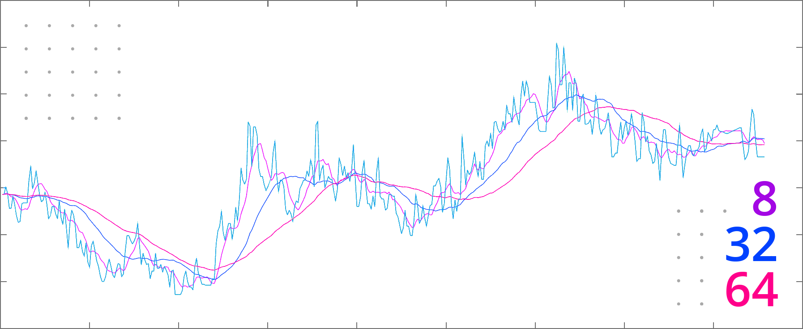
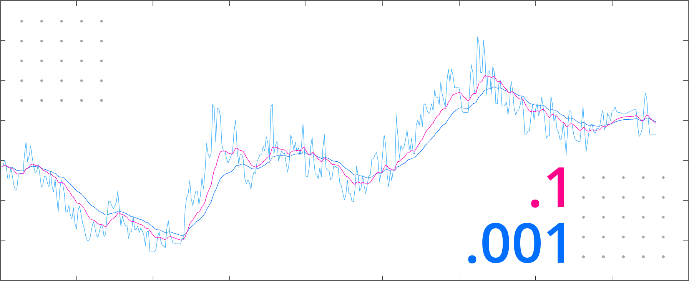
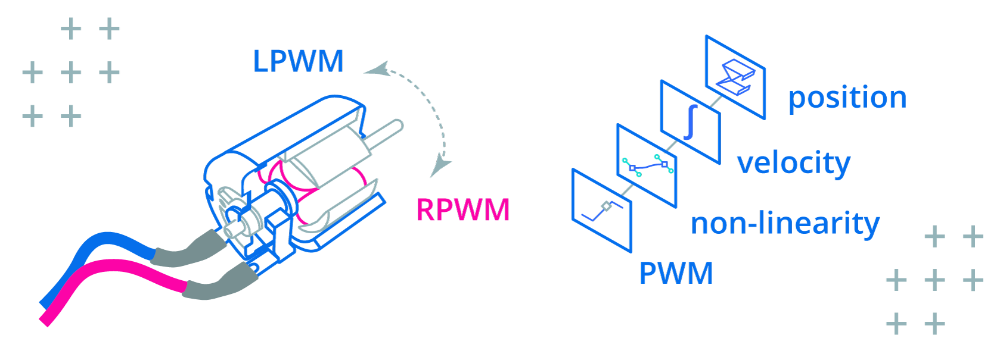
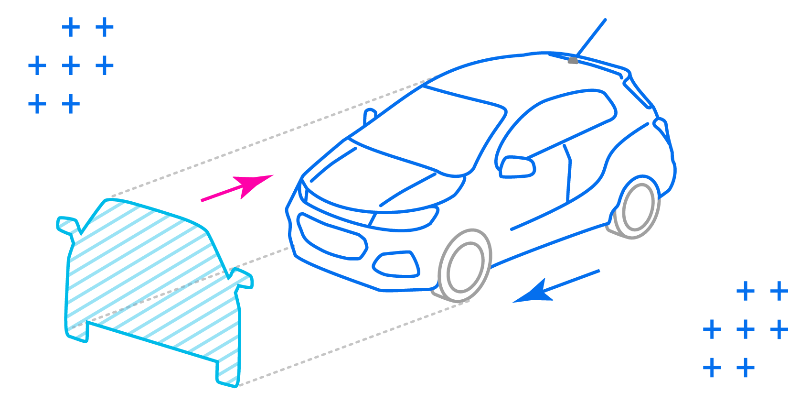
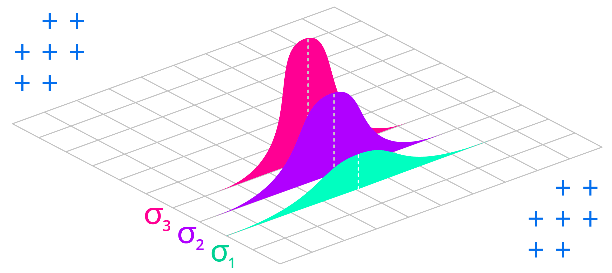

## overview

The Kalman filter is popular because it can generate accurate estimates in the presence of uncertainty and measurement noise. Simpler techniques like moving average or low pass filters introduce delay or miss important events, which is unacceptable for dynamic systems like cars and robots.

## background

In this article I introduce the Kalman Filter in the shortest way possible with practical examples. When you're ready to go deeper checkout *Kalman Filter from the Ground Up by Alex Becker* at [kalmanfilter.net](https://www.kalmanfilter.net/default.aspx):


## why not average?

A basic *moving average* filter can be implemented as follows:

```matlab
function output = movingAverageFilter(input, size)
  buffer = ones(size, 1) * input(1);
  output = zeros(length(input))

  for sampleIndex = 1:length(input)
    bufferIndex = mod(sampleIndex - 1, size) + 1;
    buffer(bufferIndex) = input(sampleIndex);
    output(sampleIndex, 1) = sum(buffer) / size;
  end
end
```

Compare the filter result to the original data with buffer size `8`, `32`, and `64`:



Filtered data has been shifted on the time axis proportionately to the smoothing amount, introducing *delay*:

+ In the case of DC motor control for robotics, a simple average filter would cause the [PID](https://www.ni.com/en/shop/labview/pid-theory-explained.html) algorithm to oscillate, as it would see this delay as a signal that it's not working hard enough, and over-compensate. 
+ In the case of a moving vehicle, a simple average would cause the estimated position to lag too far behind, causing the navigation system to suggest changes to the route too late for the driver to respond.

## why not low pass?

A basic *low-pass* filter can be implemented as follows:

```matlab
function output = lowPassFilter(input, coefficient)
  estimate = input(1);
  output = zeros(length(input))

  for sampleIndex = 1:length(input)
    estimate = (1.0 - coefficient) * estimate + ...
      coefficient * input(sampleIndex);

    output(sampleIndex, 1) = estimate;
  end
end
```

Compare the filter result to the original noisy data set:



This filter missed short temporal spikes in the data. This may be fine if the system is cyclical in nature, but if the subsequent state depends on previous system state, missing events could cause it to diverge far from reality.

In the following video we test both filters on real data:

`youtube:https://www.youtube.com/embed/rLM0os3vpsw`

## why predict?

If you know what a moving vehicle or a motor shaft are supposed to do (*since you are controlling them in the first place*), why should you let measurements have so much influence on where they are estimated to be next?

In the case of a DC motor, the PWM command can be mapped to velocity (adjusting for non-linearity) which is then used to determine the shaft position:



```matlab
% System Identification (5202 Series Yellow Jacket Motor)
MAX_PWM = 65536;
MAX_VELOCITY_RPM = 30;
MAX_VELOCITY = MAX_VELOCITY_RPM * PI * 2 / 60;
PWM_NONLINEARITY = [1.0, 1.023, 1.03, 1.0, 0.98, 0.93, 1.0];

% System State
position = 0;

% System Model
function position = systemModel(input, timeStep)
  % Normalize PWM to 0...1 range
  norm = input / MAX_PWM;

  % Map to velocity adjusting for PWM non-linearity curve
  index = round(length(PWM_NONLINEARITY) * norm);
  velocity = norm * PWM_NONLINEARITY[index] * MAX_VELOCITY;

  % Predict position
  position = position + velocity * timeStep;
end
```

In the case of a moving vehicle, the pressure on the gas pedal can determine acceleration, which then determines velocity and position:



```matlab
% System Identification (Chevrolet Trax 2017 4WD)
MAX_ACCELERATION = 2.82;
DRAG_COEFFICIENT = 0.35;
FRONTAL_AREA = 2.5;
AIR_DENSITY = 1.225;

% System State
velocity = 0;
position = 0;

% System Model
function position = systemModel(input, timeStep)
  % Map pressure on gas pedal to acceleration
  acceleration = input * MAX_ACCELERATION;

  % Subtract drag force
  drag = DRAG_COEFFICIENT / 2.0 * ...
    AIR_DENSITY * FRONTAL_AREA * velocity^2;

  acceleration = acceleration - drag;

  % Predict velocity
  velocity = velocity + acceleration * timeStep;

  % Predict position
  position = position + velocity * timeStep;
end
```

This is the first special thing about the Kalman filter: it blends *measurements* with *predictions* by using a *weight* which is tuned at each iteration to maximize the accuracy of the estimate:

1. Start with initial guess
2. Take a measurement
3. Calculate a Kalman weight that will optimize the estimate
4. Calculate estimate by blending prediction with measurement
5. Predict the next state by using a mathematical model

We will examine each of these steps in detail in the following sections.

## variance

The second special thing about the Kalman filter is that its output isn't simply a value but a *probability distribution* (the likelihood of it being a certain value).

+ A probability distribution is a *mean* of a set of numbers and their *spread* from that mean.
+ The *mean* is the sum of a set of numbers divided by the size of the set.
+ The spread from the mean is called *variance* and it's denoted by the greek letter σ (sigma).



To calculate variance from a set of samples:

1. Calculate the mean
2. For each number in the set, calculate distance from the mean (subtract mean from the number)
3. Square each distance from the mean, which will give you variance for this item in the set
4. Calculate the mean of all variances in the set (variances summed over number of items). This will give you the variance of the set.

In [Matlab](https://www.mathworks.com/products/matlab.html) or [Octave](https://octave.org/), mean and variance can be calculated as follows:

```matlab
set = [1, 2, 3, 4, 5]

>> mean(set)

ans =

   3

>> var(set)

ans =

   2.5000
```

The following video demonstrates how to calculate variance:

`youtube:https://www.youtube.com/embed/-RpGzyQoaOg`

## kalman filter

The Kalman filter starts with an initial guess. The weight of measurements decreases exponentially as the system state is synchronized with reality.

```matlab
% Initial guess
prediction = initialGuess
estimateVariance = initialGuessVariance

while running
  % Take measurement
  measurement = getMeasurement()
  measurementVariance = getMeasurementVariance(conditions)

  % Optimize
  gain = estimateVariance /
    (estimateVariance + measurementVariance)

  % Estimate
  estimate = prediction + gain * (measurement - prediction)
  estimateVariance = (1 - gain) * estimateVariance

  % Predict
  prediction = systemModel(input)
  estimateVariance = systemModelVariance(estimateVariance)
end
```

## initial guess

Initial guess can be an initial measurement, or the output of the system model with initial state. The initial guess does not have to be accurate.

```matlab
prediction = initialGuess
estimateVariance = initialGuessVariance
```

The initial variance depends on where the initial guess came from.
+ If the initial guess was from a measurement, use the variance of the measurement device. See [variance](#variance) section above for determining how to calculate variance by taking a set of samples from your device.
+ If the initial guess was from a system model, use the variance of the model. We will go over identifying system models with Matlab in [system identification](#system-identification) and estimating variance in [estimating variance](#estimating-variance).
+ If you can express variance in terms of *tolerance* by using it in a sentence like "this estimate is within *x* or +/- *x*", then square half the tolerance amount to convert it to variance: `variance = (tolerance / 2)^2`.

## measurement

Next we start taking measurements:

```matlab
measurement = getMeasurement()
measurementVariance = getMeasurementVariance(conditions)
```

Measurement variance could be constant or vary based on conditions.

+ If you are using a hall effect encoder that provides less accurate readings if the magnet is off-center, you could use the alignment error to adjust the measurement variance (encoders like [AKSIM](https://www.rls.si/eng/aksim-off-axis-rotary-absolute-encoder) tell you the alignment error).
+ Complex measurement devices like radar let you estimate the dynamic effects of wind and rain on their signal-to-noise ratio to derive measurement variance.
+ A basic potentiometer can be sampled in a range of expected conditions to calculate a constant variance (see [variance](#variance)).

## optimization

The Kalman gain is adjusted at each iteration to optimize the estimate:

```matlab
gain = estimateVariance /
  (estimateVariance + measurementVariance)
```

## estimate

Prediction is blended with measurement to get an optimal estimate:

```matlab
estimate = prediction + gain * (measurement - prediction)
```

Estimate variance is updated after updating the estimate:

```matlab
estimateVariance = (1 - gain) * estimateVariance
```

## prediction

The prediction is updated based on the system model as discussed earlier:

```matlab
prediction = systemModel(input)
```

## system identification

You can come up with the system model by analyzing the system (as we did in the overly simplified examples of a vehicle and PWM-controlled motor in [why predict?](#why-predict) section earlier), or by using [system identification](https://www.mathworks.com/products/sysid.html).

A system identification algorithm tries to guess the system model given system input and output tracked over time.

In the following video we'll look at identifying a system by using a [linear state-space model](https://www.mathworks.com/help/control/ref/ss.html) in Matlab because it's simple and provides great estimates:

`youtube:https://www.youtube.com/embed/D8Q-FoiqhiA`

A discrete linear state-space model is described by two equations:

```matlab
% Predict
y = Cx + Du + e

% Update state
x = Ax + Bu + Ke
```

The model *order* refers to the number of state variables needed to describe the system. Terms that are vectors will have the *order* number of elements and terms that are matrices will be *order* x *order*:

+ `y` is system output (scalar)
+ `x` is system state that causes the output (vector)
+ `C` is the weight of system state (vector)
+ `D` is the weight of input (scalar)
+ `A` is the weight of system state derivative (matrix)
+ `B` is the weight of input derivative (vector)
+ `K` is the weight of noise or disturbance derivative (vector)
+ `t` is the time interval (scalar)
+ `u` is system input (scalar)
+ `e` is noise or disturbance

*Identifying* a system refers to finding `A`, `B`, `C`, `D`, `K` weights that make the output of these two equations most closely resemble the measured output.

The properties of the identified system can be extracted by using [idssdata](https://www.mathworks.com/help/ident/ref/idss.idssdata.html):

```matlab
[A,B,C,D,K,x0,dA,dB,dC,dD,dx0] = idssdata(systemModel);
```

Or by using an object property notation:

```matlab
dx0 = systemModel.dx0
```

* `A`, `B`, `C`, `D`, `K` are the weights described above
* `dA`, `dB`, `dC`, and `dD` are the variances of system state and inputs
* `x0` is initial state (plug this into the equations to get the initial guess)
* `dx0` is the variance of the initial state

To compare the identified system model to the original system, sample the model with the same inputs originally used to identify the system:

```matlab
% TODO: update this code sample for discrete model

% Generate a vector with evenly spaced time samples
startTime = 0
endTime = 8
timeStep = 0.02
time = linspace(startTime, endTime, (endTime - startTime) / timeStep)

% Get initial system state
[A,B,C,D,K,x0,dA,dB,dC,dD,dx0] = idssdata(systemModel);

% Simulate the system with original input and initial state
simulatedOutput = lsim(systemModel, input, time, x0)

% Graph simulated system against the real system
plot(time, output, time, simulatedOutput)
```

In the above code sample:

+ `systemModel` - the continuous linear system model
+ `input` - the vector of input values used to identify the system
+ `output` - the vector of output values used to identify the system
+ `startTime` - the start time when the original system was measured
+ `endTime` - the end time when the original system was measured
+ `timeStep` - the time step, or the original measurement interval

Implementing a discrete state-space system model in Matlab looks like the following:

```matlab
% A weights (3x3 matrix)
A = [ ...
  0.9988,     0.05193, -0.02261;
  0.02222,   -0.01976,  0.7353;
  0.0009856, -0.2093,  -0.5957;
];

% B weights (3x1 vector)
B = [ ...
  -0.00000266;
  0.0000572747;
  -0.0001872152;
];

% C weights (1x3 vector)
C = [ ...
  -5316.903919, ...
  24.867656, ...
  105.92416 ...
];

% D weight (scalar)
D = 0;

% K weights (3x1 vector)
K = [ ...
  -0.0001655;
  -0.001508;
  6.209e-06;
];

% Initial state (3x1 vector)
x0 = [ ...
  -0.0458;
  0.0099;
  -0.0139;
];

% Simulate
input = []; % get input from somewhere
x = x0;
output = zeros(length(input), 1);

for i = 1:length(input)
  u = input(i);
  [y, x] = systemModel(A, B, C, D, K, x, u, 0);
  output(i) = y;
end

%
% Discrete state-space system model
%   x: system state
%   u: system input
%   e: disturbance
% returns:
%   system output and next system state
%
function [y, x] = systemModel(A, B, C, D, K, x, u, e)
  % Predict
  % y = Cx + Du + e
  y = ...
    C * x + ...  % Add contribution of state
    D * u + ...  % Add contribution of input
    e;           % Add disturbance

  % Update state
  % x = Ax + Bu + Ke
  x = ...
    A * x + ... % Add contribution of state
    B * u + ... % Add contribution of input
    e * K;      % Add contribution of disturbance
end
```

Implementing a discrete state-space system model in C++ looks like the following:

```cpp
#include <vector>
#include <Eigen/Dense>

using namespace std;
using namespace Eigen;

// A weights (3x3 matrix)
const MatrixXd A
{
  { 0.998800,   0.05193, -0.02261 },
  { 0.0222200, -0.01976,  0.7353  },
  { 0.0009856, -0.20930, -0.5957  }
};

// B weights (3x1 vector)
const RowVectorXd B {{
  -0.00000266,
  0.0000572747,
  -0.0001872152
}};

// C weights (1x3 vector)
const VectorXd C {{
  -5316.903919,
  24.867656,
  105.92416
}};

// D weight (scalar)
const double D = 0;

// K weights (3x1 vector)
const RowVectorXd K {{
  -0.0001655,
  -0.001508,
  6.209e-06
}};

// Initial state (3x1 vector)
const RowVectorXd x0 {{
  -0.0458,
  0.0099,
  -0.0139
}};

/*
  * Discrete state-space system model
  * @param x: system state to update
  * @param u: system input
  * @param e: disturbance
  * @return: system output
*/
double systemModel(
  RowVectorXd& x, double u, double e)
{
  // Predict
  // y = Cx + Du + e
  double y =
    // Add contribution of state
    C.dot(x) +
    // Add contribution of input
    D * u +
    // Add disturbance
    e;

  // Update state
  // x = Ax + Bu + Ke
  x =
    // Add contribution of state
    x * A +
    // Add contribution of input
    B * u +
    // Add contribution of disturbance
    K * e;

  return y;
}

bool read(double& input)
{
  // get input from somewhere...
}

// Simulate
int main(int argc, char** argv)
{
  RowVectorXd state = x0;
  vector<double> output;
  double disturbance = 0.0;
  double input;

  while(read(input))
  {
    double prediction = systemModel(
      state, input, disturbance);

    output.push_back(prediction);
  }

  return 0;
}
```

See complete examples in the [companion repository](https://github.com/01binary/systemid).

The `e` term is the disturbance or noise to apply at each time step. Its meaning depends on the model:

+ When controlling a DC motor it could be *lag* due to a loose gearbox, *shock* from quickly reversing direction, or any other impediment.
+ When estimating the position of a vehicle it could be wind, road quality, or driver maneuvers like steering and braking.
+ If you don't have a way to derive disturbance, uncheck *Include disturbance component* when identifying the system and omit this term.
+ If you don't know the disturbance but know its mean and variance from sampling the real system, you could also *simulate* the disturbance.

To simulate disturbance by adding normally distributed noise:

```cpp
// A function that simulates disturbance ("e" term)
#include <random>

using namespace std;

double generateDisturbance(double mean, double variance)
{
  // Set up a random device and a normal distribution
  random_device rd;
  mt19937 gen(rd());
  normal_distribution<double> dist(mean, sqrt(variance));

  // Generate a sample from the distribution
  return dist(gen);
}
```

If you are looking for more background on system identification, try [series of tutorials](https://ctms.engin.umich.edu/CTMS/index.php?aux=Home) assembled by two professors at Carnegie Mellon university.

## estimating variance

To update the estimate variance, you have to use the same equation(s) describing your system model. However, since variance is not a number but a function of a set of numbers, it follows [variance algebra for random variables](https://en.wikipedia.org/wiki/Algebra_of_random_variables#:~:text=the%20product%20of%20two%20random,if%20X%20is%20a%20constant.).

> For example, to multiply a variance by a constant you have to [square the constant](https://flexbooks.ck12.org/cbook/ck-12-probability-and-statistics-concepts/section/7.10/primary/lesson/transforming-random-variables-ii-pst/). This is because variance is calculated for every item in a set, so you are in effect multiplying the entire set by that constant.

In the remainder of this section we will look at examples on how to update the estimate variance for various system models explored in this article.

### constant velocity

If the system is described by constant velocity (i.e. velocity is an input):

```matlab
% Get input
velocity = getVelocity()

% Update estimate
estimate = estimate + velocity * timeStep
```

Then the estimate variance can be updated like this:

```matlab
% Get input variance
velocityVariance = getVelocityVariance()

% Update estimate variance
estimateVariance = estimateVariance
  + velocityVariance * timeStep^2
```

The velocity variance depends on where the velocity input came from:

+ If it's from twisting a potentiometer knob, you would start with the variance of the potentiometer signal (calculated from a set of samples of this signal), then put it through the equation that maps potentiometer position to PWM command using random variable arithmetic.
+ If it's calculated by a PID control algorithm based on an absolute encoder and a set-point you would start with the variance of the encoder and the set-point, and put it through the same equation as the PID algorithm using random variable arithmetic.

As you can see variance simply travels downstream from inputs to outputs.

### velocity/acceleration

If the system is described by velocity and acceleration:

```matlab
% Get input
acceleration = getAcceleration()

% Update estimate
estimate = estimate + velocity * timeStep

% Update system state
velocity = velocity + acceleration * timeStep
```

Then the estimate variance can be updated like this:

```matlab
% Get input variance
accelerationVariance = getAccelerationVariance()

% Update estimate variance
estimateVariance = estimateVariance
  + velocityVariance * timeStep^2

% Update system state variance
velocityVariance = velocityVariance +
  accelerationVariance * timeStep^2
```

### linear system model

If the system is described by a linear system model:

```matlab
% Get input
u = getInput()

% Update estimate
y = Cx + Du + e

% Update system state
x = Ax + Bu + Ke
```

Then variance can be updated using the same equations:

```matlab
% Get input variance
du = getInputVariance()

% Update estimate variance
estimateVariance = ...
  sum(C * dx * C') + ...
  D^2 * du + ...
  de

% Update system state variance
% TODO: double check this
dx = ...
  (dx.' * A) * A.' + ...
  B * du * B' + ...
  K * de * K'
```

+ `dx` is state variance. Initial state variance can be extracted from system model as `dx0` by using [idssdata](https://www.mathworks.com/help/ident/ref/idss.idssdata.html) and then updated each iteration.
+ `du` is input variance.
+ `de` is disturbance variance.
+ The prime (`'`) is Matlab notation for matrix transpose.
+ The dot followed by prime (`.'`) is Matlab notation for vector transpose.

If you identified the linear system model, you could estimate its initial variance against the system it was based, subtracting measurement variance:

```matlab
% TODO: update code snippet for discrete system
% TODO: doesn't Matlab return noise variance? Find out what that is

% Generate a vector with evenly spaced time samples
startTime = 0
endTime = 8
timeStep = 0.02
time = linspace(startTime, endTime, (endTime - startTime) / timeStep)

% Get initial system state
[A,B,C,D,K,x0,dA,dB,dC,dD,dx0] = idssdata(systemModel);

% Simulate the system with original input and initial state
simulatedOutput = lsim(systemModel, input, time, x0)

% Calculate measurement variance by sampling measurement device...
measurementVariance = var(measurementsFromDevice)

% Calculate difference between system output and real system
differences = output - simulatedOutput;

% Calculate system model variance
variance = mean(differences .^ 2) - measurementVariance;
```

## kalman filter in c++

In this final section let's look at a complete example of a Kalman filter in C++:

```cpp
// TODO: this code sample has not been compiled and tested yet
double systemModel(
  double acceleration,
  double accelerationVariance,
  double& variance,
  double timeStep)
{
  static double position = 0.0;
  static double velocity = 0.0;
  static double velocityVariance = 0.0;

  velocity = velocity + acceleration * timeStep;
  position = position + velocity * timeStep;

  velocityVariance = velocityVariance +
    accelerationVariance * pow(timeStep, 2);

  variance = variance +
    velocityVariance * pow(timeStep, 2);

  return position;
}

// Kalman filter
double gain = 0.0;
double variance = 0.0;
double prediction = systemModel(
 input, inputVariance, variance, timeStep);

double kalmanFilter(
  double measurement,
  double measurementVariance,
  double input,
  double inputVariance,
  double timeStep)
{
  gain = variance / (variance + measurementVariance);

  double estimate = prediction + gain * (measurement - prediction);

  variance = (1 - gain) * variance;

  prediction = systemModel(
    input, inputVariance, variance, timeStep);

  return estimate;
}
```
