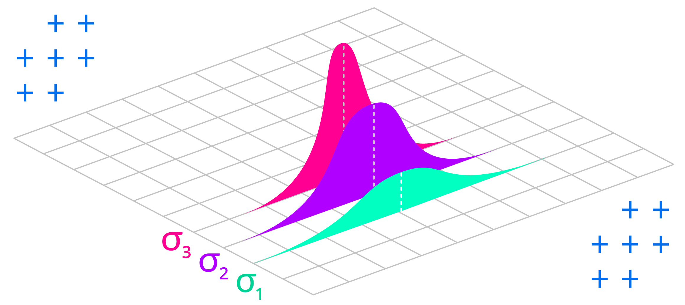
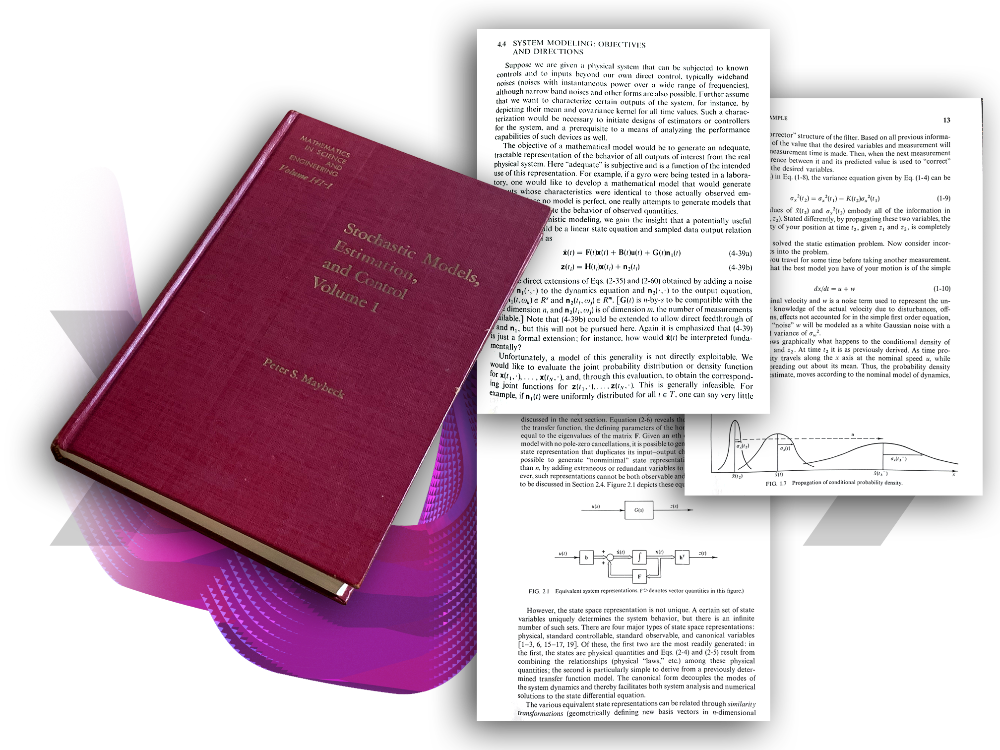

import KalmanFilter from './components/kalman-filter';

## overview

The Kalman filter is great at interpreting noisy or uncertain measurements from a variety of sources like servo encoders, GPS, and radar. This makes it ideal for use with dynamic systems like robots and autonomous vehicles.

## background

In this article I introduce the Kalman Filter in the shortest way possible with practical examples. When you're ready to go deeper check out *Kalman Filter from the Ground Up by Alex Becker* at [kalmanfilter.net](https://www.kalmanfilter.net/default.aspx):


## why not average?

A basic *moving average* filter can be implemented as follows:

```matlab
function output = movingAverageFilter(input, bufferSize)
  buffer = ones(bufferSize, 1) * input(1);
  output = zeros(length(input));

  for sampleIndex = 1:length(input)
    bufferIndex = mod(sampleIndex - 1, bufferSize) + 1;
    buffer(bufferIndex) = input(sampleIndex);

    % Output is average of last bufferSize inputs
    output(sampleIndex, 1) = ...
      sum(buffer) / bufferSize;
  end
end
```

Compare the filter result to the original data with buffer size `8`, `32`, and `64`:


Filtered data has been shifted forward on the time axis proportionately to the smoothing amount, introducing *delay*:

+ In the case of DC motor control for robotics, a moving average filter would cause the [PID](https://www.ni.com/en/shop/labview/pid-theory-explained.html) algorithm to oscillate, as it would see this delay as a signal that it's not working hard enough, and over-compensate. 
+ In the case of a vehicle, a moving average would cause the estimated position to lag too far behind, causing the navigation system to suggest changes to the route too late for the driver to respond.

## why not low pass?

A basic *low-pass* filter can be implemented as follows:

```matlab
function output = lowPassFilter(input, coefficient)
  estimate = input(1);
  output = zeros(length(input));

  for sampleIndex = 1:length(input)
    sample = input(sampleIndex);

    % Output is input blended with previous estimate
    estimate = ...
      (1.0 - coefficient) * estimate + ...
      coefficient * sample;

    output(sampleIndex, 1) = estimate;
  end
end
```

Compare the filter result with `0.1` and `0.001` coefficients to the original data:


This filter missed short temporal spikes in the data. This may be fine if the system is cyclical in nature, but if the subsequent state depends on previous system state, missing events could cause it to diverge far from reality.

In the following video we test both filters on real data:

`youtube:https://www.youtube.com/embed/5IUP3TfOMCw?si=XkhCUAAcJAaQMIBS`

## why predict?

If you know what a moving vehicle or a motor shaft are supposed to do (*since you are controlling them in the first place*), why should you let measurements have so much influence on where they are estimated to be next?

In the case of a DC motor, commanded velocity can be used to determine the current shaft position:


```matlab
% System Identification (5202 Series Yellow Jacket Motor)
MAX_PWM = 65536;
MAX_VELOCITY_RPM = 30;
MAX_VELOCITY = MAX_VELOCITY_RPM * PI * 2 / 60;
PWM_NONLINEARITY = [1.0, 1.023, 1.03, 1.0, 0.98, 1.0];

% System Model
function position = systemModel(...
  input, ...
  position, ...
  timeStep ...
)
  % Map PWM to velocity
  norm = input / MAX_PWM;

  index = round(...
    length(PWM_NONLINEARITY) * norm...
  );

  velocity = ...
    norm * PWM_NONLINEARITY[index] * MAX_VELOCITY;

  % Predict position
  position = position + velocity * timeStep;
end
```

In the case of a moving vehicle, the pressure on the accelerator pedal can determine the velocity and position:


```matlab
% System Identification (Chevrolet Trax 2017 4WD)
MAX_ACCELERATION = 2.82;
DRAG_COEFFICIENT = 0.35;
FRONTAL_AREA = 2.5;
AIR_DENSITY = 1.225;

% System Model
function [position, velocity] = systemModel(...
  input, ...
  position, ...
  velocity, ...
  timeStep ...
)
  % Input pressure on accelerator pedal
  acceleration = ...
    input * MAX_ACCELERATION

  % Subtract drag force
  drag = ...
    DRAG_COEFFICIENT / 2.0 * ...
    AIR_DENSITY * ...
    FRONTAL_AREA * ...
    velocity^2;

  acceleration = acceleration - drag;

  % Predict position
  position = position + velocity * timeStep;

  % Predict velocity
  velocity = velocity + acceleration * timeStep;
end
```

Prediction can be a valuable tool provided the model is detailed enough. The Kalman filter's key strength lies in its ability to combine measurements with predictions, depending on which offers the most accurate estimate.

A basic Kalman filter algorithm look something like this:

1. Start with an initial estimate
2. Take a measurement
3. Correct the estimate by the measurement
4. Predict the next estimate

We will add more detail to these steps in the [filter algorithm](#filter-algorithm) section later.

## variance

The second special thing about the Kalman filter is that its output isn't simply a value but a *likelihood of it being a certain value*. This concept is borrowed from statistics where it's called a *random variable*.

+ A random variable is defined by a *mean* and a *spread* from that mean.
+ The *mean* is a sum of a set of samples divided by the size of the set. This represents the *center* of the random variable.
+ The spread from the mean is called *variance* and it's denoted by the greek letter σ (sigma).
+ The *shape* of this spread is a "bell curve" called a *Gaussian distribution*.

Measuring physical quantities results in readings that follow this Gaussian distribution due to the [Holographic Principle](https://www.semanticscholar.org/paper/The-Holographic-Principle-Opening-Lecture-Hooft/43ce0cb38dba603c08c21d135fa4754fa5a95a41) of the Universe:

> The one-dimensional array of data that makes up the Universe is stretched over a 3D surface with 1 bit of information every 0.724 x 10<sup>-64</sup>cm<sup>2</sup>.

When the Universe is "sampled" by taking a measurement, the sample is interpolated by using a strategy discovered by Carl Gauss: surrounding bits are blended in depending on distance of the sample from the "center" of each bit.



Variance can be calculated from a set of samples as follows:

1. Calculate the mean
2. For each number in the set, calculate distance from the mean (subtract mean from the number)
3. Square each distance from the mean, which will give you variance for this item in the set
4. Calculate the mean of all variances in the set (variances summed over number of items). This will give you the variance of the set.

In [Matlab](https://www.mathworks.com/products/matlab.html) or [Octave](https://octave.org/), mean and variance can be calculated as follows:

```matlab
set = [1, 2, 3, 4, 5]

>> mean(set)

ans =

   3

>> var(set)

ans =

   2.5000
```

The following video demonstrates how to calculate variance:

`youtube:https://www.youtube.com/embed/I6p-iQulKgk?si=QI76h5psxfRZG_s5`

## filter algorithm

Since the filter estimate is a random variable, the algorithm has to keep track of its uncertainty, making the same changes to the estimate uncertainty as the ones made to the estimate mean value.

The measurement is also a random variable and its uncertainty could change each iteration or remain constant.

If we include the additional steps for tracking estimate and measurement uncertainties, the algorithm would look like the following:

1. Start with initial estimate and its uncertainty
2. Take a measurement and determine its uncertainty
3. Correct the estimate by the measurement
4. Correct the estimate uncertainty by the measurement uncertainty
5. Predict the next estimate
6. Predict the next estimate uncertainty

Kalman filter starts with an initial estimate, the uncertainty of this estimate, and an initial state of the system being measured.

Each iteration, the system state is corrected by the last measurement according to the ratio of estimate uncertainty to measurement uncertainty.

The next estimate is then predicted by evaluating the system model with the corrected state:

```matlab
% Initial estimate
estimate = y0;

% Initial estimate uncertainty
covariance = P0;

% Initial state
state = x0;

% Identity matrix (state x state)
I = eye(length(state));

% Filter
for i = 1:length(inputs)
  % Measure
  measurement = measurements(i);

  % Determine correction amount
  gain = ...
    (covariance * C') / ...
    (C * covariance * C' + measurementVariance);

  % Correct state with measurement
  state = state + gain * (measurement - estimate);

  % Correct estimate uncertainty
  covariance = ...
    (I - gain * C) * ...
    covariance * (I - gain * C)' + ...
    gain * measurementVariance * gain';

  % Read input
  input = inputs(i);

  % Update state
  state = A * state + B * input;

  % Update estimate uncertainty
  covariance = A * covariance * A' + noiseCovariance;

  % Predict the next estimate
  estimate = C * state + D * input;
end
```

The next few sections will explain the algorithm parameters in more detail.

## initial estimate

The initial estimate `y0` can come from initial measurement, output of the system model with initial state, or an educated guess.

A more accurate guess will let the algorithm converge on the optimal estimate faster and avoid a "jump" when the filter performs a large correction.

## measurement

Each iteration begins by taking a measurement (labeled `z` in equations) and determining its uncertainty or [variance](#variance), typically denoted by `R`.

Measurement variance can be constant or vary based on conditions:

+ Hall effect encoders like [AKSIM](https://www.rls.si/eng/aksim-off-axis-rotary-absolute-encoder) report the distance of the rotating magnet from the center of the sensor because this affects the accuracy of the readings. This could be used to derive a measurement variance.
+ Complex measurement devices like radar let you estimate the dynamic effects of wind and rain on their signal-to-noise ratio to derive a measurement variance.
+ A basic potentiometer can be sampled in a range of expected conditions to calculate a constant variance (see [variance](#variance)).

## kalman gain

To produce optimal estimates, the Kalman filter has to know if the estimates are more or less reliable than measurements.

The *ratio* of estimate uncertainty to measurement uncertainty is calculated at each iteration. This ratio is called the Kalman gain (typically denoted by `K`) and used as a weight to correct predictions with measurements.

```matlab
% K - Kalman gain
% P - estimate uncertainty
% C - measurement matrix
% R - measurement uncertainty

K = (P * C') / (C * P * C' + R);
```

Similar to other iterative optimization algorithms like [Gradient Descent](https://www.01binary.us/articles/inverse-kinematics/#gradient-descent), the Kalman filter has to calculate an *error* at each iteration, defined as the difference between the prediction and the measurement.

This error is then used to correct the model, with the correction amount determined by the Kalman gain:

+ If the measurements are trusted more, the Kalman gain will be closer to `1` which will correct the model prediction by a greater amount.
+ If the model is trusted more, the Kalman gain will be closer to `0` which will correct the model prediction by a lesser amount.

Since estimates are a function of the model internal state, we can't correct them directly. Instead we change the model state to get the desired output:

```matlab
% Correct state with measurement
% x - system state
% K - Kalman gain
% z - measurement
% y - current estimate

x = x + K * (z - y);
```

After correcting the model state, the *estimate uncertainty* is updated by blending measurement uncertainty with model uncertainty:

```matlab
% Correct estimate uncertainty
% P - current estimate uncertainty
% I - identity matrix (state x state)
% K - Kalman gain
% C - measurement matrix
% R - measurement uncertainty

P = ...
  (I - K * C) * ...
  P * (I - K * C)' + ...
  K * R * K';
```

If the estimate was based more on the measurement, then the estimate uncertainty reflects more of the measurement uncertainty.

Conversely, if the estimate was based more on the model prediction, then the estimate uncertainty reflects more of the model uncertainty.

## prediction

The Kalman filter borrows from [System Identification](https://www.amazon.com/System-Identification-Theory-User-2nd/dp/0136566952) theory which states that most systems (heaters, motors, hydraulic pumps, you name it!) can be approximated by a linear model of the following form:


The system *output* `y` depends on system *state* `x` and *input* `u`.

The relationship between system output and system state is described by `C` *measurement matrix* and the relationship between input and immediate output is described by `D` *input contribution*.

Differences between the real system and its model are represented by `e` as *disturbance* or *noise*. This is a theoretical term that's there in the equation to represent "unknowns" and does not appear in the code.

> The measurement matrix is often called `H` in literature, but in this article I use `C` for consistency with Matlab System Identification Toolbox.

When modeling systems, you'll find that the input contribution to system output `D` is almost always `0` because real-world systems are not instantly affected by inputs. Instead, the inputs modify system state which eventually changes the output.

## state transition

The following equation is used to update (or *transition*) the state of a linear system model at each iteration:


This equation involves the following terms:

+ `x` is the system state being updated. The new state is based on the previous state so this term appears on both sides of the equation. The initial system state is usually denoted by `x0`.
+ `u` is the input provided at this iteration.
+ `A` is the *state transition* matrix. Multiplying the system state by this matrix will "simulate" the system, advancing it forward by one time step.
+ `B` is the *input matrix* or *control matrix* that represents the weight of input on each system state variable. Multiplying the input by this matrix will change each system state variable by a different amount depending on how it's affected by the input.
+ `e` represents the noise or disturbance that affects the system state transition. This is a theoretical term used to model unknowns so it does not appear in the code.
+ `K` represents the influence of noise on each state variable. Since `e` is not used in a practical implementation, we don't use this term either.

## covariance

For a system model with a *single* state variable, the initial estimate and disturbance uncertainties are represented by scalar **variances**.

For a system with *multiple* state variables, the initial estimate and disturbance uncertainties are represented by square **covariance** matrices with the same number of rows and columns as there are state variables.

In a covariance matrix, the diagonal entries encode variances, and the off-diagonal entries encode *covariances*.

## estimate covariance

Estimate uncertainty is typically denoted by `P`, and the uncertainty of initial estimate is denoted by `P0`.

For systems with only one state variable both terms are scalar variances, otherwise they are covariance matrices.

A covariance matrix that encodes the estimate uncertainty of a system with two state variables (position and velocity) would look like this:


This matrix encodes the following information:

+ The *variance of position* (how far the estimated position could be from the true position, squared)
+ The *variance of velocity* (how far the estimated velocity could be from the true velocity, squared)
+ The *covariance* of position and velocity (the mathematical relationship between position and velocity random variables), with `0` indicating the two variables are not related.

A covariance matrix that encodes the estimate uncertainty of a system with three or more state variables follows the same pattern:


There are a few ways to initialize the estimate uncertainty:

+ If the approximate variances of state variables are known, they can be *projected* on the diagonal of the covariance matrix:

  ```matlab
  covariance = diag([ ...
    100, ...
    200, ...
    300 ...
  ]);

  covariance =

     100     0     0
       0   200     0
       0     0   300
  ```

+ If the system was identified with [Control System Toolbox](https://www.mathworks.com/products/control.html), the standard deviations of state variables are available in [dx0](https://www.mathworks.com/help/ident/ref/idss.idssdata.html#btahx3u-dx0) property. Squaring elements of `dx0` to convert standard deviation to variance and projecting them on the diagonal will give you the estimate covariance:

  ```matlab
  % ss - identified system
  covariance = diag(ss.dx0.^2);

  5.5288e+13            0            0
            0   1.5450e+19            0
            0            0   2.6517e+21
  ```

+ If you have a data set that records system state over time you could use Matlab's [cov](https://www.mathworks.com/help/matlab/ref/cov.html) function to initialize the estimate covariance:

  ```matlab
  % CSV with position, velocity, acceleration
  dataset = readmatrix("states.csv");
  covariance = cov(dataset);
  ```

+ If you can express the variance of the system model in terms of *tolerance* by using it in a sentence like "this estimate is within *x* or +/- *x*", then square half the tolerance amount to convert it to variance.

  The model variance can then be back-projected through the *measurement* matrix to determine the variance of the initial estimate:

  ```matlab
  modelTolerance = 50
  modelVariance = (modelTolerance / 2)^2;

  covariance = diag( ...
    inv(C) * ...
    eye(length(state)) * modelVariance ...
    * inv(C)' ...
  );
  ```

    Multiplying variance by another quantity requires squaring that quantity. To make this work with matrices, the variance is pre-multiplied by the matrix and post-multiplied by the transpose of the same matrix. This is why you'll often see the pattern `X * y * X'`.

+ Lastly, you could assume the same variance for all initial state variables, leaving covariances blank:

  ```matlab
  variance = 200;
  covariance = eye(length(state)) * variance

  covariance =

     200     0     0
       0   200     0
       0     0   200
  ```

These initialization strategies work because the Kalman filter will eventually converge on a more accurate estimate covariance.

However, significantly over-estimating initial estimate uncertainty will cause the algorithm to ignore model predictions while significantly over-estimating the measurement variance will cause the algorithm to ignore measurements.

> Recall that Kalman filter works by calculating a ratio between the two uncertainties, so if either one is many orders of magnitude greater than the other, it will break the filter.

## noise covariance

A process *noise* or *disturbance* covariance matrix usually denoted by `Q` looks exactly like estimate covariance, but it encodes the variance of Gaussian *noise* affecting the *change* made to each state variable within a single iteration.

> Noise or disturbance is the difference between the system model and the real system. Its covariance represents the likelihood of state variables being affected by random occurrences like external forces, noise, or the system state being updated using imperfect (noisy) inputs.

There are a few ways to initialize the `Q` covariance matrix:

+ Similarly to estimate covariance, the approximate variance of noise or disturbance affecting all state variables in the same way could be *projected* by spreading the same variance across the diagonal:

  ```matlab
  noiseVariance = 200
  noiseCovariance = eye(length(state)) * noiseVariance
  ```

+ If the approximate variance of noise introduced by updating the *system state* is known, it could be projected by using the *state transition matrix*:

  ```matlab
  noiseVariance = 200;
  noiseCovariance = A * noiseVariance * A'
  ```

  For systems identified with System Identification Toolbox, the noise variance is available in `NoiseVariance` property of the model:

  ```matlab
  % ss1 - linear system model
  noiseCovariance = eye(length(state)) * ss1.NoiseVariance
  ```

+ If the approximate variance of noise introduced by the *system input* is known, it could be projected by using the *control matrix*:

  ```matlab
  inputNoiseVariance = 200;
  noiseCovariance = B * inputNoiseVariance * B'
  ```

+ If the approximate variances of noise or disturbances affecting each state variable are known, they could be used to fill in diagonal entries of the covariance matrix, leaving off-diagonal entries blank:

  ```matlab
  noiseCovariance = diag([ ...
    positionNoiseVariance, ...
    velocityNoiseVariance, ...
    accelerationNoiseVariance ...
  ])
  ```

+ If the system was identified with [Control System Toolbox](https://www.mathworks.com/products/control.html), the [covar](https://www.mathworks.com/help/control/ref/dynamicsystem.covar.html?s_tid=doc_ta) function will output its disturbance covariance:

  ```matlab
  noiseVariance = 200;

  [ ...
    % Initial estimate variance
    P, ...
    % Disturbance covariance
    Q ...
  ] = covar(ss, noiseVariance)
  ```

+ Finally, you could [simulate](#simulating-systems) your system model with the same data used to identify it, and calculate the difference between the original measurements and the system model at each iteration.

  Since the system model includes a *measurement* matrix which maps system state to system output, you could multiply the difference between the original measurement and the model prediction by the inverse of this matrix to calculate the noise affecting each state variable at each iteration.

  With these results recorded in a separate vector for each state variable, you could then use `cov` to generate a disturbance matrix.

## covariance transition

Since Kalman filter estimates are random variables represented by mean and variance, anything that we do to the mean of the estimate must also be reflected in its uncertainty.

Earlier we corrected the estimate uncertainty by the same amount (`K`) used to correct the estimate:

```matlab
% P - estimate uncertainty
% R - measurement uncertainty
% I - identity matrix (state x state)
% K - Kalman gain
% C - measurement matrix

P = ...
  (I - K * C) * P * (I - K * C)' + ...
  K * R * K';
```

In this step, we transition the estimate uncertainty by the same amount (`A`) used to transition the estimate:

```matlab
% P - estimate uncertainty
% A - state transition matrix
% Q - state transition noise/disturbance matrix

P = A * P * A' + Q;
```

Recall that `A` is the [state transition](#state-transition) matrix that represents the change made to the system state at each iteration.

The [noise covariance](#noise-covariance) matrix `Q` represents how much uncertainty is added at each iteration by simulating the system based on an imperfect model and using noisy inputs to change the system state.

## system identification

The system model can be derived by analyzing the system (as we did in the overly simplified examples of a vehicle and PWM-controlled motor in [why predict?](#why-predict) section earlier), or by using [system identification](https://www.mathworks.com/products/sysid.html).

> A system identification algorithm tries to guess the system model given system input and output tracked over time.

In the following video we'll identify a system in Matlab [Control System Toolbox](https://www.mathworks.com/products/control.html) using a discrete [linear state-space model](https://www.mathworks.com/help/control/ref/ss.html):

`youtube:https://www.youtube.com/embed/YCKNEHN-dfc?si=PfIQRKFs_nFHz4U4`

*Identifying* a system refers to finding `A`, `B`, `C`, `D` coefficients that make the output of the linear model most closely resemble the original measurements. These coefficients can then be used as parameters to the Kalman filter.

The best way to compare the identified systems to original measurements is by viewing the *Model Output* in **System Identification app**:


This will simulate any identified models and display their outputs alongside the original measurements:


The properties of a system identified by [Control System Toolbox](https://www.mathworks.com/products/control.html) can be extracted by using an object property notation, for example:

```matlab
% Get initial state of system "ss1"
ss1.x0
```

We will use the following properties in this article:

* `A`, `B`, `C`, `D` are the coefficients described earlier.
* `x0` is the initial system state.
* `dx0` is the uncertainty of initial state.
* `NoiseVariance` is the variance of Gaussian noise affecting the system.

For more background on system identification, try this [series of tutorials](https://ctms.engin.umich.edu/CTMS/index.php?aux=Home) assembled by two professors at Carnegie Mellon university.

## simulating systems

The quickest way to simulate a linear system is by using [lsim](https://www.mathworks.com/help/control/ref/dynamicsystem.lsim.html) in Matlab:

```matlab
startTime = 0;
endTime = 8;
timeStep = ss.Ts;
initialState = ss.x0;

% Generate equally spaced time samples
time = startTime:timeStep:endTime; 

% Simulate
lsim(ss, inputs, time, initialState);
```

Calling `lsim` without storing results in a variable will display a plot while assigning to a variable will store the simulated outputs in that variable.


It's useful to understand how linear system equations presented earlier are used by `lsim` under the hood to simulate the system. The following example simulates a linear discrete system model, storing the output in a vector:

```matlab
% Constants
global A;
global B;
global C;
global D;

% A weights (3x3 matrix)
A = [ ...
  0.9988,     0.05193, -0.02261;
  0.02222,   -0.01976,  0.7353;
  0.0009856, -0.2093,  -0.5957;
];

% B weights (3x1 vector)
B = [ ...
  -0.00000266;
  0.0000572747;
  -0.0001872152;
];

% C weights (1x3 vector)
C = [ ...
  -5316.903919, ...
  24.867656, ...
  105.92416 ...
];

% D weight (scalar)
D = 0;

% Initial state (3x1 vector)
initialState = [ ...
  -0.0458;
  0.0099;
  -0.0139;
];

% Skipped opening file, see complete example

% Initialize
state = initialState;

% Simulate
for i = 1:length(inputs)
  input = inputs(i);
  [prediction, state] = systemModel(state, input);
  outputs(i) = prediction;
end

% Linear discrete system model
function [y, x] = systemModel(x, u)
  global A;
  global B;
  global C;
  global D;

  % y = Cx + Du
  y = ...
    C * x + ... % Map state to output
    D * u;      % Map input to output

  % x = Ax + Bu
  x = ...
    A * x + ... % Transition state
    B * u;      % Drive state by input
end
```

Here's how this would look in C++ using the [Eigen3](https://eigen.tuxfamily.org/index.php?title=Main_Page) library:

```cpp
#include <iostream>
#include <fstream>
#include <vector>
#include <string>
#include <random>
#include <limits>
#include <Eigen/Dense>

using namespace std;
using namespace Eigen;

// A weights (3x3 matrix)
const MatrixXd A
{
  { 0.998800,   0.05193, -0.02261 },
  { 0.0222200, -0.01976,  0.7353  },
  { 0.0009856, -0.20930, -0.5957  }
};

// B weights (3x1 vector)
const VectorXd B {{
  -0.00000266,
  0.0000572747,
  -0.0001872152
}};

// C weights (1x3 vector)
const RowVectorXd C {{
  -5316.903919,
  24.867656,
  105.92416
}};

// D weight (scalar)
const double D = 0;

// Initial state (3x1 vector)
const VectorXd x0 {{
  -0.0458,
  0.0099,
  -0.0139
}};

/*
  * Discrete state-space system model
  * @param x: system state to update
  * @param u: system input
  * @returns: system output
*/
double systemModel(
  VectorXd& x, double u)
{
  // Predict
  // y = Cx + Du
  double y =
    // Add contribution of state
    C.dot(x) +
    // Add contribution of input
    D * u;

  // Update state
  // x = Ax + Bu
  x =
    // Transition state
    A * x +
    // Control state
    B * u;

  return y;
}

int main(int argc, char** argv)
{
  // Skipped opening files, see complete example

  VectorXd state = x0;
  double time, measurement, input;

  while(read(inputFile, time, measurement, input))
  {
    double prediction = systemModel(
      state, input);

    outputFile
      << time << ","
      << prediction << ","
      << measurement
      << endl;
  }

  return 0;
}
```

See the complete Matlab and C++ examples demonstrating how to simulate a linear system in [systemid](https://github.com/01binary/systemid) companion repository.

## demonstration

Live Kalman filter demonstration that lets you load a file and tweak parameters:

<KalmanFilter />

## kalman in matlab

The [kalman](https://github.com/01binary/kalman) companion repository includes a complete filter implementation in addition to two *live notebooks* that explain the filter algorithm parameters.

The `constantAcceleration.mlx` notebook implements a Kalman filter that works with a simpler Newtonian motion model:


The `linearSystemModel.mlx` notebook implements a Kalman filter that works with a general-form linear discrete system model:


Finally, `kalman.m` demonstrates a Kalman filter with the same linear system model in the form of a `.m` script:

```matlab
% Constants
global A;
global B;
global C;
global D;
global Q;
global R;
global I;

% A weights (3x3 matrix)
A = [ ...
  1.0005, -0.0050, 0.0001;
  0.0061, 0.9881, -0.0684;
  -0.0009, 0.0768, 0.9224;
];

% B weights (3x1 vector)
B = [ ...
  8.7913e-10;
  1.0489e-07;
  -2.4853e-05;
];

% C weights (1x3 vector)
C = [ ...
  -5.2908e+03, ...
  13.0803, ...
  -0.6389 ...
];

% D weight (scalar)
D = 0;

% Initial state (3x1 vector)
x0 = [ ...
  -0.0461;
  -0.0198;
  0.0098;
];

% Initial state standard deviation (3x1 vector)
dx0 = [ ...
  7.4356e+06;
  3.9306e+09;
  5.1495e+10;
];

% State identity matrix
I = eye(length(x0));

% Noise variance (scalar)
NoiseVariance = 1.539e-7;

% Noise covariance (3x3 matrix)
Q = I * NoiseVariance;

% Measurement variance
R = 3.4556e+03;

% Initial covariance
P0 = diag(dx0.^2);

% Read input
csv = readmatrix('https://raw.githubusercontent.com/01binary/kalman/main/input.csv');
time = csv(:,1);
measurements = csv(:,2);
inputs = csv(:,3);

% Initialize
state = x0;
covariance = P0;
gain = I * 0;
prediction = 100;
outputs = zeros(length(inputs), 1);
gains = zeros(length(inputs), 1);

% Filter
for i = 1:length(inputs)
  % Read input
  input = inputs(i);

  % Take measurement
  measurement = measurements(i);

  % Correct state
  [state, covariance, gain] = kalmanFilter( ...
    prediction, ...
    measurement, ...
    state, ...
    covariance, ...
    gain ...
  );

  % Predict and update state
  [state, prediction] = systemModel( ...
    state, ...
    input ...
  );

  % Output
  gains(i) = sum(gain);
  outputs(i) = prediction;
end

function [x, y] = systemModel(x, u)
  global A;
  global B;
  global C;
  global D;
  global Q;

  % Predict
  % y = Cx + Du
  y = ...
    % Contribution of state
    C * x + ...
    % Contribution of input
    D * u;

  % Update state
  % x = Ax + Bu
  x = ...
    % Contribution of previous state
    A * x + ...
    % Contribution of input
    B * u;
end

function [x, P, K] = kalmanFilter(y, z, x, P, K)
  global A;
  global C;
  global Q;
  global R;
  global I;

  % Update covariance
  P = A * P * A' + Q;

  % Optimize gain
  K = (P * C') / (C * P * C' + R);

  % Correct state with measurement
  x = x + K * (z - y);

  % Correct covariance
  P = (I - K * C) * P * (I - K * C)' + ...
    K * R * K';
end

```

## kalman in c++

The [kalman](https://github.com/01binary/kalman) companion repository includes the following example. Steps that can be used to compile, run, and debug the code are in the [readme](https://github.com/01binary/kalman?tab=readme-ov-file#c) file:

```cpp
//
// Includes
//

#include <iostream>
#include <fstream>
#include <vector>
#include <string>
#include <random>
#include <limits>
#include <Eigen/Dense>

//
// Namespaces
//

using namespace std;
using namespace Eigen;

//
// Constants
//

// A weights (3x3 matrix)
const MatrixXd A
{
  { 0.998800,   0.05193, -0.02261 },
  { 0.0222200, -0.01976,  0.7353  },
  { 0.0009856, -0.20930, -0.5957  }
};

// B weights (3x1 vector)
const VectorXd B {{
  -0.00000266,
  0.0000572747,
  -0.0001872152
}};

// C weights (1x3 vector)
const RowVectorXd C {{
  -5316.903919,
  24.867656,
  105.92416
}};

// D weight (scalar)
const double D = 0;

// Initial state (3x1 vector)
const VectorXd x0 {{
  -0.0458,
  0.0099,
  -0.0139
}};

// State standard deviation (3x1 vector)
const VectorXd dx0 {{
  7.4356e+06,
  3.9306e+09,
  5.1495e+10
}};

// State identity (3x3 matrix)
const Matrix3d I = Matrix3d::Identity();

// Noise variance (scalar)
const double NoiseVariance = 1.539e-7;

// Noise covariance (3x3 matrix)
const MatrixXd Q = I * NoiseVariance;

// Measurement variance
const double R = 3.4556e+03;

// Initial covariance
const MatrixXd P0 {{
  { pow(dx0(0, 0), 2), 0.0, 0.0 },
  { 0.0, pow(dx0(1, 0), 2), 0.0 },
  { 0.0, 0.0, pow(dx0(2, 0), 2) }
}};

//
// Functions
//

double systemModel(
  VectorXd& x,  // state
  double u)     // input
{
  // Predict
  // y = Cx + Du
  double y =
    // Contribution of state
    C.dot(x) +
    // Contribution of input
    D * u;

  // Update state
  // x = Ax + Bu
  x =
    // Contribution of previous state
    A * x +
    // Contribution of input
    B * u;

  return y;
}

double kalmanFilter(
  double y,    // prediction
  double z,    // measurement
  VectorXd& x, // state
  MatrixXd& P, // covariance
  VectorXd& K) // gain
{
  // Update covariance
  P = A * P * A.transpose() + Q;

  // Optimize gain
  K = (
    (P * C.transpose()) /
    (C * P * C.transpose() + R)
  );

  // Correct state with measurement
  x = x + K * (z - y);

  // Correct covariance
  P = (I - K * C) * P *
    (I - K * C).transpose() +
    K * R * K.transpose();

  return y;
}

//
// Forward Declarations
//

bool openInput(const string& path, ifstream& file);
bool openOutput(const string& path, ofstream& file);
bool read(
  ifstream& file,
  double& time,
  double& measurement,
  double& input);

//
// Entry point
//

int main(int argc, char** argv)
{
  ifstream inputFile;

  if (!openInput("input.csv", inputFile))
  {
    cerr << "Failed to open input file" << endl;
    return 1;
  }

  ofstream outputFile;

  if (!openOutput("output.csv", outputFile))
  {
    cerr << "Failed to open output file" << endl;
    return 1;
  }

  // Initialize
  VectorXd state = x0;
  VectorXd gain(3);
  MatrixXd covariance = P0;
  double time, measurement, input;
  double prediction = 0.0;

  // Filter
  while(read(inputFile, time, measurement, input))
  {
    // Correct state with measurement
    double estimate = kalmanFilter(
      prediction,
      measurement,
      state,
      covariance,
      gain
    );

    // Predict and update state
    prediction = systemModel(
      state,
      input
    );

    // Output
    outputFile
      << time << ","
      << estimate << ","
      << measurement
      << endl;
  }

  return 0;
}

//
// Utilities
//

bool openOutput(
  const string& path, ofstream& file)
{
  // Delete if exists
  remove(path.c_str());

  // Open file for writing
  file.open(path);
  if (!file.is_open()) return false;

  // Write headers
  file << "time,estimate,measurement" << endl;

  return true;
}

bool openInput(
  const string& path, ifstream& file)
{
  // Open file for reading
  file.open(path);
  if (!file.is_open()) return false;

  // Skip headers
  string headers;
  getline(file, headers);

  return true;
}

bool read(
  ifstream& file,
  double& time,
  double& measurement,
  double& input)
{
  static string line;
  getline(file, line);

  sscanf(
    line.c_str(),
    "%lf, %lf, %lf",
    &time,
    &measurement,
    &input);

  return !file.eof();
}
```

## resources

Some additional resources covering *Kalman filter design* and *linear system identification* are listed below. Some are sold as published books and others are available for free as digital eBooks.

+ [Kalman and Bayesian Filters in Python](https://github.com/rlabbe/Kalman-and-Bayesian-Filters-in-Python) includes code samples and [eBook](https://archive.org/download/KalmanAndBayesianFiltersInPython/Kalman_and_Bayesian_Filters_in_Python.pdf). The author simplifies a complex topic for practical application.

  
+ [Understanding Kalman Filters](https://www.mathworks.com/videos/series/understanding-kalman-filters.html) is a series of videos published by MathWorks. While they look accessible, they skip over a lot of critical context. These tutorials are the principal reason for writing this article.
+ [Special Topics - The Kalman Filter](https://www.youtube.com/watch?v=CaCcOwJPytQ) is a series of videos published by Professor Biezen for his online educational site.
+ [Theory of Modal Control](https://stuff.mit.edu/people/mitter/publications/3_theory_modal_INFO.pdf) published by MIT does a pretty good job of introducing the reader to modeling linear systems.
+ [Estimation II Lecture](https://www.robots.ox.ac.uk/~ian/Teaching/Estimation/LectureNotes2.pdf) by Ian Reid at University of Oxford is a quality introduction to Kalman filter design, carefully breaking it down into digestible concepts and keeping math to a minimum.
+ [Stochastic Models, Estimation, and Control](https://www.amazon.com/Stochastic-Estimation-Control-Mathematics-Engineering/dp/0124807038) by Peter Maybeck is approachable and explains where the equations came from:

  
+ [System Identification: Theory for the User](https://www.amazon.com/System-Identification-Theory-User-2nd/dp/0136566952) by Lennart Ljung requires an undergraduate Mechanical Engineering degree to understand, although a few sections are simple and well-illustrated:
  
