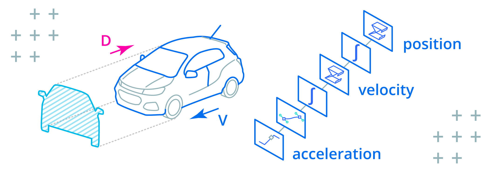

## overview

The Kalman filter is popular because it can generate accurate estimates in the presence of uncertainty and measurement noise. Simpler techniques like moving average or low pass filters introduce delay or miss important events, which is unacceptable for dynamic systems like cars and robots.

## background

In this article I introduce the Kalman Filter in the shortest way possible with practical examples. When you're ready to go deeper check out *Kalman Filter from the Ground Up by Alex Becker* at [kalmanfilter.net](https://www.kalmanfilter.net/default.aspx):


## why not average?

A basic *moving average* filter can be implemented as follows:

```matlab
function output = movingAverageFilter(input, size)
  buffer = ones(size, 1) * input(1);
  output = zeros(length(input))

  for sampleIndex = 1:length(input)
    bufferIndex = mod(sampleIndex - 1, size) + 1;
    buffer(bufferIndex) = input(sampleIndex);
    output(sampleIndex, 1) = sum(buffer) / size;
  end
end
```

Compare the filter result to the original data with buffer size `8`, `32`, and `64`:


Filtered data has been shifted forward on the time axis proportionately to the smoothing amount, introducing *delay*:

+ In the case of DC motor control for robotics, a moving average filter would cause the [PID](https://www.ni.com/en/shop/labview/pid-theory-explained.html) algorithm to oscillate, as it would see this delay as a signal that it's not working hard enough, and over-compensate. 
+ In the case of a vehicle, a moving average would cause the estimated position to lag too far behind, causing the navigation system to suggest changes to the route too late for the driver to respond.

## why not low pass?

A basic *low-pass* filter can be implemented as follows:

```matlab
function output = lowPassFilter(input, coefficient)
  estimate = input(1);
  output = zeros(length(input))

  for sampleIndex = 1:length(input)
    estimate = (1.0 - coefficient) * estimate + ...
      coefficient * input(sampleIndex);

    output(sampleIndex, 1) = estimate;
  end
end
```

Compare the filter result with `0.1` and `0.001` coefficients to the original data:


This filter missed short temporal spikes in the data. This may be fine if the system is cyclical in nature, but if the subsequent state depends on previous system state, missing events could cause it to diverge far from reality.

In the following video we test the moving average filter on real data:

`youtube:https://www.youtube.com/embed/rLM0os3vpsw`

## why predict?

If you know what a moving vehicle or a motor shaft are supposed to do (*since you are controlling them in the first place*), why should you let measurements have so much influence on where they are estimated to be next?

In the case of a DC motor, commanded velocity can be used to determine the shaft position:


```matlab
% System Identification (5202 Series Yellow Jacket Motor)
MAX_PWM = 65536;
MAX_VELOCITY_RPM = 30;
MAX_VELOCITY = MAX_VELOCITY_RPM * PI * 2 / 60;
PWM_NONLINEARITY = [1.0, 1.023, 1.03, 1.0, 0.98, 1.0];

% System Model
function nextPosition = systemModel(input, position, timeStep)
  % Normalize PWM to 0...1 range
  norm = input / MAX_PWM;

  % Map to velocity adjusting for PWM non-linearity curve
  index = round(length(PWM_NONLINEARITY) * norm);
  velocity = norm * PWM_NONLINEARITY[index] * MAX_VELOCITY;

  % Predict position
  nextPosition = position + velocity * timeStep;
end
```

In the case of a moving vehicle, the pressure on the accelerator pedal determines velocity and position:



```matlab
% System Identification (Chevrolet Trax 2017 4WD)
MAX_ACCELERATION = 2.82;
DRAG_COEFFICIENT = 0.35;
FRONTAL_AREA = 2.5;
AIR_DENSITY = 1.225;

% System Model
function [nextPosition, nextVelocity] = systemModel(...
  input, position, velocity, timeStep)
  % Map pressure on gas pedal to acceleration
  acceleration = ...
    input * MAX_ACCELERATION

  % Subtract drag force
  drag = DRAG_COEFFICIENT / 2.0 * ...
    AIR_DENSITY * FRONTAL_AREA * velocity^2;

  acceleration = acceleration - drag;

  % Predict velocity
  nextVelocity = velocity + acceleration * timeStep;

  % Predict position
  nextPosition = position + velocity * timeStep;
end
```

The first special thing about the Kalman filter is that it blends *measurements* with *predictions*, depending on which can provide the most accurate estimate:

+ Start with an initial guess as the first estimate
+ Determine how certain the estimate is
+ Take a measurement
+ Determine how certain the measurement is
+ Correct estimate by measurement
+ Predict the next estimate

We will examine each of these steps in detail in the following sections.

> The Kalman filter works by recursively predicting the object state using the motion model and correcting the state using measurements. -- [Matlab Sensor Fusion and Tracking Toolbox](https://www.mathworks.com/help/fusion/ug/linear-kalman-filters.html)

## variance

The second special thing about the Kalman filter is that its output isn't simply a value but a *likelihood of it being a certain value*. This concept is borrowed from statistics where it's called a *random variable*.

+ A random variable is defined by a *mean* and a *spread* from that mean.
+ The *mean* is a sum of a set of samples divided by the size of the set. This represents the *center* of the random variable.
+ The spread from the mean is called *variance* and it's denoted by the greek letter σ (sigma).
+ The *shape* of this spread is a "bell curve" called a *Gaussian distribution*.

Measuring physical quantities results in readings that follow this Gaussian distribution due to the [Holographic Principle](https://www.semanticscholar.org/paper/The-Holographic-Principle-Opening-Lecture-Hooft/43ce0cb38dba603c08c21d135fa4754fa5a95a41) of the Universe:

> The one-dimensional array of data that makes up the entire content of the Universe is stretched over a 3D surface with 1 bit of information every 0.724 x 10<sup>-64</sup>cm<sup>2</sup>.

When the Universe is "sampled" by taking a measurement, the sample is interpolated by using a strategy discovered by Carl Gauss: surrounding bits are blended in depending on distance of the sample from the "center" of each bit.


Variance can be calculated from a set of samples as follows:

1. Calculate the mean
2. For each number in the set, calculate distance from the mean (subtract mean from the number)
3. Square each distance from the mean, which will give you variance for this item in the set
4. Calculate the mean of all variances in the set (variances summed over number of items). This will give you the variance of the set.

In [Matlab](https://www.mathworks.com/products/matlab.html) or [Octave](https://octave.org/), mean and variance can be calculated as follows:

```matlab
set = [1, 2, 3, 4, 5]

>> mean(set)

ans =

   3

>> var(set)

ans =

   2.5000
```

The following video demonstrates how to calculate variance:

`youtube:https://www.youtube.com/embed/-RpGzyQoaOg`

## filter algorithm

Kalman filter starts with an initial estimate, the uncertainty of this estimate, and an initial state of the system being measured.

Each iteration, the system state is corrected by the last measurement according to the ratio of estimate uncertainty to measurement uncertainty.

The next estimate is then predicted by evaluating the system model with the corrected state:

```matlab
% Initial estimate
estimate = y0;

% Initial estimate uncertainty
covariance = P0;

% Initial state
state = x0;

% Identity matrix (state x state)
I = eye(length(state));

% Filter
for i = 1:length(inputs)
  % Measure
  measurement = measurements(i);

  % Determine correction amount
  gain = ...
    (covariance * C') / ...
    (C * covariance * C' + measurementVariance);

  % Correct state with measurement
  state = state + gain * (measurement - estimate);

  % Correct estimate uncertainty
  covariance = ...
    (I - gain * C) * ...
    covariance * (I - gain * C)' + ...
    gain * measurementVariance * gain';

  % Read input
  input = inputs(i);

  % Update state
  state = A * state + B * input;

  % Update estimate uncertainty
  covariance = A * covariance * A' + Q;

  % Predict the next estimate
  estimate = C * state + D * input;
end
```

The next few sections will explain the algorithm parameters in more detail.

## initial estimate

The initial estimate `y0` can come from initial measurement, output of the system model with initial state, or an educated guess.

A more accurate guess will let the algorithm converge on the optimal estimate faster and avoid a "jump" in the beginning when the filter performs a large correction.

## measurement

Each iteration begins by taking a measurement (`z`) and determining its uncertainty or [variance](#variance), typically denoted by `R`.

Measurement variance can be constant or vary based on conditions:

+ Hall effect encoders like [AKSIM](https://www.rls.si/eng/aksim-off-axis-rotary-absolute-encoder) measure the distance of the rotating magnet from the center of the sensor because this affects the accuracy of the readings. This feedback could be used to derive a measurement variance.
+ Complex measurement devices like radar let you estimate the dynamic effects of wind and rain on their signal-to-noise ratio to derive a measurement variance.
+ A basic potentiometer can be sampled in a range of expected conditions to calculate a constant variance (see [variance](#variance)).

## kalman gain

To produce optimal estimates, the Kalman filter has to know if the estimates are more or less reliable than measurements.

The *ratio* of estimate uncertainty to measurement uncertainty is calculated at each iteration. This ratio is called the Kalman gain (typically denoted by `K`) and used as a weight to correct predictions with measurements.

```matlab
% K - Kalman gain
% P - estimate [co]variance
% C - measurement matrix
% R - measurement variance

K = (P * C') / (C * P * C' + R);
```

Similar to other iterative optimization algorithms like [Gradient Descent](https://www.01binary.us/articles/inverse-kinematics/#gradient-descent) or [Newton-Raphson Iterator](https://www.01binary.us/articles/inverse-kinematics/#newton-raphson), the Kalman filter has to calculate an *error* at each iteration. This error is defined as the difference between the prediction and the measurement.

The error is then used to correct the model, with the correction amount determined by the Kalman gain:

+ If the measurements are trusted more, the Kalman gain will be closer to `1` which will correct the model prediction by a greater amount.
+ If the model is trusted more, the Kalman gain will be closer to `0` which will correct the model prediction by a lesser amount.

Since estimates are a function of the model internal state, we can't correct them directly. Instead we change the model state to get the desired corrected output:

```matlab
% Correct state with measurement
% x - system state
% K - Kalman gain
% z - measurement
% y - current estimate

x = x + K * (z - y);
```

After correcting the model state, the *estimate uncertainty* is updated by blending measurement uncertainty with model uncertainty:

```matlab
% Correct estimate uncertainty
% P - current estimate uncertainty (covariance)
% I - identity matrix (state x state)
% K - Kalman gain
% C - measurement matrix
% R - measurement variance

P = ...
  (I - K * C) * ...
  P * (I - K * C)' + ...
  K * R * K';
```

If the estimate was based more on the measurement, then the estimate uncertainty reflects more of the measurement uncertainty.

Conversely, if the estimate was based more on the model prediction, then the estimate uncertainty reflects more of the model uncertainty.

## prediction

The Kalman filter borrows from [System Identification](https://www.amazon.com/System-Identification-Theory-User-2nd/dp/0136566952) theory which states that most systems (heaters, motors, hydraulic pumps, you name it!) can be approximated by a linear model of the following form:


The system *output* `y` depends on system *state* `x` and *input* `u`.

The relationship between system output and system state is described by `C` *measurement matrix* and the relationship between input and immediate output is described by `D` *input contribution*.

Differences between the real system and its model are represented by `e` as *disturbance* or *noise*. This is a theoretical term that's there in the equation to represent "unknowns" and does not appear in the code.

> The measurement matrix is often called `H` in Kalman filter literature, but in this article I use `C` for consistency with Matlab System Identification Toolbox.

When modeling systems, you'll find that the input contribution to system output `D` is almost always `0` because real-world systems are not instantly affected by inputs. Instead, the inputs modify system state which eventually changes the output.

## state transition

The following equation is used to update (or *transition*) the state of a linear system model at each iteration:


This equation involves the following terms:

+ `x` is the system state being updated. The new state is based on the previous state so this term appears on both sides of the equation. The initial system state is usually denoted by `x0`.
+ `u` is the input provided at this iteration.
+ `A` is the *state transition* matrix. Multiplying the system state by this matrix will "simulate" the system, advancing it forward by one time step.
+ `B` is the *input matrix* or *control matrix* that represents the weight of input on each system state variable. Multiplying the input by this matrix will change each system state variable by a different amount depending on how it's affected by the input.
+ `e` represents the noise or disturbance that affects the system state transition. This is a theoretical term used to sweep discrepancies between the model and the real system under the rug, so it does not appear in the code.
+ `K` represents the influence of noise on each state variable. Since `e` is not used in a practical Kalman filter implementation, we don't use this term either.

## covariance

For a system model with a *single* state variable, the initial estimate and disturbance uncertainties are represented by scalar **variances**.

For a system with *multiple* state variables, the initial estimate and disturbance uncertainties are represented by square **covariance** matrices with the same number of rows and columns as there are state variables.

In a covariance matrix, the diagonal entries encode variances, and the off-diagonal entries encode *covariances*.

## estimate covariance

Estimate uncertainty is typically denoted by `P`, and the uncertainty of initial estimate is denoted by `P0`.

For systems with only one state variable both terms are scalar variances, otherwise they are covariance matrices.

A covariance matrix that encodes the estimate uncertainty of a system with two state variables (position and velocity) would look like this:


This matrix encodes the following information:

+ The *variance of position* (how far the estimated position could be from the true position, squared)
+ The *variance of velocity* (how far the estimated velocity could be from the true velocity, squared)
+ The *covariance* of position and velocity (the mathematical relationship between position and velocity random variables), with `0` indicating the two variables are not related.

A covariance matrix that encodes the estimate uncertainty of a system with three or more state variables follows the same pattern:


If the system was identified with Matlab [Control System Toolbox](https://www.mathworks.com/products/control.html), initial estimate covariance can be *projected* from initial state standard deviation available in [dx0](https://www.mathworks.com/help/ident/ref/idss.idssdata.html#btahx3u-dx0) property of the identified system by using the *measurement matrix*:

```matlab
% ss - identified system
% C - measurement matrix

covariance = diag(C * ss.dx0.^2 * C')
```

Each element of `dx0` is squared to convert standard deviation to variance by using the "dot" notation in Matlab.

> Multiplying variance by another quantity requires squaring that quantity. In order for this to work with matrix multiplication, the variance is pre-multiplied by the matrix and post-multiplied by the transpose of the same matrix. This is why you'll often see the pattern `X * y * X'`.

If you have a data set that records system state over time you could use Matlab's [cov](https://www.mathworks.com/help/matlab/ref/cov.html) function to get initial estimate covariance:

```matlab
% CSV with position, velocity, acceleration
dataset = readmatrix("states.csv");
covariance = cov(dataset);
```

If you can express the variance of the system model in terms of *tolerance* by using it in a sentence like "this estimate is within *x* or +/- *x*", then square half the tolerance amount to convert it to variance: `variance = (tolerance / 2)^2`.

The model variance can then be projected through the *measurement* matrix to determine the variance of the initial estimate:

```matlab
modelTolerance = 50
modelVariance = (modelTolerance / 2)^2;

covariance = diag( ...
  C * ...
  eye(length(state), 1) * modelVariance ...
  * C' ...
);
```

If the approximate variances of state variables are known, the estimate covariance matrix can be built by projecting these variances on the diagonal and leaving covariances blank:

```matlab
covariance = diag([ ...
  100, ...
  200, ...
  300 ...
]);

covariance =

   100     0     0
     0   200     0
     0     0   300
```

Lastly, you could assume the same variance for all initial state variables, leaving covariances blank:

```matlab
variance = 200;

covariance = ...
  eye(length(state)) * ...
  variance

covariance =

   200     0     0
     0   200     0
     0     0   200
```

These initialization strategies work because the Kalman filter will eventually converge on a more accurate estimate covariance.

However, significantly over-estimating the uncertainty of the initial estimate will cause the algorithm to ignore model predictions while significantly over-estimating the measurement variance will cause the algorithm to ignore measurements.

Recall that Kalman filter works by calculating a ratio between the two uncertainties, so if either one is many orders of magnitude greater than the other, it will break the filter.

## noise covariance

A process *noise* or *disturbance* covariance matrix usually denoted by `Q` looks exactly like estimate covariance, but it encodes the variance of Gaussian *noise* affecting each state variable within a single algorithm iteration.

> Noise or disturbance is the difference between the system model and the real system. Its covariance represents the likelihood of state variables being affected by random occurrences like external forces, noise, or the system state being updated using imperfect (noisy) inputs.

Similarly to estimate covariance, the approximate variance of noise or disturbance affecting all state variables in the same way could be *projected* across the diagonal:

```matlab
noiseCovariance = ...
  eye(length(state)) * ...
  noiseVariance
```

If the approximate variances of noise or disturbances affecting each state variable are known, they could be used to fill in diagonal entries of the covariance matrix, leaving off-diagonal entries blank:

```matlab
noiseCovariance = diag([ ...
  positionNoiseVariance, ...
  velocityNoiseVariance, ...
  accelerationNoiseVariance ...
])
```

If the approximate variance of noise introduced by updating the system state is known, it could be projected by using the *state transition matrix*:

```matlab
noiseVariance = 200;
noiseCovariance = A * noiseVariance * A'
```

If the approximate variance of noise introduced by the system input is known, it could be projected by using the *control matrix*:

```matlab
inputNoiseVariance = 200;
noiseCovariance = B * inputNoiseVariance * B'
```

If the system was identified with Matlab [Control System Toolbox](https://www.mathworks.com/products/control.html), the [covar](https://www.mathworks.com/help/control/ref/dynamicsystem.covar.html?s_tid=doc_ta) function (not to be confused with [cov](https://www.mathworks.com/help/matlab/ref/cov.html)) will output the disturbance covariance:

```matlab
noiseVariance = 200;

[ ...
  % Scalar estimate variance
  P, ...
  % Disturbance covariance
  Q ...
] = covar(ss, noiseVariance)
```

Finally, you could simulate your system model using the same data set used to identify the system, and calculate the difference between the original measurements and the system model at each iteration.

Since the system model includes a *measurement* matrix which maps system state to system output, you could multiply the difference between the original measurement and the model prediction by the inverse of this matrix to calculate the noise affecting each state variable at each iteration.

With these results recorded in a separate vector for each state variable, you could then use the `cov` function in Matlab to generate a noise or disturbance matrix.

We will go over how to simulate a continuous discrete systems in the simulation section.

## covariance transition

Since Kalman filter estimates are random variables represented by mean and variance, anything that we do to the estimate must also be reflected in its uncertainty.

Earlier we corrected the estimate uncertainty by the same amount (`K`) used to correct the estimate:

```matlab
P = ...
  (I - K * C) * ...
  P * (I - K * C)' + ...
  K * R * K';
```

In this step, we transition the estimate uncertainty by the same amount (`A`) used to transition the estimate:

```matlab
P = A * P * A' + Q;
```

Recall that `A` is the [state transition](#state-transition) matrix that represents the change made to the system state at each iteration.

The [noise covariance](#noise-covariance) matrix `Q` represents how much uncertainty is added at each iteration by simulating the system based on an imperfect model and using noisy inputs to change the system state.

## system identification

The system model can be derived by analyzing the system (as we did in the overly simplified examples of a vehicle and PWM-controlled motor in [why predict?](#why-predict) section earlier), or by using [system identification](https://www.mathworks.com/products/sysid.html).

> A system identification algorithm tries to guess the system model given system input and output tracked over time.

In the following video we'll identify a system by using a discrete [linear state-space model](https://www.mathworks.com/help/control/ref/ss.html) in Matlab because it's simple and provides great estimates:

`youtube:https://www.youtube.com/embed/D8Q-FoiqhiA`

*Identifying* a system refers to finding `A`, `B`, `C`, `D` coefficients that make the output of the linear model most closely resemble the measurements. These coefficients can then be used as parameters to the Kalman filter.

The best way to compare the identified system to the original measurements is by viewing the *Model Output* in **System Identification app**, as demonstrated in the above video:


This will simulate any identified models and display their outputs alongside the original measurements:


The properties of the system identified by [Control System Toolbox](https://www.mathworks.com/products/control.html) can be extracted by using [idssdata](https://www.mathworks.com/help/ident/ref/idss.idssdata.html):

```matlab
[A,B,C,D,K,x0,dA,dB,dC,dD,dx0] = idssdata(ss);
```

...or by using an object property notation, for example:

```matlab
ss.dx0
```

The following properties are available:

* `A`, `B`, `C`, `D`, `K` are the coefficients described earlier.
* `dA`, `dB`, `dC`, and `dD` are standard deviations of system state and inputs.
* `x0` is initial state (plug this into the equations to get the initial guess).
* `dx0` is the standard deviation of initial state.

In the next section we will also go over how to simulate a system manually, which can help you understand how state and inputs affect system output.

For more background on system identification, try this [series of tutorials](https://ctms.engin.umich.edu/CTMS/index.php?aux=Home) assembled by two professors at Carnegie Mellon university.

## system simulation

The quickest way to simulate a linear system identified by System Identification app is using [lsim](https://www.mathworks.com/help/control/ref/dynamicsystem.lsim.html):

```matlab
% Generate evenly spaced time samples
time = linspace( ...
  0, ...
  ss3.Ts * length(inputs), ...
  length(inputs) ...
);

% Simulate with original input and initial state
outputs = lsim(ss3, inputs, time, ss3.x0)
```

See the complete Matlab and C++ examples in the [companion repository](https://github.com/01binary/systemidn).

## kalman filter in c++

In this final section let's look at a complete example of a Kalman filter in C++:

```cpp
// TODO: this code sample has not been compiled and tested yet
double systemModel(
  double acceleration,
  double accelerationVariance,
  double& variance,
  double timeStep)
{
  static double position = 0.0;
  static double velocity = 0.0;
  static double velocityVariance = 0.0;

  velocity = velocity + acceleration * timeStep;
  position = position + velocity * timeStep;

  velocityVariance = velocityVariance +
    accelerationVariance * pow(timeStep, 2);

  variance = variance +
    velocityVariance * pow(timeStep, 2);

  return position;
}

// Kalman filter
double gain = 0.0;
double variance = 0.0;
double prediction = systemModel(
 input, inputVariance, variance, timeStep);

double kalmanFilter(
  double measurement,
  double measurementVariance,
  double input,
  double inputVariance,
  double timeStep)
{
  gain = variance / (variance + measurementVariance);

  double estimate = prediction + gain * (measurement - prediction);

  variance = (1 - gain) * variance;

  prediction = systemModel(
    input, inputVariance, variance, timeStep);

  return estimate;
}
```
