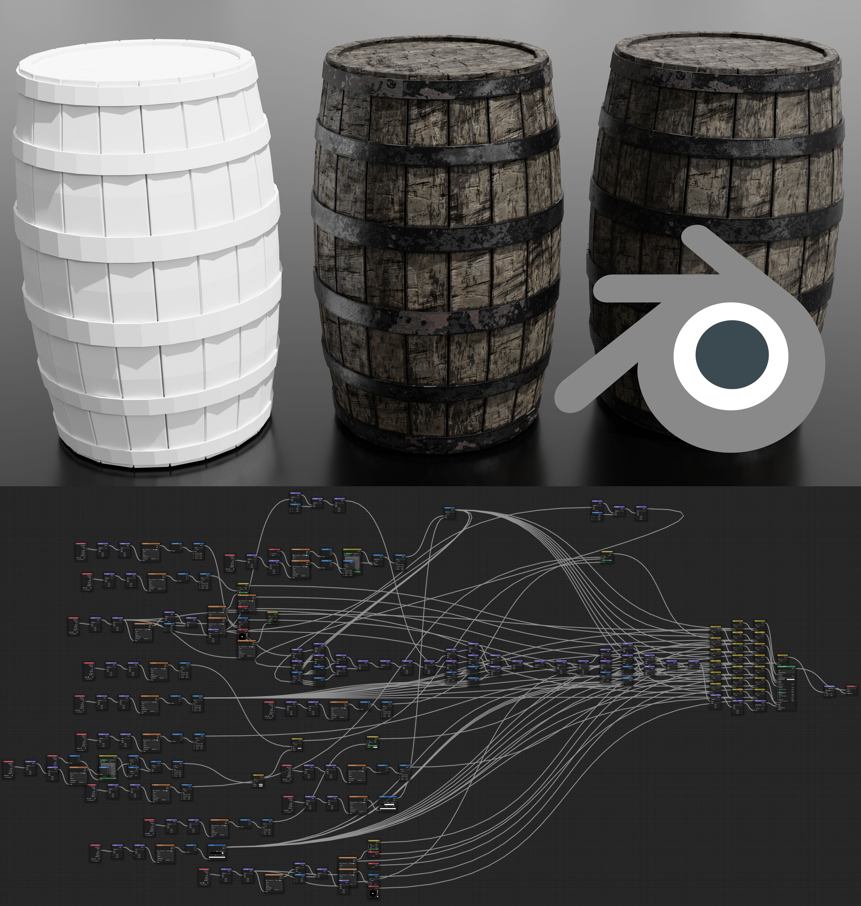
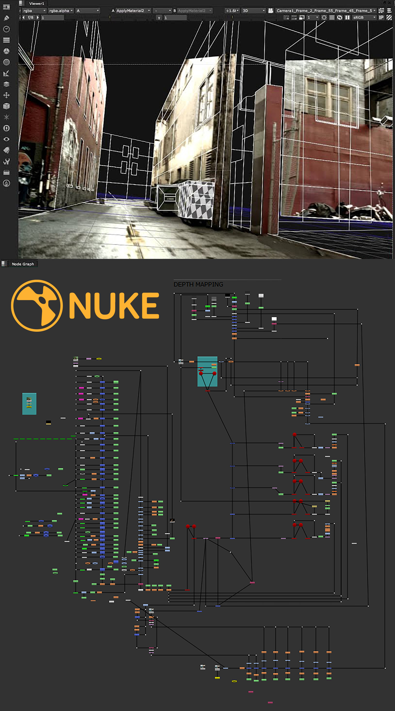

## introduction

As I became more familiar with the writings of *Freud* and *Plato* and started practicing daily meditation, I realized that many of the concepts I was learning were repeating the same pattern:

- All authors have the same model of the human mind.
- One calls it the *soul* while the other calls it *personality*, and yet another calls it *consciousness*.
- All theories divide the mind into *three elements* responsible for *thinking*, *feeling*, and *doing*.
- The three elements are described as information processing nodes that connect *input* to *output*.
- The elements are always *weighted* in some *proportion* to each other.
- Each element shares the characteristics of the whole mind, making them more like "partitions" over the computing volume of the mind.
- Each one is *single-minded* and driven by its own *purpose* in an endless cycle to optimize and maximize through learning.

This arrangement mirrors my favorite areas of computer science like digital signal processing and functional programming.

## why study the mind?

Different authors have their own reasons for studying the mind:

- Freud is like a *craftsman* who is more concerned with the "how". He studies practical implications of the mind’s internal structure and applies this knowledge to fix unwanted behavior by regulating the three elements.
- Socrates is like a *scholar* who is more concerned with the "why". He uses deductive reasoning to explain why the mind is organized the way it is, and leverages this knowledge to self-regulate or compete with others by understanding their strengths and weaknesses better than they do.
- Sensei are like *artists* that practice training aimed at increasing awareness. They want to help you tune your mind to the rest of the band, and learn to play your own part of the Universe’s symphony.

## the three elements

Why are the three elements separate? *Optimizing* each element to follow its own objectives and then *summing* them has the capability of producing more accurate output than if there was only one mind with a multitude of objectives.

> If you spin up a neural network in Azure Machine Learning and ask it to detect objects in pictures at the same time as finding the quickest way to cook rice in various atmospheric conditions, you will see what I mean.

In order for the system to learn, you need a scoring strategy.

- Do you score based on how successful the *object detection* was?
- Do you score based on the best *rice recipe*?
- If you score on *both*, which one has more *weight*?
- Whichever way you choose, the *weights* would be recorded at the time of learning, making the system *too rigid* to handle *dynamic environments*.
- To compensate for the *mismatch* between the *present* conditions and the conditions at the time of *learning*, you need a way to *re-mix* the decisions.

When the decision-making elements are separate, each one makes the best decision based on its own *past experience*, and then the results are *blended together* to tailor the output to what’s *currently happening*.

Why are there there *three* elements, and why are they given *these* tasks?

- You get these three elements because your mind is a *partition* over the larger Universal Consciousness, thus it *shares* in the Universe’s characteristics. See the previous article: [A Theory of Consciousness](/articles/theory-of-consciousness).
- The three elements that make up the Universal consciousness are *Planning*, *Sensing*, and *Execution*, so when you grab a slice of that consciousness, you end up with all three elements present.

Why does the Universe *itself* consist of these three elements?

- In  [A Theory of Consciousness](/articles/theory-of-consciousness), I make the case that the Universe is engaged in a large scale effort to *understand* itself by taking raw data from its "unexplored" parts and *forming* it into structures.
- It works like a large-scale *data transformation pipeline* and can be modeled by using *functional programming* concepts.
- A *function* maps a range of inputs into a range of outputs and is characterized by three features: *input*, *mapping*, and *output*.
- The relationship between the three elements is that the inputs are connected or *mapped* to outputs through the *transform graph*.

## planning element

*Socrates* calls it the "Rational" element and *Freud* calls it the "Super-ego". It's compared to a *chariot driver*, a *gardener*, and a *king*.

This element is characterized by:

- Being truth-loving, order loving, and reason-loving.
- Single-minded devotion to learning, planning, and resource management.

It is responsible for:

- *Managing* and *maintaining* the other two elements.
- *Predicting* and *comparing* outcomes to select an optimal plan of action.
- Looking for *new patterns* and fitting incoming data into *existing patterns*.

This element has the following effects on behavior:

- **In Range**: takes sensor inputs advertised by the Sensing element into account to plan and prioritize goals, then directs the Executive element to carry them out.
- **Hypo**: allows feelings or blind instinct to take over depending on whether the Sensing or the Executive element is stronger.
- **Hyper**: If Sensing element is weak: fails to consider feelings and makes assumptions instead, resulting in poor health, inability to communicate, and operating on wrong assumptions. If Execution element is weak: has lots of ideas but cannot bring them to fruition.

## execution element

Socrates calls this element "Spirited" and Freud calls it the "Ego".

- Socrates compares it to a lion or a white horse because its role is to be *strong* and *courageous*.
- Freud denotes this as the part of mind shaped by interacting with the physical world. The Ego is an *extension* of the Superego, a bridge that connects consciousness to the physical world.

This element is characterized by being honor-loving, victory-loving, and having a single-minded devotion to achieving goals.

It is responsible for:

- Actualizing the decisions made by the planning element.
- Self-preservation and protecting others.
- Competition with others for the same goal.

This element affects behavior in the following ways:

- **In Range**: relentless execution that reaches goals at any cost.
- **Hypo**: laziness and lack of motivation.
- **Hyper**: blindly charging without planning and feeling, using energy to create problems instead of solving them, forcing the planning element to aquire goals through raw strength.

## sensing element

Socrates call this the "Appetitive" element and Freud calls it the "Id". It is compared to a snake that can grow many heads, or a black horse with a character that's hard to control.

This element is sensitive, complex, and multifaceted.

- It can *scale* to track any number of sensory inputs (this may be the property that invites a comparison to a snake with many heads).
- It performs *adoptive input sensing*. The strength of "desire" and "relief" signals it outputs depends on the min/max range of recently sampled data. Samples clipping outside of range first generate very intense signals, and then the system adopts to the new range over time, making the same inputs produce less intense signals.

This element is responsible for:

- Providing *accurate*, *high-gain*, *low-noise* feedback signals to inform the planning and execution elements.
- Advertising unfulfilled needs to the Planner and reporting the intensity of each need based on the adoptive input range processing.
- Constantly searching for new needs that need to be fulfilled, determine their range, and advertise them to the Planner.

It influences behavior in the following ways:

- **In Range**: accurate sensing that results in goals reached efficiently and crises averted.
- **Hypo**: lack of connection to the surrounding world, which typically results in inaccurate actions and decisions due to incorrect or lacking feedback.
- **Hyper**: feasting on feedback instead of using it to achieve goals.

## the mind as a system

The mind is most efficient when all three elements are in correct *proportions* to each other. The rational element *steers*, the sensing element provides *feedback* used to guide the steering, and the executive element *actuates* the system. Many designs found in nature repeat the same pattern:

- *Bacteria* sense the concentration of chemicals in their medium by using *chemo-receptor* proteins. Receptors dispatch *messenger proteins* when they bind to a *stimuli* molecule, and the messengers bind to flagellar motors that actuate movement. This causes the motors to rotate, facing whichever direction gets the strongest signal.
- More complex organisms like *tardigrades* need a system of connected nerve cells (*cerebral ganglia*) that take multiple inputs and wire them through to multiple outputs. There are enough cells in the ganglia to create a surface for laying out several large graphs of nodes.
- The largest animals on Earth maintain the same structure: several elements, a decision-making graph consisting of many connected nodes, and muscles that actuate movement.

The information processing graphs of nodes appear in modern CG software.

The shader editor in `Blender` allows composing materials for 3D rendering:

The composition graphs in `Nuke` allow composing special effects on video:

* * *

The same pattern repeats at both micro- and macro-levels because mapping sensory input into activity is a very common task for any living organism.