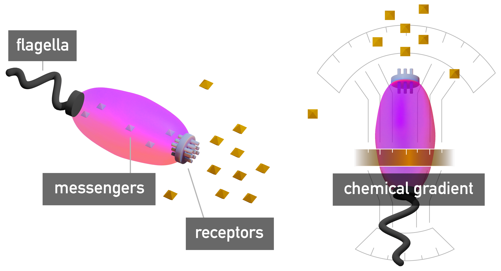

import Gallery from '../components/Gallery';

## introduction

As I became more familiar with the writings of *Freud* and *Plato* and started practicing daily meditation, I realized that both authors and sensei have the same model of the human mind.

Freud calls it *personality*, sensei practicioners call it *consciousness*, and *Plato* calls it the *soul*. All theories divide the mind into *three elements*:

1. The **Rational**, or *thinking* element that plans and measures
2. The **Executive**, or *doing* element that acts
3. The **Appetitive**, or *sensing* element that provides feedback

The elements are described as information processing nodes that connect *input* to *output*, and are always *weighted* in some *proportion* to each other.

Each element shares the characteristics of the whole mind, making them more like "partitions" over the computing volume of the mind, or sub-networks in a larger network. Each one is *single-minded* and driven by its own *purpose* in an endless cycle to optimize and maximize through learning.

## why study the mind?

Different authors have their own reasons for studying the mind:

- Freud applies his knowledge of the mind's internal structure to regulate the constituent elements and fix unwanted behaviors.
- Socrates uses deductive reasoning to explain the mind and leverages this knowledge to self-regulate or compete with others by understanding their strengths and weaknesses better than they do.
- Sensei practice training aimed at increasing awareness. They want to help you tune your mind to the rest of the band, and learn to play your own part of the Universe’s symphony.

## the three elements

Why are the *Rational*, *Executive* and *Appetitive* elements separate? *Optimizing* each element to follow its own objectives and then *summing* them gives the mind a capability to produce more accurate output.

> If you spin up a neural network in [Azure Machine Learning](https://docs.microsoft.com/en-us/azure/machine-learning/overview-what-is-azure-machine-learning) and ask it to detect objects in pictures at the same time as finding the quickest way to cook rice in various atmospheric conditions, you will see what I mean.

In order for the system to learn, you need a scoring strategy.

- Do you score based on how successful the *object detection* was?
- Do you score based on the best *rice recipe*?
- If you score on *both*, which one has more *weight*?
- Whichever way you choose, the *weights* would be recorded at the time of learning, making the system *too rigid* to handle *dynamic environments*.
- To compensate for the *mismatch* between the *present* conditions and the conditions at the time of *learning*, you need a way to *re-mix* the decisions.

When the decision-making elements are separate, each one makes the best decision based on its own *past experience*, and then the results are *blended together* to tailor the output to what’s *currently happening*.

Why are there *three* elements, and why are they given *these* tasks?

- You get these three elements because your mind is a *partition* over the larger Universal Consciousness, thus it *shares* in the Universe’s characteristics. See my previous article: [A Theory of Consciousness](/articles/theory-of-consciousness).
- The three elements that make up the Universal consciousness are *Planning*, *Sensing*, and *Execution*, so when you grab a slice of that consciousness, you end up with all three elements present.

Why does the Universe *itself* consist of these three elements?

- In  [A Theory of Consciousness](/articles/theory-of-consciousness), I make the case that the Universe is engaged in a large scale effort to *understand* itself by taking raw data from its "unexplored" parts and *forming* it into structures.
- It works like a large-scale *data transformation pipeline* that connects inputs to outputs through a *transform graph* which consists of many information processing nodes (*functions*) which are linked together.
- A *function* maps a range of inputs into a range of outputs and is characterized by three features: *input*, *mapping*, and *output*, which directly correspond to elements of a mind: *Sensing*, *Thinking*, and *Doing*.

* * *

In the following sections we explore all three constituent elements of the mind.

## planning element

*Plato* calls this the "Rational" element and compares it to a *chariot driver*, a *gardener*, and a *king* [[A Plato Reader](https://www.amazon.com/gp/product/B00AQZYXNE)].

Freud calls it the "Ego" and compares it to "a man on horseback, who has to hold in check the superior strength of the horse" [[The Ego and the Id (1923)](https://www.amazon.com/Ego-Id-Sigmund-Freud-ebook/dp/B07L48664D)].

This element is characterized by:

- Being truth-loving, order loving, and reason-loving.
- Single-minded devotion to learning and organizing.

It is responsible for:

- *Managing* and *maintaining* the other two elements.
- *Predicting* and *comparing* outcomes to select an optimal plan of action.

This element has the following effects on behavior:

- **In Range**: uses inputs from the *Sensing* element to plan and prioritize goals, then directs the *Executive* element to carry them out.
- **Hypo**: allows feelings of the *Sensing* element to take over and lets the *Executive* element charge into situations blindly.
- **Hyper**: fails to consider feelings and makes assumptions. Never leaves the planning stage to take action, failing to recognize that *learning* happens by *doing* and failure is a necessary part of learning.

## executive element

Socrates calls this element "Spirited" and compares it to a lion because its role is to be *strong* and *courageous*. Freud calls it the "Super-Ego", a part of the mind shaped by interacting with the physical world.

This element is characterized by being honor-loving, victory-loving, and having a single-minded devotion to achieving goals.

It is responsible for:

- Actualizing the decisions made by the planning element.
- Self-preservation and protecting others.
- Competition with others for the same goal.

This element affects behavior in the following ways:

- **In Range**: relentless execution that reaches goals at any cost.
- **Hypo**: laziness and lack of motivation.
- **Hyper**: blindly charging without planning and feeling, or attempting to aquire goals through raw strength alone.

## sensing element

*Plato* calls this the "Appetitive" element and compares it to a black horse with a character that's hard to control.

*Freud* calls it the "Id" and poses that the *Ego* and the *Super-Ego* have "grown out" of *Id* like appendages used to manipulate the surrounding world. The *Id* needs them to get what it wants, but must subject itself to a constrained role of *sensing*, letting the *Ego* mediate and *Super-Ego* handle the details.

This element is able to *scale* to track any number of sensory inputs and performs *adoptive input sensing*. The strength of "desire" and "relief" signals it outputs depends on recently sampled data. Samples outside of range generate intense signals at first, but the intensity decays over time as the system adopts to the new range of data.

This element is responsible for:

- Providing *accurate*, *high-gain*, *low-noise* feedback signals to inform the planning and execution elements.
- Advertising unfulfilled needs to the Planner and reporting the intensity of each need based on the adoptive input range processing.
- Constantly searching for new needs that need to be fulfilled, determine their range, and advertise them to the Planner.

It influences behavior in the following ways:

- **In Range**: accurate sensing that results in goals reached efficiently and crises averted.
- **Hypo**: lack of connection to the surrounding world, which typically results in inaccurate actions and decisions due to incorrect or lacking feedback.
- **Hyper**: feasting on feedback instead of using it to achieve goals.

## the mind as a system

The mind is most efficient when all three elements are in correct *proportions* to each other. The rational element *steers*, the sensing element provides *feedback*, and the executive element *mobilizes* the system.

Many designs found in nature repeat the same pattern.

*Bacteria* sense the concentration of chemicals in their medium by using *chemo-receptor* proteins. Receptors dispatch *messenger proteins* when they bind to a *stimuli* molecule, and the messengers bind to flagellar motors that actuate movement. This causes the motors to rotate, facing whichever direction gets the strongest signal.

More complex organisms like *tardigrades* (water bears) need a system of connected nerve cells (*cerebral ganglia*) that take multiple inputs and wire them through to multiple outputs. There are enough cells in the ganglia to create a large surface for laying out many graphs of function nodes.

The same node graphs are used as a tool in modern CG software to let artists design the flow of visual information from a veriety of input sources through to the final rendered and composed frame.

The shader editor in `Blender` allows composing materials for 3D rendering:

<Gallery>
  
  
  
  
</Gallery>

The composition graphs in `Nuke` allow composing special effects on video:

<Gallery>
  
  
   
  
</Gallery>

The same *function* pattern repeats at both micro- and macro-levels because mapping senses into activity is a very common task for any living organism.