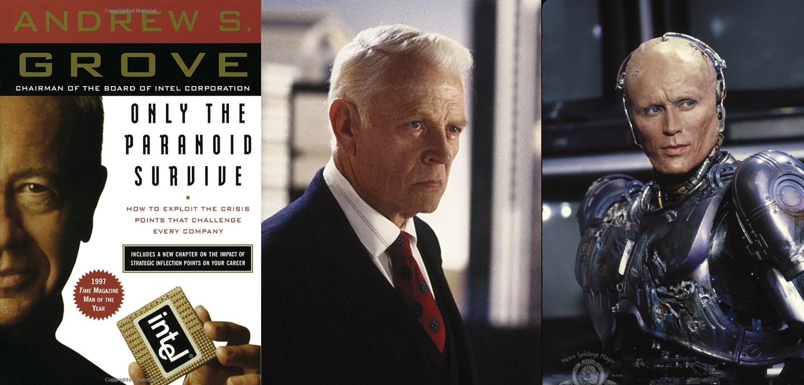

## preamble

Andy Grove's book [Only the Paranoid Survive](https://www.amazon.com/Only-Paranoid-Survive-Exploit-Challenge-ebook/dp/B0036S4B2G) has useful insights for anyone working in applied science industry. I know what you're thinking - the author looks like Old Man, the OCP corporation CEO who hurt Robocop's feelings.

Yes, he did spend 30% of the book struggling with "CEO issues" like putting his ego aside to talk to middle managers and ask what the people who do the actual work for the company are thinking (God forbid he would talk to workers). Despite this I guarantee you will have something to learn from the other 70%:

* You are in charge of your own business
* Survival is determined by how you respond to change
* Success is determined by the efficiency of extracting value from change

## what is a business?

You probably think of yourself as an employee unless you have people on the payroll. Grove challenges this assumption, asserting that everyone is at least a consultant who is running their own business.

Whether you are a full- or part-time employee working for a software company, you had to go through an interiew proccess, just like a vendor or a consultant:
- You had to prove that you have an edge over the competition by developing your unique sales pitch to highlight strengths and downplay weaknesses, as well as constantly update your resume based on feedback from recruiters and missed opportunities.
- You also had to build a network of references that can back up the claims in your marketing copy through targeted testimonials.
- You may have done some information marketing like answering questions on StackOverflow, running a blog, speaking at conferences, or teaching an online course to position yourself as an expert.
- You may have done some pro-bono work to build your portfolio.

Visit the landing page of any startup, including consulting agencies and Software as a Service (SaaS) companies. What do you see?

Likely a marketing copy that connects your needs to their service offer (a *resume*), customer testimonials (*references*), and links to work samples (*portfolio*). Sometimes their service is available for free for non-commercial use like in the case of Travis or WhiteSource Bolt (*pro-bono work*). How did you find them? Likely some well-placed *informational marketing* like a blog post.

The same subject comes up again in another book by Andy Grove: [High Output Management](https://www.amazon.com/High-Output-Management-Andrew-Grove-ebook/dp/B015VACHOK):

> As a general rule, you have to accept that no matter where you work, you are not an employee -- you are in a business with one employee: yourself. You must compete with millions of individuals every day, and every day you must enhance your value, hone your competitive advantage, learn, adapt, get out of the way, move from job to job, even from industry to industry if you must and retrentch if you need to do so in order to start again.

## responding to change

Adopting to change takes a lot of time and effort, so the two metrics most predictive of success are:
- How soon you notice the change
- Your level of effort and how long the effort is sustained

While responding to change will put you ahead of a sizeable chunk of the market, continued success means you have to start adopting to a new trend when you experience no external pressure to do so.

This is the controversial part and the reason for the title of this book. When everyone else is relaxing and enjoying their ongoing success, you have to do the opposite by training hard to get ready for the next challenge.

[Who moved my cheese? : an a-mazing way to deal with change](https://www.amazon.com/Who-Moved-My-Cheese-Mazing-ebook/dp/B004CR6AM4) by Spencer Johnson is a quick read that explains how you can cultivate this outlook.

Why is doing the opposite so often the right thing to do? According to *Socrates* in the book of [Phaedo](https://www.amazon.com/Phaedo-Plato-ebook/dp/B07WHTZYN7), change is simply a movement or oscillation between two opposites. If you know what the opposites are, constantly working to be ready for the next change in polarity would make you look like a successful visionary to an independent observer who is not aware of this rule.

> When something comes to be larger it must necessarily become larger from having been smaller before [...] and the weaker comes to be from the stronger. Between each of those pairs of opposites there are two processes: from the one to the other and then again from the other to the first. -- Socrates (as documented by Plato)

## failure as opportunity

You are probably familiar with at least one story of a visionary leader that exploited adverse conditions by re-framing them as an opportunity:

- In [Only the Paranoid Survive](https://www.amazon.com/Only-Paranoid-Survive-Exploit-Challenge-ebook/dp/B0036S4B2G), Andy Grove tells the story of Intel becoming a leader in building micro-processors for personal computers instead of going out of business as a manufacturer of memory chips for mainframes.
- In [The Passion Economy](https://www.amazon.com/Passion-Economy-Thriving-Twenty-First-Century-ebook/dp/B07QDK4MM7), Adam Davidson tells the story of *Braun Brush*, a company that was started in `1865` by an entrepreneur who designed brushes for many applications ranging from cleaning milk bottles to cleaning tennis courts. In `1990`s Braun was losing to Chinese manufacturers who bulk-imported cheap commodity brushes. Instead of going out of business, Braun focused entirely on one-off products that solved problems for specific customers: cleaning nuclear reactors, cleaning dust from rock drills on NASA rovers *Spirit* and *Opportunity*, or a high-temperature resistant brush for cleaning deep fryers.
- In [Monetizing Innovation](https://www.amazon.com/Monetizing-Innovation-Companies-Design-Product-ebook/dp/B01F4DYY1I), Madhavan Ramanujam tells the story of the *Gillette* razor by Procter & Gamble, which had `60%` of the market share in U.S. but achieved only `22%` in India. P&G realized that the majority of the Indian market could not afford the `$2.24` price due to the difference in economies of the two countries, and designed a version with only the features essential to Indian consumers at `$0.33` each. Two years after the re-design Gillette captured `60%` of the Indian market, which amounted to `400 billion` customers vs. `94 million` in the U.S.

The difference between success and failure lies in your ability to detach from the "apparent" situation and focus on what's happening behind the scenes: a simple oscillation of a value between the two ends of a scale.

Since you've managed to become successful by harvesting the "delta change" of the value from one extreme to the other, now you simply have to figure out how to extract value from the movement in the opposite direction.