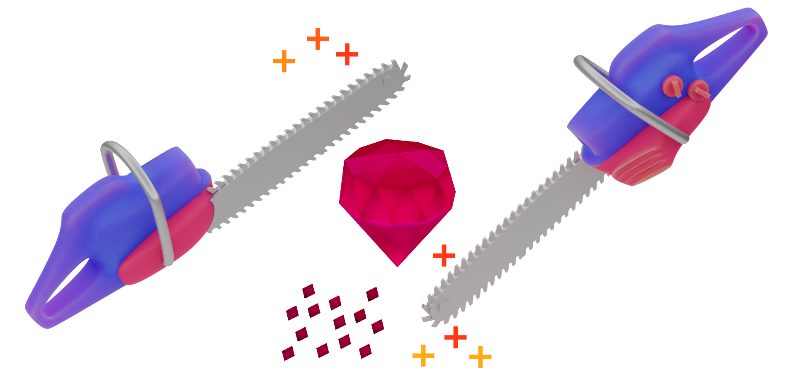
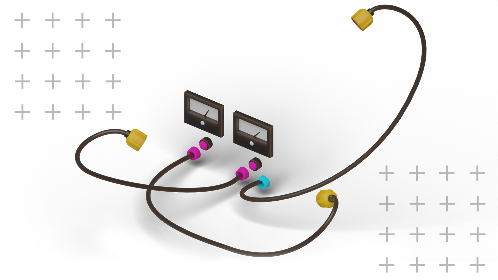

## introduction

Professionals today think of business as a vehicle for transforming the world while doing what they love. However, as soon as they leave the beaten path, they realize it was just a narrow strip in an endless desert. Their first instinct is to grasp at something familiar: an MBA program at an accredited institution!

Kaufman argues that learning core business skills is more valuable if you are searching for *meaning* rather than *comfort*, and [his book](https://www.amazon.com/Personal-MBA-10th-Anniversary-ebook/dp/B08H5PKGGG) accumulates the information necessary for a self-study course in business administration.

## parts of a business

Business exists to create and deliver value, and consists of the following parts:

1. *Value creation*: discovering what people need and creating it
2. *Marketing*: attracting attention and building demand for the product
3. *Sales*: turning prospective customers into paying customers
4. *Value delivery*: giving your customers what you promised
5. *Finances*: bringing in enough to keep going

At the heart of any successful business is a *repeatable process* that:

+ Creates and delivers something of value
+ ...that other people want or need
+ ...at a price they are willing to pay
+ ...in a way that satisfies customer's needs or expectations
+ ...that generates enough value to continue operation

Providing business value involves satisfying one or more **core human drives**:

+ *The drive to acquire* -- retail, financial or political consulting
+ *The drive to form relationships* -- communities, restaurants, conferences
+ *The drive to learn* -- educational and training services
+ *The drive to defend* -- insurance, legal, and security services
+ *The drive to feel* -- entertainment businesses

## market research

Test a market as soon as possible by developing a *minimum viable product* or *prototype* and getting it in front of customers.

Remember that **competition has hidden benefits**. There is already a market you might be able to serve better than your competitors. Rather than having to prove that a market exists, time and energy can be invested on *differentiation* and *positioning* to hone your business value.

The best way to validate **Critical Assumptions** about a market is through **Shadow Testing**: selling of a product or service before it's created. This lets you validate assumptions without building a product or even a prototype.

One example is [Fitbit](https://www.fitbit.com/global/us/home?), a wearable device that tracks activity to provide valuable feedback for improving the user's health.

> When Fitbit was announced, a landing page accepted **pre-orders** based on **stories** of the value the product would provide and a few **visualizations**. Customer information was collected and credit card numbers were verified, but no charges were processed until the product shipped. Fitbit used this to get the attention of investors who provided the `$2` million to design, build, and ship the product.

Discover what prospects truly want by forcing them to make decisions with **Relative Importance Testing**. A series of questions with several alternatives for each one ("what would you rather have?") will activate the same emotions that will influence customers to select from alternatives and make decisions.

## marketing

Products should be designed for a specific market segment, a concept reinforced in another useful resource on this subject, [Obviously Awesome: How to Nail Product Positioning So Customers Get It, Buy It, Love It by April Dunford](https://www.amazon.com/Obviously-Awesome-Product-Positioning-Customers-ebook/dp/B07PPW5V9C). Within that segment, appeal to one or more core human drives.

> Marketing at the **point of market entry** is another effective strategy. When new parents come home from a maternity ward, they are given a complimentary "care package" of diapers, ointments and baby formula, "generously" sponsored by Kimberly-Clark or Johnson & Johnson.

It's important to be conscious of **Framing**: emphasizing important details and leaving out or minimizing others. The benefits of an offer should be communicated concisely to maximize its persuasive power.

> Given a choice of saving `200` lives and a `33%` chance of saving `600` lives, survey correspondents almost always chose the first option, even though the two options are **equivalent** (`200` is `33%` of `600`). Clearly the choice was made using a quick emotional assessment of "save lives!" vs "some people would die!" rather than rational thought.

## delivering value

Working on the **right thing** is more important than **working hard**.

The *Five-Fold Why* technique can help with eliciting the right goal. Ask "Why" `5 times`, each time questioning the basis for the last answer:

1. *Why do I want a million dollars?* Because I don't want to be stressed about money
2. *Why don't you want to be stressed?* So I don't feel anxious
3. *Why don't you want to feel anxious?* So I feel secure.
4. *Why do you want to feel secure?* So I feel free.
5. *Why do you want to feel free?* Because I want to feel free.

Keep breaking down the reasons until you get to the atomic "core" that cannot be broken down further.

The *Five-Fold How* is the process for building up back to the actions that need to be taken to achieve a goal. At each iteration, select the most likely choice and ask "How?" again to break it down further. After about five iterations, you should arrive at a detailed process for achieving the goal.

For example, **how can I feel free?**

1. Paying off outstanding debt
2. Reducing work hours, finding another position, or becoming an entrepreneur
3. Moving to a new city or country
4. Breaking off a restricting personal relationship

Each task breaks down into smaller chunks until you have a detailed plan.

## designing systems

The subject of *systems thinking* comes up often in modern business.

> According to Gall's Law, all complex systems **that work** evolved from simpler systems **that worked**.

Complex systems designed from scratch will never work in the real world because they haven't been subjected to *environmental selection forces*. This is why **Prototyping** and **Iteration** work so well for creating and delivering value.

## measurement

Key Performance Indicators (*KPIs*) are a popular topic, but measurements that can help you improve a system must be related to either [Five Parts of Every Business](#parts-of-a-business) or *Throughput*. The following questions can help identify KPIs:

+ *Value Creation*: how quickly is the system creating value? What is the current level of Inflows (Inputs)?
+ *Marketing*: How many people are paying Attention to your offer? How many prospects are giving you Permission to provide more information?
+ *Sales*: How many prospects are becoming paying customers? What is the average customer's Lifetime Value?
+ *Value Delivery*: How quickly can you serve each customer? What is your current returns or complaints rate?
+ *Finance*: What is. Your Profit Margin? How much Purchasing Power do you have? Are you financially Sufficient?

Variables that cannot be measured directly require measuring a related **proxy**. For example, [researchers at Google](https://kerryrodden.com/publications/wisi2007.pdf) found that `76.2%` of the time people move the mouse cursor, *they point to where they are looking*. Measuring eye fixation is complex and expensive, but measuring mouse movement is simple.

> When optimizing systems based on measurements, remember the **Pareto Principle**: `80%` of results come from `20%` of behavior.

Improving the most important parts of a system is the best way to make **high-leverage changes**: significant improvements with little effort.

## direction

Everyone has experienced what the "design by committee" does to a product. The most persuasive voices win and the design holds together for a little while before being challenged and pulled in another direction.

It turns out the inverse of design by committee is a "direction" that informs all the micro-decisions on the way from the current to the desired condition.

> "You've got to think about big things while you're doing small things, so that all the small things to in the right direction." --Alvin Toffler

This direction is set by the leadership team for the entire company, and it's the reason why many companies train employees on company values.

## time management

You may have heard this quote, known as *Parkinson's Law*:

> "Work expands to fill the time available for its completion." --Cyril Parkinson, The Economist

Reaching a goal always requires trade-offs, so why not plan those instead of letting the deadlines force them on you?

## people management

One effective strategy for improving performance of your direct reports is giving them "a great reputation to live up to" according to Dale Carnegie, the author of [How to Win Friends and Influence People](https://www.amazon.com/How-Win-Friends-Influence-People-ebook/dp/B09LVWLKXB).

This is known as the *Pigmalion Effect*, named after a greek sculptor that prayed so desperately for his perfect statue to come to life that his wish was granted.

## conclusion

This book offers a lot of great advice on planning and executing successful projects. It teaches you how to set the right goals, how to reach them efficiently while steering clear of human cognitive biases, and how to keep what you build running long enough to benefit. I recommend this read for anyone who aspires to be a high performer at work.