## overview

Proportional-Integral-Derivative, or **PID** control is the *most popular way* to automate *anything* from valves and heaters to motors that drive robot joints.

The *entire algorithm* is just *a few lines of code*, takes minimal effort to achieve decent results, and scales well in complexity by [cascading](https://www.mathworks.com/help/control/ug/designing-cascade-control-system-with-pi-controllers.html).

By the end of this article, you will be able to control a DC motor with a PID controller running on an Arduino:

`youtube:https://www.youtube.com/embed/azsj90bGa3w?si=cyy39zk6z0XiOCeT`

If you are more of a visual learner, see the [presentation slides](https://docs.google.com/presentation/d/1MY7ZS5YL83aQoyHDS1kQtU45OQe2a02zv7njyi_CJF4/edit?usp=drive_link) I prepared.

## motivation

Servo-motors (which are simply motors integrated with *controllers* and *drivers*) are significantly more expensive than the same actuators without a controller.

> Compare a [linear actuator](https://www.firgelliauto.com/products/feedback-rod-actuator) with a [linear servo](https://www.servocity.com/4-stroke-115-lb-thrust-linear-servo/), or [high-torque motor](https://www.robotshop.com/products/duma-dynamics-29rpm-7nm-dc12v-gearmotor-w-2-channel-13ppr-hall-sensor-encoder) with a [high-torque servo](https://www.robotis.us/dynamixel-pm42-010-s260-r/). Why such difference in price?

Someone had to perform [system identification](https://www.mathworks.com/help/ident/gs/about-system-identification.html), [design a controller](https://www.mathworks.com/discovery/pid-tuning.html) and a printed circuit board, wire up [encoder(s)](https://www.01binary.us/articles/absolute-encoder-review/) to read motor shaft position, integrate the motor driver, and design a housing that contains all these parts.

This self-contained package becomes their intellectual property that can be sold at a premium, unlike a commodity.

Sometimes it's desirable to get a project off the ground quickly, but selling mass-produced robots means keeping production costs low to protect profits.

Robotics hobbyists will also find that they can stretch their budget much further for prototyping - and learn something in the process!

## applications

While most of the world runs on PID controllers, they are often found in less-exciting roles: refrigerators, stoves, heaters, and inside industrial plants.

Do they really have a place at the forefront of robotics and automation? Let's look at some use-cases.

### personal robot

The [PR2](https://robotsguide.com/robots/pr2) (or *Personal Robot*) is the hardware the first version of Robot Operating System (ROS) was developed on.

With a mobile base, a pair of articulate arms, and a visual sensor array supplemented with laser scanning, it can perform many useful tasks:

`youtube:https://www.youtube.com/embed/gYqfa-YtvW4?si=IuAWhfhdgovFVy1W`

The PR2 [runs PI controllers](https://www.clearpathrobotics.com/assets/downloads/pr2/pr2_manual_r321.pdf) on its motor control boards:

> Each motor/encoder on the PR2 has its dedicated Motor Controller Board (MCB). The MCB detects and counts transitions in the encoder signal, measures the motor current, and commands the voltage going to the motor. Each MCB runs a PI-control loop to control the motor current to a desired value, by commanding the motor voltage.

### retail robot

The [Fetch](https://robotsguide.com/robots/fetch) robot is a mobile platform specifically designed for [pick-and-place](https://smart-robotics.io/what-is-a-pick-and-place-robot/):

`youtube:https://www.youtube.com/embed/CEIUrF7iOXk?si=j6CqFOSCJ46caW4_`

Fetch runs a [variation of PID control](https://dymesich.com/wp-content/uploads/2019/08/Fetch-and-Freight-Standard-Platform-for-Service-Robot-Applications.pdf) on its motor control boards:

> Each motor has a dedicated motor controller board based on an STM32. This microcontroller runs a 17kHz effort controller on the brushless motor as well as realtime 1kHz PIV loops for velocity or position control [...].

### inspection robot

The [Anymal](https://www.anybotics.com/robotics/robot-capabilities/) is a four-legged robot broadly useful for applications like warehouse inspections, rescue operations, security surveillance, forest and animal control, or teleoperation in hazardous environments:

`youtube:https://www.youtube.com/embed/P6y_dhFTgik?si=aC2vVE_hOzo7tTBx`

Anymal is based on [MIT Mini Cheetah](https://robotsguide.com/robots/minicheetah), which runs a [variation of PID control](https://dspace.mit.edu/bitstream/handle/1721.1/118671/1057343368-MIT.pdf):

>  Motor control, sensor measurement, and communication are handled by an STM32F446 microcontroller. [...] An automatically tuned PI controller was used, which sets the gains of the current controller based on electrical parameters measured by the motor controller itself.

## alternatives

What about the highly dynamic robots that dominate today's news? Are they also using PID controllers?

### mpc control

The [Atlas](https://robotsguide.com/robots/atlas2016) series of robots from Boston Dynamics are using [Model Predictive Control](https://www.mathworks.com/help/mpc/gs/what-is-mpc.html), or **MPC** for dynamic walking and balancing:

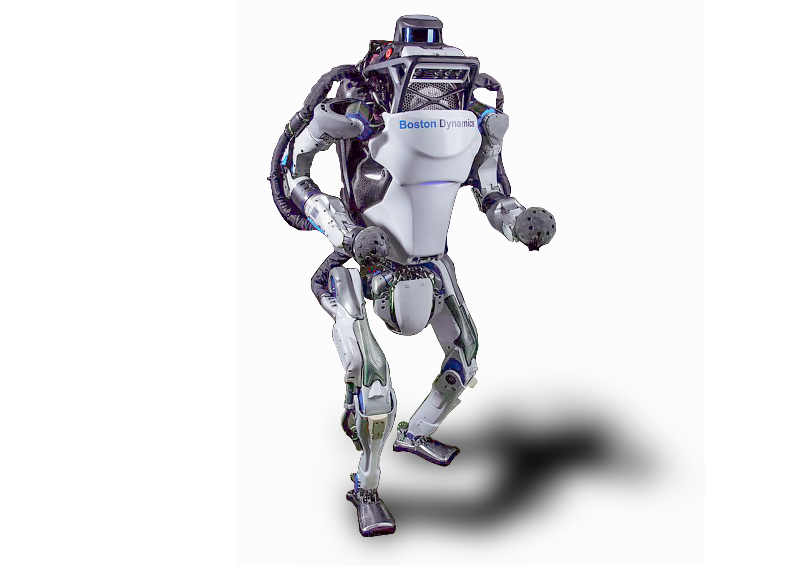

While PID controllers respond to changes without understanding the system they're controlling, MPC controllers use a model similar to the [Kalman Filter](https://www.01binary.us/articles/kalman-filter/).

They run real-time physics simulation modeled by [Lagrangian Mechanics](https://www.amazon.com/Lagrangian-Mechanics-Non-Physicist-Modern-Physics/dp/B0CN7HMTJL) to determine how get the robot to the desired pose with the least effort.

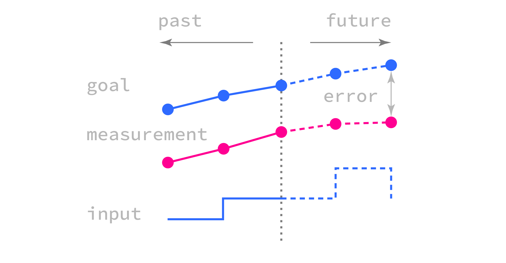

### non-linear control

Non-linear controllers combine or replace PID with a *neural network*. Two notable companies using Machine Learning techniques to run the motors in their robots are [Figure AI](https://robotsguide.com/robots/figure) and [Agility Robotics](https://robotsguide.com/robots/digit).

*Figure 01* by Figure Robotics in California:

`youtube:https://www.youtube.com/embed/Sq1QZB5baNw?si=RP6ZGzYYtxlCUoII`

*Digit* by Agility Robotics in Oregon:

`youtube:https://www.youtube.com/embed/97OTFEpsj8c?si=uVwdrZTvzNPXLzpI`

Non-linear controllers are able to learn the quirks of the physical systems they are controlling through [reinforcement learning](https://www.ibm.com/think/topics/reinforcement-learning) (RL) or [convex gradient descent](https://www.youtube.com/watch?v=AM6BY4btj-M).

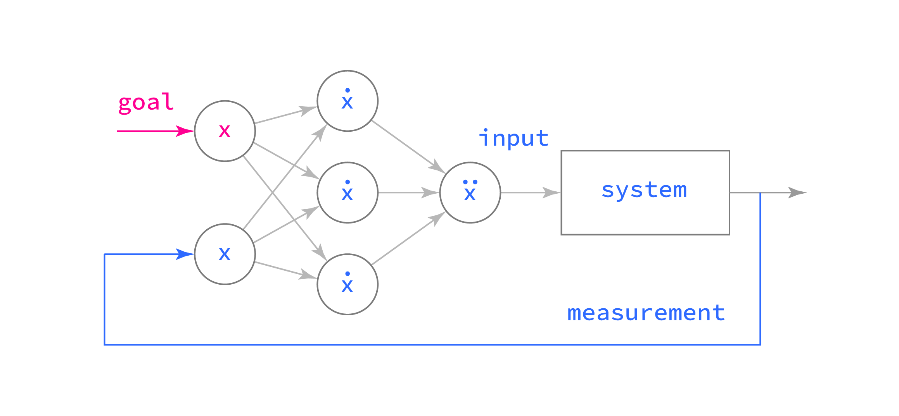

## terms

The PID controller began its life as an electrical circuit designed by a Russian naval engineer, [Nikolai Minorski](https://www.chemistryworld.com/opinion/minorskys-pid-algorithm-and-the-control-of-complex-systems/4019854.article), to automate ship steering. It was later adopted by the entrepreneur [Elmer Sperry](https://www.marinelink.com/news/pioneer-sperry-modern369254) to create an autopilot for the U.S. Navy.

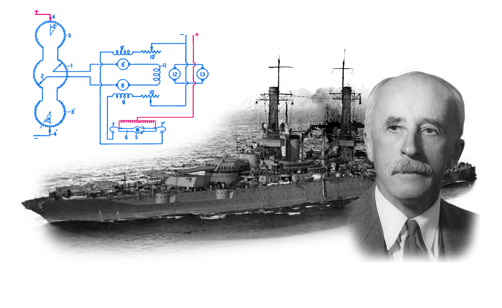

A PID controller is *composed* of three behaviors:

+ **Proportional**: attempts to close the distance to the goal
+ **Integral**: compensates for *under-correcting* in the *past*
+ **Derivative**: compensates for *over-correcting* in the *future*

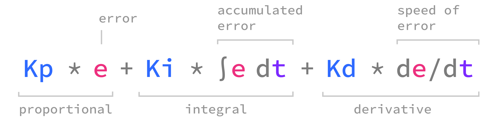

The `Kp`, `Ki`, and `Kd` weights applied to each term are called **gains**, and they are used to tune the overall behavior of the controller:

+ **Proportional** term: controls *responsiveness* and can be tuned for *aggressive* or *laid-back* behavior.
+ **Integral** term: controls *disturbance* rejection, and can be tuned to compensate for long-acting forces like wind, pressure, and gravity.
+ **Derivative** term: simulates *friction*, gradually "applying brakes" when in danger of over-correcting.

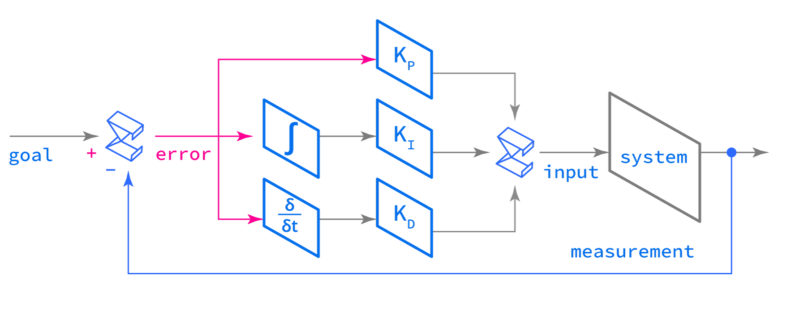

The three terms are simply summed together, which is represented by ∑ at the right end of the diagram. This sum is called a *command* or an *input*.

### what is an error?

The *error* in PID controller equations is the difference between the **desired** state and the **measured** state (the amount of *mismatch* to *correct*).

> For example, the desired temperature in a room versus the current temperature, or the desired servo position and its current position.

The ∑ at the left end of the diagram represents that the error is the goal (or *setpoint*) with the measurement subtracted from it.

### proportional term

The *proportional* term reacts to the *present* error. How vigorously it reacts is configured by the *proportional gain* `Kp`.

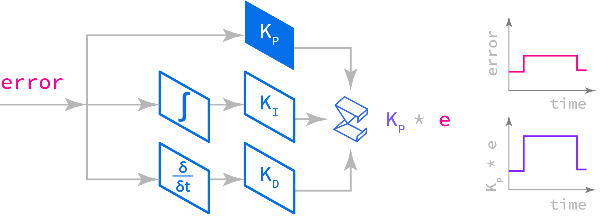

A large proportional gain will result in more immediate and aggressive action, while a smaller gain will make the behavior more laid-back.

Selecting a proportional gain is about balancing the speed of response against the possibility of overshoot, or *over-reacting*.

### integral term

The *integral* term rejects *constant disturbances*: forces that are constantly pushing against the system.

The integral is multiplied by `Ki`, which acts as a weight that determines how much the controller should care about disturbance rejection.

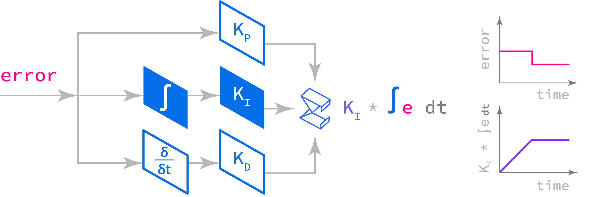

This term was originally used to cancel out the effects of wind or currents in the high seas, since the controller must work *consistently harder* to *defeat* these forces when making its corrections.

Applied to robot actuators, it could be used to correct for gravity, such as when limbs are held out, under their own weight and the weight of held objects.

### what is an integral?

The name of this term [comes from calculus](https://en.wikipedia.org/wiki/Integral): solving the same equation for multiple inputs in a row and summing the results.

For a PID controller, the *integral term* is the *sum* of all *parts* of *error* from *beginning* to *now* (and also the *area under the graph* of error over time):

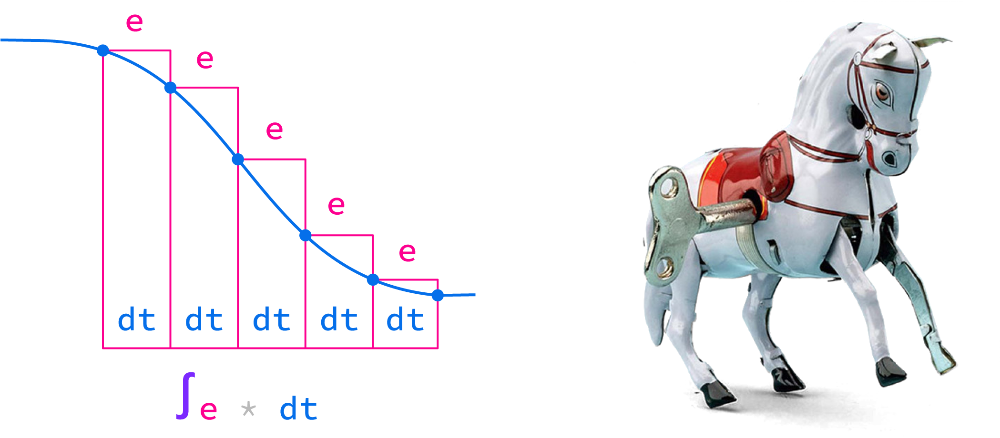

The integral term *accumulates* error, winding up like a coiled spring that steadily pushes against any constant forces fighting the controller.

When the controller is "successful" (error is low) for an extended period of time, the tension "winds down" and the integral term stops acting.

### derivative term

The *derivative* term applies *brakes* to control *overshoot*. The technical name used to describe *braking action* in mechanical engineering is "damping".

The derivative is multiplied by `Kd`, which acts as a weight that determines how much the behavior of a PID controller is affected by damping.

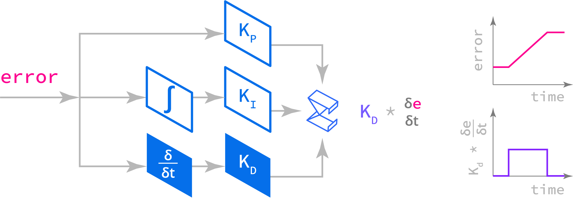

Dividing the *change in error* by the *change in time* (time step) will get you the "speed" with which the error is changing, hence the equation for this term.

Since the amount of *damping* applied is proportional to *speed*, it can be also be thought of as synthetic, or simulated, *friction* which helps us tune the behavior of a controller in an intuitive manner.

### what is a derivative?

This term, [originating from calculus](https://en.wikipedia.org/wiki/Derivative), represents the slope of a curve at a specific point. When the error is plotted over time, it corresponds to the slope of the line between the previous and current error values:

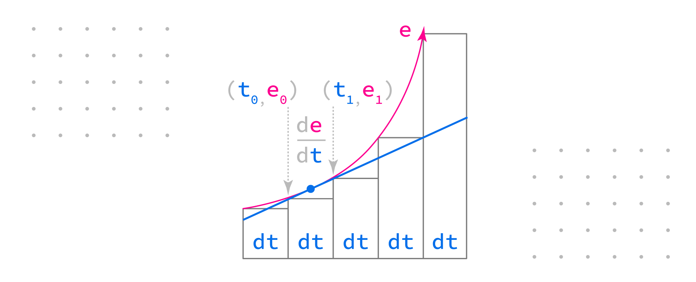

Having made these two measurements we can "look ahead" and predict what the next value of *error* will be, so we can begin "pumping the brakes" ahead of time. The smaller the time step, the better the quality of predictions.

You may have noticed that PID equations bear resemblance to [spring physics](https://gafferongames.com/post/spring_physics/) used to [simulate *ropes*, *cloth*, and *hair*](https://www.youtube.com/watch?v=sLcg_QD9dTk) in video games:

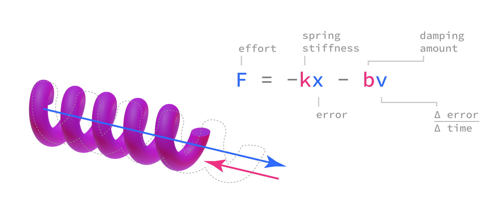

Indeed, a PID controller is nothing more than a synthetic spring that "stretches" when the measurement is too far from the desired value, with "stiffness" defined by `Kp` and "damping" by `Kd`.

The `Ki` weight simulates a spring that "gets stiffer" the longer it's stretched. This lets you tune the character of a controller by making it less "patient", so it pushes harder when its efforts are unsuccessful and "relaxes" otherwise.

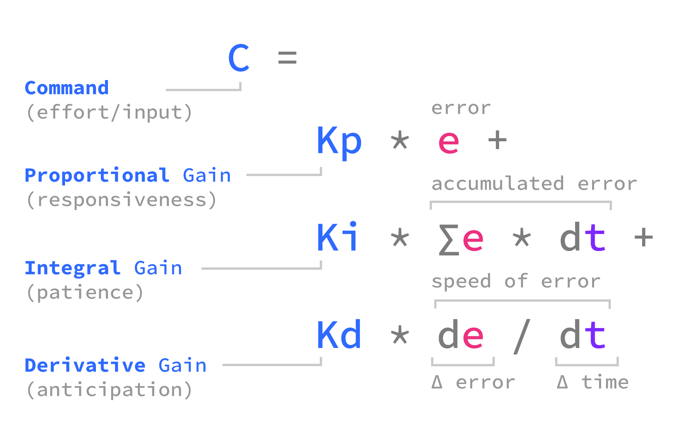

## implementation

Let's translate these equations into working C++ code:

```cpp
float pid(
  float Kp,             // Proportional weight (responsiveness)
  float Ki,             // Integral weight (disturbance rejection)
  float Kd,             // Derivative weight (damping)
  float error,          // Measured vs Desired position
  float lastError,      // Error from last iteration
  float& integralError, // Accumulated error over all iterations
  float timeStep        // How much time passed
)
{
  // Integral equation
  integralError += error * timeStep;

  // Derivative equation
  derivativeError = (error - lastError) / timeStep;

  // Calculate the effort needed to reach desired position
  return (
    // Proportional term
    Kp * error +

    // Integral term
    Ki * integralError +

    // Derivative term
    Kd * derivativeError
  );
}
```

PID controllers run on a *motor control board* at a specific frequency (number of times per second) measured in *hertz*. We can use an [Arduino](https://store-usa.arduino.cc/products/arduino-micro) for this:

```cpp
//
// Arduino Motor Control Board
//

// PID control parameters
const float KP = 1.0;
const float KI = 0.01;
const float KD = 0.01;
const float TOLERANCE = 0.01;

// PID control state
float goal = 0.0;
float lastError = 0.0;
float integralError = 0.0;
unsigned long lastTime = micros();

void setup()
{
  Serial.begin(9600);
}

void loop()
{
  // Get time
  unsigned long time = micros();

  // Receive goal position
  if (Serial.available())
  {
    goal = Serial.parseFloat();
  }

  // Read encoder
  float measurement = readEncoder();

  // Calculate error
  float error = measurement - goal;

  // Act until "close enough" to the goal
  if (abs(error) > TOLERANCE)
  {
    // Calculate time step (difference in microseconds to seconds)
    float timeStep = float(time - lastTime) / 1e-6f;

    // Calculate effort
    float command = pid(
      KP, KI, KD, error, lastError, integralError, timeStep);

    // Command motor velocity or torque
    writeMotor(command);
  }

  // Prepare for next loop
  lastTime = time;
  lastError = error;
}
```

The code needed to read the encoder position and communicate with the motor driver is application-specific.

## analysis

Controller behavior can be analyzed by plotting measurements from the point it starts acting on the error, until the error falls below threshold:

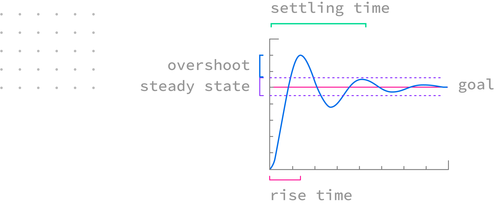

This *envelope* can help *qualify* the controller's *character*:

+ Does the controller *overshoot* the goal position and by how much?
+ Does the controller get stuck in *steady state*, oscillating around the goal?
+ How fast does it respond (how long is the *rise time*)?
+ How fast does it stop acting (how long is the total *settling time*)?

Let's add one component at a time to determine how they affect the envelope:

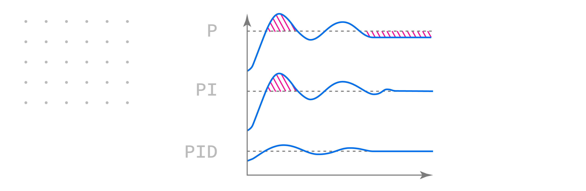

+ Only **Proportional** (`P`): may overshoot and oscillate around the goal without ever settling.
+ **Proportional + Integral** (`PI`): settles but may still overshoot.
+ **Proportional + Integral + Derivative** (`PID`): minimizes overshoot, settling as quickly as possible.

Tuning a PID controller is about balancing *responsiveness* against *overshoot* and *steady state* error. This balance is usually described as:

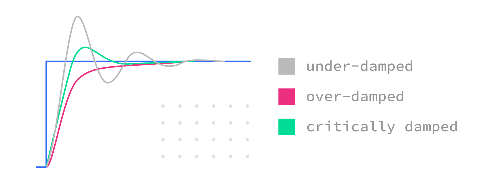

+ *Under*-damped: the controller is too aggressive, regularly missing and having to backtrack.
+ *Critically* damped: the controller is balanced, with minimum overshoot, rise time, and no steady state oscillation.
+ *Over*-damped: the controller is too laid-back and slow.

## troubleshooting

As seen before, the *integral* term acts like a coiled spring: the longer it takes for the controller to reach its goal, the more tightly it's *wound up*.

This makes the controller "live in the past" for a while, unable to adjust to its new reality and reacting *longer than necessary*:

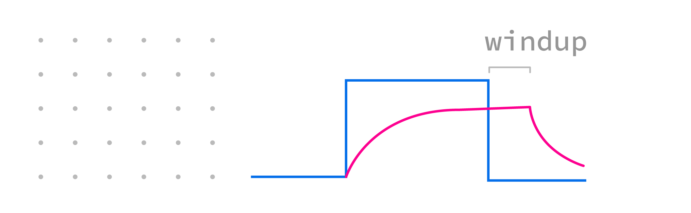

Fortunately there is a simple solution: clamping the integral gain by introducing two more parameters: `Imin` and `Imax`:

```c++
integralError = clamp(integralError, Imin, Imax);
```

Another common issue is *steady state error*: when the controller endlessly hovers around the goal, missing it over and over again by a small amount:

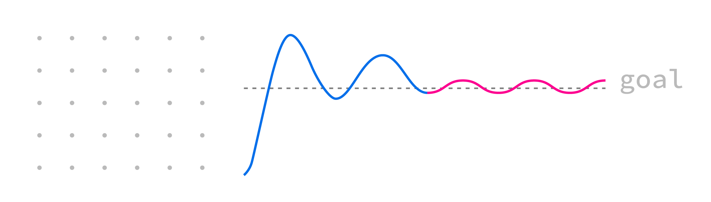

This behavior can be fixed by increasing *integral gain* or introducing a *tolerance* below which the error is ignored and the controller stops acting:

```
if (abs(error) > TOLERANCE)
{
  // run PID controller
}
else
{
  // don't run PID controller
}
```

A controller can also begin to oscillate when there's a *delay* between the controller acting and seeing the results of its actions:

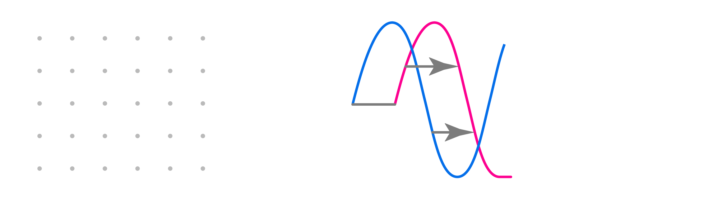

This will causes a controller to over-compensate because it thinks the effort its applying is not working. To fix issues caused by delay:

+ Lower the *proportional gain*
+ Lower disable the *integral gain*
+ Move the controller closer to *feedback*
+ Bake the *sample delay* into the model used to tune the controller

PID controllers can also suffer from *instability*, manifesting as violent oscillations that gradually increase in amplitude:

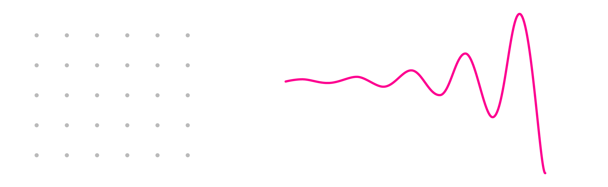

This could be caused by gains that are set too high, a time step that is too coarse, or a high sample delay.

## tuning

Plugging in PID gains manually is like tuning a guitar without a tuner: it's easy to get something that's *good enough*, but never *perfect*:

+ Start with `Kp 10`, `Ki 1`, `Kd 1` and watch the behavior.
+ If the controller reacts very aggressively, *scale* the terms *down* by `10`.
+ If the controller reacts too slowly, *scale* the terms *up* by `10`.
+ Add or subtract small amounts to each of the three terms.
+ Try setting various terms to `0` to turn them off.

In this section we'll explore using Matlab [System Identification Toolbox](https://www.mathworks.com/products/sysid.html) to estimate a mathematical model for the system being controlled, and [Control System Toolbox](https://www.mathworks.com/products/control.html) to tune a PID controller automatically.

> Why use Matlab? Precise PID tuning requires advanced techniques like identifying an [Autoregressive Exogenous](https://apmonitor.com/dde/index.php/Main/AutoRegressive) model, and calculating PID gains using [Frequency Response](https://www.youtube.com/watch?v=fq139cp1I6Y) analysis. Using wizards will get us immediate gratification and postpone treating these topics until later!

### system identification

System identification is a process used to estimate a mathematical model of the control system. This captures how the measurements from the encoder change when velocity or torque commands are sent to the motor.

To perform system identification, we need a dataset that consists of *time*, *commands*, and *measurement* samples:

+ The **time** column records the current time, usually in seconds as a decimal number, to allow for microsecond accuracy.
+ The **command** column records the command sent to the motor. This can be normalized to `-1...1` range (maximum effort in forward and reverse directions, with `0` signifying a complete stop).
+ The **measurement** column contains the encoder reading recorded at the same time. This can also be normalized to `0...1` range between the minimum and maximum achievable absolute position, or left as an integer when using a quadrature encoder.

I built a [PID Tuner Web App](https://github.com/01binary/pidtuner) utility to facilitate recording these samples and simplify experimentation by plugging in different PID gains:

`youtube:https://www.youtube.com/embed/azsj90bGa3w?si=cyy39zk6z0XiOCeT`

Prepare the **hardware** (a motor tuning fixture):

+ Connect an [Arduino board](https://store-usa.arduino.cc/products/arduino-mega-2560-rev3) to [motor driver](https://www.amazon.com/L6201P-Module-H-Bridge-Control-12V-48V/dp/B09N7L9TLB), [encoder](https://www.amazon.com/Magnetic-Encoder-Induction-Measurement-Precision/dp/B097QNG1CN/), and your computer.
+ Connect a [power supply](https://www.amazon.com/Adjustment-Quick-Charge-30V-10A-BLACK/dp/B09BFCF13Y) and a [motor](https://www.robotshop.com/search?q=DC%20motor) to the motor driver.

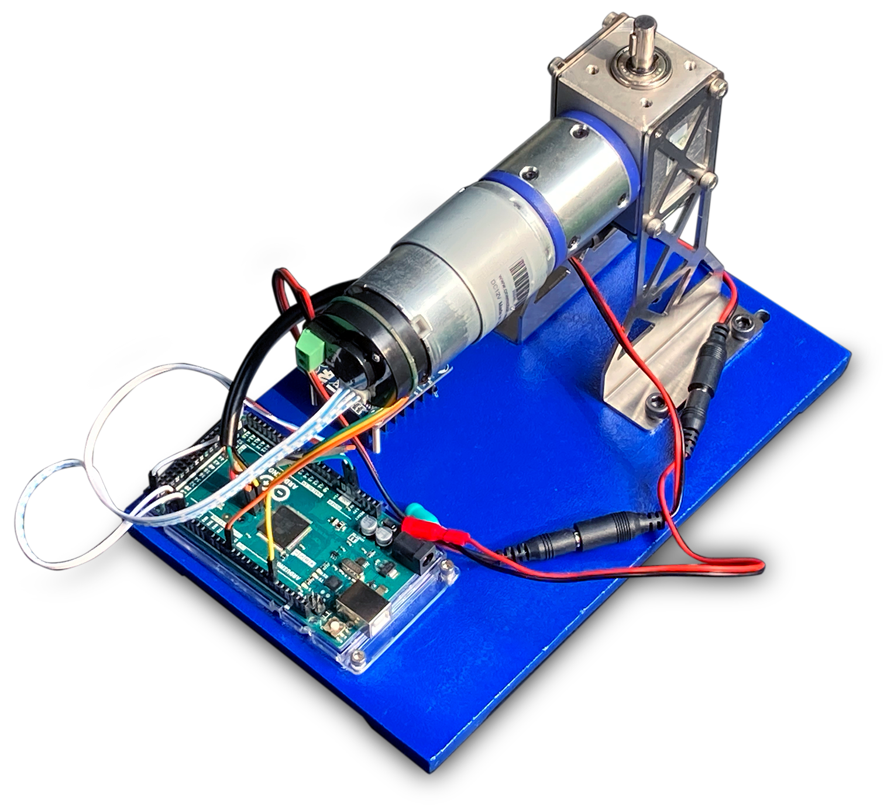

Record a **step response**:

+ [Clone the PID Tuner Web App repository](https://github.com/01binary/pidtuner) and follow the [setup guide](https://github.com/01binary/pidtuner/blob/main/README.md).
+ The web app uses [Robot Operating System](https://wiki.ros.org/noetic/Installation/Ubuntu) (ROS) to talk to an Arduino. ROS only works on Linux, but you can use [Multipass](https://ubuntu.com/blog/ros-development-on-linux-windows-and-macos) to spin up an `Ubuntu 20.04` VM on Mac and Windows.
+ The [Arduino code](https://github.com/01binary/pidtuner/blob/main/serial/serial.ino) in this project can be customized to integrate different encoders and motor drivers if necessary.
+ Draw a pattern in the *Step* pane, making the motor spin forward and backward with different velocities:

  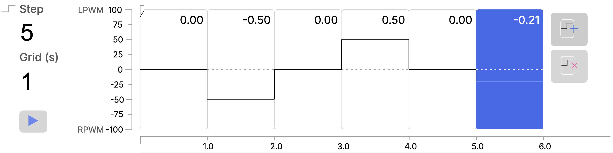
+ Click *play* to play back the pattern, sending these commands to the motor and recording encoder measurements.
+ Click the *export* button to download the CSV dataset.

Install **auto-tuning tools**:

+ [Matlab](https://www.mathworks.com/help/install/ug/install-products-with-internet-connection.html)
+ [System Identification Toolbox](https://www.mathworks.com/products/sysid.html)
+ [Control System Toolbox](https://www.mathworks.com/products/control.html)

**Import** the dataset:

+ Click **Import Data** on the *Home* tab in Matlab:

  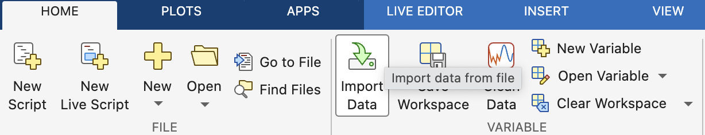

+ Select the columns, and choose to import as **column vectors**:

  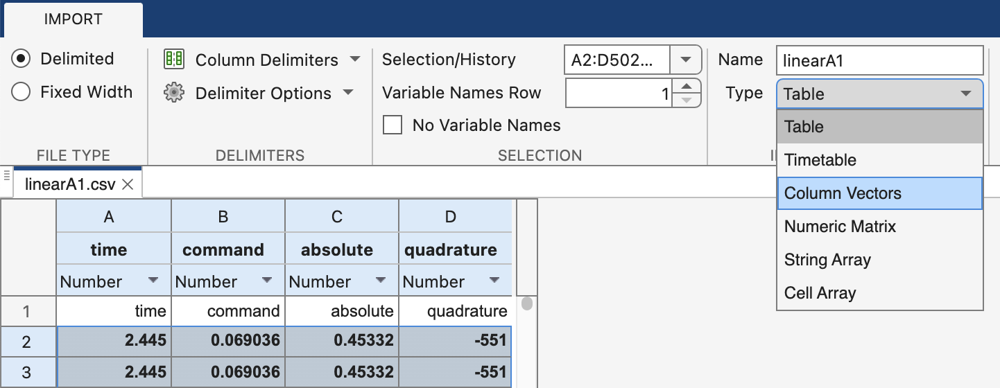

**Smooth** the imported data:

+ On the **Home** tab in Matlab, click **New**, then select **Live Script**:

  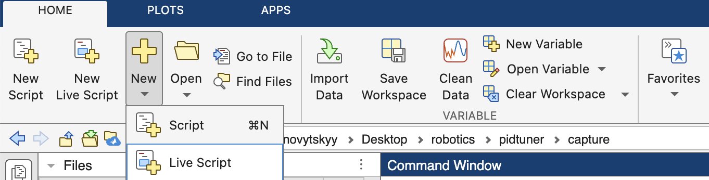
+ When the new live script opens, and click **Task** on the **Home** tab, then select **Smooth Data**:

  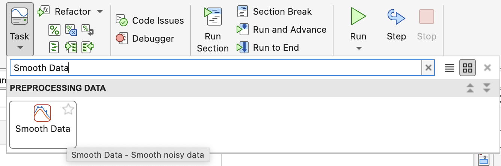
+ In the Smooth Data widget that gets placed, pick your encoder column as the *Input data*, and *Gaussian* as the *Smoothing method*:

  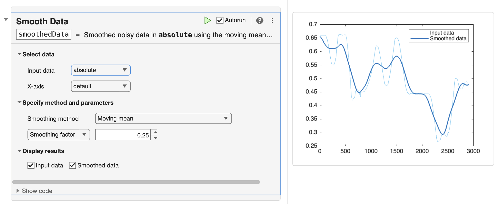
+ This will automatically create a column vector called `smoothedData` as a global variable, and even display a before/after chart. The live script can be closed without saving changes.

Perform **system identification**:

+ Click **System Identification** on **Apps** toolbar in Matlab:

  
+ Click **Import data** dropdown and select *Time domain data...*:

  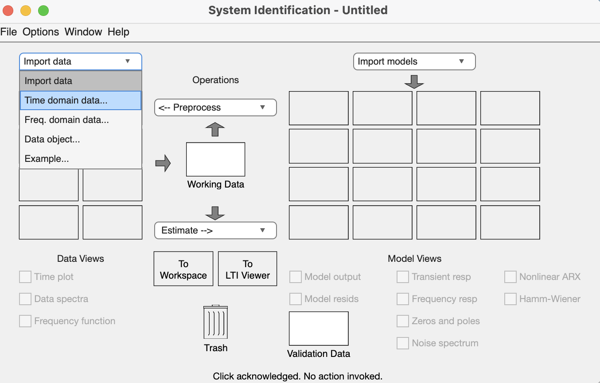
+ In the *Import Data* dialog that opens, type in the names of the workspace variables corresponding to the imported column vectors:
  + **Input** is the name of the column with *motor commands*.
  + **Output** is the name of the column with *encoder readings*. Use `smoothedData` here.
  + **Sample time** can be calculated by looking at the average difference between time samples in the imported dataset.
+ Click **Time plot** to preview imported (correlated) data:

  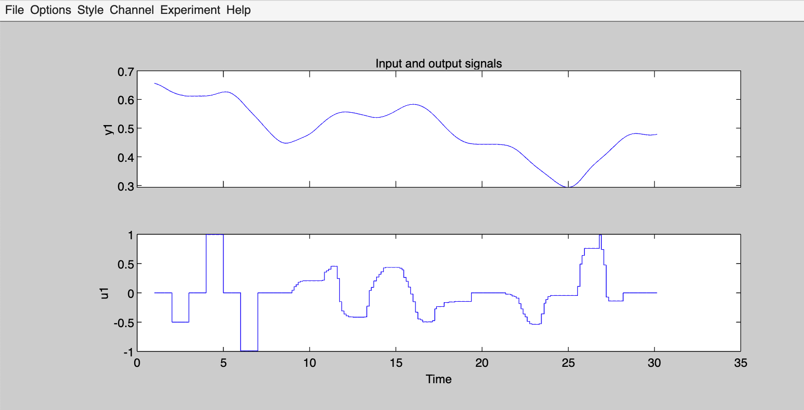
+ Click **Estimate** dropdown and select **Transfer function models...**.
+ On the **Estimate Transfer Functions** dialog, select **Discrete-time**.
+ Delay options can be configured under **Delay** accordion.
+ Click **Estimate**, and the resulting model will be placed in one of the empty slots in **System Identification** dialog.
+ With the identified model selected (selection is communicated through increased line thickness in the preview slot), click **Model output** to see a preview of how the model fits over the original measurements:

  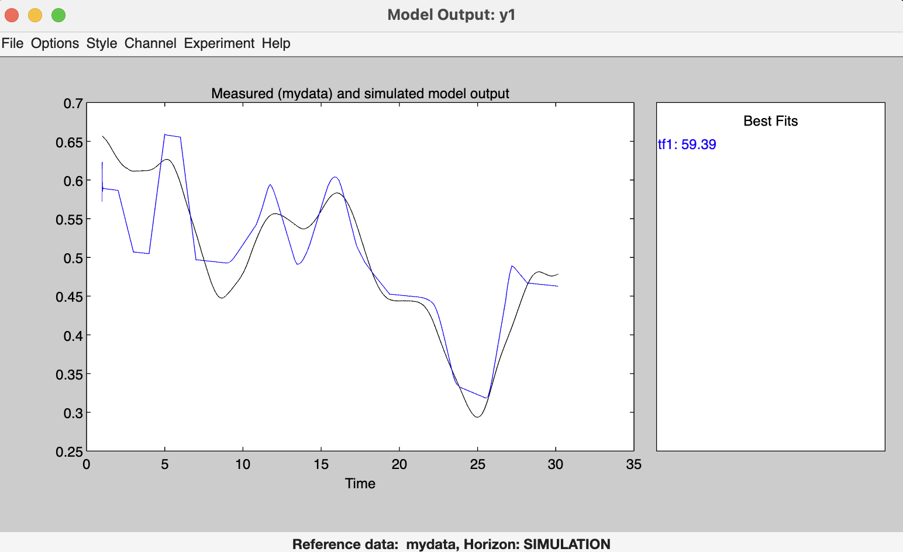

+ This process can be repeated, filling in empty slots with models identified by using different settings. Model Output will then preview all of the models against the original data.
+ Drag the best model to the **To Workspace** button above the Trash icon to save it into a global variable for the next step.

### auto-tuning

We can tune the PID controller by using the identified model:

+ Click **PID Tuner** on *Apps* toolbar in Matlab:

  
+ Import the plant identified and saved in the previous section:

  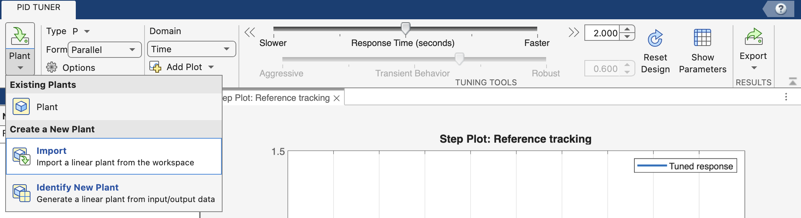
+ Change the controller **Type** in the dropdown, and use the sliders to set the requirements for the controller performance:

  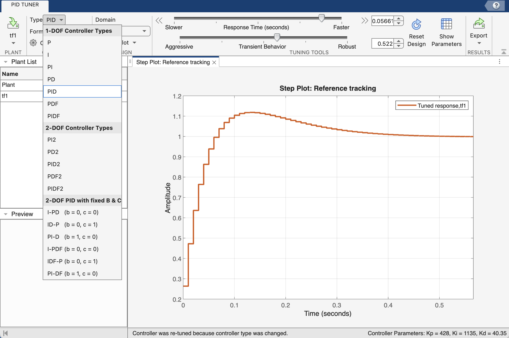
+ Click **Show Parameters** to see the suggested PID gains, which are also displayed in the status bar at the bottom:

  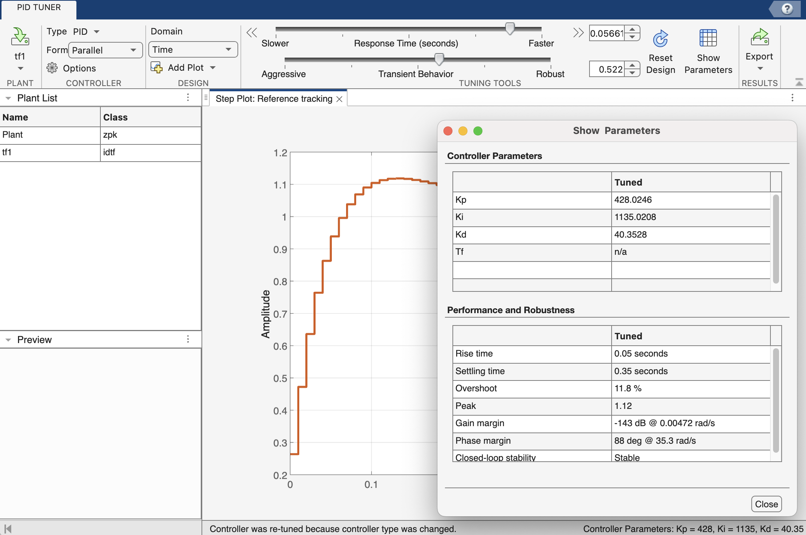
+ Plug in the suggested PID gains, move the position slider in PID Tuner web app, and watch how the motor responds!