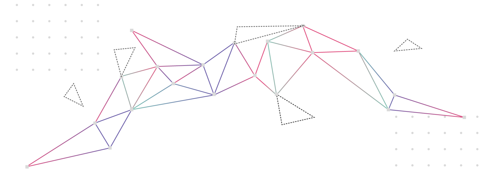

## introduction

I finished a series of books about the **lifecycle** of the first **industrial revolution** by authors who thoroughly analyzed the underlying factors and have new insights to share about the **pattern that emerges**.

Let's begin by setting up a basic framework for understanding change:

> The history of change in **systems** is best visualized as a sine wave, with periodic “ups” and “downs” over time.

Every period of **success** and **prosperity** is followed by **instability** when the environment conditions change. The system struggles to adjust to the new conditions, and finally stabilizes. Once **stabilization** is achieved, **optimization** takes over for the remainder of the cycle until another large change occurs.

## past challenges

In [The Decline of the West](https://www.amazon.com/Decline-West-Form-Actuality/dp/1912975602), Oswald Spengler covers the *beginning* and *middle* of the industrial revolution.

At first success was defined as the ability to **scale** production by leveraging **force amplification**. Businesses that could produce the most products or service the most customers won.

When business owners saw an opportunity to produce cheaper abroad, they taught their manufacturing techniques to then-developing countries. This became their undoing according to Spengler.

> The Western industry largely responsible for propping up the economies of the participating countries has collapsed and was overrun by competition from the same countries where their manufacturing was relocated.

## the old model

[The Toyota Way](https://www.amazon.com/Toyota-Way-Second-Management-Manufacturer-ebook/dp/B088P46Q9P) by Jeffrey Liker offers lessons about the *middle* of the industrial revolution. At that time, success no longer meant the ability to scale production, since all the players have achieved the same scale. The new definition of success was **efficiency**.

First, the profession of the [Industrial Engineer](https://www.bls.gov/ooh/architecture-and-engineering/industrial-engineers.htm) was born. While industrial engineers were busy re-arranging the layout of production plants and inventing the conveyor belt to reduce the *energy wasted on moving parts through the production process*, the production line Managers and Team Leads were busy *aligning every team member to shared goals* and organizing all activities to ensure that every ounce of effort was spent on **high-leverage improvements** to overall **value delivery**.

[Agile](https://www.easyagile.com/blog/lean-agile) project management now in wide-spread use in the tech industry has its roots in the **Lean Manufacturing Process** pioneered by *Toyota* and evangelized by the *Ford Motor Company* in its joint venture with Toyota.

## the new model

The subsequent collapse of the industry due to global competition and the challenges of recovery are presented by *Adam Davidso*n in [The Passion Economy](https://www.amazon.com/Passion-Economy-Thriving-Twenty-First-Century-ebook/dp/B07QDK4MM7) and *Andy Grove* in [Only the Paranoid Survive](https://www.amazon.com/Only-Paranoid-Survive-Exploit-Challenge-ebook/dp/B0036S4B2G).

> On the **down-stroke** of the industrial revolution, many businesses were searching for a way to **survive** in the **globalized market**.

They discovered that the **new definition of success** meant designing **unique products** that closely addressed customer needs, rather than producing **generic products** at *grand scales* and with *high efficiency*.

Generating **unique designs** requires **creativity**, and **iterative development** requires quick and **agile** execution.

The need for *creative solutions* and *fast decision-making* has made traditional command-and-control structures obsolete.

> The *volume* of information that would have to travel up to the decision-makers in order to make the *right decision*, coupled with the *speed* required to ensure the decision would be *relevant* by the time it travels back down, has rendered **centralized decision-making impossible**.

## the new challenge

The principal challenge faced by the tech industry today is transitioning from **centralized** to **distributed** decision-making.

The focus is on evolving the **top layers** of the organizational structure to drive *management inefficiencies* down to zero, the way *production inefficiencies* have been optimized half a century before.

* Engineers will often understand how to improve the **product** or **processes** on the team but must spend valuable focus time *pushing this information up to the decision makers*, who may have at one point understood how the “work in the trenches” was done but have gotten too detached from reality after being promoted.
* Communicating **technical details** in an **accessible manner** requires including all of the *prerequisites* needed to establish a shared *context* and *vocabulary*, in addition to convincing decision-makers that *mental models* they have internalized over the years *no longer match reality*.
* Once the outer shells of *technical accessibility*, *context*, and *outdated mental models* have been penetrated, there remains a challenge of fighting through the **forces of ego**. For example in [Only the Paranoid Survive](https://www.amazon.com/Only-Paranoid-Survive-Exploit-Challenge-ebook/dp/B0036S4B2G), the ex-CEO of Intel talks about the challenge of sensing change in the operating environment through multiple layers of management.

Communicating at the higher levels of the organization is a complex **diplomatic exercise**:

* Information must be force-fed by utilizing unobtrusive sales techniques, such as convincing a recipient that a certain idea is their own, masquerading it as something they already agree with, or appealing to someone they trust.
* Critical insights are frequently **re-shaped beyond the point of being useful** and the resulting decisions are **disharmonious with reality**.

## predictions

In closing, I will extrapolate some predictions based on the above model.

First, **management skills** will soon be the primary requirement for most jobs: **technical knowledge** alone will no longer be useful.

Candidates will need to cultivate **sophisticated understanding** of their **unique value proposition** and the lens through which they view the world.

Skills that were previously in the realm of high-level executive roles and often boasted as the "millionaire mindset" will become commonplace.

Once each employee bears the responsibility of **managing their own time** and **owning their efficiency**, mental *health* and *fitness* will become an important metric for performance evaluation.

Candidates that haven’t learned how to self-regulate and stay calm through challenging or emotionally charged situations will have to build their mental fitness and emotional intelligence in order to stay relevant.