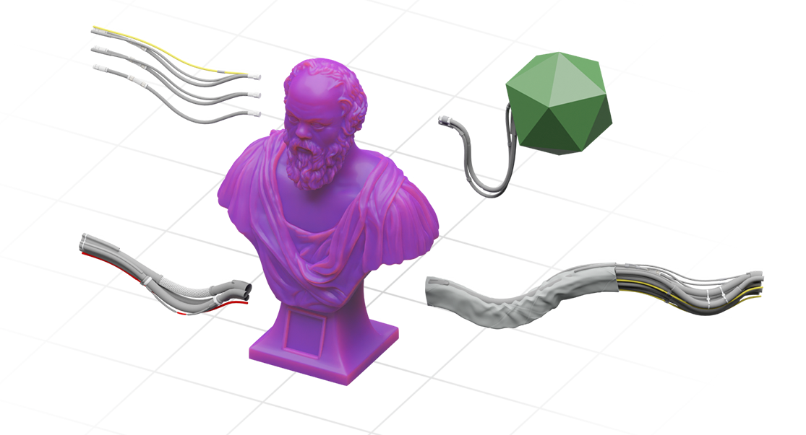
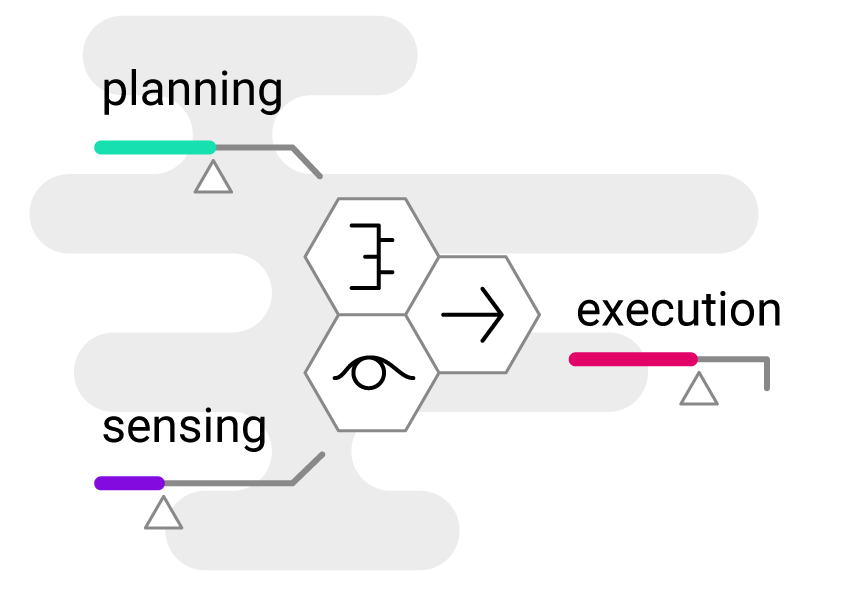
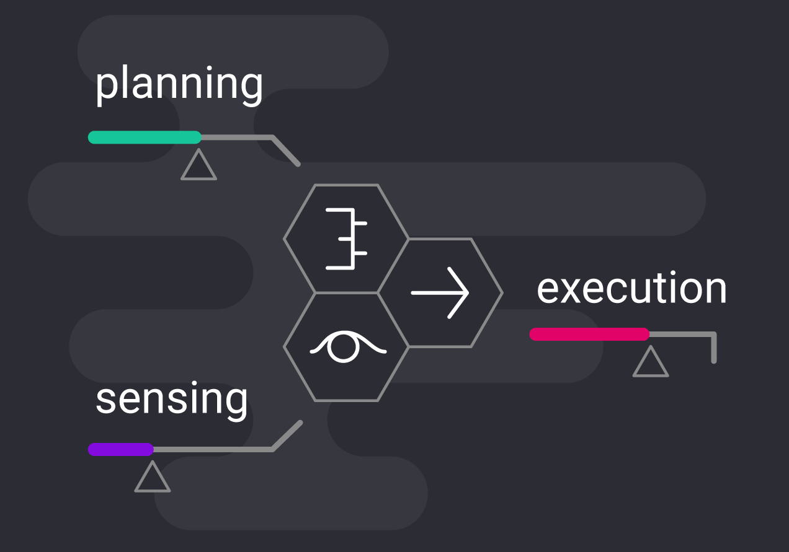

## introduction

I heard the sensei’s voice from a guided meditation series say:

- The universal consciousness is within all of us.
- By engaging in meditation, you feel more connected to everything around you, because your act of thinking is the Universe being aware of itself.
- Life will trouble you far less when you realize that you are bigger than the parts of your mind where you are accustomed to spending your time: planning, working to execute your plans, or experiencing sensations.
- The real you is behind all of that: the root of your consciousness.

These words may sound enigmatic at first, but each statement incrementally builds a model that explains what consciousness **is** and where it **comes from**.

## the process of inquiry

The sensei, Jeff Warren, mentions that he spent his life straining to understand the true reasons for things. This obsession was causing him so much suffering that he had to work with his own sensei to learn to let it go. This character definitely comes through as he explains complex concepts in simple terms.

In this article, I would like to invite you on a journey of inquiry by putting Jeff’s model of the aware Universe through a *philosophical refinement process*.

## defining the terms

Each **mind** is made of a material or fabric that we call **consciousness**.

- The simplest analogy is clay. If you have a box of clay, you can grab a handful and shape it. The act of *shaping* clay creates a *unique object*.
- Since everyone is a part of the Universe, it follows that each mind is *shaped* from the same *pool* of Universal consciousness.
- Once a mind acquires its *unique shape*, it becomes a *single entity* of consciousness, *aware* of itself as being separate from the rest.
- The mind maintains its shape until the force of *entropy* loosens its elements and they drift apart, dissolving into the surrounding medium.

The relationship of a mind to the Universal consciousness appears to mirror the relationship between **matter** and **energy**:

 - Recall that `E=mc^2` means that energy is *mass* proportionally accelerated to the speed of *light*.
 - Going in reverse, matter is decelerated energy. This refers to frequency at which its elements vibrate.
 - Vibration is the stable cycling of energy between two opposing poles.
 - So, matter is frozen energy. It vibrates at such a low frequency that it appears to stay put.
 - If we visualized vibration frequency `f` on a vertical axis, minds would look like volumes (`V`) of Universal consciousness that have been "pulled down" by the force for their formation (`F`).

The consciousness is made up of **individual units** that give it **information processing capability**.

- Any material has to be made of one or more types of *elements*.
- A piece of material is a *volume* made up of these elements.
- Let’s use a computing analogy. A running program is "made of" both CPU and memory. Instructions reside in memory, the data on which they operate reside in memory, and the program executes by moving or *propagating* this memory from one place to another.
- A volume of computing power is made from a "computing fabric" and a running application occupies a "plot of land" on the surface of this fabric. The smallest element is a single computer, so a large piece of the fabric is made from many connected computers.
- With cloud computing, it’s possible to own an even larger plot of land on this fabric, occupied by many running applications. This puts the cloud architect into the role of a "farmer" who is letting applications "graze on the land" to transform data into useful insights.

## defining the purpose

This gets us closer to understanding the nature of the Universe:

- The purpose of the Universe is to take raw information and understand it.
- There is no place *from which* to take raw information other than from the *Universe itself*.
- Therefore the purpose of the Universe is to *understand itself*.
- This may be compared to a game where you mine resources to build things. The objective of the game is to use up all available resources to build as many things as possible.
- The player derives purpose and satisfaction from taking raw materials and fashioning (*shaping*) them it into unique objects.
- The "end game" condition is that the entire available volume has been "structured" and there is no more "shapeless" material left to shape.

If you were a perfect machine for eating tacos and you ended up alone with no tacos, would you engage in a large-scale effort to make tacos from raw ingredients available to you as efficiently as possible?

## theorizing the means

Now back to this business of the Universe understanding or "mining" itself.

- The act of taking raw (shapeless) information and understanding (shaping, or structuring) it is called *thinking*.
- Therefore the Universe carries on its objective of *understanding* itself through *thinking*.
- In order to think, the Universe have to *store* and *propagate* data.
- To enable storing and propagating data, the body of the universe is made up of *computing nodes* that are all connected to each other.
- A volume of many connected computing nodes is organized into a *mesh* that may be called a "fabric".
- This fabric can be *partitioned* into pieces to establish related *networks* of nodes that can talk to each other and to the larger network.
- Each partition can be organized for processing a certain kind of information to complete the objective of "structuring unstructured space" in the most efficient manner.

So, the Universe partitions itself into minds to undertake the task of exploring itself in the most efficient way possible, to complete its self-actualization.

- You are "borrowing" your processing capacity or "consciousness" from the Universe for the purpose of helping it understand itself. Like a farmer, you are given a plot of land to develop in exchange for sustenance, and the results of your labor will be collected and evaluated.
- Since you are being "farmed" by the Universe, you are a part of an efficient data transformation pipeline that can dynamically re-configure itself by re-allocating worker nodes to suit the task at hand, and optimize the internal logic of the nodes themselves by a process of learning.
- Any kind of *optimization* requires the use of a *grading algorithm* to determine which configurations are more efficient at certain tasks.

## the conclusion

We are getting pretty close to explaining the nature of the human consciousness and its reason for existing.

- A human mind (or *soul*, using Plato's language) is a unique shape formed from the Universal consciousness, with a nested internal structure arranged to perform specific tasks that help the Universe break down its "formless" parts and form them into structures by "understanding".
- The Universe divides itself into networks optimized for different kinds of understanding, depending on the material that needs to be understood.
- When the Universe divides itself, the resulting partitions repeat its structure at a microscopic level: minds have the power to store and propagate information which enables them to learn and self-organize to be more efficient at performing their assigned tasks.

## appendix

If you are curious about the mind’s internal structure, Socrates and Freud have an answer for that. The mind consists of *three elements*: one is responsible for *planning*, one for *sensing*, and one for *execution*.

The three elements are *separated* so that each can be *optimized* for its own task, making the system more efficient than it would be otherwise.

See my next article in this series: [A Model of the Human Mind](/articles/model-of-human-mind).

Since the structure of a mind reflects that of the Universe, your capacity to *plan*, to *do* and to *feel* is borrowed from the total planning, execution, and sensing capacity of the Universe.

The universe has to manage minds by allocating them for tasks and assessing their performance to drive a continuous process of optimization. Optimization at scale requires endless experimentation by making incremental improvements to a massive repository of designs.