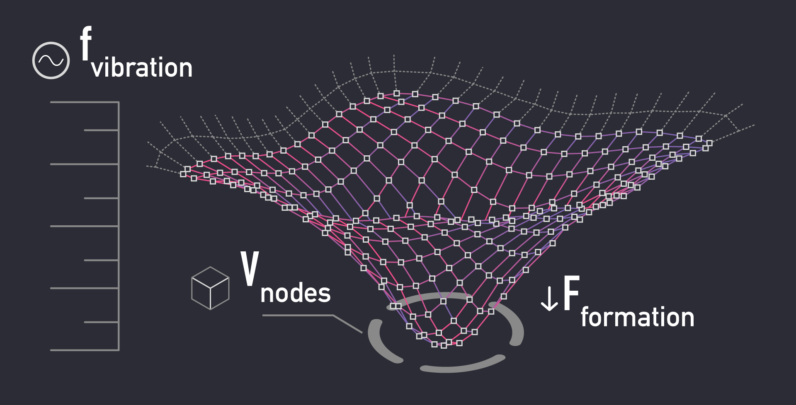

## introduction

I heard the sensei’s voice from a guided meditation series say:

- The universal consciousness is within all of us.
- By engaging in meditation, you feel more connected to everything around you, because your act of thinking is the Universe being aware of itself.
- Life will trouble you far less when you realize that you are bigger than the parts of your mind where you are accustomed to spending your time: planning, working to execute your plans, or experiencing sensations.
- The real you is behind all of that: the root of your consciousness.

These words may sound enigmatic at first, but each statement incrementally builds a model that explains what human consciousness *is* and where it *comes from*. This insight, combined with what I discovered by reading Plato and Freud, has sparked an inspiration to write this article.

## the process of inquiry

The sensei, Jeff Warren, mentions that he spent much of his life straining to understand the true reasons for things. This obsession was causing him so much suffering that he had to work with his own sensei to learn to let it go. This character definitely comes through as he distills complex concepts into clear and simple structures.

In this article, I would like to invite you on a journey of inquiry by putting Jeff’s model of the aware Universe through a *philosophical refinement process* that I learned from Plato.

By progressively breaking down each term to reveal more details by using *parallel* and *deductive* reasoning, we can uncover a truth that we already knew, but were too consumed with daily life to think about.

## defining the terms

Let’s start by defining the terms *mind* and *consciousness*.

> Each **mind** is made of a material or fabric that we call **consciousness**.

- The simplest analogy is clay. If you have a box of clay, you can grab a handful and shape it. The act of *shaping* clay creates a *unique object*.
- Since everyone is a part of the Universe, it follows that each mind is *shaped* from the same *pool* of the *self-aware fabric* of Universal consciousness.
- Once a mind acquires its *unique shape*, it becomes a *single entity* of consciousness, *aware* of itself as being separate from the rest.

Once a mind has been shaped, it stays together until the force of *entropy* loosens its elements enough that they drift apart and dissolve into the surrounding medium.

In physics simulations of rigid bodies where constraints between the elements are not enforced at each time-step, you can see the particles that make up the objects vibrate as mathematical rounding errors accumulate, and eventually start sliding apart into shapeless noise.

The relationship of a mind to the Universal consciousness appears to mirror the relationship between matter and energy:
 - Recall that `E=mc^2` means that energy is mass proportionally accelerated to the speed of light.
 - Going in reverse, matter is decelerated energy. This refers to frequency at which its elements vibrate.
 - Vibration may be defined simply as the cycling of internal state between two poles.
 - Basically, this says that matter is frozen energy (it vibrates at such a low frequency that it appears to stay put).
 - Based on this, we can theorize about the nature of the force (`F`) that shaped the mind. If the mind stays put as a unique entity, then its elements vibrate at a lower frequency (`f`) than the surrounding pool of consciousness, making it appear to keep its shape (`V`) for some time.
 - If we visualized vibration frequency on a vertical axis, minds would look like pockets of Universal consciousness that have been "pulled down".

> "The consciousness is made of **individual units** that give it **information processing capability**".

- Any material has to be made of one or more types of *elements*.
- A piece of material is a *volume* made up of these elements.
- The requirement for calling something a *volume* is that the elements are connected to each other in a stable structure.

I think we adequately covered what we mean by consciousness consisting of *units* and having a *volume*, but what about the reason it exists in the first place - *processing information*?

- Let’s use a computing analogy. A running program is "made of" both CPU and memory. Instructions reside in memory, the data on which they operate reside in memory, and the program executes by moving or *propagating* this memory from one place to another.
- For me, this actually conjures up an organic image of water propagating through an amoeba as it extracts nutrients and expels the remainder.
- A volume of computing power is made from a "computing fabric" and a running application occupies a "plot of land" on the surface of this fabric. The smallest element is a single computer, so a large piece of the fabric is made from many connected computers.
- With cloud computing, it’s possible to own an even larger plot of land on this fabric, occupied by many running applications. This puts the cloud architect into the role of a "farmer" who is letting applications "graze on the land" to transform data into useful insights.
- You might even say that the act of going from raw information to structured information is the act of "thinking".

## defining the purpose

This chain of reasoning based on analogies gets us closer to understanding both the human consciousness and the nature of the Universe:

- The purpose of the Universe is to take raw information and understand it.
- There is no place *from which* to take raw information other than from the *Universe itself*.
- Therefore the purpose of the Universe is to *understand itself*.
- This may be compared to a game where you mine resources to build things. The objective of the game is to use up all available resources to build as many things as possible.
- The player derives purpose and satisfaction from taking raw materials and fashioning (*shaping*) them it into unique objects.
- The "end game" condition is that the entire available volume has been "structured" and there is no more "shapeless" material left to shape.

Having a *purpose* seems like a fundamental property of any *mind*. Anything that is conscious seems to spend all of its time chasing goals and deriving intense satisfaction from reaching them. In this way, every mind resembles the pool of material it came from.

We don’t know which came first: the Universe or its purpose. However, we do know that minds are shaped by what they do and vice versa, what minds end up doing is shaped by what they do best.

Some sources tell us that the Universe has always existed as a constant entity, in which case its purpose is self-defined according to an ongoing process of self-discovery. I think that’s called self-actualization.

> Look at it this way: if you were a perfect machine for eating tacos, and you ended up alone with no tacos, do you think you might engage in a large-scale, highly coordinated effort to make tacos from raw ingredients available to you as efficiently as possible? I think we both know the answer.

How would you discover that you were perfect for tacos in the first place? Likely by a continuous process of self-discovery where you did a million other things before accidentally making a taco and realizing that nothing you experienced before has provided this level of satisfaction.

## theorizing the means

Now back to this business of the Universe understanding or "mining" itself.

- The act of taking raw (shapeless) information and understanding (shaping, or structuring) it is called *thinking*.
- Therefore the Universe carries on its objective of *understanding* itself through *thinking*.
- In order to think, the Universe have to *store* and *propagate* data.
- To enable storing and propagating data, the body of the universe is made up of *computing nodes* that are all connected to each other.
- A volume of many connected computing nodes is organized into a *mesh* that may be called a "fabric".
- This fabric can be *partitioned* into pieces to establish related *networks* of nodes that can talk to each other and to the larger network.
- Each partition, or a network of nodes, can be organized for processing a certain kind of information to complete the objective of "structuring unstructured space" in the most efficient manner.

You could compare this to any kind of building activity. You need certain workers to dig trenches and install pipes. Other types of workers are needed to rig electrical power.

If you hire workers that can do everything, you are paying extra for experience that they have but don’t get to use on your project, therefore you are not being efficient with your budget allocation.

The Universe hates this! You can reason from observable phenomena that the Universe is completely obsessed with being efficient.

- Organizing a partition for a certain task involves *arranging* the computational fabric into *structures* to optimize handling of specific tasks.
- Once a partition exists and has a shape it becomes a unique entity that we call a "mind".
- Partitions can be partitioned further (have sub-partitions) and the sub-partitions themselves can be shaped, creating complex nested structures. This lets you organize a certain kind of "mind" to optimize it for doing a specific kind of work.
- So, the Universe partitions itself into separate minds to undertake the task of exploring itself in the most efficient way possible, in order to achieve total self-actualization.

## making connections

At this point you might have noticed a few things.

- First, shaping the computational fabric to create nested structures specialized for various jobs involved in breaking down raw data and understanding it enables the Universe to *optimize* groups of nodes for certain tasks. This makes the operation more *efficient* in ways it wouldn’t be possible *without partitioning*.
- Second, you can see that you are "borrowing" your processing capacity or "consciousness" from the Universe for the purpose of helping it understand itself. Like a farmer, you are given a plot of land to develop in exchange for sustenance, and the results of your labor will be collected, evaluated, and if they are found to be good they will satisfy your employer.
- Since you are being "farmed" by the Universe for the purpose of it "farming" itself, it follows that you are a part of an efficient data transformation pipeline that can dynamically re-configure itself by re-allocating worker nodes to suit the task at hand, and optimize the internal logic of the nodes themselves by a process of learning.
- Any kind of *optimization* requires the use of a *grading algorithm* to determine which configurations are more efficient at certain tasks.
- Efficient nodes could be used as templates for similar designs or moved around to where they are needed, and inefficient nodes could be dissolved back into the pool of fabric to be re-used for more experiments to create efficient nodes.

## the conclusion

We are getting pretty close to defining what a human consciousness really is, and even explaining the nature of the human soul and its reason for existing. After all the leg-work we’ve done up to this point (not to mention standing on the shoulders of giants like Socrates, Plato and Jeff Warren), this is almost too easy:

- A human mind (or *soul*, using Plato's language) is a unique shape formed from the Universal consciousness, with a nested internal structure arranged to perform specific tasks that help the Universe break down its "formless" parts and form them into structures by "understanding".
- The process of understanding is accomplished by propagating information through the nodes that the Universe is composed of. To do this most efficiently, the Universe divides itself into networks that are optimized for different kinds of understanding, depending on the material that needs to be understood.
- Presumably, only the "structured" or "understood" space within the Universe can be partitioned. As the self-discovery effort proceeds, the Universe has more and more space available to create nodes that process even more information, so its activity will speed up in an exponential fashion over time.
- When the Universe divides itself, the resulting partitions repeat its structure at a microscopic level: minds have the power to store and propagate information which enables them to learn and self-organize to be more efficient at performing their assigned tasks.

## final thoughts

If you are curious about the mind’s internal structure, Socrates and Freud have an answer for that. The mind consists of *three elements*: one is responsible for *planning*, one for *sensing*, and one for *execution*.

The three elements are *separated* so that each can be *optimized* for its own task, making the system more efficient than it would be otherwise. See my next article in this series: The Model of the Human Mind for more on that.

Since the structure of a mind reflects that of the Universe, it follows that each computing node that makes up the Universe also consists of these three elements, much like atoms consist of sub-atomic particles. That means your capacity to plan, to do and to feel is borrowed from the total planning, execution, and sensing capacity of the Universe.

The universe has to manage minds by allocating them for tasks and assessing their performance to drive a continuous process of optimization. Optimization requires both a grading algorithm and the ability to learn. Negative feedback can be sent in the form of pain and positive in the form of pleasure to motivate this internal re-organization based on the score.

A continuous process of optimization at scale requires endless experimentation by making incremental improvements to a massive repository of designs. Efficient designs are stored in the library and inefficient designs are dissolved to free up capacity for further experimentation.