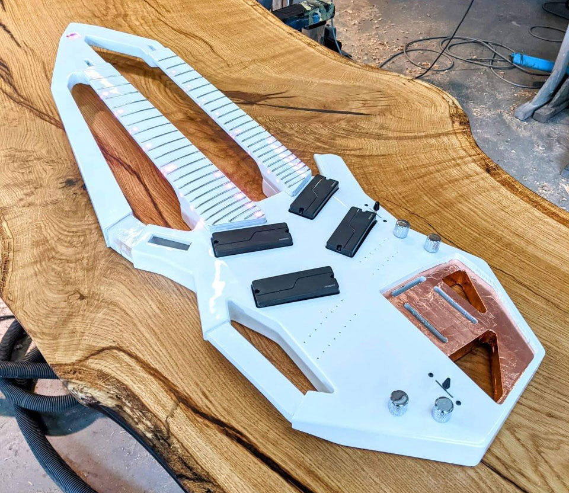
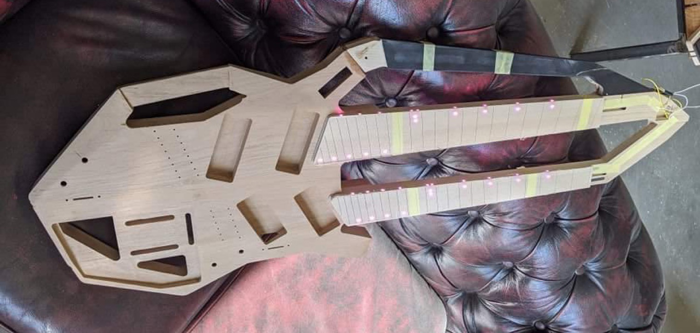
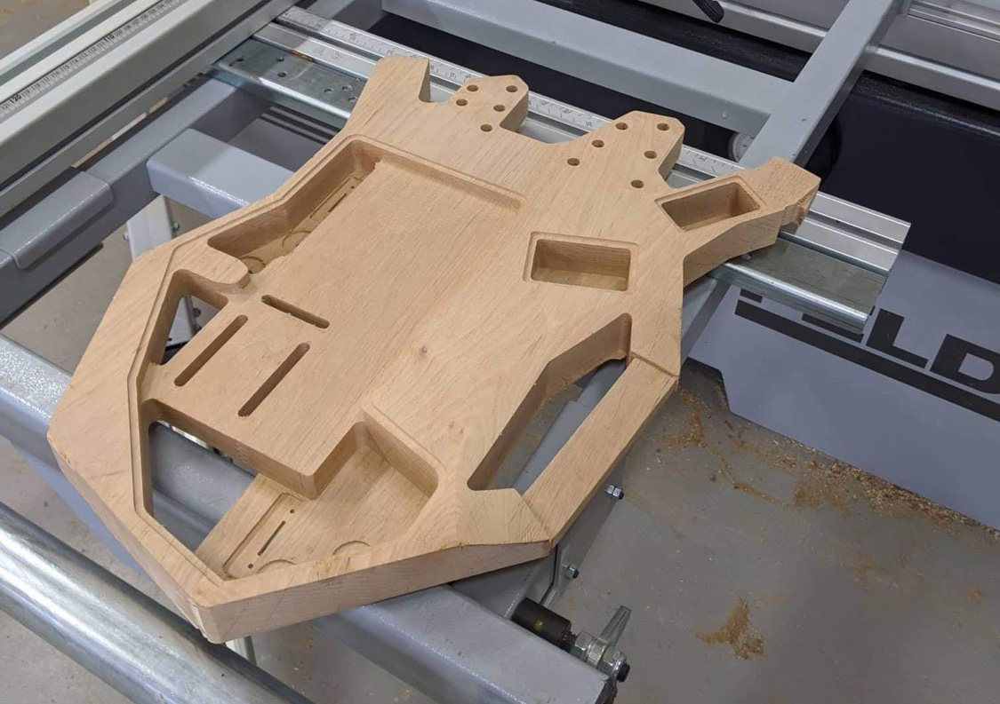
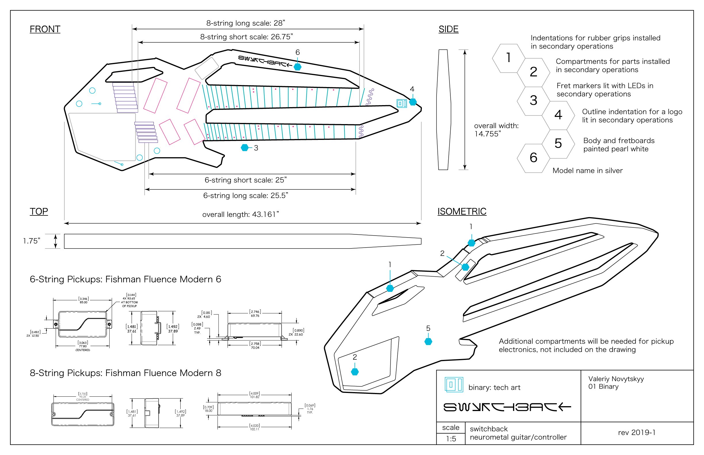

## overview

Switchback is a double-neck guitar with a built-in keyboard for playing [neurometal](https://www.youtube.com/playlist?list=PL2ZwTvIdYJGJxl1kszP3a_z6O4DcHwvok). It can integrate with a sequencer to perform a software synth and display the waveform in onboard oscilloscope built into the handle.

- 6-string (bottom) modeled after [Strandberg Boden Metal 6](https://strandbergguitars.com/product/boden-metal-6-white-pearl/) with Fishman Fluence Modern 6 pickups
- 8-string (top) modeled after [Strandberg Boden Metal 8](https://www.sweetwater.com/store/detail/BDMT8BKP--strandberg-boden-metal-8-black-pearl) with Fishman Fluence Modern 8 pickups
- 9-key [Roli Seaboard Block keyboard](https://roli.com/products/seaboard) (bottom) with two extra dimensions of touch is embedded into the body
- Built-in oscilloscope can display a waveform from a remote synth or sampler, for an effect similar to [Korg Minilogue](https://www.sweetwater.com/store/detail/MinilogueXD--korg-minilogue-xd-4-voice-analog-synthesizer)

For this project my goal was to get an introduction to electrical engineering, learn how to use Arduino and Itsy Bitsy microcontrollers, display graphics on a monochrome screen by using the SPI protocol, and receive audio signal from a Bluetooth board.

## build

Switchback is being built by [Claas Guitars](https://claasguitars.com/) in Germany, a luthier that specializes in custom shop headless guitars.

The luthier had to make many adjustments to make the guitar playable, such as customizing pickup positions and increasing the space between the two necks.

The body has extra space to fit in electronics for the Seaboard, and both the built-in keyboard and oscilloscope will communicate with a computer running Ableton by using Bluetooth.

## instructions

Instructions for building can be found in this guide:

[switchback guide](switchback-instructions.pdf)

