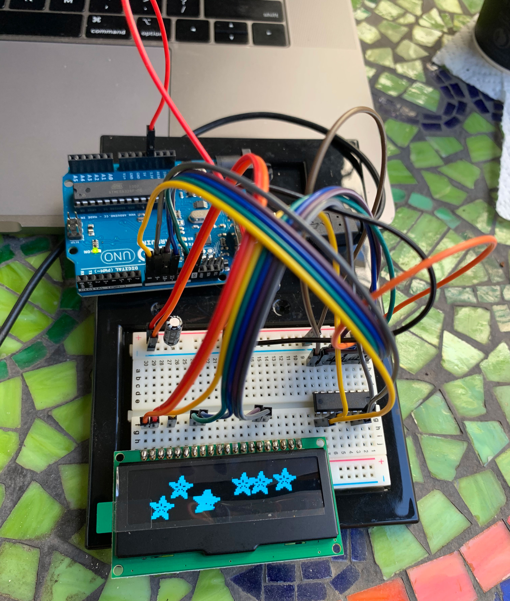
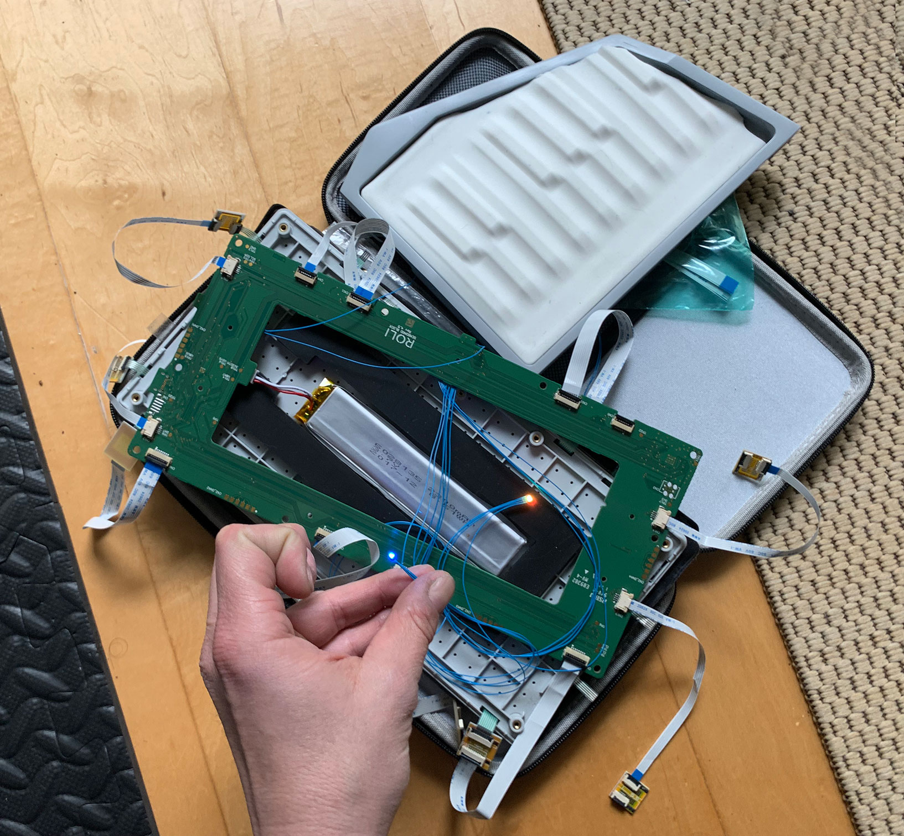

import Gallery from '../components/Gallery';

## overview

Switchback is a headless double-neck guitar with a keyboard for playing [neurometal](https://www.youtube.com/playlist?list=PL2ZwTvIdYJGJxl1kszP3a_z6O4DcHwvok). It can integrate with a sequencer to perform a software synth and display the waveform in an onboard oscilloscope built into the handle.

For this project my goal was to get into electrical engineering, learn embedded development on [Arduino](https://www.arduino.cc/) and [Itsy Bitsy](https://www.adafruit.com/product/3675) micro-controllers, display graphics on a screen with the [SPI](https://learn.sparkfun.com/tutorials/serial-peripheral-interface-spi/all) protocol, and process audio from a [bluetooth receiver](https://www.amazon.com/gp/product/B07W7YCFS1).

<Gallery>
  
  
  
  
</Gallery>

## specifications

- 6-string (bottom) modeled after [Strandberg Boden Metal 6](https://strandbergguitars.com/product/boden-metal-6-white-pearl/) with Fishman Fluence Modern 6 pickups
- 8-string (top) modeled after [Strandberg Boden Metal 8](https://www.sweetwater.com/store/detail/BDMT8BKP--strandberg-boden-metal-8-black-pearl) with Fishman Fluence Modern 8 pickups
- 9-key [Roli Seaboard Block keyboard](https://roli.com/products/seaboard) (bottom) with two extra dimensions of touch is trimmed into a custom shape and embedded into the body
- Built-in oscilloscope can display a waveform from a remote synth or sampler, for an effect similar to [Korg Minilogue](https://www.sweetwater.com/store/detail/MinilogueXD--korg-minilogue-xd-4-voice-analog-synthesizer)

<Gallery>
  
  
  
  
</Gallery>

## keyboard

To embed a [Seaboard](https://roli.com/products/seaboard/rise2) MIDI controller in the guitar body, I started by separating the keyboard surface from the case with [ribbons](https://www.amazon.com/gp/product/B07RS4QST3) and [adapters](https://www.amazon.com/gp/product/B07RT6XM3W).
Then I re-cast the surface in [Ecoflex 50](https://www.smooth-on.com/products/ecoflex-00-50/) so it could be re-skinned without affecting function.

`youtube:https://www.youtube.com/embed/TDDvcfjg9t4`

## oscilloscope

The source code for the built-in oscilloscope that analyzes audio signals and displays waveforms is available on [GitHub](https://github.com/01binary/switchback/blob/master/src/code/oscilloscope.ino):

`youtube:https://www.youtube.com/embed/auq8bbIgFvc`

## downloads

Clone the [GitHub repository](https://github.com/01binary/switchback) to download CAD models and [building instructions](switchback-instructions.pdf).

| location                                                                          | content                     |
| --------------------------------------------------------------------------------- | --------------------------- |
| [src](https://github.com/01binary/switchback/tree/master/src)                     | Autodesk Inventor, AutoCAD  |
| [design](https://github.com/01binary/switchback/tree/master/design)               | Concept art and inspiration |
| [design/cad](https://github.com/01binary/switchback/tree/master/design/cad)       | CAD Drawings                |
| [design/render](https://github.com/01binary/switchback/tree/master/design/render) | 3D Renders                  |
| [references](https://github.com/01binary/switchback/tree/master/references)       | References based on         |
| [export](https://github.com/01binary/switchback/tree/master/export)               | Export to various formats   |
