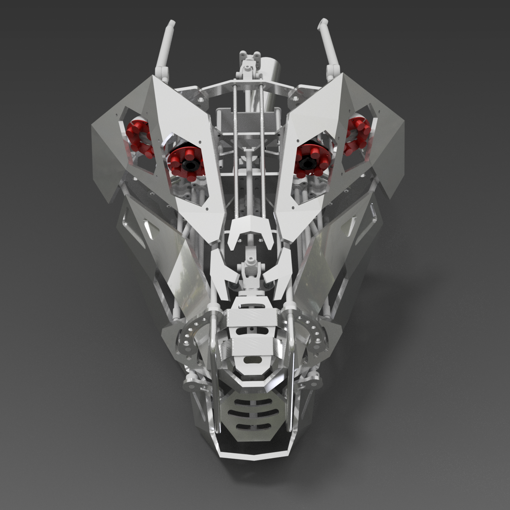

import Gallery from '../components/Gallery';

## overview

Str1ker is a robotic drummer built with a combination of metal casting, 3D printing, CNC machining, sheet metal fabrication and pre-made components. Performance, movement, and facial expressions are controlled by MIDI, and the position of each drum is determined by using a night-vision stereo camera.

For this project my goal is to learn [::ROS](https://www.ros.org/), create parts that look organic by using Generative Design functionality in [Autodesk Inventor](https://www.autodesk.com/products/inventor/), get experience with [Raspberry Pi 4](https://www.adafruit.com/product/4296) micro-controller, modern servos and linear actuators, and finally build a robotic drummer for my [neurometal](https://www.youtube.com/playlist?list=PL2ZwTvIdYJGJxl1kszP3a_z6O4DcHwvok) band.

<Gallery>
  
  
  
  
</Gallery>

## prototype

I started by prototyping a single arm out of wood to get it rotating, raising, extending, and triggering a drum stick using a solenoid on a spring:

`youtube:https://www.youtube.com/embed/Abf0k5A4z88`

Once the design for the robot arms was finalized, I printed and [re-cast](https://github.com/01binary/investment-casting) them out of Aluminum 356, then installed encoders and actuators. I also designed a head that could make facial expressions and voice [hypergrowls](https://www.youtube.com/watch?v=Stvc9zR3-KA).

<Gallery>
  
  
  
  
  
  
  
  
</Gallery>

Next I'm integration testing all four arms together, implementing inverse kinematics with [MoveIt](https://moveit.ros.org/), and locating drums using OpenCV with [Arducam](https://www.arducam.com/) NoIR stereo camera that can estimate positions of objects in the dark.

## downloads

The project files can be downloaded by cloning the [GitHub repository](https://github.com/01binary/drummingrobot).

| content                           | location                                                                       |
| --------------------------------- | ------------------------------------------------------------------------------ |
| Mechanical parts                  | [parts](https://github.com/01binary/drummingrobot/tree/master/src/parts)       |
| Source code                       | [code](https://github.com/01binary/drummingrobot/tree/master/src/code)         |
| Concept art                       | [design](https://github.com/01binary/drummingrobot/tree/master/design)         |
| Documentation for components used | [doc](https://github.com/01binary/drummingrobot/tree/master/doc)               |
| Inspiration                       | [references](https://github.com/01binary/drummingrobot/tree/master/references) |
| 3D renders                        | [render](https://github.com/01binary/drummingrobot/tree/master/render)         |

