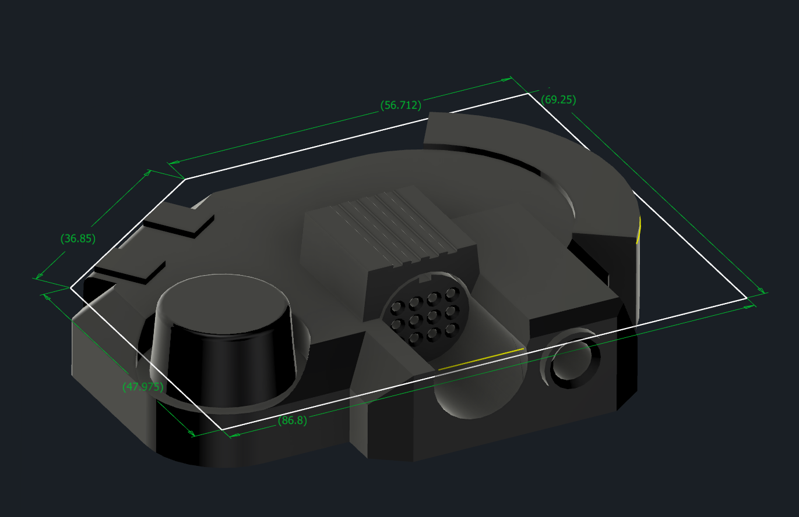
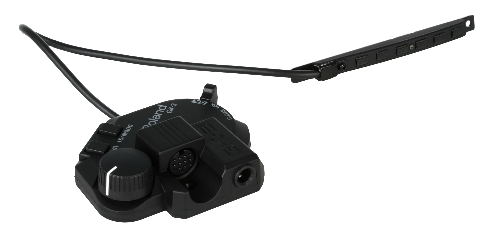
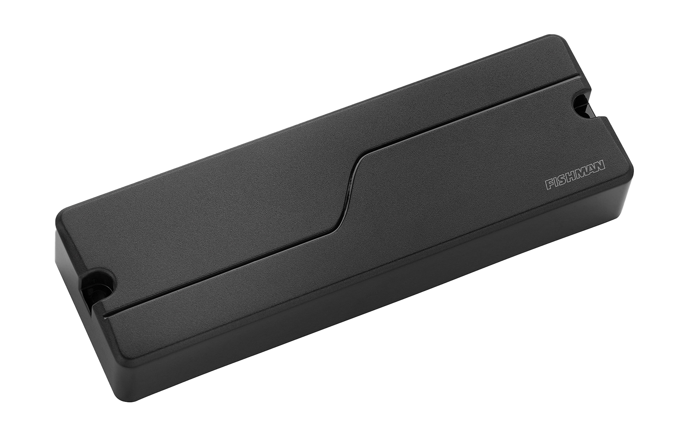
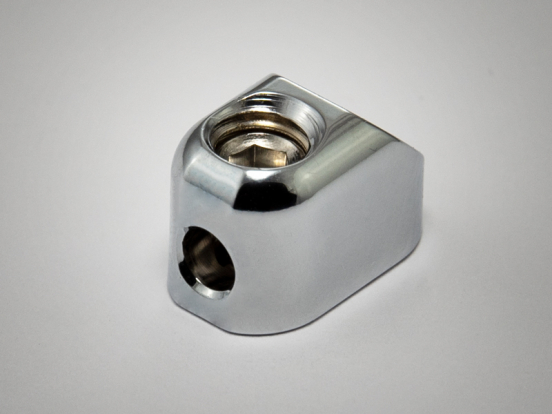
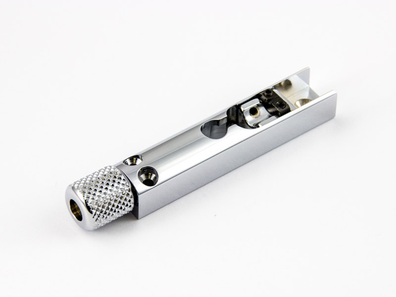
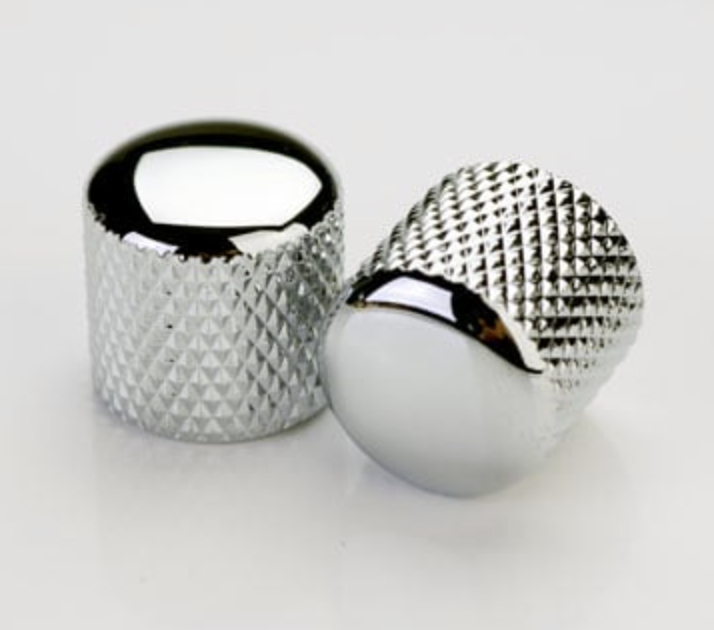
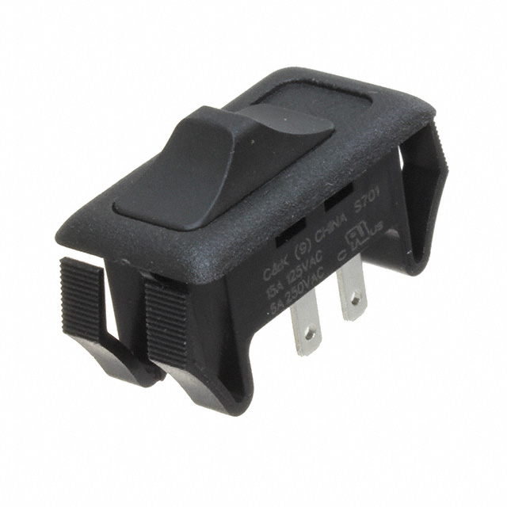
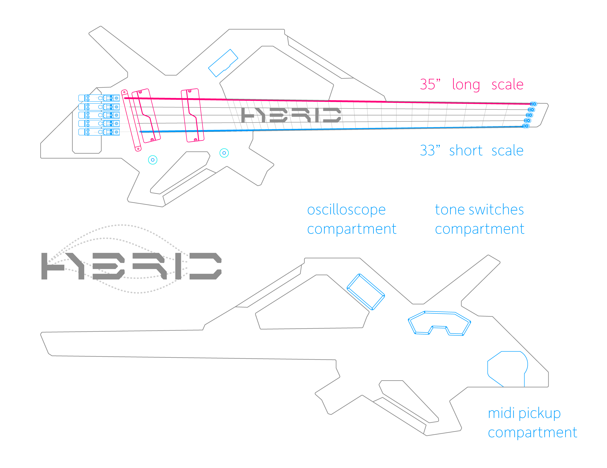

import Gallery from '../components/Gallery';

## overview

Hybrid is a 5-string multi-scale headless bass with MIDI pickups for playing [Neurometal](https://www.youtube.com/playlist?list=PL2ZwTvIdYJGJxl1kszP3a_z6O4DcHwvok). The sound of on-board pickups can be blended with a remote bass synth to create a unique "hybrid" sound.

A built-in oscilloscope can display a waveform from a bass synth driven by MIDI via a Bluetooth Audio connection to support live sound design.

As modern music production trends placed musicians behind a computer, a need for a new instrument has emerged that makes it possible to maintain sophisticated sound design while providing an exciting live experience.

<Gallery>
  
  
  
  
</Gallery>

## midi pickups

A built-in [Roland GK-3B](https://www.roland.com/us/products/gk-3b/) MIDI pickup is used to drive synth bass, including popular software synthesizers like [FM8](https://www.native-instruments.com/en/products/komplete/synths/fm8/) and [Massive X](https://www.native-instruments.com/en/products/komplete/synths/massive-x/).

## bass pickups

Fishman Fluence bass [soapbar pickups](https://www.fishman.com/portfolio/fluence-6-string-bass-pickups/) support blending modern and vintage voicing to add flavor to any track:

## hardware

This bass is equipped with [ABM7011C](https://abm-guitarpartsshop.com/ABM-GUITAR-PARTS/Headless-Systems/Bass/Headpieces/ABM-7011c-Chrome::439.html) string locks and [ABM3901C](https://abm-guitarpartsshop.com/ABM-GUITAR-PARTS/Single-Bridges/Bass/ABM-3901/ABM-3901c-Chrome::245.html) bridges.

<Gallery>
  
  
  
  
</Gallery>

Two knobs on the bottom control *bass* and *treble* while a pair of [S701](https://www.digikey.com/en/products/detail/c&k/S701C21S207Q/3754449) slide switches accessible from the back toggle between *bridge/neck*, and *classic/modern* voicings.

## oscilloscope

The built-in oscilloscope implemented with [Itsy Bitsy 3V](https://www.adafruit.com/product/3675) micro-controller analyzes audio signals coming from a bluetooth audio receiver and displays the waveforms on the screen to provide visual feedback:

`youtube:https://www.youtube.com/embed/auq8bbIgFvc`

## downloads

Clone the [GitHub repository](https://github.com/01binary/hybrid) to download CAD models.

| location                                                                          | content                     |
| --------------------------------------------------------------------------------- | --------------------------- |
| [src](https://github.com/01binary/hybrid/tree/master/src)                         | Autodesk Inventor and Adobe Illustrator files for CNC fabrication |
| [design](https://github.com/01binary/hybrid/tree/master/design)                   | Concept art and inspiration |
