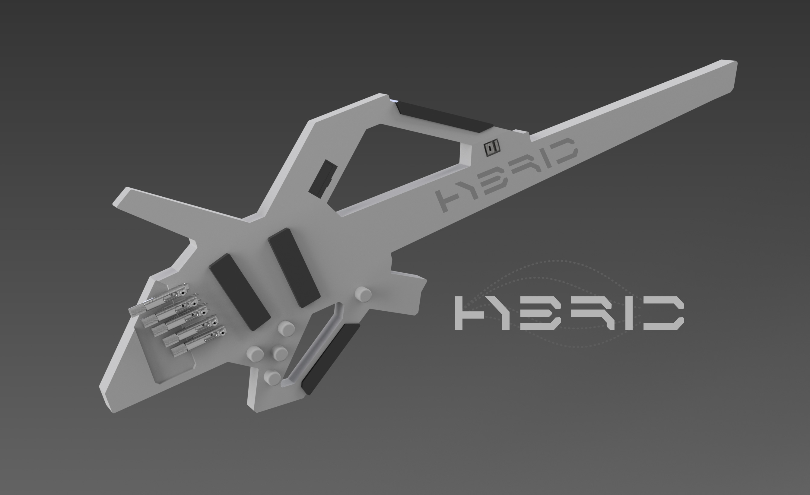
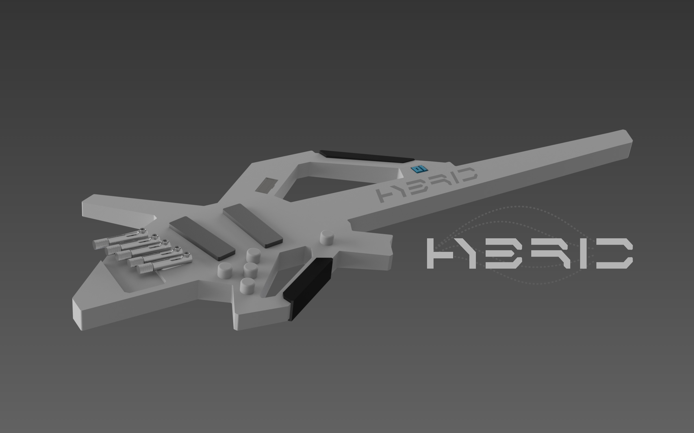
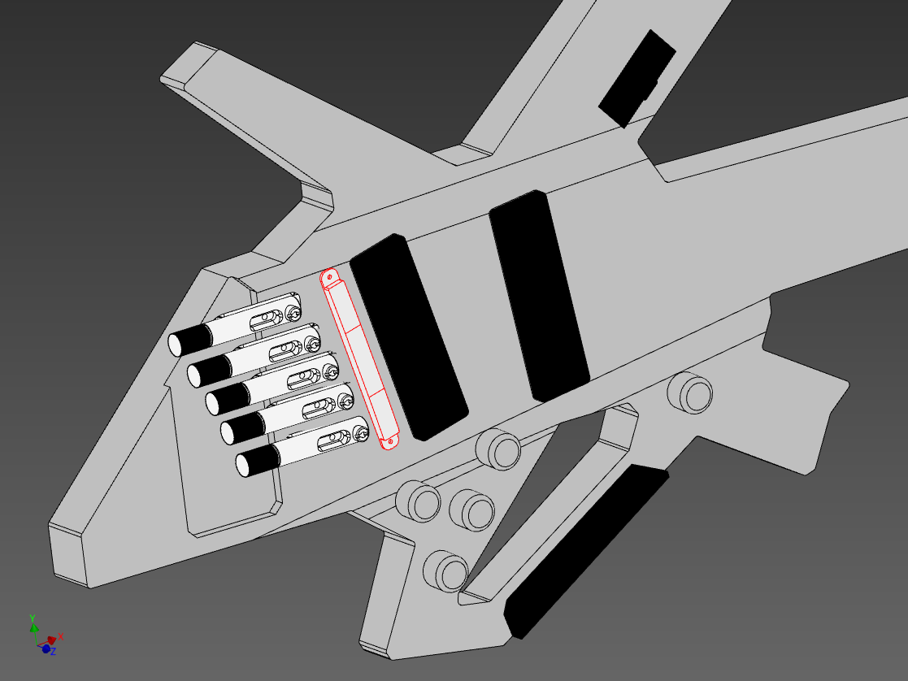

import Gallery from '../components/Gallery';

## overview

Hybrid is a 5-string multi-scale headless bass with MIDI pickups for playing [Neurometal](https://www.youtube.com/playlist?list=PL2ZwTvIdYJGJxl1kszP3a_z6O4DcHwvok). The sound of on-board pickups can be blended with a remote bass synth to create a unique "hybrid" sound.

A built-in oscilloscope can display a waveform from a bass synth driven by MIDI via a Bluetooth Audio connection to support live sound design.


As modern music production trends placed musicians behind a computer, a need for a new instrument has emerged that makes it possible to maintain sophisticated sound design while providing an exciting live experience.

<Gallery>
  
  
  
  
</Gallery>

## midi pickups

A built-in [Roland GK-3B](https://www.roland.com/us/products/gk-3b/) MIDI pickup is used to drive synth bass, including popular software synthesizers like [FM8](https://www.native-instruments.com/en/products/komplete/synths/fm8/) and [Massive X](https://www.native-instruments.com/en/products/komplete/synths/massive-x/).

## oscilloscope

The built-in oscilloscope implemented with [Itsy Bitsy 3V](https://www.adafruit.com/product/3675) micro-controller analyzes audio signals coming from a bluetooth audio receiver and displays the waveforms on the screen to provide visual feedback:

`youtube:https://www.youtube.com/embed/auq8bbIgFvc`

```c
#include <Wire.h>
#include <SPI.h>
#include <Adafruit_GFX.h>
#include <Adafruit_SSD1305.h>
#include "splash.h"

const int OLED_DC = 8;
const int OLED_CS = 10;
const int OLED_RESET = 9;
const int AUDIO = A2;

const int MIN = 0;
const int MAX = 1024;
const int BIAS = 512;
// Signal level for "no signal"
const int THRESHOLD = -60;
const int WIDTH = 128;
// Anti-alias smoothing multiplier
const int ALIAS = 2;
const int SAMPLES = WIDTH * ALIAS;
const int HEIGHT = 32;
const int HALF = HEIGHT / 2;
// Sample average count
const int AVG_COUNT = 32;
const double AVG_MUL = 0.1;
const int DRAW_DELAY = 50;

// Using hardware SPI
Adafruit_SSD1305 display(WIDTH, HEIGHT, &SPI, OLED_DC, OLED_RESET, OLED_CS, 7000000UL);

short aud[SAMPLES] = {0};
int sample = 0;

int minCur = MAX;
short minAvg[AVG_COUNT] = {0};
int minSample = 0;

int maxCur = MIN;
short maxAvg[AVG_COUNT] = {0};
int maxSample = 0;

void setup() {
  pinMode(AUDIO, INPUT);

  initDisplay();
}

void loop() {
  int value = analogRead(AUDIO) - BIAS;
 
  aud[sample++] = value;

  averageRange(value, &minCur, minAvg, &minSample, true);
  averageRange(value, &maxCur, maxAvg, &maxSample, false);
 
  if (sample >= SAMPLES)
  {
    sample = 0;

    tuneRange();
 
    draw();
  }
}

int averageRange(int value, int* current, short* samples, int* sample, bool minOrMax)
{
  if ((minOrMax && value < *current) || (!minOrMax && value > *current))
    *current = value;

  samples[*sample] = *current;
  *sample = *sample + 1;

  if (*sample >= AVG_COUNT)
  {
    int sum = 0;
   
    for (int n = 0; n < AVG_COUNT; ++n)
    {
      sum += samples[n];
    }

    *current = sum / AVG_COUNT;
    *sample = 0;
  }
}

void tuneRange()
{
  int localMin = MAX;
  int localMax = MIN;
 
  for (int n = 0; n < SAMPLES; ++n)
  {
    if (aud[n] < localMin)
      localMin = aud[n];
    else if (aud[n] > localMax)
      localMax = aud[n];
  }

  if (localMin > minCur)
  {
    minCur += ceil((localMin - minCur) * AVG_MUL);
  }

  if (localMax < maxCur)
  {
    maxCur -= ceil((maxCur - localMax) * AVG_MUL);
  }
}

void draw()
{
  if (minCur < THRESHOLD) {
    // Prevents from drawing too fast, which can look ugly and flickery
    if (DRAW_DELAY) delay(DRAW_DELAY);

    display.clearDisplay();
  
    int lastx = 0;
    int lasty = mapSample(aud[0]);
    int smoothy = lasty;
   
    for (int x = 0; x < WIDTH; ++x)
    {
      int sum = 0;
     
      for (int oversample = 0; oversample < ALIAS; ++oversample)
      {
        sum += aud[x];
      }
  
      int y = (mapSample(sum / ALIAS) + lasty + smoothy) / 3;
     
      display.drawLine(lastx, lasty, x, y, WHITE);
  
      smoothy = lasty;
      lasty = y;
      lastx = x;
    }
  
    display.display();
  } else {
    // When "no signal", present the logo
    drawSplash();
  }
}

inline int mapSample(int value)
{
  return max(map(value, minCur, maxCur, HEIGHT - 1, 0), 0);
}

void initDisplay()
{
  Serial.begin(9600);

  if (!display.begin(0x3C) ) {
     Serial.println("Unable to initialize OLED");
     while (1) yield();
  }

  display.display();
  delay(1000);
  display.clearDisplay();

  Serial.println("Initialized");
}

void drawSplash()
{
  display.clearDisplay();
    
  display.drawBitmap(
    (WIDTH - splash2_width) / 2,
    (HEIGHT - splash2_height) / 2,
    splash2_data,
    splash2_width,
    splash2_height,
    1);
    
  display.display();
}
```

## downloads

Clone the [GitHub repository](https://github.com/01binary/hybrid) to download CAD models.

| location                                                                          | content                     |
| --------------------------------------------------------------------------------- | --------------------------- |
| [src](https://github.com/01binary/hybrid/tree/master/src)                         | Autodesk Inventor and Adobe Illustrator files for CNC fabrication |
| [design](https://github.com/01binary/hybrid/tree/master/design)                   | Concept art and inspiration |
