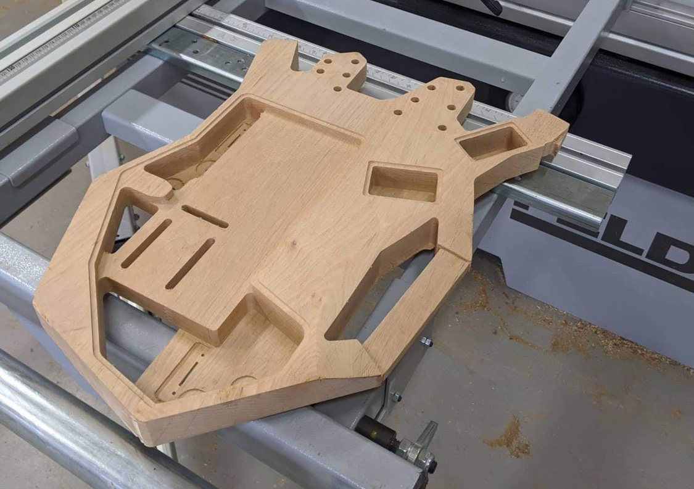
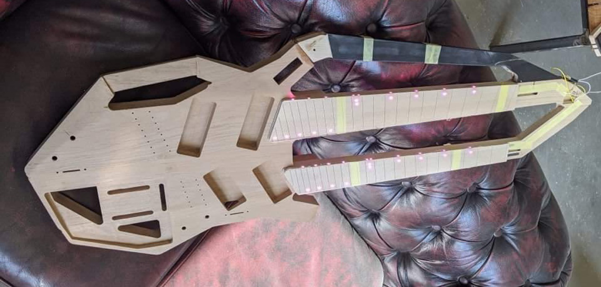
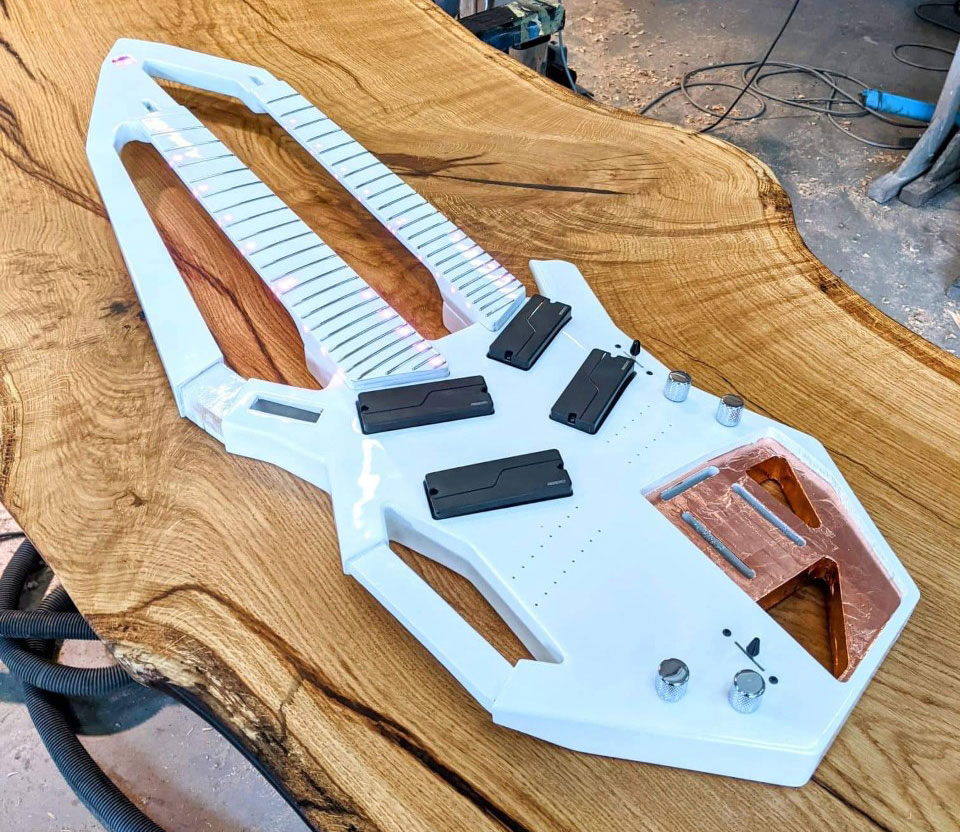
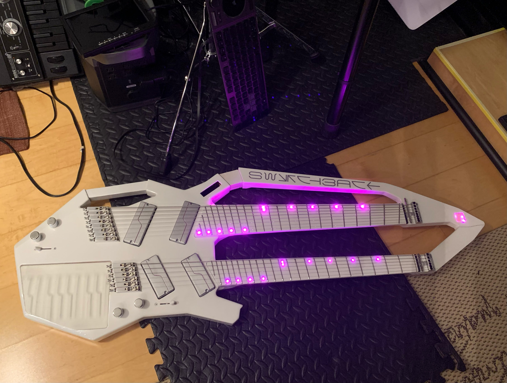
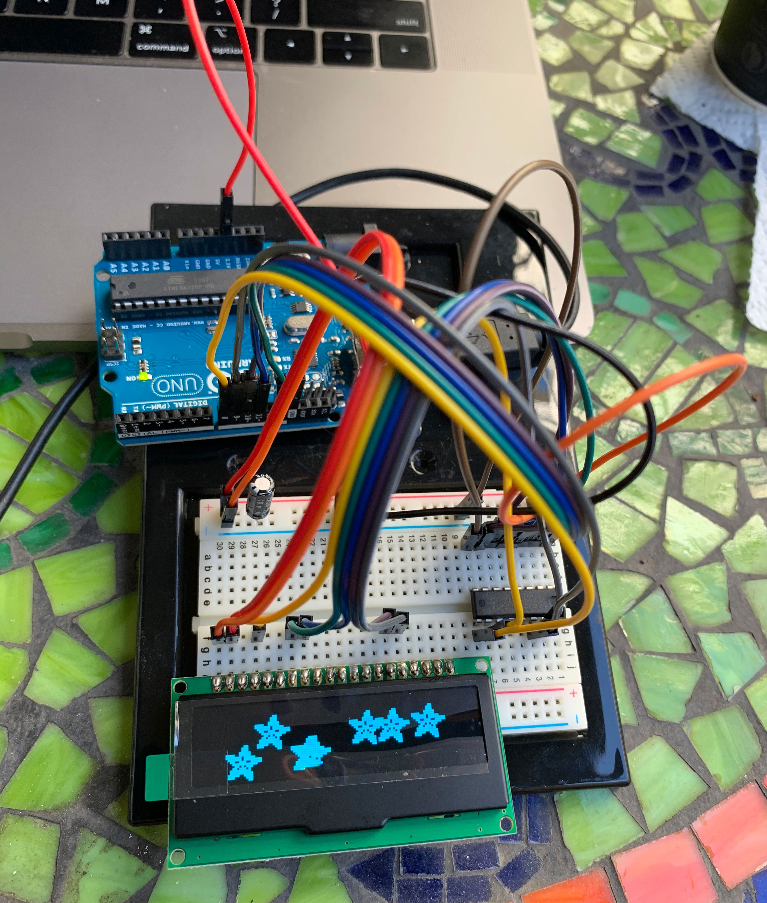
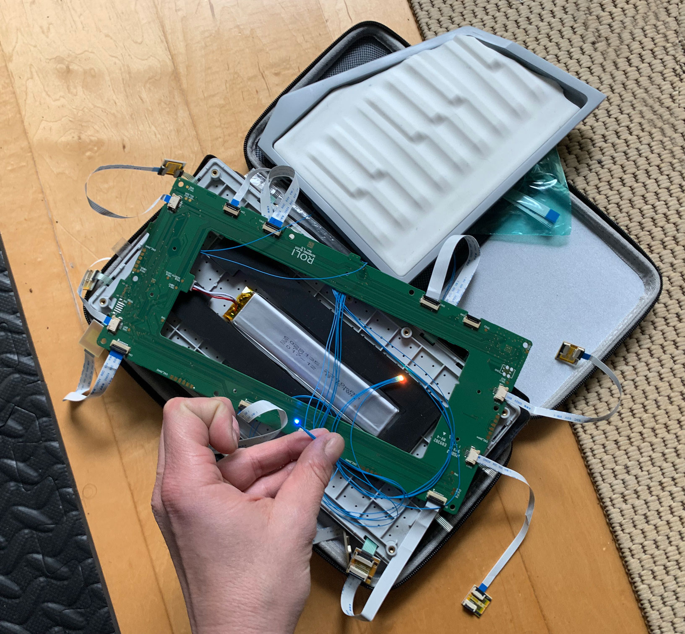
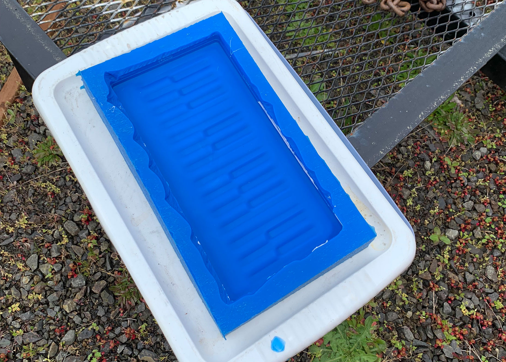
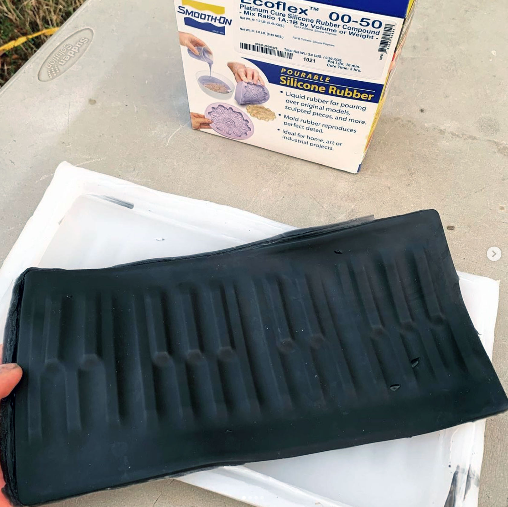

import Gallery from '../components/Gallery';

## overview

Switchback is a headless double-neck guitar with a keyboard for playing [neurometal](https://www.youtube.com/playlist?list=PL2ZwTvIdYJGJxl1kszP3a_z6O4DcHwvok). It can integrate with a sequencer to perform a software synth and display the waveform in an onboard oscilloscope built into the handle.


For this project my goal was to get into electrical engineering, learn embedded development on [Arduino](https://www.arduino.cc/) and [Itsy Bitsy](https://www.adafruit.com/product/3675) micro-controllers, display graphics on a screen with the [SPI](https://learn.sparkfun.com/tutorials/serial-peripheral-interface-spi/all) protocol, and process audio from a [bluetooth receiver](https://www.amazon.com/gp/product/B07W7YCFS1).

<Gallery>
  
  
  
  
</Gallery>

## specifications

- 6-string (bottom) modeled after [Strandberg Boden Metal 6](https://strandbergguitars.com/product/boden-metal-6-white-pearl/) with Fishman Fluence Modern 6 pickups
- 8-string (top) modeled after [Strandberg Boden Metal 8](https://www.sweetwater.com/store/detail/BDMT8BKP--strandberg-boden-metal-8-black-pearl) with Fishman Fluence Modern 8 pickups
- 9-key [Roli Seaboard Block keyboard](https://roli.com/products/seaboard) (bottom) with two extra dimensions of touch is trimmed into a custom shape and embedded into the body
- Built-in oscilloscope can display a waveform from a remote synth or sampler, for an effect similar to [Korg Minilogue](https://www.sweetwater.com/store/detail/MinilogueXD--korg-minilogue-xd-4-voice-analog-synthesizer)

<Gallery>
  
  
  
  
</Gallery>

## keyboard

To embed a [Seaboard](https://roli.com/products/seaboard/rise2) MIDI controller in the guitar body, I started by separating the keyboard surface from the case with [ribbons](https://www.amazon.com/gp/product/B07RS4QST3) and [adapters](https://www.amazon.com/gp/product/B07RT6XM3W).
Then I re-cast the surface in [Ecoflex 50](https://www.smooth-on.com/products/ecoflex-00-50/) so it could be re-skinned without affecting function.

`youtube:https://www.youtube.com/embed/TDDvcfjg9t4`

## oscilloscope

The source code for the built-in oscilloscope that analyzes audio signals and displays waveforms is available on [GitHub](https://github.com/01binary/switchback/blob/master/src/code/oscilloscope.ino):

`youtube:https://www.youtube.com/embed/wj2-lyEgEZo`

```c
#include <Wire.h>
#include <SPI.h>
#include <Adafruit_GFX.h>
#include <Adafruit_SSD1305.h>
#include "splash.h"

/*
  LED Screen SPI Connections

  SSD1305   Arduino Uno   ItsyBitsy 3u4   Arduino Nano 33 BLE
 
  [1] GND   GND           GND             GND
  [2] 3V3   3V3           3V3             3V3
  
  [4] DC    [8] Digital   [8] Digital     [8] Digital
  [7] SCLK  [13] SCLK     SCLK            [D13] SCK
  [8] DIN   [11] MOSI     MOSI            [D11] COPI
  [15] CS   [10] CS       [6] CS          [6] CS
  [16] RST  [9] Digital   [9] Digital     [9] Digital

  Note: for 5V boards like Arduino Uno, everything goes through 5V to 3.3V level shifter
  Note: for all boards, there must be a 220uF capacitor between 3V3 and GND
*/

/*
  Bluetooth Audio Connections

  HW-407    Arduino   Lipo Backpack
  
  VBAT                BAT
  GND       GND
  L         A2 through audio circuit (TODO)
  Ref       3V3
            GND        GND
*/

const int OLED_DC = 8;
const int OLED_CS = 10;
const int OLED_RESET = 9;
const int AUDIO = A2;

const int MIN = 0;
const int MAX = 1024;
const int BIAS = 512;
// Signal level for "no signal"
const int THRESHOLD = -60;
const int WIDTH = 128;
// Anti-alias smoothing multiplier
const int ALIAS = 2;
const int SAMPLES = WIDTH * ALIAS;
const int HEIGHT = 32;
const int HALF = HEIGHT / 2;
// Sample average count
const int AVG_COUNT = 32;
const double AVG_MUL = 0.1;
const int DRAW_DELAY = 50;

// Using hardware SPI
Adafruit_SSD1305 display(WIDTH, HEIGHT, &SPI, OLED_DC, OLED_RESET, OLED_CS, 7000000UL);

short aud[SAMPLES] = {0};
int sample = 0;

int minCur = MAX;
short minAvg[AVG_COUNT] = {0};
int minSample = 0;

int maxCur = MIN;
short maxAvg[AVG_COUNT] = {0};
int maxSample = 0;

void setup() {
  pinMode(AUDIO, INPUT);

  initDisplay();
}

void loop() {
  int value = analogRead(AUDIO) - BIAS;
 
  aud[sample++] = value;

  averageRange(value, &minCur, minAvg, &minSample, true);
  averageRange(value, &maxCur, maxAvg, &maxSample, false);
 
  if (sample >= SAMPLES)
  {
    sample = 0;

    tuneRange();
 
    draw();
  }
}

int averageRange(int value, int* current, short* samples, int* sample, bool minOrMax)
{
  if ((minOrMax && value < *current) || (!minOrMax && value > *current))
    *current = value;

  samples[*sample] = *current;
  *sample = *sample + 1;

  if (*sample >= AVG_COUNT)
  {
    int sum = 0;
   
    for (int n = 0; n < AVG_COUNT; ++n)
    {
      sum += samples[n];
    }

    *current = sum / AVG_COUNT;
    *sample = 0;
  }
}

void tuneRange()
{
  int localMin = MAX;
  int localMax = MIN;
 
  for (int n = 0; n < SAMPLES; ++n)
  {
    if (aud[n] < localMin)
      localMin = aud[n];
    else if (aud[n] > localMax)
      localMax = aud[n];
  }

  if (localMin > minCur)
  {
    minCur += ceil((localMin - minCur) * AVG_MUL);
  }

  if (localMax < maxCur)
  {
    maxCur -= ceil((maxCur - localMax) * AVG_MUL);
  }
}

void draw()
{
  if (minCur < THRESHOLD) {
    // Prevents from drawing too fast, which can look ugly and flickery
    if (DRAW_DELAY) delay(DRAW_DELAY);

    display.clearDisplay();
  
    int lastx = 0;
    int lasty = mapSample(aud[0]);
    int smoothy = lasty;
   
    for (int x = 0; x < WIDTH; ++x)
    {
      int sum = 0;
     
      for (int oversample = 0; oversample < ALIAS; ++oversample)
      {
        sum += aud[x];
      }
  
      int y = (mapSample(sum / ALIAS) + lasty + smoothy) / 3;
     
      display.drawLine(lastx, lasty, x, y, WHITE);
  
      smoothy = lasty;
      lasty = y;
      lastx = x;
    }
  
    display.display();
  } else {
    // When "no signal", present the logo
    drawSplash();
  }
}

inline int mapSample(int value)
{
  return max(map(value, minCur, maxCur, HEIGHT - 1, 0), 0);
}

void initDisplay()
{
  Serial.begin(9600);

  if (!display.begin(0x3C) ) {
     Serial.println("Unable to initialize OLED");
     while (1) yield();
  }

  display.display();
  delay(1000);
  display.clearDisplay();

  Serial.println("Initialized");
}

void drawSplash()
{
  display.clearDisplay();
    
  display.drawBitmap(
    (WIDTH - splash2_width) / 2,
    (HEIGHT - splash2_height) / 2,
    splash2_data,
    splash2_width,
    splash2_height,
    1);
    
  display.display();
}
```

## downloads

Clone the [GitHub repository](https://github.com/01binary/switchback) to download CAD models and [building instructions](switchback-instructions.pdf).

| location                                                                          | content                     |
| --------------------------------------------------------------------------------- | --------------------------- |
| [src](https://github.com/01binary/switchback/tree/master/src)                     | Autodesk Inventor, AutoCAD  |
| [design](https://github.com/01binary/switchback/tree/master/design)               | Concept art and inspiration |
| [design/cad](https://github.com/01binary/switchback/tree/master/design/cad)       | CAD Drawings                |
| [design/render](https://github.com/01binary/switchback/tree/master/design/render) | 3D Renders                  |
| [references](https://github.com/01binary/switchback/tree/master/references)       | References based on         |
| [export](https://github.com/01binary/switchback/tree/master/export)               | Export to various formats   |
