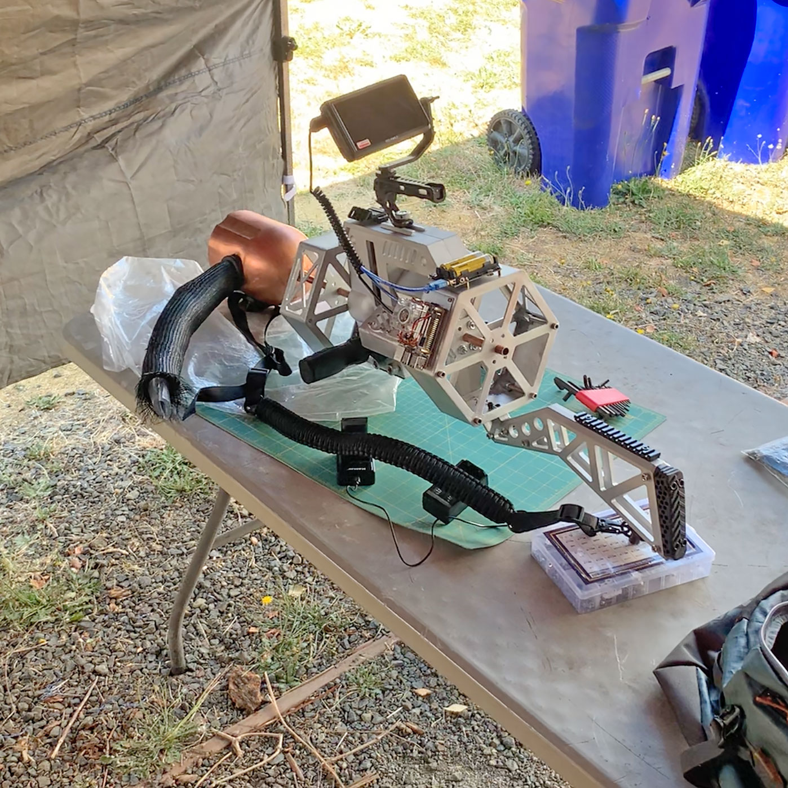
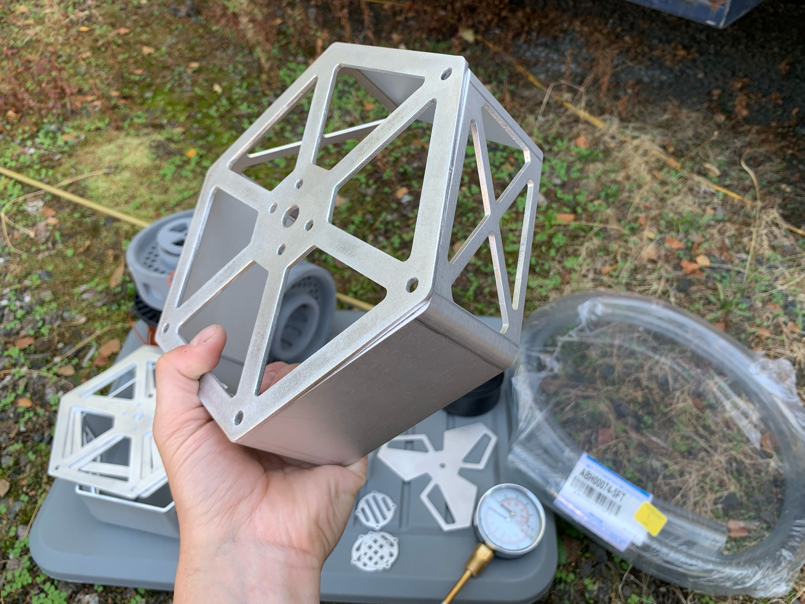
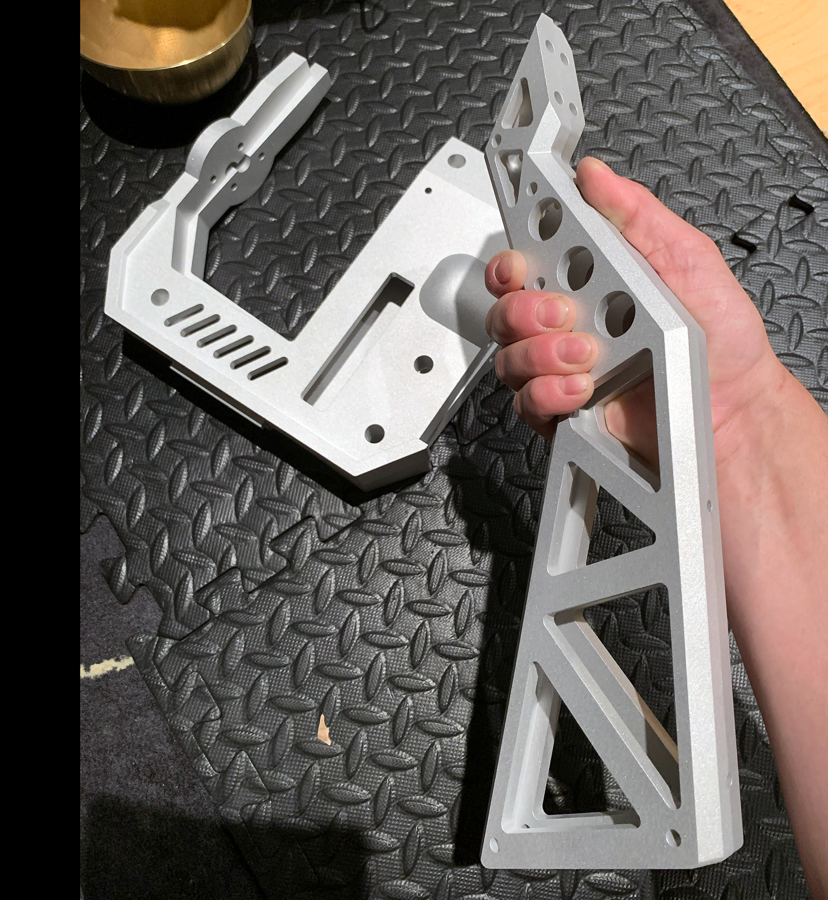
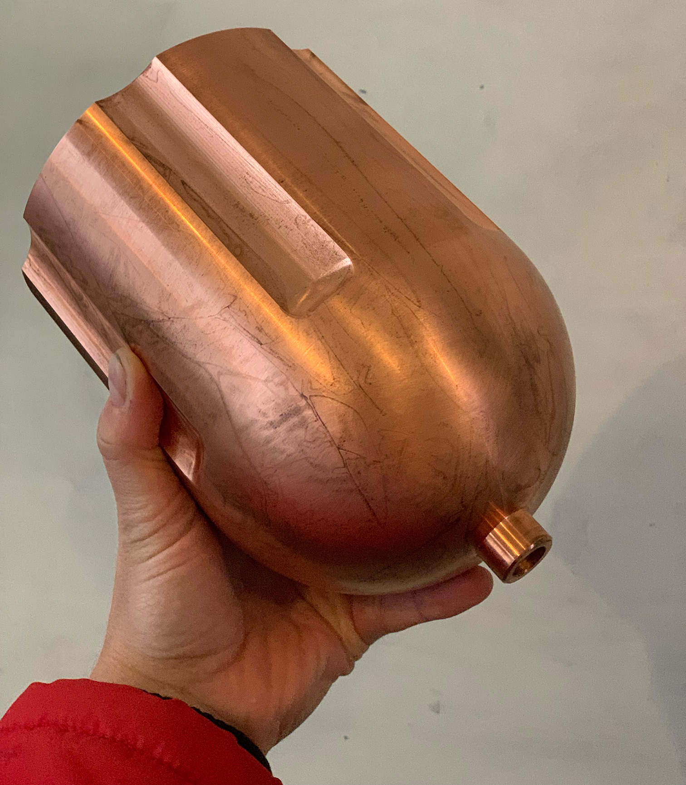
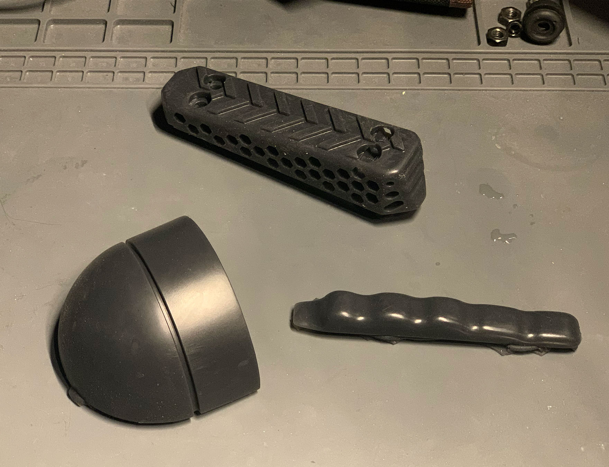
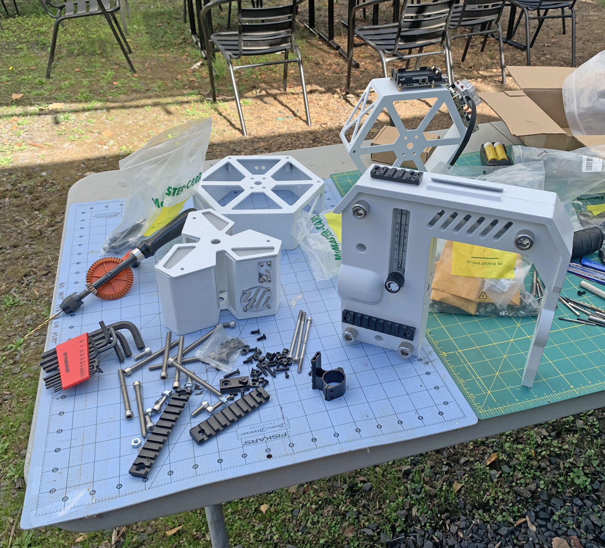
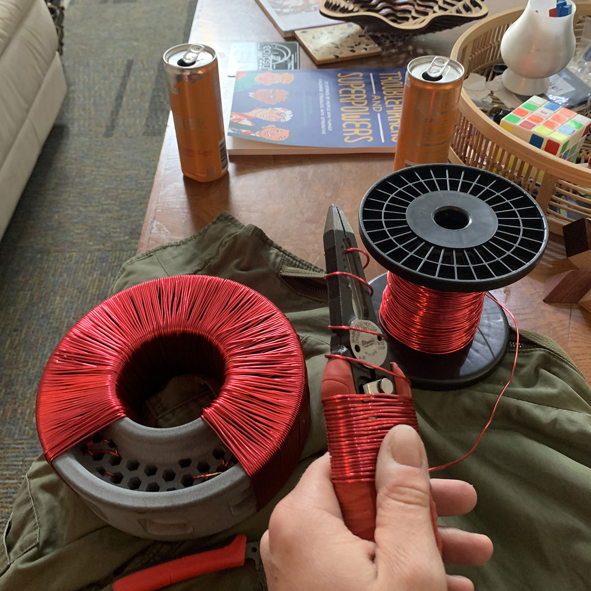
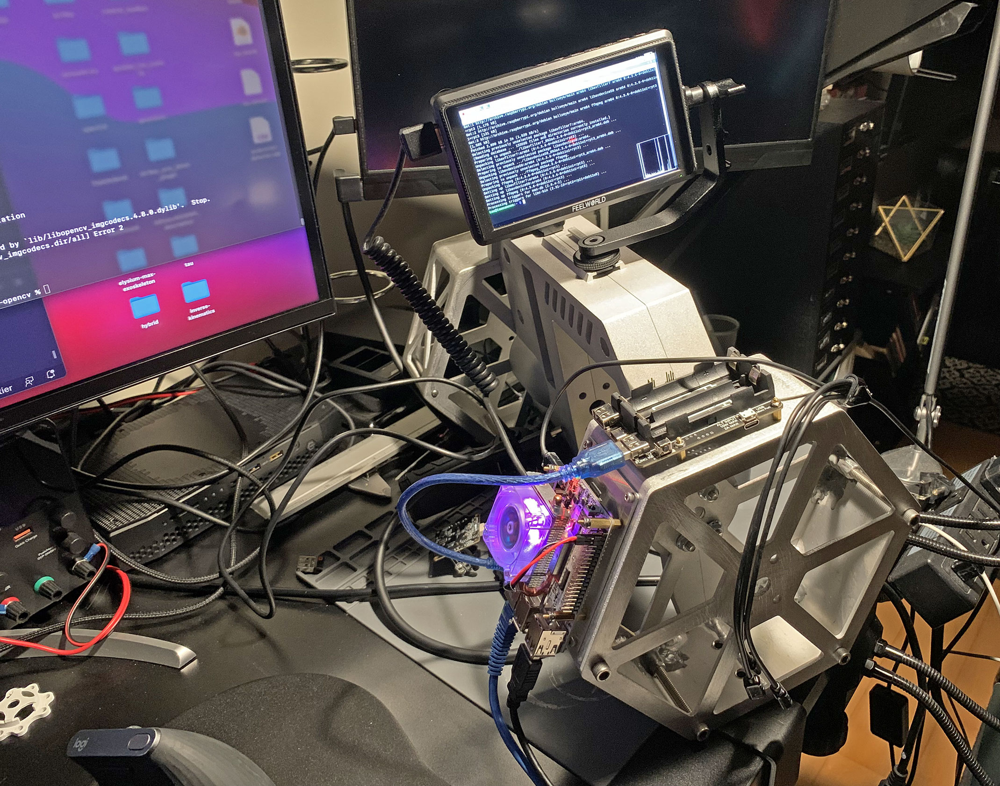

import Gallery from '../components/Gallery';

## overview

The Tau Cannon from Half-Life has captured imaginations of gamers and 3D artists ever since Black Mesa mod for Valve's Source engine first presented a [high-definition concept image](https://steamuserimages-a.akamaihd.net/ugc/1664606477131939319/8DF7F5E523E55435A730B38C35BE2B0A11D14E02/?imw=5000&imh=5000&ima=fit&impolicy=Letterbox&imcolor=%23000000&letterbox=false) based on the model from the original game.

I always wanted one, so I decided to build my own to get more experience with sheet metal and CNC fabrication, rubber casting, and tube bending.

`youtube:https://www.youtube.com/embed/5NiPVSd7cmM?si=UBcfIIHoa8esO2U6`

## build details

I started with sourcing external components because it's easier to reverse-engineer a sci-fi prop with no known dimensions by finding real-world equivalents of a few parts and sizing everything else relative to those.

The [top](https://www.amazon.com/SMALLRIG-Handle-Anti-Off-Designed-Adapter/dp/B07BT7XXN9) and [side](https://marksalecenter.com/product/supeirxiu-quick-connect-handle-for-hand-guard-can-be-tilted-to-5-non-slip-and-scratch-resistant-positionsblack/) handles  provided for good reference points in ensuring the size of the finished prop will fit a person.

Installing picatinny rails added another dimension of realism -- you can mount [tactical straps](https://www.amazon.com/dp/B08RF1LJDT), [laser sights](https://www.amazon.com/EZshoot-Tactical-Picatinny-Magnetic-Rechargeable/dp/B09TB3W5LD), [flashlights](https://www.amazon.com/Feyachi-FL11-MB-Tactical-Flashlight-Picatinny/dp/B09MW4HV72), and even [bipods](https://www.amazon.com/CVLIFE-Tactical-Adjustable-Release-Picatinny/dp/B01N43IPLF) on those.

`youtube:https://www.youtube.com/embed/owwMjv__WYo?si=q29OIxsaySO-CLbi`

Body and stock were machined out of aluminum, the coil and battery covers made out of sheet metal, and toroidal transformer cores were 3D printed.

I also designed some rubber parts: a [recoil pad](https://www.amazon.com/s?k=rubber+recoil+pad+AR-15&i=sporting), finger grip near the trigger, and a hose panel-mount connector. I still need to find a fitting wire gauge for winding the toroidal cores, weld, and paint all the parts.

Finally, I added an *on-board computer* (a Raspberry Pi 4B) that processes video from a small webcam mounted near the muzzle and uses the OpenCV [HOG Descriptor](https://automaticaddison.com/how-to-detect-pedestrians-in-images-and-video-using-opencv/) to detect people in real-time and draw cross-hairs over them.

<Gallery>
  
  
  
  
  
  
  
  
</Gallery>

## downloads

Clone the [GitHub repository](https://github.com/01binary/tau) to download CAD models and printable STLs.

| location                                                                          | content                     |
| --------------------------------------------------------------------------------- | --------------------------- |
| [src](https://github.com/01binary/tau/tree/master/src)                            | Autodesk Inventor, AutoCAD  |
| [references](https://github.com/01binary/tau/tree/master/references)              | Concept art and inspiration |
| [export](https://github.com/01binary/tau/tree/master/export)                      | STL Exports for 3D printing |
